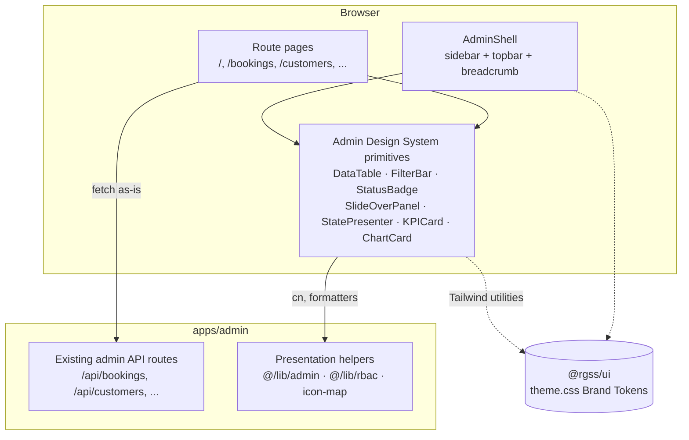
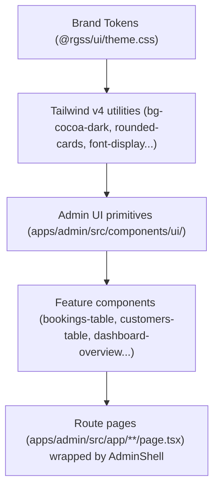
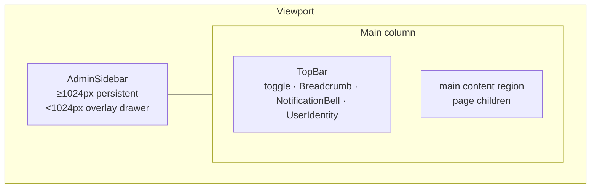
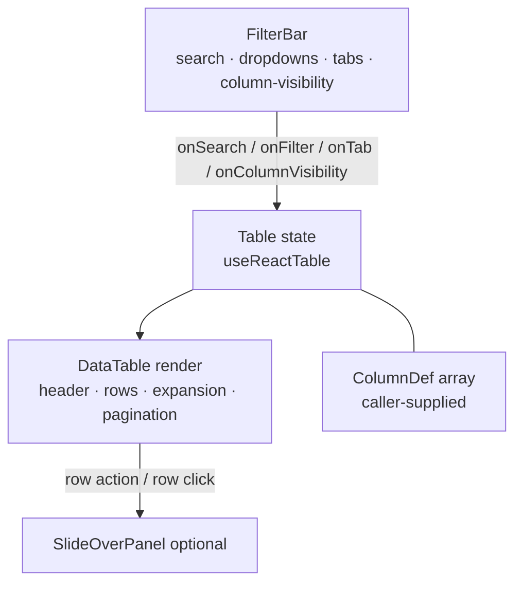

# Design Document — Admin Portal Redesign

## Overview

This design specifies a **presentation-layer** redesign of the Royal Glow admin
portal (`apps/admin`, served at `admin.theroyalglow.in`). It introduces a
cohesive **Admin Design System** — a set of reusable primitives (App Shell,
Data Table, Filter Bar, Status Badge, Slide-Over Panel, State Presenters, KPI /
Chart cards, an Icon System) — and a plan to apply them consistently across
every existing admin route.

The redesign reconciles a premium white-canvas SaaS/CRM aesthetic (sectioned
sidebar, dense data tables with status pills + inline row actions + expandable
rows, filter bars with column-visibility toggles, KPI + chart cards, right-side
slide-over panels) with the existing **warm Royal Glow brand** (cocoa/gold)
defined in `@rgss/ui` (`packages/ui/src/styles/theme.css`).

### Scope and Boundaries

This is a **re-skin and restructure only**. The design honours these hard
constraints (Req 16):

- **No data-layer changes.** No edits to `packages/db/schema/`,
  `packages/db/migrations/`, API request/response contracts, or RBAC logic in
  `@/lib/rbac`. Existing admin API endpoints are consumed **as-is** (Req 16.2,
  16.3, 16.4).
- **No business logic in components** (Req 16.5). Domain calculations,
  validation, and state-transition rules stay in `packages/business`.
  Formatting reuses existing helpers in `@/lib/admin` (`formatINR`,
  `formatINRWithPaise`, `formatDateDDMMYYYY`, `formatTime12h`).
- **Tokens are the single source of truth.** All colour, font, radius, and
  shadow values come from `@rgss/ui` Brand Tokens. Zero such literals are
  defined in `apps/admin` (Req 1.1, 1.2, 1.6).
- **Changed files are confined** to `apps/admin/app/`,
  `apps/admin/src/components/`, `apps/admin/src/lib/` (presentation helpers
  only), and shared primitives in `@rgss/ui` (Req 16.1, 16.6).
- **Root-Path Convention preserved** — no `/admin` prefix is introduced (Req
  4.9).

### Design Goals

| Goal | Requirement(s) |
|------|----------------|
| On-brand premium aesthetic via tokens only | 1.1–1.7 |
| Professional iconography (lucide-react) | 2.1–2.6 |
| Consistent, accessible App Shell on every route | 3.1–3.9, 17.1 |
| Role-filtered, sectioned navigation preserved | 4.1–4.9 |
| Orienting breadcrumb trail | 5.1–5.7 |
| Dense, capable, accessible data tables | 6.1–6.13, 7.1–7.6 |
| Uniform filter controls | 8.1–8.7 |
| Semantic, contrast-safe status pills | 9.1–9.6 |
| At-a-glance dashboard | 10.1–10.8 |
| Right-side detail panels | 11.1–11.8 |
| Consistent loading / empty / error states | 12.1–12.8 |
| WCAG 2.1 AA, Lighthouse a11y = 100 | 13.1–13.8 |
| Responsive 375px–1920px | 14.1–14.5 |
| India-first formatting | 15.1–15.5 |
| Cohesive application across all routes | 17.1–17.7 |

### Key Design Decisions

1. **Admin-local primitives in `apps/admin/src/components/ui/`.** The
   `@rgss/ui` `components/ui/` directory is currently empty (only a `.gitkeep`).
   shadcn-style primitives specific to the admin CRM aesthetic
   (DataTable, FilterBar, SlideOverPanel, StatusBadge, StatePresenter, KPICard,
   ChartCard) live in `apps/admin/src/components/ui/`. Rationale: these are
   admin-only patterns; the customer site (`apps/web`) has a different visual
   language. Only the **tokens** are shared (via `@rgss/ui/theme.css`), plus the
   `cn` utility from `@rgss/ui/lib/utils`. This satisfies Req 16.1 (shared UI
   primitives in `@rgss/ui` are permitted but not required) while keeping blast
   radius minimal.

2. **Server Components by default; `'use client'` only for interactivity.**
   Page shells, layouts, static card chrome, and breadcrumbs render on the
   server. Interactive primitives (DataTable, FilterBar, SlideOverPanel,
   AdminShell sidebar state, ChartCard) are client components (Req per
   coding-standards; Next.js 16 App Router).

3. **Tokens consumed exclusively through Tailwind v4 utilities.** The shared
   theme defines `@theme` tokens (e.g. `--color-cocoa-dark`, `--radius-cards`)
   which Tailwind v4 exposes as utilities (`bg-cocoa-dark`, `rounded-cards`).
   Components reference these named utilities, never raw hex/px literals (Req
   1.2, 1.5).

4. **`StatusBadge` migrates off raw Tailwind palette colours.** The current
   `StatusBadge` uses `bg-amber-50`, `text-emerald-700`, etc. (raw Tailwind
   palette = hard-coded literals, violating Req 1.2). The redesign maps statuses
   to the **semantic brand tokens** `--color-success`, `--color-warning`,
   `--color-error`, and a neutral default, all contrast-verified (Req 9.2, 9.5).

### Research Notes

- **`@tanstack/react-table` v8.21** (installed) is headless: it owns table
  *state* (sorting, pagination, column visibility, row selection, expansion) and
  leaves *markup* to us, which suits a token-driven design. We use
  `getCoreRowModel`, `getSortedRowModel`, `getPaginationRowModel`,
  `getFilteredRowModel`, and `getExpandedRowModel`. Source:
  [TanStack Table v8 docs](https://tanstack.com/table/v8/docs/introduction).
  *Content rephrased for compliance with licensing restrictions.*
- **`@radix-ui/react-dialog` v1.1** (installed) provides accessible modal
  semantics out of the box: focus trap, focus return to trigger, `Esc` to close,
  scroll lock, `role="dialog"` + `aria-modal`, and a labelled title via
  `Dialog.Title`. The SlideOverPanel is a styled Radix Dialog positioned on the
  right edge — this gives Req 11.4–11.7 essentially for free. Source:
  [Radix Dialog docs](https://www.radix-ui.com/primitives/docs/components/dialog).
  *Content rephrased for compliance.*
- **`recharts` v3.9** (installed) renders responsive SVG charts; its
  `ResponsiveContainer` handles fluid widths (Req 14.3). Colours are passed
  explicitly so we feed brand-token values resolved from CSS custom properties.
- **`lucide-react`** is **not yet installed** and must be added (Req 2.1). It is
  the standard tree-shakeable icon set; each icon is a React component accepting
  `size`, `aria-hidden`, and `className` (for `currentColor` token theming).
- **India formatting helpers already exist** in `@/lib/admin/bookings.ts`
  (`formatINR`, `formatINRWithPaise`, `formatDateDDMMYYYY`, `formatTime12h`).
  Req 15 mandates **reuse**, not duplication. A gap exists: Req 15.5 wants
  24-hour `HH:MM`, but the existing `formatTime12h` returns 12-hour. Resolution
  below in Components.

## Architecture

### System Context



The redesign sits entirely in the **presentation** column. Pages fetch from the
**unchanged** API routes and render data through the primitives. Primitives draw
their styling from Brand Tokens via Tailwind utilities.

### Layered Component Architecture



### App Shell Layout



- `≥1024px`: sidebar persistent beside content (Req 3.4); user identity shows
  avatar **and** name (Req 14.4).
- `<1024px`: sidebar hidden; toggle opens an overlay drawer with dimming
  backdrop, focus moves into drawer, focus trapped, `Esc`/backdrop/nav-item/
  toggle close it, focus returns to toggle on close (Req 3.5–3.9); user-name
  text hidden, avatar stays as a ≥44×44px control (Req 14.2, 14.5).

### Data Table Architecture



The FilterBar is a **controlled sibling** of the DataTable. State lives in the
page (or a small `useAdminTable` hook) and both components read/write it, so the
FilterBar "emits to the DataTable" (Req 8) via shared state rather than DOM
coupling. Column-visibility, sorting, pagination, selection, and expansion are
all owned by the TanStack `table` instance.

## Components and Interfaces

All primitives live in `apps/admin/src/components/ui/` unless noted. All accept a
`className` merged via `cn` from `@rgss/ui/lib/utils`. None contain business
logic; they receive pre-shaped data and callbacks.

### Token & Typography Mapping (Req 1.3, 1.4, 1.5)

| Role | Token | Tailwind utility |
|------|-------|------------------|
| Heading font (Cabinet Grotesk) | `--font-display` | `font-display` |
| Body font (Clash Grotesk) | `--font-sans` | `font-sans` |
| UI label font (Plus Jakarta Sans) | `--font-ui` | `font-ui` |
| Card radius 6px | `--radius-cards` | `rounded-cards` |
| Button radius 8px | `--radius-buttons` | `rounded-buttons` |
| Pill radius | `--radius-pill` | `rounded-pill` |
| Card hover shadow | `--shadow-card-hover` | `shadow-card-hover` |
| Surface / canvas | `--color-canvas-white`, `--color-cloud-gray` | `bg-canvas-white`, `bg-cloud-gray` |
| Primary text | `--color-cocoa-dark`, `--color-warm-gray` | `text-cocoa-dark`, `text-warm-gray` |
| Muted text / borders | `--color-dusty-gray`, `--color-outline-gray` | `text-dusty-gray`, `border-outline-gray` |
| Semantic | `--color-success`, `--color-warning`, `--color-error` | `text-success`, `bg-warning`, … |

**Typography scale** (UI labels = `font-ui`, body = `font-sans`, headings =
`font-display`): `text-[11px]`→`text-xs`→`text-sm`→`text-base`→`text-lg`→
`text-2xl` mapped to Tailwind's default type scale (no arbitrary literals beyond
the established `text-[11px]`/`text-[10px]` micro-label sizes already in use).
**Spacing scale**: Tailwind's `1/1.5/2/3/4/5/6/8` step scale only. A lint guard
(below) forbids hex/rgb/px colour & shadow literals in `apps/admin` component
source to enforce Req 1.2.

> **Note on missing radius/font utilities.** `rounded-buttons`, `rounded-pill`,
> `rounded-cards`, and `font-ui` derive automatically from the `@theme` tokens
> in Tailwind v4. If a referenced token is absent at build time, Tailwind emits
> no utility and the class is a no-op — to satisfy Req 1.7 (fail build, no
> silent fallback) a build-time token-presence check (see Testing Strategy)
> asserts each required token name exists in the resolved theme.

### Icon System (`@/components/ui/icon` + `@/lib/admin/nav-icons`) (Req 2)

Replaces the emoji `NAV_ICONS` map in `admin-sidebar.tsx` and the emoji KPI
icons in `dashboard-overview.tsx`.

```ts
import type { LucideIcon } from 'lucide-react'
import {
  LayoutDashboard, CalendarDays, Clock, Users, Target, Scissors,
  CalendarRange, Palmtree, Sparkles, Tag, Gem, ReceiptText, TrendingUp,
  Settings, Building2, KeyRound, Plug, ScrollText, CircleDot, // default
} from 'lucide-react'

/** Per-route icon map keyed by Root-Path href (Req 2.2). */
export const NAV_ICON_MAP: Record<string, LucideIcon> = {
  '/': LayoutDashboard,
  '/bookings': CalendarDays,
  '/waitlist': Clock,
  '/customers': Users,
  '/leads': Target,
  '/staff': Scissors,
  '/schedule': CalendarRange,
  '/leave': Palmtree,
  '/services': Sparkles,
  '/offers': Tag,
  '/memberships': Gem,
  '/billing': ReceiptText,
  '/reports': TrendingUp,
  '/settings': Settings,
  '/branches': Building2,
  '/users': KeyRound,
  '/integrations': Plug,
  '/logs': ScrollText,
  '/me/schedule': CalendarRange,
  '/me/leave': Palmtree,
}

/** Single predefined fallback icon (Req 2.6). */
export const DEFAULT_NAV_ICON: LucideIcon = CircleDot

export function navIconFor(href: string): LucideIcon {
  return NAV_ICON_MAP[href] ?? DEFAULT_NAV_ICON
}
```

`Icon` wrapper enforces a11y rules:

```ts
type IconProps = {
  icon: LucideIcon
  /** Decorative icon beside visible text → hidden from AT (Req 2.4). */
  decorative?: boolean
  /** Required when the icon is the only content of a control (Req 2.5). */
  label?: string
  size?: number
  className?: string
}
// decorative → aria-hidden="true"; otherwise role="img" + aria-label={label}
```

### AdminShell / AdminSidebar / TopBar / Breadcrumb (Req 3, 4, 5)

`AdminShell` (client) keeps its current server-resolved props (`role`,
`userName`, `userInitials`) and adds the responsive overlay behaviour.

```ts
type AdminShellProps = {
  role: string          // server-resolved (drives nav visibility)
  userName: string
  userInitials: string  // ≤2 initials (Req 3.3)
  children: React.ReactNode
}
```

Behavioural contract:

- Renders `AdminSidebar`, `TopBar`, content region on every page (Req 3.1,
  17.1).
- `sidebarOpen` state; toggle in TopBar. On open `<1024px`: render backdrop,
  move focus into drawer, trap focus (Req 3.6, 3.8). On close (toggle, backdrop,
  `Esc`, nav-item click): return focus to toggle (Req 3.7, 3.9). Focus trap +
  return implemented with a small `useFocusTrap` hook in
  `@/components/ui/use-focus-trap.ts` (or by rendering the drawer as a Radix
  Dialog in mobile mode to reuse its trap — chosen approach: **reuse Radix
  Dialog** for the mobile drawer to avoid hand-rolling focus management, while
  the `≥1024px` persistent rail is plain markup).

`TopBar` contains: sidebar toggle, `Breadcrumb`, `NotificationBell` (existing,
unchanged), `UserIdentity`.

`UserIdentity`:
- avatar = up to first two initials of display name (Req 3.3);
- `≥1024px`: avatar + name + role label (Req 14.4);
- `<1024px`: name text hidden, avatar visible & operable, ≥44×44px (Req 14.2,
  14.5).

`AdminSidebar` keeps `filterNavByLevel(ADMIN_NAV, roleLevel)` exactly (Req 4.2,
4.3); sections with zero visible items are already omitted by the helper (Req
4.4). Active item = longest-matching route prefix, visually distinct +
`aria-current="page"` (Req 4.5, 4.6). Unresolved role → level 0 via
`resolveRoleLevel` (Req 4.7). Logo + "Admin" label at top (Req 4.8). Emoji
replaced by `navIconFor(item.href)` (Req 2.3).

`Breadcrumb` (server component) derives the trail from `pathname` +
`ADMIN_NAV`:

```ts
type Crumb = { label: string; href: string; current: boolean }
/** Pure, in @/lib/admin/breadcrumbs.ts — unit/property testable. */
export function deriveBreadcrumbs(
  pathname: string,
  nav: ReadonlyArray<NavSection>,
): Crumb[]
```

Derivation strategy:
1. Find the `ADMIN_NAV` item whose `href` is the **longest path-prefix** of
   `pathname` (reusing the same prefix semantics as `rbac.ts`).
2. The matched item's `label` is the section/page label; if `pathname` extends
   beyond it (a sub-route like `/bookings/123`), append a current crumb for the
   detail segment (Req 5.1, 5.2).
3. Every crumb except the last renders as a link; the last is non-interactive
   text with `aria-current="page"` (Req 5.3, 5.4, 5.6).
4. Wrapped in `<nav aria-label="Breadcrumb">` (Req 5.7). Top-level routes (e.g.
   `/`) yield a single current crumb (Req 5.6).

### DataTable (`@/components/ui/data-table.tsx`, client) (Req 6, 7, 14.1)

```ts
import type { ColumnDef, Row } from '@tanstack/react-table'

type DataTableProps<T> = {
  columns: ColumnDef<T>[]            // caller-supplied (Req 6.2)
  data: T[]
  /** Stable route key for persisting column visibility within the route (Req 7.5). */
  tableId: string
  enableSelection?: boolean          // checkbox + select-all (Req 6.6)
  getRowCanExpand?: (row: Row<T>) => boolean   // expandable rows (Req 6.7)
  renderSubRows?: (row: Row<T>) => React.ReactNode
  rowActions?: (row: Row<T>) => RowAction[]     // kebab dropdown (Req 6.5)
  onRowClick?: (row: T) => void                 // e.g. open SlideOverPanel
  pageSize?: 10 | 25 | 50 | 100      // default 25 (Req 6.8)
  /** Controlled global filter / column filters from FilterBar (Req 8). */
  globalFilter?: string
  columnFilters?: { id: string; value: unknown }[]
  /** Lifted state so FilterBar's column-visibility control can read/write it (Req 7). */
  columnVisibility?: Record<string, boolean>
  onColumnVisibilityChange?: (v: Record<string, boolean>) => void
}

type RowAction = { label: string; icon?: LucideIcon; onSelect: () => void; destructive?: boolean }
```

Internals & contract:
- `useReactTable` with core/sorted/filtered/paginated/expanded row models (Req
  6.2).
- **Sorting**: header click toggles asc⇄desc, single active column
  (`enableMultiSort: false`), direction indicator (chevron up/down) on active
  header (Req 6.3). Headers are `<button>` inside `<th scope="col">` (Req 6.10,
  13.3).
- **Hover**: row `hover:bg-cloud-gray/40` (Req 6.4).
- **Row actions**: trailing column renders a `@radix-ui/react-dropdown-menu`
  kebab with `rowActions(row)` (Req 6.5); destructive items styled with
  `text-error`.
- **Selection**: leading checkbox column + header select-all when
  `enableSelection` (Req 6.6); checkboxes are labelled for AT.
- **Expansion**: leading expand chevron when `getRowCanExpand(row)`; expanded
  content via `renderSubRows` (Req 6.7).
- **Pagination**: footer with "Rows per page" select {10,25,50,100} default 25
  (Req 6.8, 6.9), prev/next buttons, "Page X of Y" indicator (Req 6.11); prev
  disabled on first page, next on last (Req 6.13); navigating swaps rows (Req
  6.12).
- **Column visibility** owned by the `table` instance and lifted via
  `columnVisibility`/`onColumnVisibilityChange`; persists across sort/filter/
  page changes while on the route (Req 7.5) — persistence backed by the page /
  `useAdminTable` hook (in-memory + optional `sessionStorage` keyed by
  `tableId`). The guard preventing an all-hidden state lives in FilterBar (Req
  7.4).
- **Responsive**: table wrapped in `overflow-x-auto` region so only the table
  scrolls horizontally on 375–1023px, never the page; no value clipped (Req
  14.1, 14.3).
- **a11y**: `<table>` with `<caption class="sr-only">`, `<th scope>`
  associations, fully keyboard-operable controls (Req 6.10, 13.3).

### FilterBar (`@/components/ui/filter-bar.tsx`, client) (Req 7.1–7.6, 8)

```ts
type FilterBarProps = {
  /** Only the listed controls render (Req 8.1). */
  config: {
    search?: { placeholder: string; ariaLabel: string }     // Req 8.2, 8.3
    dropdowns?: FilterDropdown[]                              // Req 8.4
    tabs?: { ariaLabel: string; options: TabOption[] }       // Req 8.5
    columnVisibility?: boolean                               // Req 7.1, 8.6
  }
  // controlled values + emit callbacks
  search?: string
  onSearchChange?: (trimmed: string) => void                 // debounced 300ms, ≤100 chars
  onFilterChange?: (id: string, value: string) => void
  onTabChange?: (value: string) => void
  columns?: ColumnToggle[]      // {id, label, visible} excluding select/expand/actions (Req 7.1)
  onColumnToggle?: (id: string, visible: boolean) => void    // blocks last-visible-off (Req 7.4)
}
```

Contract:
- Renders only configured controls (Req 8.1).
- Search input: `maxLength={100}` (Req 8.3); 300 ms debounce then emit
  **trimmed** term (Req 8.2). Debounce via a small `useDebouncedCallback`.
- Dropdowns/tabs emit selected value (Req 8.4, 8.5).
- Column-visibility control (a labelled dropdown of checkboxes) lists only
  toggleable data columns by header label with current on/off state (Req 7.1,
  7.6); toggling emits updated visible set (Req 8.6) and updates within 200 ms
  (Req 7.2, 7.3 — pure React state update, well under budget). If toggling the
  last visible data column off, it is **kept visible** and a hint ("At least one
  column must stay visible") is shown (Req 7.4 → see Property 6).
- Every control has a programmatically associated label (Req 7.6, 8.7, 13.3).

### StatusBadge (`@/components/ui/status-badge.tsx`) (Req 9)

Replaces the raw-palette `StatusBadge`. Pure mapping in
`@/lib/admin/status-badge.ts` for testability:

```ts
export type BadgeVariant = 'success' | 'warning' | 'error' | 'neutral'

/** Recognised status → semantic variant (Req 9.2). snake_case keys. */
export const STATUS_VARIANT: Record<string, BadgeVariant> = {
  // success
  confirmed: 'success', completed: 'success', active: 'success',
  paid: 'success', won: 'success', approved: 'success',
  // warning
  pending: 'warning', follow_up: 'warning', in_progress: 'warning',
  contacted: 'warning', rescheduled: 'warning',
  // error
  rejected: 'error', cancelled: 'error', no_show: 'error',
  expired: 'error', lost: 'error',
}

/** Variant resolution with neutral fallback (Req 9.4). */
export function variantForStatus(status: string | null | undefined): BadgeVariant {
  if (status == null || status.trim() === '') return 'neutral'
  return STATUS_VARIANT[status] ?? 'neutral'
}

/** snake_case → Title Case (Req 9.3); fixed placeholder when no value (Req 9.4). */
export function labelForStatus(status: string | null | undefined): string {
  if (status == null || status.trim() === '') return 'Unknown'
  return status.replace(/_/g, ' ').replace(/\b\w/g, (c) => c.toUpperCase())
}
```

Variant → token classes (contrast-verified ≥4.5:1, Req 9.5):

| Variant | bg | text | dot |
|---------|----|----|-----|
| success | `bg-success/10` | `text-success` | `bg-success` |
| warning | `bg-warning/15` | `text-warm-gray` (not warning-on-white, to keep ≥4.5:1) | `bg-warning` |
| error | `bg-error/10` | `text-error` | `bg-error` |
| neutral | `bg-cloud-gray` | `text-warm-gray` | `bg-dusty-gray` |

> **Contrast decision (Req 9.5).** `--color-warning` (#c8a961, gold) on white
> fails 4.5:1 for small text. The warning pill therefore uses a tinted gold
> background with **cocoa/warm-gray text** plus a gold dot — colour is never the
> sole signal because the Title-Case text label is always present (Req 9.6).

Component renders a pill: dot (`aria-hidden`) + text label. The text label is
the accessible content (Req 9.1, 9.6).

### SlideOverPanel (`@/components/ui/slide-over-panel.tsx`, client) (Req 11)

Built on `@radix-ui/react-dialog`.

```ts
type SlideOverPanelProps = {
  open: boolean
  onOpenChange: (open: boolean) => void
  title: string                 // accessible name via Dialog.Title (Req 11.7)
  description?: string
  children: React.ReactNode
  footer?: React.ReactNode
}
```

- `Dialog.Content` positioned `fixed right-0 inset-y-0` width `w-full max-w-md`,
  slides in from the right over `Dialog.Overlay` backdrop within 300 ms (Req
  11.1, 11.2).
- Radix provides focus trap, focus return to trigger, `Esc`/backdrop close,
  scroll lock, `role="dialog"` + `aria-modal`, and labelled title (Req
  11.3–11.7).
- Transition classes gated by `motion-reduce:transition-none` so reduced-motion
  users get no slide (Req 11.8, 13.6) — the global theme already forces
  near-instant transitions under `prefers-reduced-motion`.

### State Presenters (`@/components/ui/state/`) (Req 10.4–10.8, 12)

Three components + a small status hook.

```ts
// Skeleton.tsx — same footprint as content; 1 row per expected record, max 10 (Req 12.1)
type SkeletonProps = { rows?: number; variant?: 'table' | 'card' | 'kpi' }
// EmptyState.tsx — message describing absence (Req 12.2)
type EmptyStateProps = { title: string; message: string; icon?: LucideIcon }
// ErrorState.tsx — message + retry (Req 12.3)
type ErrorStateProps = { message: string; onRetry: () => void }
```

Live regions (Req 12.7, 12.8): skeleton wrapper has `aria-live="polite"` +
`aria-busy="true"` announcing loading; error wrapper uses `role="alert"`
(assertive). Retry re-requests data and returns the view to the loading state
(Req 12.4, 12.5).

**30-second timeout** (Req 12.6) and the dashboard **10-second timeout** (Req
10.8) are provided by a shared async-state hook:

```ts
type AdminAsyncState<T> =
  | { status: 'loading' } | { status: 'success'; data: T } | { status: 'error'; message: string }

/** Wraps a fetcher; flips to 'error' if not resolved within timeoutMs. */
function useAsyncData<T>(
  fetcher: () => Promise<T>,
  opts: { timeoutMs: number },   // 30_000 default; 10_000 for Dashboard
): { state: AdminAsyncState<T>; retry: () => void }
```

This hook centralises the loading/empty/error/timeout/retry behaviour so every
route (Req 17.4) behaves identically; it contains **no business logic**, only
fetch orchestration + timing.

### Dashboard KPI & Chart Cards (Req 10)

```ts
type KPICardProps = {
  label: string
  value: string                 // pre-formatted; monetary via formatINRWithPaise (Req 10.6)
  icon?: LucideIcon
  loading?: boolean             // shows KPI skeleton (Req 10.4)
}
type ChartCardProps = {
  title: string
  children: React.ReactNode     // a recharts chart (Req 10.2)
  loading?: boolean
}
```

`DashboardOverview` (redesign of existing `dashboard-overview.tsx`) renders ≥4
`KPICard`s (Req 10.1), ≥1 `ChartCard` with a recharts bar chart (Req 10.2), and
a recent-activity `DataTable` beneath (Req 10.3). It uses `useAsyncData(...,
{timeoutMs: 10_000})` for skeleton/error/empty/timeout states (Req 10.4, 10.5,
10.7, 10.8). Monetary KPI values use `formatINRWithPaise` so they render
`₹1,00,000.00` (Req 10.6, 15.1). Chart colours come from brand tokens resolved
via CSS variables.

## Data Models

This feature introduces **no persistent data models** and **no API contract
changes** (Req 16.2). It defines only **presentation-layer view types** that
mirror existing API responses and primitive prop types. The canonical data types
(`AdminBooking`, `AdminBookingServiceRow`, `StaffMember`, lead/membership types)
already exist in `@/lib/admin/*` and are consumed unchanged.

### Presentation View Types (new, presentation-only)

```ts
// @/components/ui/* prop types (summarised above):
//   DataTableProps<T>, RowAction, FilterBarProps, FilterDropdown, TabOption,
//   ColumnToggle, StatusBadgeProps, SlideOverPanelProps, KPICardProps,
//   ChartCardProps, Skeleton/Empty/ErrorState props, IconProps

// @/lib/admin presentation helpers (pure):
type Crumb = { label: string; href: string; current: boolean }
type BadgeVariant = 'success' | 'warning' | 'error' | 'neutral'
type AdminAsyncState<T> = { status: 'loading' }
  | { status: 'success'; data: T }
  | { status: 'error'; message: string }
```

### Formatting Helpers (reused / extended — Req 15)

| Helper | Location | Req | Status |
|--------|----------|-----|--------|
| `formatINRWithPaise(paise)` → `₹1,00,000.00` | `@/lib/admin/bookings.ts` | 15.1, 10.6 | **reuse** |
| `formatINR(paise)` → `₹1,499` (no decimals) | `@/lib/admin/bookings.ts` | — | reuse for dense cells |
| `formatDateDDMMYYYY(value)` → `DD/MM/YYYY` | `@/lib/admin/bookings.ts` | 15.2 | reuse |
| `formatDateTimeIST(value)` (UTC→IST, DD/MM/YYYY) | `@/lib/admin` (extend) | 15.3 | **add** |
| `formatTime24hIST(value)` → `HH:MM` 24h IST | `@/lib/admin` (extend) | 15.5 | **add** |
| Placeholder for null/invalid → `'—'` | shared const | 15.4 | **add** |

> **Formatting decisions.** (1) The existing `formatTime12h` returns 12-hour
> time, but Req 15.5 mandates 24-hour `HH:MM` in IST. To avoid changing the
> existing helper's contract (other callers depend on it), the redesign adds a
> sibling `formatTime24hIST`. These are **presentation formatters**, not
> business logic, so they belong in `@/lib/admin` (Req 16.5 permits this; they
> perform no domain calculation). (2) Every formatter returns the fixed
> placeholder `'—'` for null/undefined/invalid input and never renders a
> partial/raw value (Req 15.4).

## Correctness Properties

*A property is a characteristic or behavior that should hold true across all
valid executions of a system — essentially, a formal statement about what the
system should do. Properties serve as the bridge between human-readable
specifications and machine-verifiable correctness guarantees.*

These properties target the **pure presentation logic** extracted into testable
helpers (`@/lib/admin/*`, `@/components/ui/*` pure utilities). Interactive React
behaviours (focus trap, responsive breakpoints, Radix dialog semantics, debounce
timing, route consistency) are verified by example/integration tests in the
Testing Strategy, not by property-based tests, per the prework classification.

### Property 1: Icon resolution is total with a single fallback

*For any* string `href`, `navIconFor(href)` returns a defined `LucideIcon`
component; for any `href` not present in `NAV_ICON_MAP` it returns exactly
`DEFAULT_NAV_ICON`; and every `href` in `ADMIN_NAV` resolves to a defined icon.

**Validates: Requirements 2.1, 2.2, 2.6**

### Property 2: Avatar initials are at most two uppercase letters

*For any* display-name string, the derived avatar initials contain at most two
characters, are uppercase, and are taken from the first letters of the first two
whitespace-separated words (empty/whitespace-only names yield a safe placeholder
of length ≤ 2).

**Validates: Requirements 3.3**

### Property 3: Exactly one active navigation item by longest prefix

*For any* pathname, at most one navigation item is marked active, and when one is
active it is the item whose `href` is the longest path-prefix of the pathname;
that item (and only that item) is marked `aria-current="page"`.

**Validates: Requirements 4.5, 4.6**

### Property 4: Navigation filtering respects role level with no empty sections

*For any* role level, every navigation item rendered by the sidebar satisfies
`item.minLevel <= roleLevel`, and no section with zero visible items is
rendered. (Consumes the existing pure `filterNavByLevel`; the redesign adds no
new filtering logic.)

**Validates: Requirements 4.2, 4.3, 4.4, 4.7**

### Property 5: Breadcrumb derivation is well-formed

*For any* pathname, `deriveBreadcrumbs(pathname, ADMIN_NAV)` returns a non-empty
ordered list from highest ancestor to current page in which exactly one crumb —
the last — is marked current and non-interactive, every other crumb carries a
link `href`, and a top-level route yields a single current-only crumb.

**Validates: Requirements 5.1, 5.2, 5.3, 5.4, 5.6**

### Property 6: Column-visibility invariant — never empty, preserved across ops

*For any* initial set of toggleable data columns and *any* sequence of toggle
attempts interleaved with sorting, filtering, and pagination operations, the set
of visible toggleable data columns is never empty (an attempt to hide the last
visible data column is rejected and that column stays visible), and no
sort/filter/pagination operation changes the column-visibility selection.

**Validates: Requirements 7.4, 7.5**

### Property 7: Pagination stays in bounds with correct slice and control state

*For any* total row count, *any* page size in {10, 25, 50, 100}, and *any*
sequence of previous/next activations, the current page index stays within
`[1, totalPages]`, the displayed rows equal the contiguous slice
`[(page-1)*size, page*size)` (so visible rows = `min(size, total-offset)`), the
previous control is disabled exactly on the first page, and the next control is
disabled exactly on the last page.

**Validates: Requirements 6.8, 6.9, 6.11, 6.12, 6.13**

### Property 8: Sorting orders by the active column and toggles direction

*For any* data array and *any* sortable column, after activating that column's
header the displayed rows are ordered monotonically by that column (non-
decreasing for ascending, non-increasing for descending), a second activation
reverses the order, and at most one column has an active sort at any time.

**Validates: Requirements 6.3**

### Property 9: FilterBar renders exactly the configured controls

*For any* control configuration drawn from {search, dropdowns, tabs,
column-visibility}, the FilterBar renders exactly the configured controls and no
others.

**Validates: Requirements 8.1**

### Property 10: Search term is emitted trimmed

*For any* search input string, the value emitted to the Data_Table equals the
input with leading and trailing whitespace removed (`input.trim()`).

**Validates: Requirements 8.2**

### Property 11: Status variant mapping with neutral fallback

*For any* status string, `variantForStatus` returns the documented semantic
variant (`success` / `warning` / `error`) for recognised values and returns
`neutral` for any unrecognised, empty, null, or undefined value.

**Validates: Requirements 9.2, 9.4**

### Property 12: Status label is Title-Cased and always non-empty

*For any* status value, `labelForStatus` returns a non-empty string containing no
underscores, with the first letter of every word capitalised and the word count
preserved; for empty/null/undefined it returns the fixed placeholder label.

**Validates: Requirements 9.1, 9.3, 9.4, 9.6**

### Property 13: Every status-badge variant meets AA contrast

*For any* `BadgeVariant`, the computed WCAG contrast ratio between its text
colour and its background colour (resolved from Brand-Token hex values, composited
over the canvas) is at least 4.5:1.

**Validates: Requirements 9.5**

### Property 14: Skeleton row count is bounded

*For any* expected record count `n ≥ 0`, the skeleton presenter renders exactly
`min(n, 10)` placeholder rows.

**Validates: Requirements 12.1**

### Property 15: Async timeout outcome is deterministic

*For any* fetch resolve delay and *any* timeout value, the async-data state
settles to `success` if and only if the fetch resolves strictly before the
timeout deadline, and otherwise settles to `error` with a retry available.

**Validates: Requirements 12.6, 10.8**

### Property 16: INR formatting round-trips with Indian grouping

*For any* paise amount in `[0, 99_999_999_999]` (₹0.00 … ₹999,999,999.99), the
formatted string begins with `₹`, has exactly two decimal places, groups the
integer part in the Indian convention (groups of two beyond the first three),
and parsing the digits back recovers the original rupee amount.

**Validates: Requirements 15.1, 10.6**

### Property 17: Date formatting is DD/MM/YYYY and round-trips

*For any* valid date, `formatDateDDMMYYYY` returns a string matching
`DD/MM/YYYY` with each component zero-padded, and parsing the components back
yields the same day, month, and year.

**Validates: Requirements 15.2**

### Property 18: UTC→IST conversion uses a constant +05:30 offset

*For any* UTC instant, the presented date-time equals the instant shifted by
exactly +330 minutes, and the applied offset is constant across all dates of the
year (no daylight-saving adjustment).

**Validates: Requirements 15.3**

### Property 19: Time formatting is 24-hour HH:MM in IST

*For any* UTC instant, `formatTime24hIST` returns a string matching `HH:MM`
(zero-padded, 24-hour) equal to the hours and minutes of the instant shifted by
+330 minutes.

**Validates: Requirements 15.5**

### Property 20: Formatters reject invalid input with a fixed placeholder

*For any* null, undefined, NaN, or otherwise invalid input, every currency,
date, and time formatter returns the fixed placeholder `'—'` and never a partial,
raw, or unformatted value.

**Validates: Requirements 15.4**

## Error Handling

Because this is a presentation-layer redesign consuming existing APIs, error
handling is about **surfacing** failures consistently, not changing API error
contracts.

| Condition | Handling | Requirement |
|-----------|----------|-------------|
| Fetch returns non-2xx / `success:false` | `useAsyncData` → `error` state; `ErrorState` shows the API `error.message` (or a generic fallback) + retry | 12.3, 12.4 |
| Network failure / thrown error | caught → `error` state with generic message | 12.3 |
| Request exceeds timeout | `useAsyncData` deadline (30s general / 10s dashboard) → `error` state + retry | 12.6, 10.8 |
| Retry activated | re-invoke fetcher; transition `error → loading` first | 12.4, 12.5 |
| Loaded with empty result | `EmptyState` describing absence of records | 12.2, 10.7 |
| Unknown / null status value | `StatusBadge` neutral variant + placeholder label | 9.4 |
| Null / invalid currency / date / time | formatter returns `'—'` placeholder | 15.4 |
| Missing per-route icon | `DEFAULT_NAV_ICON` fallback | 2.6 |
| Missing brand token at build | build-time token-presence check fails the build (no silent fallback) | 1.7 |
| Change touches a forbidden path | CI path-allowlist gate rejects the change | 16.6, 16.7 |

Error and loading states announce via live regions: loading is `aria-live="polite"`
+ `aria-busy`, error is `role="alert"` (assertive) (Req 12.7, 12.8). No
`dangerouslySetInnerHTML`; all rendered API strings are treated as untrusted text.

## Testing Strategy

### Dual Approach

- **Property-based tests** (fast-check, already a dev dependency) verify the 20
  universal properties above against the pure helpers.
- **Example / component tests** (Vitest + React Testing Library + jest-axe)
  verify discrete component behaviour, rendering, a11y structure, and
  interaction.
- **Integration / E2E tests** (Playwright + Lighthouse CI) verify responsive
  layout, no horizontal overflow, route consistency, and the a11y = 100 gate.

### Property-Based Testing

- Library: **fast-check** (`apps/admin` devDependency).
- Each property test runs a **minimum of 100 iterations** (`{ numRuns: 100 }` or
  higher).
- Each property test is tagged with a comment referencing its design property:
  `// Feature: admin-portal-redesign, Property {n}: {property text}`.
- Each correctness property is implemented by a **single** property-based test.
- Generators: arbitrary strings for hrefs/names/statuses; arbitrary
  `snake_case` strings (words joined by `_`); arbitrary arrays + page sizes for
  pagination; arbitrary toggle/op sequences for the column-visibility invariant;
  integer paise in `[0, 99_999_999_999]`; arbitrary valid `Date`s / UTC instants
  for formatters. Generators explicitly include edge cases: empty string,
  whitespace-only, single-word names, unicode, `0` paise, max paise, leap-year
  dates, midnight/near-midnight IST boundary instants.

Property-to-helper map:

| Property | Helper / unit under test |
|----------|--------------------------|
| 1 | `navIconFor` (`@/lib/admin/nav-icons`) |
| 2 | initials deriver (`@/lib/admin/initials`) |
| 3 | `isActive` / active-resolver (sidebar pure helper) |
| 4 | `filterNavByLevel` (reuse `@/lib/rbac`) |
| 5 | `deriveBreadcrumbs` (`@/lib/admin/breadcrumbs`) |
| 6 | column-visibility reducer (`@/components/ui/data-table` model) |
| 7 | pagination model (TanStack-backed pure helper) |
| 8 | sort comparator/model |
| 9 | FilterBar config→controls selector |
| 10 | search trim in FilterBar emit path |
| 11 | `variantForStatus` |
| 12 | `labelForStatus` |
| 13 | contrast computation over `BadgeVariant` token pairs |
| 14 | skeleton row-count helper |
| 15 | `useAsyncData` reducer (modelled, timer-driven) |
| 16 | `formatINRWithPaise` |
| 17 | `formatDateDDMMYYYY` |
| 18 | `formatDateTimeIST` |
| 19 | `formatTime24hIST` |
| 20 | all formatters (invalid-input edge) |

> Properties 6, 7, 8, and 15 are tested against **pure model functions** that
> mirror the TanStack/React behaviour (the column-visibility reducer, the
> pagination index/slice computation, the sort comparator, the async-state
> reducer). This keeps them fast and deterministic — no DOM, no 100×-rendered
> tables — per the prework guidance to test logic, not the third-party library.

### Example / Component Tests (Vitest + RTL + jest-axe)

- Icon a11y (2.4/2.5), Shell composition (3.1/3.2), responsive drawer
  open/close/focus-trap/return (3.6–3.9), breadcrumb landmark + link nav
  (5.5/5.7), row actions/selection/expansion render (6.5/6.6/6.7), header/cell
  a11y (6.10), column-visibility control contents (7.1/7.6), toggle add/remove
  (7.2/7.3), dropdown/tab/column emit (8.4/8.5/8.6), search maxLength (8.3) and
  debounce timing (8.2 timing, fake timers), badge render (9.1), dashboard
  composition + states + 10s timeout (10.1–10.5/10.7/10.8), slide-over
  semantics/focus/scroll-lock/reduced-motion (11.1–11.8), empty/error render +
  retry (12.2–12.5), live regions (12.7/12.8), touch targets (14.5).
- `jest-axe` assertion (zero violations) on every primitive and redesigned route
  (supports 13.x).

### Integration / E2E (Playwright + Lighthouse CI)

- Responsive: no horizontal page overflow across 375 → 1920px (14.3); table-only
  horizontal scroll on 375–1023px (14.1); user-name hide/show by breakpoint
  (14.2/14.4); sidebar persistent/overlay by breakpoint (3.4/3.5).
- Route consistency smoke (extends existing `migrated-routes.smoke.test.tsx`):
  every authenticated route renders within `AdminShell` (17.1) and uses the
  primitives where applicable (17.2–17.5); pre-redesign fields and actions
  preserved (17.6/17.7).
- **Lighthouse CI** accessibility audit = 100 per redesigned route; a score < 100
  fails the gate and blocks merge (13.7, 13.8) — wired into the existing
  `.github/lighthouse` config.

### Static / CI Gates (Smoke)

- **No brand literals**: lint/grep gate asserting zero hex/rgb/px colour, font,
  radius, or shadow literals in `apps/admin` component source (1.1, 1.2).
- **No emoji icons**: grep gate over Shell/Sidebar/Dashboard source (2.3).
- **Token presence**: build-time assertion that every required Brand-Token name
  resolves; missing token fails the build (1.7).
- **Path allowlist**: CI gate rejecting diffs that touch
  `packages/db/schema`, `packages/db/migrations`, API contracts, `@/lib/rbac`,
  or the drift fingerprint reference (16.1–16.3, 16.6–16.8).
- **Root-Path**: assert every `ADMIN_NAV` href omits the `/admin` prefix (4.9).

### Out of Scope for Automated Tests

WCAG "full conformance" (13.1) and subjective contrast/focus-obscuring judgments
(13.2) require manual assistive-technology testing and expert review beyond
automated checks; automated tests (jest-axe + Lighthouse + the contrast property)
cover the machine-verifiable subset.

## Component Inventory & File Structure

New / changed files (all within permitted directories — Req 16.1):

```
apps/admin/src/
├── components/
│   ├── ui/                          ← NEW admin design-system primitives
│   │   ├── icon.tsx                 ← Icon wrapper (a11y rules) — Req 2.4/2.5
│   │   ├── data-table.tsx           ← DataTable (TanStack) — Req 6,7,14.1
│   │   ├── data-table-model.ts      ← pure pagination/sort/visibility models (PBT)
│   │   ├── filter-bar.tsx           ← FilterBar — Req 7,8
│   │   ├── status-badge.tsx         ← StatusBadge (token-based) — Req 9
│   │   ├── slide-over-panel.tsx     ← SlideOverPanel (Radix Dialog) — Req 11
│   │   ├── kpi-card.tsx             ← KPICard — Req 10.1/10.6
│   │   ├── chart-card.tsx           ← ChartCard (recharts) — Req 10.2
│   │   ├── use-async-data.ts        ← loading/error/empty/timeout/retry — Req 12,10.8
│   │   ├── use-debounced-callback.ts← 300ms debounce — Req 8.2
│   │   └── state/
│   │       ├── skeleton.tsx         ← Req 12.1
│   │       ├── empty-state.tsx      ← Req 12.2
│   │       └── error-state.tsx      ← Req 12.3
│   ├── layout/
│   │   ├── admin-shell.tsx          ← REDESIGN (responsive, focus, identity) — Req 3,14
│   │   ├── admin-sidebar.tsx        ← REDESIGN (lucide icons, sectioned) — Req 2,4
│   │   ├── top-bar.tsx              ← NEW (extracted) — Req 3.2
│   │   ├── breadcrumb.tsx           ← NEW — Req 5
│   │   └── user-identity.tsx        ← NEW — Req 3.3,14.2/14.4
│   └── admin/
│       └── StatusBadge.tsx          ← re-export shim → ui/status-badge (back-compat)
├── lib/admin/
│   ├── nav-icons.ts                 ← NAV_ICON_MAP, DEFAULT_NAV_ICON, navIconFor — Req 2
│   ├── breadcrumbs.ts               ← deriveBreadcrumbs — Req 5
│   ├── initials.ts                  ← avatar initials — Req 3.3
│   ├── status-badge.ts              ← variantForStatus, labelForStatus — Req 9
│   └── format.ts                    ← formatDateTimeIST, formatTime24hIST, PLACEHOLDER — Req 15
└── lib/rbac.ts                      ← UNCHANGED (consumed only) — Req 16.3

packages/ui/src/styles/theme.css     ← (optional) add radius-buttons token alias if absent — Req 1
```

> The existing `@/components/admin/StatusBadge` import path stays valid via a
> thin re-export shim so callers (e.g. `dashboard-overview`, `bookings-table`)
> need no churn during migration.

## Migration & Rollout

Apply primitives across all root-path routes (Req 17) in dependency order, each
step independently shippable:

1. **Foundation** — add `lucide-react`; create `lib/admin` pure helpers
   (nav-icons, breadcrumbs, initials, status-badge, format) + their property
   tests. No UI change yet.
2. **Status & format** — migrate `StatusBadge` to tokens (shim old path); swap
   formatting call-sites to the IST/24h helpers where Req 15 applies.
3. **Shell** — redesign `AdminShell`/`AdminSidebar`, extract `TopBar`,
   `Breadcrumb`, `UserIdentity`; replace emoji nav icons. Every route inherits
   this immediately (single layout) — satisfies 17.1.
4. **Primitives** — build `DataTable`, `FilterBar`, `SlideOverPanel`,
   `StatePresenters`, `KPICard`, `ChartCard` + tests.
5. **Dashboard** — rebuild `dashboard-overview` on KPICard/ChartCard/DataTable +
   `useAsyncData` (Req 10).
6. **Route-by-route adoption** — migrate each list/table page to DataTable +
   FilterBar + StatePresenters + StatusBadge, preserving every field and action
   (Req 17.2–17.7): `/bookings`, `/waitlist`, `/customers`, `/leads`, `/staff`,
   `/schedule`, `/leave`, `/services`, `/offers`, `/memberships`, `/billing`,
   `/reports`, `/settings`, `/branches`, `/users`, `/integrations`, `/logs`,
   `/me/schedule`, `/me/leave`. Detail routes (`[id]`) adopt `SlideOverPanel`
   where a slide-over inspection improves flow.
7. **Gates** — enable the static gates (no-literals, no-emoji, token-presence,
   path-allowlist) and Lighthouse a11y = 100 per route before merge (Req 1, 2,
   13, 16).

### Requirement → Design Coverage Map

| Req | Covered by |
|-----|-----------|
| 1 Token consumption | Token & Typography Mapping; static gates; Property 13 |
| 2 Iconography | Icon System; Property 1; a11y example tests |
| 3 App Shell | AdminShell/TopBar/UserIdentity; Property 2; interaction tests |
| 4 Sidebar/role filter | AdminSidebar; Properties 3, 4 |
| 5 Breadcrumb | Breadcrumb; Property 5 |
| 6 Data Table | DataTable; Properties 7, 8; example tests |
| 7 Column visibility | FilterBar + DataTable; Property 6 |
| 8 Filter Bar | FilterBar; Properties 9, 10 |
| 9 Status Badge | StatusBadge; Properties 11, 12, 13 |
| 10 Dashboard | KPICard/ChartCard/DataTable + useAsyncData; Properties 15, 16 |
| 11 Slide-Over | SlideOverPanel (Radix); interaction tests |
| 12 State Presenters | state/*; useAsyncData; Properties 14, 15 |
| 13 Accessibility | jest-axe + Lighthouse gates; Property 13 |
| 14 Responsive | Shell + DataTable responsive; Playwright |
| 15 India formatting | format helpers; Properties 16–20 |
| 16 Boundary | file-structure confinement; path-allowlist gate |
| 17 Consistency | Migration plan; smoke/route tests |
