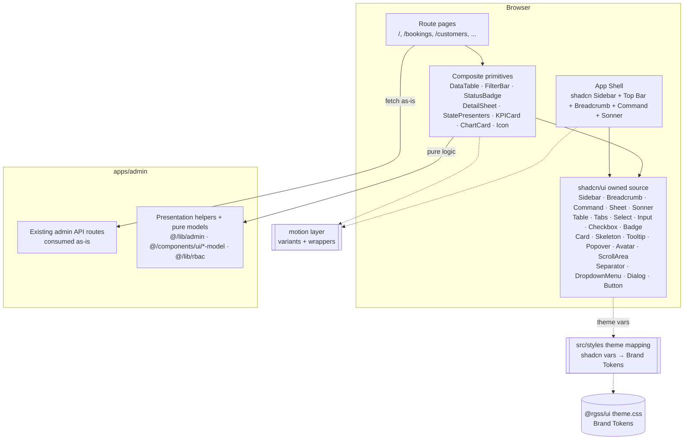
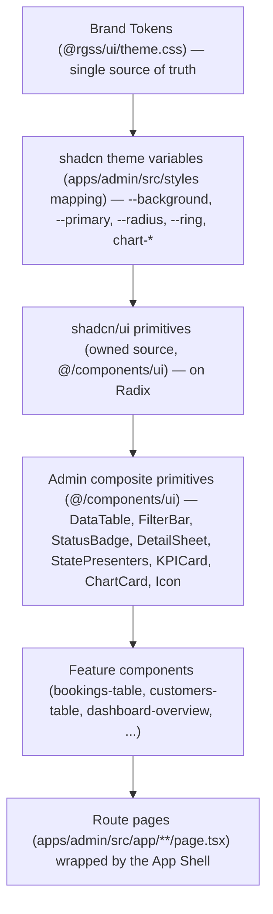
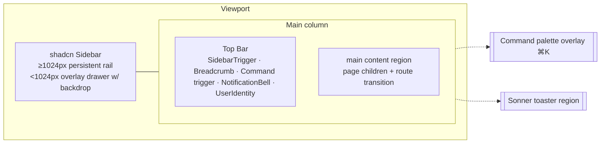
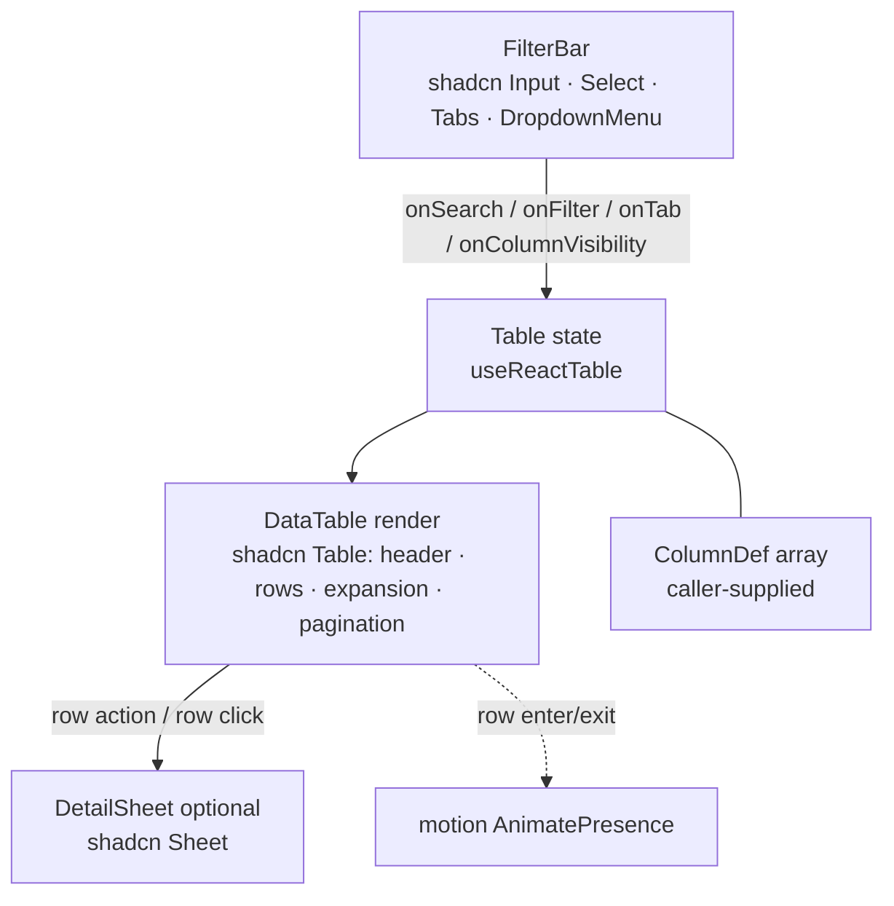
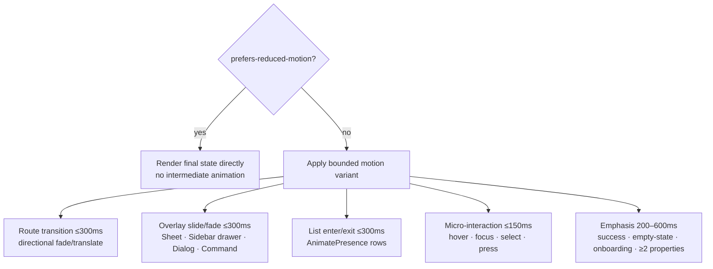

# Design Document — Admin Portal Redesign

## Overview

This design specifies a **presentation-layer** redesign of the Royal Glow admin
portal (`apps/admin`, served at `admin.theroyalglow.in`). It rebuilds the
portal's UI on the **canonical shadcn/ui component set** — owned source copied
into `apps/admin/src/components/ui/` via the shadcn CLI, built on **Radix UI**
primitives — with the **`motion`** package (motion.dev) driving route, overlay,
and list transitions plus control micro-interactions.

The previously hand-rolled admin primitives (Data Table, Filter Bar, Status
Badge, Detail Sheet, State Presenters, KPI Card, Chart Card, Icon System) are
**refactored to compose shadcn/ui and Radix components** rather than bespoke
markup. Their **pure helper logic and property-tested behaviour are preserved
unchanged** — the refactor swaps the rendering substrate, not the logic.

Because `apps/admin/components.json` is configured with `baseColor: neutral`,
the design **remaps the shadcn theme CSS variables onto the existing Royal Glow
Brand Tokens** (`@rgss/ui`) so every shadcn component renders in the warm
cocoa/gold brand identity instead of the default neutral palette. Brand Tokens
in `@rgss/ui` remain the **single source of truth**; the admin app maps onto
them and defines no brand literals of its own.

The user experience follows Benji Taylor's **Family Values** principles —
Simplicity (gradual revelation), Fluidity (seamless, context-preserving
transitions), and Delight (selective emphasis) — alongside standard
shadcn/Radix admin best practices: a responsive Sidebar block, a Breadcrumb
trail, a Command palette for power actions, Sonner toasts, Sheets for detail
panels, and TanStack-backed data tables. The redesign meets WCAG 2.1 AA,
targets a Lighthouse accessibility score of 100, uses India-first formatting,
and remains responsive from 375px to 1920px.

### Scope and Boundaries

This is a **re-skin and restructure only** (Req 21). The design honours these
hard constraints:

- **No data-layer changes.** No edits to `packages/db/schema/`,
  `packages/db/migrations/`, API request/response contract fields, or RBAC logic
  in `@/lib/rbac`. Existing admin API endpoints are consumed **as-is** (Req
  21.2, 21.3, 21.4).
- **No business logic in components** (Req 21.5). Domain calculations,
  validation, and state-transition rules stay in `packages/business`. Formatting
  reuses / extends presentation helpers in `@/lib/admin`.
- **Brand Tokens are the single source of truth.** All colour, font, radius, and
  shadow values resolve from `@rgss/ui` Brand Tokens, either directly via
  Tailwind v4 utilities or via the mapped shadcn theme variables. Zero such
  literals are defined in `apps/admin` (Req 1.1, 1.2, 1.3, 1.6).
- **The CI Drift_Gate and committed schema fingerprint reference are untouched**
  (Req 21.8).
- **Root-Path Convention preserved** — no `/admin` prefix is introduced (Req
  7.9).

#### Permitted change paths (Req 21.1)

The redesign confines every changed file to:

- `apps/admin/app/` and `apps/admin/src/app/` — route pages
- `apps/admin/src/components/` — primitives, layout, feature components
- `apps/admin/src/lib/` — **presentation helpers only**
- `apps/admin/src/styles/` — the **shadcn theme-variable mapping** (new)
- `apps/admin/components.json` — shadcn CLI config
- `apps/admin/package.json` — **dependency list only** (`motion` + Radix packages)
- shared UI primitives in `@rgss/ui` (Brand Tokens remain authoritative)

A change that would touch any path outside this allowlist is rejected and the
file preserved unchanged (Req 21.6, 21.7); a CI path-allowlist gate enforces
this (see Testing Strategy).

### Design Goals → Requirements

| Goal | Requirement(s) |
|------|----------------|
| On-brand premium aesthetic via Brand Tokens + mapped shadcn vars | 1.1–1.7 |
| Canonical shadcn/Radix foundation (owned source, no bespoke controls) | 2.1–2.7 |
| Motion-driven, bounded, reduced-motion-safe transitions | 3.1–3.7 |
| Family Values interaction principles | 4.1–4.6 |
| Professional iconography (lucide-react) | 5.1–5.6 |
| Consistent, accessible App Shell (shadcn Sidebar) on every route | 6.1–6.9 |
| Role-filtered, sectioned sidebar navigation preserved | 7.1–7.9 |
| Orienting breadcrumb trail (shadcn Breadcrumb) | 8.1–8.7 |
| Keyboard-driven command palette (shadcn Command) | 9.1–9.9 |
| Dense, capable, accessible data tables (shadcn Table + TanStack) | 10.1–10.13 |
| Column-visibility toggle | 11.1–11.6 |
| Uniform filter controls (shadcn Input/Select/Tabs/DropdownMenu) | 12.1–12.7 |
| Semantic, contrast-safe status pills (shadcn Badge) | 13.1–13.6 |
| At-a-glance dashboard (shadcn Card + recharts) | 14.1–14.8 |
| Right-side detail sheets (shadcn Sheet) | 15.1–15.8 |
| Consistent toast feedback (shadcn Sonner) | 16.1–16.9 |
| Consistent loading / empty / error presenters (shadcn Skeleton) | 17.1–17.8 |
| WCAG 2.1 AA, Lighthouse a11y = 100 | 18.1–18.8 |
| Responsive 375px–1920px | 19.1–19.5 |
| India-first formatting | 20.1–20.5 |
| Presentation-layer boundary enforced | 21.1–21.8 |
| Cohesive application across all routes | 22.1–22.7 |

### Key Design Decisions

1. **shadcn/ui as owned source under `@/components/ui`.** Components are added
   via the shadcn CLI (`style: new-york`, `rsc: true`, `tsx`, `iconLibrary:
   lucide`, alias `@/components/ui`) and committed as editable source. The
   `apps/admin` package manifest therefore declares **zero runtime shadcn
   dependency** (Req 2.3); only the underlying Radix packages and `motion` are
   added as pinned dependencies (Req 2.5).

2. **Composite primitives compose shadcn, preserving pure logic.** Each existing
   admin primitive is refactored so its *markup* is shadcn/Radix while its *pure
   logic* (extracted into `@/lib/admin/*` and `@/components/ui/*-model.ts`) is
   untouched. The existing tests
   (`data-table-model.test.ts`, `filter-bar-render.property.test.ts`,
   `filter-bar-search.property.test.ts`, `status-badge-contrast.property.test.ts`,
   `use-async-data.property.test.ts`, and the `@/lib/admin` property tests) must
   pass **unchanged** (Req 2.4). This is the central constraint of the pivot.

3. **Detail Sheet replaces the hand-rolled SlideOverPanel.** The current
   `slide-over-panel.tsx` is a styled Radix Dialog. It is superseded by the
   shadcn **Sheet** component (also Radix-Dialog-based, `side="right"`), which
   provides the same focus trap / focus return / Esc-and-backdrop close / scroll
   lock / `role="dialog"` + `aria-modal` semantics with canonical styling (Req
   15). A thin re-export keeps existing import sites working during migration.

4. **shadcn theme variables mapped to Brand Tokens in `src/styles/`.** A new
   mapping stylesheet redefines the shadcn HSL custom properties
   (`--background`, `--foreground`, `--primary`, …) to resolve to named Brand
   Token values, so shadcn components inherit cocoa/gold rather than neutral
   (Req 1.2). The mapping lives in `apps/admin/src/styles/` and is imported by
   `globals.css` after `@rgss/ui/theme.css`.

5. **Motion layer via the `motion` package.** A small set of shared variants and
   wrappers (route transition, list enter/exit, overlay slide/fade, control
   micro-interactions) centralises all animation, all reduced-motion-gated and
   duration-bounded (Req 3, 4). `motion` is not yet installed and is added as a
   pinned dependency (Req 2.5).

6. **Server Components by default; `'use client'` only for interactivity.** Page
   shells, static card chrome, breadcrumb derivation, and server-resolved props
   render on the server. Interactive primitives (DataTable, FilterBar, Detail
   Sheet, Command palette, Sidebar drawer state, ChartCard, Sonner host) are
   client components, per coding-standards (Next.js 16 App Router).

7. **Brand Tokens consumed through Tailwind v4 utilities.** The shared theme
   defines `@theme` tokens (`--color-cocoa-dark`, `--radius-cards`, …) exposed by
   Tailwind v4 as utilities (`bg-cocoa-dark`, `rounded-cards`). Composite-level
   styling references these named utilities; shadcn base components reference the
   mapped theme variables. Neither references raw hex/px literals (Req 1.3).

### Research Notes

Research informing this design (external content rephrased for licensing
compliance):

- **shadcn/ui — owned source on Radix.** shadcn/ui is distributed as copy-in
  source components rather than a runtime package: the CLI writes the component
  files into the repo so they are fully editable, and each builds on a Radix UI
  primitive for accessibility. This matches Req 2.3 (no runtime shadcn
  dependency) and Req 2.1/2.6 (Radix under every interactive control). Source:
  [ui.shadcn.com](https://ui.shadcn.com).
- **shadcn admin dashboard best practices.** The shadcn ecosystem's reference
  admin/dashboard patterns favour a collapsible **Sidebar** block for the app
  frame, a **Breadcrumb** in the header, a **Command** palette (⌘K) for fast
  navigation and power actions, **Sonner** for toasts, **Sheet** for detail
  overlays, and **Table** wired to TanStack Table state. The redesign adopts each
  of these. Sources: [shadcn Sidebar](https://ui.shadcn.com/docs/components/sidebar),
  [shadcn Command](https://ui.shadcn.com/docs/components/command),
  [shadcn Sonner](https://ui.shadcn.com/docs/components/sonner),
  [shadcn Sheet](https://ui.shadcn.com/docs/components/sheet),
  [shadcn Data Table](https://ui.shadcn.com/docs/components/data-table).
  *Content rephrased for compliance.*
- **`motion` package (motion.dev).** `motion` (the successor to Framer Motion's
  open-source core) provides a declarative animation API: `motion.*` elements for
  property animation, `AnimatePresence` for enter/exit of removed elements
  (suited to list-row insertion/removal, Req 3.3), and gesture/transition
  controls for micro-interactions. It respects `prefers-reduced-motion` when
  motion is gated on the media query. Source:
  [motion.dev](https://motion.dev). *Content rephrased for compliance.*
- **Benji Taylor — "Family Values".** Three principles guide the interaction
  design: **Simplicity** (reveal complexity gradually — keep default views
  uncluttered and surface secondary/power actions through progressive disclosure,
  the Detail Sheet, or the Command palette), **Fluidity** (transitions should
  preserve context and move directionally — "fly, don't teleport" — overlaying
  detail rather than navigating away), and **Delight** (the "Delight-Impact
  Curve" — richer, multi-property emphasis motion on rare/important moments,
  restrained motion on frequent ones). Source:
  [benji.org/family-values](https://benji.org/family-values). *Content rephrased
  for compliance.*
- **`@tanstack/react-table` v8.21** (installed) is headless: it owns table
  *state* (sorting, pagination, column visibility, row selection, expansion) and
  leaves *markup* to the shadcn Table, which suits a token-driven design. The
  redesign uses `getCoreRowModel`, `getSortedRowModel`, `getPaginationRowModel`,
  `getFilteredRowModel`, and `getExpandedRowModel`. Source:
  [TanStack Table v8](https://tanstack.com/table/v8). *Content rephrased.*
- **`recharts` v3.9** (installed) renders responsive SVG charts; its
  `ResponsiveContainer` handles fluid widths (Req 19.3). Chart colours are fed
  from Brand Token values resolved from CSS custom properties, so charts stay
  on-brand.
- **`lucide-react`** (installed, shadcn's configured `iconLibrary`) supplies the
  professional icon set replacing emoji (Req 5); each icon is a tree-shakeable
  React component accepting `size`, `aria-hidden`, and `className`.
- **India formatting helpers** already exist under `@/lib/admin` (`format.ts`
  plus `bookings.ts` money formatters). Req 20 mandates **reuse/extension**, not
  duplication; the IST date-time and 24-hour helpers were added as siblings so
  the existing 12-hour helper's contract is preserved.

## Architecture

### System Context



The redesign sits entirely in the **presentation** column. Pages fetch from the
**unchanged** API routes and render data through composite primitives, which
compose shadcn owned-source components. shadcn components draw styling from the
mapped theme variables, which resolve to Brand Tokens. Motion is a cross-cutting
layer consumed by the shell and primitives.

### Layered Component Architecture



The flow is strictly one-directional: Brand Tokens feed the shadcn theme
variable mapping, which themes the shadcn primitives, which are composed by the
admin composite primitives, which feature components assemble, which route pages
render inside the App Shell. Composite primitives may also reference Brand Token
Tailwind utilities directly for layout-level styling.

### App Shell Layout (shadcn Sidebar block)



- `≥1024px`: the shadcn Sidebar is persistent beside the content (Req 6.4);
  UserIdentity shows avatar **and** name + role (Req 19.4).
- `<1024px`: the Sidebar is hidden; the `SidebarTrigger` opens an overlay drawer
  with a dimming backdrop, moves focus into the drawer, traps focus, and is
  closed by the trigger / backdrop / `Esc` / a nav-item activation, returning
  focus to the trigger on close (Req 6.5–6.9). UserIdentity hides the name text;
  the avatar stays a ≥44×44px control (Req 19.2, 19.5).
- The Command palette and Sonner toaster are app-shell-level overlays mounted
  once, available on every route.

### Data Table Architecture (shadcn Table + TanStack)



The FilterBar is a **controlled sibling** of the DataTable. State lives in the
page (or a small `useAdminTable` hook) and both components read/write it, so the
FilterBar "emits to the DataTable" (Req 12) via shared state rather than DOM
coupling. Column-visibility, sorting, pagination, selection, and expansion are
owned by the TanStack `table` instance; row enter/exit animation is handled by
`motion`'s `AnimatePresence` (Req 10.x, 3.3).

### Motion Layer



A single motion module exposes named, duration-bounded variants. Every variant
is gated on `prefers-reduced-motion`: when reduced motion is requested the
wrapper renders the final visual state directly (Req 3.4, 4.6, 18.6). Durations
are bounded by category — overlays and routes ≤300ms (Req 3.2, 3.7, 4.3),
micro-interactions ≤150ms (Req 3.6, 4.5), emphasis 200–600ms animating ≥2
properties (Req 4.4).

## Components and Interfaces

All composite primitives live in `apps/admin/src/components/ui/`; shadcn
owned-source components live alongside them (also `@/components/ui`, per the
`components.json` alias). All accept a `className` merged via `cn` from
`@rgss/ui/lib/utils`. None contain business logic; they receive pre-shaped data
and callbacks. The pure logic each primitive reuses is called out explicitly.

### shadcn Component Install List (Req 2.2, 2.3)

Added as owned source via the shadcn CLI (`bunx shadcn@latest add …`), each
pulling its Radix dependency (Req 2.5):

| shadcn component | Radix primitive package | Used by |
|------------------|-------------------------|---------|
| `button` | `@radix-ui/react-slot` | everywhere (actions, pagination, triggers) |
| `input` | — (native, styled) | FilterBar search |
| `select` | `@radix-ui/react-select` | FilterBar dropdowns, Rows-per-page |
| `checkbox` | `@radix-ui/react-checkbox` | DataTable row + select-all |
| `table` | — (native, styled) | DataTable |
| `tabs` | `@radix-ui/react-tabs` | FilterBar tabbed filters |
| `dropdown-menu` | `@radix-ui/react-dropdown-menu` *(installed)* | DataTable row actions, column-visibility |
| `dialog` | `@radix-ui/react-dialog` *(installed)* | base modal semantics |
| `sheet` | `@radix-ui/react-dialog` | DetailSheet, Sidebar mobile drawer |
| `tooltip` | `@radix-ui/react-tooltip` | icon-only control hints |
| `badge` | `@radix-ui/react-slot` | StatusBadge |
| `card` | — (native, styled) | KPICard, ChartCard |
| `skeleton` | — (native, styled) | StatePresenter loading |
| `popover` | `@radix-ui/react-popover` | filter popovers |
| `command` | `cmdk` + `@radix-ui/react-dialog` | Command palette |
| `separator` | `@radix-ui/react-separator` | shell / card dividers |
| `avatar` | `@radix-ui/react-avatar` | UserIdentity |
| `scroll-area` | `@radix-ui/react-scroll-area` | Sidebar / Sheet bodies |
| `sidebar` | `@radix-ui/react-slot` + Sheet + Tooltip | App Shell |
| `breadcrumb` | `@radix-ui/react-slot` | Breadcrumb trail |
| `sonner` | `sonner` | Toast feedback |

> `@radix-ui/react-dialog` and `@radix-ui/react-dropdown-menu` are already
> installed. The remaining Radix packages, `cmdk`, `sonner`, and `motion` are
> added as exact-version-pinned dependencies of `apps/admin` (Req 2.5).

### Theme Variable Mapping (Req 1.2, 1.3, 1.4, 1.5)

A new stylesheet `apps/admin/src/styles/shadcn-theme.css` redefines each shadcn
theme variable to resolve to a Brand Token, imported by `globals.css` after
`@rgss/ui/theme.css`. The shared theme already declares both the brand `@theme`
tokens and a base shadcn HSL block; this mapping makes the binding explicit and
admin-owned so no shadcn component renders the neutral default (Req 1.2).

| shadcn variable | Brand Token source | Tailwind utility consumers |
|-----------------|--------------------|----------------------------|
| `--background` | `--color-canvas-white` (#ffffff) | `bg-background` |
| `--foreground` | `--color-cocoa-dark` (#1a0f0a) | `text-foreground` |
| `--card` | `--color-canvas-white` | `bg-card` |
| `--card-foreground` | `--color-cocoa-dark` | `text-card-foreground` |
| `--popover` | `--color-canvas-white` | `bg-popover` |
| `--popover-foreground` | `--color-cocoa-dark` | `text-popover-foreground` |
| `--primary` | `--color-deep-gold` (#c8a961) | `bg-primary`, `text-primary` |
| `--primary-foreground` | `--color-cocoa-dark` | `text-primary-foreground` |
| `--secondary` | `--color-cloud-gray` (#f4f5f9) | `bg-secondary` |
| `--secondary-foreground` | `--color-warm-gray` (#3d2e1f) | `text-secondary-foreground` |
| `--muted` | `--color-cloud-gray` | `bg-muted` |
| `--muted-foreground` | `--color-dusty-gray` (#8c8c8c) | `text-muted-foreground` |
| `--accent` | `--color-warm-cream` (#fff8e7) | `bg-accent` |
| `--accent-foreground` | `--color-warm-gray` | `text-accent-foreground` |
| `--destructive` | `--color-error` (#b5482e) | `bg-destructive`, `text-destructive` |
| `--destructive-foreground` | `--color-canvas-white` | `text-destructive-foreground` |
| `--border` | `--color-outline-gray` (#cccccc) | `border-border` |
| `--input` | `--color-outline-gray` | `border-input` |
| `--ring` | `--color-deep-gold` | `ring-ring` (focus, Req 18.2) |
| `--radius` | `--radius-cards` (6px) base; `--radius-buttons` (8px) for button surfaces | `rounded-md` chain / `rounded-buttons` |
| `--card` radius | `--radius-cards` (6px) | `rounded-cards` |
| `--chart-1 … --chart-5` | brand sequence (`--color-deep-gold`, `--color-success`, `--color-warning`, `--color-error`, `--color-warm-stone`) | recharts series colours |

Typography mapping (Req 1.4): headings → `--font-display` (Cabinet Grotesk,
`font-display`), body → `--font-sans` (Clash Grotesk, `font-sans`), UI labels →
`--font-ui` (Plus Jakarta Sans, `font-ui`). Radius mapping (Req 1.5): card
surfaces use the 6px `--radius-cards` token, button surfaces use the 8px
`--radius-buttons` token.

> **Missing-token build failure (Req 1.7).** A build-time token-presence check
> (see Testing Strategy) asserts every Brand Token name referenced by the
> mapping resolves in the merged theme. If a referenced token is missing, the
> build fails with the missing token name and **no** hard-coded fallback is
> substituted.

### Motion Module (`@/components/ui/motion/`) (Req 3, 4)

A shared motion layer built on the `motion` package, consumed by the shell and
primitives.

```ts
// motion-variants.ts — bounded, named variants (durations in seconds)
export const DURATION = {
  micro: 0.15,      // hover/focus/select/press (Req 3.6, 4.5)
  overlay: 0.30,    // sheet/sidebar/dialog/command/route (Req 3.2, 3.7, 4.3)
  emphasisMin: 0.20, emphasisMax: 0.60, // rare/important (Req 4.4)
} as const

export const overlaySlideRight: Variants  // x: 100% → 0, opacity, ≤300ms
export const overlayFade: Variants         // opacity, ≤300ms
export const routeTransition: Variants     // directional translate + fade, ≤300ms
export const listRow: Variants             // enter/exit for AnimatePresence, ≤300ms
export const emphasisPop: Variants         // opacity + scale (≥2 properties), 200–600ms
```

```ts
// use-reduced-motion.ts — bridges prefers-reduced-motion to the variant gate
export function usePrefersReducedMotion(): boolean
```

```tsx
// motion-presence.tsx — wrappers that render final state under reduced motion
export function RouteTransition(props: { children: React.ReactNode }): JSX.Element
export function ListPresence(props: { children: React.ReactNode }): JSX.Element // AnimatePresence
```

Contract: when `usePrefersReducedMotion()` is true, every wrapper renders the
final state with no intermediate animation (Req 3.4, 4.6, 18.6); otherwise it
applies the category-bounded variant. Decorative-only content is never animated
(Req 3.5). High-frequency interactions begin processing immediately without
waiting for motion to complete (Req 4.5).

### Icon System (`@/components/ui/icon` + `@/lib/admin/nav-icons`) (Req 5)

**Preserved pure helper.** `@/lib/admin/nav-icons.ts` already exports
`NAV_ICON_MAP`, `DEFAULT_NAV_ICON`, and `navIconFor(href)` — unchanged. It maps
each Root-Path nav href to exactly one `lucide-react` icon (Req 5.1, 5.2) and
falls back to a single predefined default for unmapped hrefs (Req 5.6).

The `Icon` wrapper enforces a11y rules and is reused inside shadcn components
wherever an icon appears:

```ts
type IconProps = {
  icon: LucideIcon
  decorative?: boolean   // beside visible text → aria-hidden="true" (Req 5.4)
  label?: string         // required when icon is sole control content (Req 5.5)
  size?: number
  className?: string
}
```

Emoji icons in the App Shell, Sidebar, and Dashboard are replaced by
`navIconFor(item.href)` / lucide icons such that no emoji glyph remains rendered
as an icon in those areas (Req 5.3).

### App Shell (`@/components/layout/admin-shell.tsx`, client) (Req 6, 22.1)

Composed from the shadcn **Sidebar** block (`SidebarProvider`, `Sidebar`,
`SidebarTrigger`, `SidebarContent`, `SidebarInset`). Keeps its server-resolved
props and adds the responsive overlay behaviour the Sidebar block provides.

```ts
type AdminShellProps = {
  role: string          // server-resolved (drives nav visibility)
  userName: string
  userInitials: string  // ≤2 initials (Req 6.3)
  children: React.ReactNode
}
```

- **Composes:** shadcn `Sidebar` (rail + mobile Sheet drawer), `SidebarTrigger`,
  `SidebarInset`, `Separator`, plus the Top Bar, Command palette, and Sonner
  toaster.
- **Behaviour:** renders Sidebar + Top Bar + content region on every page (Req
  6.1, 22.1). Persistent rail ≥1024px; overlay drawer with backdrop, focus move,
  focus trap, and focus return <1024px (Req 6.4–6.9) — supplied by the Sidebar
  block's Sheet-based mobile mode (Radix Dialog focus management), so focus
  trapping is not hand-rolled.
- **Motion:** drawer open/close uses the `overlaySlideRight`/`overlayFade`
  variant ≤300ms (Req 3.2); route transitions wrap `SidebarInset` content in
  `RouteTransition` ≤300ms (Req 3.7, 4.3).
- **Reuses pure helper:** role-level resolution via `@/lib/rbac`
  (`resolveRoleLevel`).

`TopBar` (`@/components/layout/top-bar.tsx`) contains: `SidebarTrigger`,
`Breadcrumb`, the Command-palette trigger, `NotificationBell` (existing,
unchanged), and `UserIdentity`.

`UserIdentity` (`@/components/layout/user-identity.tsx`):
- **Composes:** shadcn `Avatar` (initials fallback), shadcn `DropdownMenu` for
  the user menu.
- avatar = up to first two initials of display name (Req 6.3, reuses
  `@/lib/admin/initials`); ≥1024px shows avatar + name + role label (Req 19.4);
  <1024px hides the name text, avatar stays operable ≥44×44px (Req 19.2, 19.5).

### Sidebar Navigation (`@/components/layout/admin-sidebar.tsx`, client) (Req 7)

- **Composes:** shadcn `Sidebar` sub-components — `SidebarGroup` /
  `SidebarGroupLabel` (titled sections), `SidebarMenu` / `SidebarMenuItem` /
  `SidebarMenuButton` (items), `ScrollArea` for overflow.
- **Reuses pure helpers (unchanged):** `ADMIN_NAV` + `filterNavByLevel` from
  `@/lib/rbac` (Req 7.2, 7.3); empty sections omitted by the helper (Req 7.4);
  active item via the existing `@/lib/admin/active-nav` longest-prefix resolver,
  rendered visually distinct + `aria-current="page"` (Req 7.5, 7.6); unresolved
  role → level 0 (Req 7.7).
- Royal Glow logo + "Admin" label at the top (Req 7.8); emoji replaced by
  `navIconFor(item.href)` (Req 5.3); Root-Path hrefs preserved, no `/admin`
  prefix (Req 7.9).
- **Motion:** active-item and hover transitions are ≤150ms micro-interactions
  (Req 3.6).

### Breadcrumb (`@/components/layout/breadcrumb.tsx`, server) (Req 8)

- **Composes:** shadcn `Breadcrumb` (`BreadcrumbList`, `BreadcrumbItem`,
  `BreadcrumbLink`, `BreadcrumbPage`, `BreadcrumbSeparator`), which renders the
  `<nav aria-label>` landmark (Req 8.7) and marks the current page (Req 8.4).
- **Reuses pure helper (unchanged):** `deriveBreadcrumbs(pathname, ADMIN_NAV)`
  in `@/lib/admin/breadcrumbs.ts` returns the ordered crumb list (highest
  ancestor → current); every crumb except the last is a link, the last is
  non-interactive `BreadcrumbPage` with `aria-current="page"`; a top-level route
  yields a single current crumb (Req 8.1–8.6).

```ts
type Crumb = { label: string; href: string; current: boolean }
export function deriveBreadcrumbs(pathname: string, nav: ReadonlyArray<NavSection>): Crumb[]
```

### Command Palette (`@/components/layout/command-palette.tsx`, client) (Req 9)

- **Composes:** shadcn **Command** (`CommandDialog`, `CommandInput`,
  `CommandList`, `CommandGroup`, `CommandItem`, `CommandEmpty`) — Radix
  Dialog + `cmdk`.
- **Behaviour:** a global `keydown` listener opens it on Ctrl/Cmd+K (or the Top
  Bar trigger), moving focus into the input within 200ms (Req 9.2); typing
  filters by case-insensitive label substring within 200ms (Req 9.3, via cmdk);
  no-match shows `CommandEmpty` (Req 9.6); selecting a navigation command routes
  and closes (Req 9.7); `Esc`/selection closes and returns focus to the
  previously focused element (Req 9.9); focus is confined while open (Req 9.8,
  Radix Dialog).
- **Reuses pure helper (unchanged):** the listed destinations are
  `filterNavByLevel(ADMIN_NAV, roleLevel)` for the signed-in role (Req 9.4),
  with unresolved role → level 0 (Req 9.5). A small pure selector
  `commandItemsForLevel(nav, roleLevel)` (new, in `@/lib/admin`) flattens the
  filtered nav into command items — pure and property-testable (see Property
  21).
- **Motion:** overlay open/close via `overlayFade` ≤300ms (Req 3.2).

### DataTable (`@/components/ui/data-table.tsx`, client) (Req 10, 11, 19.1)

- **Composes:** shadcn **Table** (`Table`, `TableHeader`, `TableRow`,
  `TableHead`, `TableBody`, `TableCell`) for header/rows/pagination region (Req
  10.1); shadcn `Checkbox` for row + select-all selection (Req 10.6); shadcn
  `DropdownMenu` for inline row actions (Req 10.5); shadcn `Select` for the
  Rows-per-page control (Req 10.8); shadcn `Button` for sort headers and
  pagination controls.
- **Reuses pure model (unchanged):** `@/components/ui/data-table-model.ts` —
  `getPaginationState`/`pageSlice`/`nextPage`/`prevPage` (Req 10.8–10.13),
  `toggleSort`/`sortRows`/`defaultComparator` (Req 10.3),
  `toggleColumnVisibility`/`isColumnVisible`/`visibleToggleableColumns` (Req
  11.4, 11.5). Table *state* is driven by `@tanstack/react-table` (Req 10.2);
  the model mirrors that behaviour for property testing.

```ts
import type { ColumnDef, Row } from '@tanstack/react-table'

type DataTableProps<T> = {
  columns: ColumnDef<T>[]
  data: T[]
  tableId: string                  // stable route key for column-visibility persistence (Req 11.5)
  enableSelection?: boolean        // shadcn Checkbox column + select-all (Req 10.6)
  getRowCanExpand?: (row: Row<T>) => boolean  // expandable rows (Req 10.7)
  renderSubRows?: (row: Row<T>) => React.ReactNode
  rowActions?: (row: Row<T>) => RowAction[]   // shadcn DropdownMenu (Req 10.5)
  onRowClick?: (row: T) => void               // e.g. open DetailSheet
  pageSize?: 10 | 25 | 50 | 100               // default 25 (Req 10.8)
  globalFilter?: string                       // from FilterBar (Req 12)
  columnFilters?: { id: string; value: unknown }[]
  columnVisibility?: Record<string, boolean>  // lifted for FilterBar (Req 11)
  onColumnVisibilityChange?: (v: Record<string, boolean>) => void
}

type RowAction = { label: string; icon?: LucideIcon; onSelect: () => void; destructive?: boolean }
```

- **Sorting:** header `Button` toggles asc⇄desc, single active column
  (`enableMultiSort: false`), chevron indicator on the active header (Req 10.3);
  headers are buttons inside `<th scope="col">` (Req 10.10).
- **Hover:** row hover visual state via `hover:bg-muted/40` (Req 10.4).
- **Pagination:** footer with Rows-per-page Select {10,25,50,100} default 25
  (Req 10.8, 10.9), prev/next buttons, "Page X of Y" indicator (Req 10.11); prev
  disabled on first page, next on last (Req 10.13); navigating swaps rows (Req
  10.12).
- **Column visibility** owned by the `table` instance, lifted via
  `columnVisibility`/`onColumnVisibilityChange`; persists across
  sort/filter/page changes while on the route (Req 11.5); never-empty guard in
  the model (Req 11.4). Toggling reflects within 200ms (Req 11.2, 11.3).
- **Row enter/exit motion:** `motion` `AnimatePresence` animates inserted/removed
  rows to completion ≤300ms (Req 10 list behaviour, 3.3).
- **Responsive:** table wrapped in a `ScrollArea`/`overflow-x-auto` region so
  only the table scrolls horizontally on 375–1023px, never the page; no value
  clipped (Req 19.1, 19.3).
- **a11y:** `<caption class="sr-only">`, `<th scope>` associations, fully
  keyboard-operable controls (Req 10.10, 18.3).

### FilterBar (`@/components/ui/filter-bar.tsx`, client) (Req 11.1–11.6, 12)

- **Composes:** shadcn `Input` (search, `maxLength={100}`), shadcn `Select`
  (filter dropdowns), shadcn `Tabs` (tabbed filters), shadcn `DropdownMenu`
  (column-visibility list of checkbox items) (Req 12.1, 11.1).
- **Reuses pure helpers (unchanged):** `useDebouncedCallback` (300ms, Req 12.2)
  and the trim-on-emit path covered by the existing
  `filter-bar-search.property.test.ts`; render-config selection covered by
  `filter-bar-render.property.test.ts`; the column-visibility never-empty guard
  delegates to `toggleColumnVisibility` in the data-table model (Req 11.4).

```ts
type FilterBarProps = {
  config: {
    search?: { placeholder: string; ariaLabel: string }
    dropdowns?: FilterDropdown[]
    tabs?: { ariaLabel: string; options: TabOption[] }
    columnVisibility?: boolean
  }
  search?: string
  onSearchChange?: (trimmed: string) => void   // debounced 300ms, ≤100 chars
  onFilterChange?: (id: string, value: string) => void
  onTabChange?: (value: string) => void
  columns?: ColumnToggle[]   // {id,label,visible}, excludes select/expand/actions (Req 11.1)
  onColumnToggle?: (id: string, visible: boolean) => void  // blocks last-visible-off (Req 11.4)
}
```

- Renders only configured controls (Req 12.1). Search emits the **trimmed** term
  after 300ms (Req 12.2), `maxLength={100}` (Req 12.3). Dropdowns/tabs/column
  toggles emit their value/selection (Req 12.4, 12.5, 12.6). Column-visibility
  list shows each toggleable data column by header label with on/off state,
  excluding selection/expand/action columns (Req 11.1, 11.6); hiding the last
  visible column is rejected with a hint (Req 11.4). Every control has a
  programmatically associated label (Req 11.6, 12.7, 18.x).

### StatusBadge (`@/components/ui/status-badge.tsx`) (Req 13)

- **Composes:** shadcn **Badge** (Req 13.1), variant classes mapped to semantic
  Brand Tokens.
- **Reuses pure helper (unchanged):** `@/lib/admin/status-badge.ts` —
  `variantForStatus` (semantic variant + neutral fallback, Req 13.2, 13.4) and
  `labelForStatus` (snake_case → Title Case, placeholder fallback, Req 13.3,
  13.4). Covered by `status-badge-contrast.property.test.ts`.

Variant → token classes (contrast-verified ≥4.5:1, Req 13.5):

| Variant | bg | text | dot |
|---------|----|----|-----|
| success | `bg-success/10` | `text-success-dark` | `bg-success` |
| warning | `bg-warning/15` | `text-warm-gray` | `bg-warning` |
| error | `bg-error/10` | `text-error` | `bg-error` |
| neutral | `bg-cloud-gray` | `text-warm-gray` | `bg-dusty-gray` |

> **Contrast decision (Req 13.5).** `--color-warning` (#c8a961, gold) on white
> fails 4.5:1 for small text, so the warning pill uses tinted gold over
> warm-gray text; success text uses the additive `--color-success-dark` token
> for AA contrast over the tinted background. Colour is never the sole signal —
> the Title-Case text label is always present (Req 13.6).

### DetailSheet (`@/components/ui/detail-sheet.tsx`, client) (Req 15)

Replaces the hand-rolled `slide-over-panel.tsx`.

- **Composes:** shadcn **Sheet** (`Sheet`, `SheetContent side="right"`,
  `SheetHeader`, `SheetTitle`, `SheetDescription`, `SheetClose`) — Radix Dialog
  under the hood, providing focus trap, focus return, `Esc`/backdrop close,
  scroll lock, and `role="dialog"` + `aria-modal` (Req 15.4–15.7).

```ts
type DetailSheetProps = {
  open: boolean
  onOpenChange: (open: boolean) => void
  title: string                 // accessible name via SheetTitle (Req 15.7)
  description?: string
  children: React.ReactNode
  footer?: React.ReactNode
}
```

- Slides in from the right over a dimming backdrop within a 300ms `motion`
  transition (Req 15.1, 15.2); close removes panel + backdrop within 300ms (Req
  15.3); reduced motion suppresses the slide (Req 15.8). A thin
  `slide-over-panel.tsx` re-export → `DetailSheet` keeps existing import sites
  working during migration.

### Toast / Sonner (`@/components/ui/toaster.tsx` + `@/lib/admin/toast.ts`) (Req 16)

- **Composes:** shadcn **Sonner** `Toaster` mounted once in the App Shell;
  `toast.success` / `toast.error` helpers wrap the Sonner API.
- **Behaviour:** success toast names the completed action and auto-dismisses
  after 5s with a keyboard-operable dismiss control (Req 16.2, 16.7); error
  toast names the attempted action + reason and persists until dismissed via a
  keyboard-operable control (Req 16.3, 16.8). Success announces via a polite
  live region; error via an assertive live region (Req 16.4, 16.5 — Sonner's
  `aria-live` regions). Reduced motion suppresses entrance/exit motion (Req
  16.6). When a failure blocks the current task, a persistent in-page message
  (an `ErrorState`/inline alert) also conveys it so the toast is not the sole
  channel (Req 16.9).

### State Presenters (`@/components/ui/state/`) (Req 14.4–14.8, 17)

**Preserved components + pure helpers.** Three presenters + the async-state
hook, refactored to compose shadcn `Skeleton`.

```ts
// skeleton.tsx — composes shadcn Skeleton; 1 row per record, max 10 (Req 17.1)
type SkeletonProps = { rows?: number; variant?: 'table' | 'card' | 'kpi' }
// empty-state.tsx — message describing absence (Req 17.2)
type EmptyStateProps = { title: string; message: string; icon?: LucideIcon }
// error-state.tsx — message + retry (Req 17.3)
type ErrorStateProps = { message: string; onRetry: () => void }
```

- **Reuses pure helpers (unchanged):** the skeleton row-count helper (`min(n,
  10)`, Req 17.1, covered by `skeleton.property.test.ts`) and `useAsyncData`
  (loading/success/error + timeout/retry; 30s general / 10s dashboard; Req 17.6,
  14.8), covered by `use-async-data.property.test.ts`.
- Live regions: loading wrapper `aria-live="polite"` + `aria-busy="true"` (Req
  17.7); error wrapper `role="alert"` (assertive, Req 17.8). Retry re-requests
  data and returns to loading (Req 17.4, 17.5). Empty-state and error-state
  reveals use the `emphasisPop` variant (200–600ms, Req 4.4), reduced-motion-safe.

```ts
type AdminAsyncState<T> =
  | { status: 'loading' } | { status: 'success'; data: T } | { status: 'error'; message: string }

function useAsyncData<T>(
  fetcher: () => Promise<T>,
  opts: { timeoutMs: number },   // 30_000 default; 10_000 for Dashboard
): { state: AdminAsyncState<T>; retry: () => void }
```

### Dashboard KPI & Chart Cards (Req 14)

- **Composes:** shadcn **Card** (`Card`, `CardHeader`, `CardTitle`,
  `CardContent`) for KPICard (Req 14.1) and ChartCard (Req 14.2); `recharts`
  chart inside ChartCard with brand-token series colours via the `--chart-*`
  mapping.
- **Reuses pure helpers (unchanged):** `formatINRWithPaise` for monetary KPI
  values (`₹1,00,000.00`, Req 14.6, 20.1); `useAsyncData(timeoutMs: 10_000)` for
  skeleton/error/empty/timeout states (Req 14.4, 14.5, 14.7, 14.8).

```ts
type KPICardProps = { label: string; value: string; icon?: LucideIcon; loading?: boolean }
type ChartCardProps = { title: string; children: React.ReactNode; loading?: boolean }
```

`DashboardOverview` renders ≥4 KPICards (Req 14.1), ≥1 ChartCard with a recharts
chart (Req 14.2), and a recent-activity DataTable beneath (Req 14.3), with
skeleton/empty/error/timeout states (Req 14.4–14.8).

## Data Models

This feature introduces **no persistent data models** and **no API contract
changes** (Req 21.2). It defines only **presentation-layer view types** that
mirror existing API responses and primitive prop types. The canonical data types
(`AdminBooking`, `AdminBookingServiceRow`, `StaffMember`, lead/membership types)
already exist in `@/lib/admin/*` and are consumed unchanged.

### Presentation View Types (presentation-only)

```ts
// @/components/ui/* prop types (summarised above):
//   DataTableProps<T>, RowAction, FilterBarProps, FilterDropdown, TabOption,
//   ColumnToggle, StatusBadgeProps, DetailSheetProps, KPICardProps,
//   ChartCardProps, Skeleton/Empty/ErrorState props, IconProps,
//   CommandItem, motion Variants

// @/lib/admin presentation helpers (pure):
type Crumb = { label: string; href: string; current: boolean }
type BadgeVariant = 'success' | 'warning' | 'error' | 'neutral'
type CommandNavItem = { label: string; href: string }   // command-palette item
type AdminAsyncState<T> = { status: 'loading' }
  | { status: 'success'; data: T }
  | { status: 'error'; message: string }

// @/components/ui/data-table-model.ts (pure):
type PageSize = 10 | 25 | 50 | 100
type PaginationState = { page; pageSize; totalRows; totalPages; startIndex; endIndex; visibleRows; prevDisabled; nextDisabled }
type SortState = { columnId: string; direction: 'asc' | 'desc' } | null
type ColumnVisibility = Record<string, boolean>
```

### Formatting Helpers (reused / extended — Req 20)

| Helper | Location | Req | Status |
|--------|----------|-----|--------|
| `formatINRWithPaise(paise)` → `₹1,00,000.00` | `@/lib/admin/bookings.ts` | 20.1, 14.6 | reuse |
| `formatINR(paise)` → `₹1,499` (no decimals) | `@/lib/admin/bookings.ts` | — | reuse |
| `formatDateDDMMYYYY(value)` → `DD/MM/YYYY` | `@/lib/admin/format.ts` | 20.2 | reuse |
| `formatDateTimeIST(value)` (UTC→IST, DD/MM/YYYY) | `@/lib/admin/format.ts` | 20.3 | reuse |
| `formatTime24hIST(value)` → `HH:MM` 24h IST | `@/lib/admin/format.ts` | 20.5 | reuse |
| Placeholder for null/invalid → `'—'` | `@/lib/admin/format.ts` | 20.4 | reuse |

> These are **presentation formatters**, not business logic, so they belong in
> `@/lib/admin` (Req 21.5 permits this — no domain calculation). Every formatter
> returns the fixed placeholder `'—'` for null/undefined/invalid input and never
> renders a partial or raw value (Req 20.4). The IST helpers apply a constant
> +05:30 offset with no daylight-saving adjustment (Req 20.3).

## Correctness Properties

*A property is a characteristic or behavior that should hold true across all
valid executions of a system — essentially, a formal statement about what the
system should do. Properties serve as the bridge between human-readable
specifications and machine-verifiable correctness guarantees.*

These properties target the **pure presentation logic** extracted into testable
helpers (`@/lib/admin/*`, `@/components/ui/*-model.ts`). This logic **survives
the shadcn/Radix/motion refactor unchanged** — the refactor swaps the rendering
substrate, not the logic — so the existing property tests continue to validate
the same guarantees (Req 2.4). Interactive shadcn/Radix and `motion` behaviours
(focus trap, focus return, reduced-motion suppression, route/overlay
transitions, command-palette open/close, cmdk substring filtering, drawer/sheet
semantics, debounce timing) are verified by example/integration tests in the
Testing Strategy, not by property-based tests, per the prework classification.

### Property 1: Icon resolution is total with a single fallback

*For any* string `href`, `navIconFor(href)` returns a defined `LucideIcon`; for
any `href` not present in `NAV_ICON_MAP` it returns exactly `DEFAULT_NAV_ICON`;
and every `href` in `ADMIN_NAV` resolves to a defined icon.

**Validates: Requirements 5.2, 5.6**

### Property 2: Avatar initials are at most two uppercase letters

*For any* display-name string, the derived avatar initials contain at most two
characters, are uppercase, and are taken from the first letters of the first two
whitespace-separated words (empty/whitespace-only names yield a safe placeholder
of length ≤ 2).

**Validates: Requirements 6.3**

### Property 3: Exactly one active navigation item by longest prefix

*For any* pathname, at most one navigation item is marked active, and when one is
active it is the item whose `href` is the longest path-prefix of the pathname;
that item (and only that item) is marked `aria-current="page"`.

**Validates: Requirements 7.5, 7.6**

### Property 4: Navigation filtering respects role level with no empty sections

*For any* role level, every navigation item rendered by the sidebar satisfies
`item.minLevel <= roleLevel`, no section with zero visible items is rendered, and
an unresolved/unknown/absent role is treated as level 0. (Consumes the existing
pure `filterNavByLevel`; the redesign adds no new filtering logic.)

**Validates: Requirements 7.2, 7.3, 7.4, 7.7**

### Property 5: Breadcrumb derivation is well-formed

*For any* pathname, `deriveBreadcrumbs(pathname, ADMIN_NAV)` returns a non-empty
ordered list from highest ancestor to current page in which exactly one crumb —
the last — is marked current and non-interactive, every other crumb carries a
link `href`, and a top-level route yields a single current-only crumb.

**Validates: Requirements 8.1, 8.2, 8.3, 8.4, 8.6**

### Property 6: Command-palette items respect role level

*For any* role level, every item returned by `commandItemsForLevel(ADMIN_NAV,
roleLevel)` corresponds to a navigation destination whose minimum required level
is `<= roleLevel`, and an unresolved/unknown/absent role is treated as level 0.
(Reuses the pure `filterNavByLevel`; the flattening selector adds no new
filtering rule.)

**Validates: Requirements 9.4, 9.5**

### Property 7: Column-visibility invariant — never empty, preserved across ops

*For any* initial set of toggleable data columns and *any* sequence of toggle
attempts interleaved with sorting, filtering, and pagination operations, the set
of visible toggleable data columns is never empty (an attempt to hide the last
visible data column is rejected and that column stays visible), and no
sort/filter/pagination operation changes the column-visibility selection.

**Validates: Requirements 11.4, 11.5**

### Property 8: Pagination stays in bounds with correct slice and control state

*For any* total row count, *any* page size in {10, 25, 50, 100}, and *any*
sequence of previous/next activations, the current page index stays within
`[1, totalPages]`, the displayed rows equal the contiguous slice
`[(page-1)*size, page*size)` (so visible rows = `min(size, total-offset)`), the
previous control is disabled exactly on the first page, and the next control is
disabled exactly on the last page.

**Validates: Requirements 10.8, 10.9, 10.11, 10.12, 10.13**

### Property 9: Sorting orders by the active column and toggles direction

*For any* data array and *any* sortable column, after activating that column's
header the displayed rows are ordered monotonically by that column (non-
decreasing for ascending, non-increasing for descending), a second activation
reverses the order, and at most one column has an active sort at any time.

**Validates: Requirements 10.3**

### Property 10: FilterBar renders exactly the configured controls

*For any* control configuration drawn from {search, dropdowns, tabs,
column-visibility}, the FilterBar renders exactly the configured controls and no
others.

**Validates: Requirements 12.1**

### Property 11: Search term is emitted trimmed

*For any* search input string, the value emitted to the Data_Table equals the
input with leading and trailing whitespace removed (`input.trim()`).

**Validates: Requirements 12.2**

### Property 12: Status variant mapping with neutral fallback

*For any* status string, `variantForStatus` returns the documented semantic
variant (`success` / `warning` / `error`) for recognised values and returns
`neutral` for any unrecognised, empty, null, or undefined value.

**Validates: Requirements 13.2, 13.4**

### Property 13: Status label is Title-Cased and always non-empty

*For any* status value, `labelForStatus` returns a non-empty string containing no
underscores, with the first letter of every word capitalised and the word count
preserved; for empty/null/undefined it returns the fixed placeholder label.
(The always-present non-empty label is what guarantees status is conveyed by text
and not by colour alone.)

**Validates: Requirements 13.3, 13.4, 13.6**

### Property 14: Every status-badge variant meets AA contrast

*For any* `BadgeVariant`, the computed WCAG contrast ratio between its text
colour and its background colour (resolved from Brand-Token hex values,
composited over the canvas) is at least 4.5:1.

**Validates: Requirements 13.5**

### Property 15: Skeleton row count is bounded

*For any* expected record count `n ≥ 0`, the skeleton presenter renders exactly
`min(n, 10)` placeholder rows.

**Validates: Requirements 17.1**

### Property 16: Async timeout outcome is deterministic

*For any* fetch resolve delay and *any* timeout value, the async-data state
settles to `success` if and only if the fetch resolves strictly before the
timeout deadline, and otherwise settles to `error` with a retry available.

**Validates: Requirements 17.6, 14.8**

### Property 17: INR formatting round-trips with Indian grouping

*For any* paise amount in `[0, 99_999_999_999]` (₹0.00 … ₹999,999,999.99), the
formatted string begins with `₹`, has exactly two decimal places, groups the
integer part in the Indian convention (groups of two beyond the first three),
and parsing the digits back recovers the original rupee amount.

**Validates: Requirements 20.1, 14.6**

### Property 18: Date formatting is DD/MM/YYYY and round-trips

*For any* valid date, `formatDateDDMMYYYY` returns a string matching
`DD/MM/YYYY` with each component zero-padded, and parsing the components back
yields the same day, month, and year.

**Validates: Requirements 20.2**

### Property 19: UTC→IST conversion uses a constant +05:30 offset

*For any* UTC instant, the presented date-time equals the instant shifted by
exactly +330 minutes, and the applied offset is constant across all dates of the
year (no daylight-saving adjustment).

**Validates: Requirements 20.3**

### Property 20: Time formatting is 24-hour HH:MM in IST

*For any* UTC instant, `formatTime24hIST` returns a string matching `HH:MM`
(zero-padded, 24-hour) equal to the hours and minutes of the instant shifted by
+330 minutes.

**Validates: Requirements 20.5**

### Property 21: Formatters reject invalid input with a fixed placeholder

*For any* null, undefined, NaN, or otherwise invalid input, every currency,
date, and time formatter returns the fixed placeholder `'—'` and never a partial,
raw, or unformatted value.

**Validates: Requirements 20.4**

## Error Handling

Because this is a presentation-layer redesign consuming existing APIs, error
handling is about **surfacing** failures consistently, not changing API error
contracts.

| Condition | Handling | Requirement |
|-----------|----------|-------------|
| Fetch returns non-2xx / `success:false` | `useAsyncData` → `error` state; `ErrorState` shows the API `error.message` (or generic fallback) + retry; an error Sonner toast names the action + reason | 17.3, 17.4, 16.3 |
| Network failure / thrown error | caught → `error` state with generic message | 17.3 |
| Request exceeds timeout | `useAsyncData` deadline (30s general / 10s dashboard) → `error` state + retry | 17.6, 14.8 |
| Retry activated | re-invoke fetcher; transition `error → loading` first | 17.4, 17.5 |
| Loaded with empty result | `EmptyState` describing absence of records | 17.2, 14.7 |
| Task-blocking failure | persistent in-page message (inline alert) in addition to the toast, so the toast is not the sole channel | 16.9 |
| Unknown / null status value | `StatusBadge` neutral variant + placeholder label | 13.4 |
| Null / invalid currency / date / time | formatter returns `'—'` placeholder | 20.4 |
| Missing per-route icon | `DEFAULT_NAV_ICON` fallback | 5.6 |
| Missing brand token at build | build-time token-presence check fails the build (no silent fallback) | 1.7 |
| Change touches a forbidden path | CI path-allowlist gate rejects the change | 21.6, 21.7 |

Error and loading states announce via live regions: loading is
`aria-live="polite"` + `aria-busy` (Req 17.7); error is `role="alert"`
(assertive, Req 17.8); Sonner success announces politely and error assertively
(Req 16.4, 16.5). No `dangerouslySetInnerHTML`; all rendered API strings are
treated as untrusted text.

## Testing Strategy

### Dual Approach

- **Property-based tests** (fast-check, already a dev dependency) verify the 21
  universal properties above against the **preserved** pure helpers and models.
- **Example / component tests** (Vitest + React Testing Library + jest-axe)
  verify discrete shadcn/Radix/motion component behaviour, rendering, a11y
  structure, reduced-motion, Sonner live regions, and interaction.
- **Integration / E2E tests** (Playwright + Lighthouse CI) verify responsive
  layout, no horizontal overflow, route consistency, field/action preservation,
  and the a11y = 100 gate.

### Property-Based Testing

- Library: **fast-check** (`apps/admin` devDependency).
- Each property test runs a **minimum of 100 iterations** (`{ numRuns: 100 }` or
  higher).
- Each property test is tagged with a comment referencing its design property:
  `// Feature: admin-portal-redesign, Property {n}: {property text}`.
- Each correctness property is implemented by a **single** property-based test.
- **Preservation rule (Req 2.4):** the existing property tests
  (`data-table-model.test.ts`, `filter-bar-render.property.test.ts`,
  `filter-bar-search.property.test.ts`, `status-badge-contrast.property.test.ts`,
  `use-async-data.property.test.ts`, `state/skeleton.property.test.ts`, and the
  `@/lib/admin` `nav-filter`/`nav-icons`/`active-nav`/`breadcrumbs`/`initials`/
  `format-*` tests) target the pure helpers/models and **must pass unchanged**
  after the shadcn/Radix refactor.
- Generators: arbitrary strings for hrefs/names/statuses; arbitrary `snake_case`
  strings; arbitrary arrays + page sizes for pagination; arbitrary toggle/op
  sequences for the column-visibility invariant; integer paise in
  `[0, 99_999_999_999]`; arbitrary valid `Date`s / UTC instants for formatters.
  Edge cases included explicitly: empty string, whitespace-only, single-word
  names, unicode, `0` paise, max paise, leap-year dates, midnight/near-midnight
  IST boundary instants, prototype-key statuses (`__proto__`).

Property-to-helper map:

| Property | Helper / unit under test | Test status |
|----------|--------------------------|-------------|
| 1 | `navIconFor` (`@/lib/admin/nav-icons`) | preserved |
| 2 | initials deriver (`@/lib/admin/initials`) | preserved |
| 3 | active-nav resolver (`@/lib/admin/active-nav`) | preserved |
| 4 | `filterNavByLevel` (`@/lib/rbac`) | preserved |
| 5 | `deriveBreadcrumbs` (`@/lib/admin/breadcrumbs`) | preserved |
| 6 | `commandItemsForLevel` (`@/lib/admin/command-items`) | **new** |
| 7 | column-visibility reducer (`@/components/ui/data-table-model`) | preserved |
| 8 | pagination model (`data-table-model`) | preserved |
| 9 | sort comparator/model (`data-table-model`) | preserved |
| 10 | FilterBar config→controls selector | preserved |
| 11 | search trim in FilterBar emit path | preserved |
| 12 | `variantForStatus` (`@/lib/admin/status-badge`) | preserved |
| 13 | `labelForStatus` (`@/lib/admin/status-badge`) | preserved |
| 14 | contrast computation over `BadgeVariant` token pairs | preserved |
| 15 | skeleton row-count helper (`state/skeleton`) | preserved |
| 16 | `useAsyncData` reducer (modelled, timer-driven) | preserved |
| 17 | `formatINRWithPaise` | preserved |
| 18 | `formatDateDDMMYYYY` | preserved |
| 19 | `formatDateTimeIST` | preserved |
| 20 | `formatTime24hIST` | preserved |
| 21 | all formatters (invalid-input edge) | preserved |

> Properties 7, 8, 9, and 16 are tested against **pure model functions** that
> mirror the TanStack/React behaviour (column-visibility reducer, pagination
> index/slice, sort comparator, async-state reducer). This keeps them fast and
> deterministic — no DOM, no 100×-rendered tables — per the prework guidance to
> test logic, not the third-party library. Property 6 is the only **new**
> property: it covers the pure `commandItemsForLevel` selector introduced by the
> Command palette; the cmdk substring filtering itself (Req 9.3) is an
> interactive example test, not PBT.

### Example / Component Tests (Vitest + RTL + jest-axe)

- **shadcn/Radix composition + a11y:** primitives keyboard-operable + visible
  focus + name/role/state (2.7, `primitives.a11y.test.tsx`); icon
  decorative/label a11y (5.4/5.5); Shell composition (6.1/6.2); responsive
  drawer open/close/focus-trap/return (6.6–6.9); breadcrumb landmark + link nav
  (8.5/8.7); command-palette open on ⌘K/Ctrl+K + focus + filter + no-results +
  select-navigates-closes + focus-confine + Esc-return (9.2/9.3/9.6/9.7/9.8/9.9);
  table sort indicator/hover/row-actions/selection/expansion render + header/cell
  a11y (10.4/10.5/10.6/10.7/10.10); column-visibility control contents + toggle
  add/remove + labels (11.1/11.2/11.3/11.6); dropdown/tab/column emit + maxLength
  (12.3/12.4/12.5/12.6/12.7); badge render (13.1); dashboard composition + states
  + 10s timeout (14.1–14.5/14.7/14.8); DetailSheet (Sheet) semantics / focus /
  scroll-lock / reduced-motion (15.1–15.8); Sonner success/error + live regions +
  auto-dismiss/persist + reduced-motion + in-page fallback (16.1–16.9);
  empty/error render + retry + live regions (17.2–17.5/17.7/17.8); touch targets
  (19.2/19.5).
- **motion:** overlay/route/list/micro transitions present and bounded
  (3.1/3.2/3.3/3.6/3.7); emphasis animates ≥2 properties in 200–600ms (4.4);
  high-frequency interaction dispatches without waiting for motion (4.5);
  reduced-motion renders final state with no animation (3.4/4.6/15.8/16.6/18.6).
- `jest-axe` assertion (zero violations) on every primitive and redesigned route
  (supports 2.7, 18.x).

### Integration / E2E (Playwright + Lighthouse CI)

- **Responsive:** no horizontal page overflow across 375 → 1920px (19.3);
  table-only horizontal scroll on 375–1023px (19.1); user-name hide/show by
  breakpoint (19.2/19.4); sidebar persistent/overlay by breakpoint (6.4/6.5).
- **Route consistency (extends `migrated-routes.smoke.test.tsx`):** every
  authenticated route in the Req 22.1 enumeration renders within `AdminShell`
  with no alternative frame (22.1) and uses the primitives where applicable —
  DataTable for lists (22.2), StatusBadge for statuses (22.3), StatePresenter for
  loading/empty/error (22.4), FilterBar for search/filter (22.5); pre-redesign
  fields and actions preserved (22.6/22.7).
- **Lighthouse CI** accessibility audit = 100 per redesigned route; a score < 100
  fails the gate and blocks merge, identifying the failing route (18.7, 18.8) —
  wired into the existing `.github/lighthouse` config.

### Static / CI Gates (Smoke)

- **No brand literals:** lint/grep gate asserting zero hex/rgb/px colour, font,
  radius, or shadow literals in `apps/admin` component source (1.1, 1.3, 1.6).
- **shadcn theme-mapping presence:** assert every shadcn theme variable
  (`--background`, `--foreground`, `--primary`, `--secondary`, `--muted`,
  `--accent`, `--border`, `--input`, `--ring`, `--radius`, `--card`, `--popover`,
  `--destructive`, `--chart-*`) is remapped to a Brand Token, so no component
  renders the neutral default (1.2, 1.4, 1.5).
- **Token presence:** build-time assertion that every required Brand-Token name
  referenced by the mapping resolves; a missing token fails the build with its
  name (1.7).
- **Owned-source / no-runtime-dep:** assert shadcn components exist under
  `@/components/ui` and `package.json` declares no runtime shadcn package; assert
  `motion` and required Radix packages are pinned (2.2, 2.3, 2.5).
- **No emoji icons:** grep gate over Shell/Sidebar/Dashboard source (5.3).
- **Path allowlist:** CI gate rejecting diffs that touch `packages/db/schema`,
  `packages/db/migrations`, API contracts, `@/lib/rbac`, or the drift fingerprint
  reference (21.1–21.3, 21.6–21.8).
- **Root-Path:** assert every `ADMIN_NAV` href omits the `/admin` prefix (7.9).

### Out of Scope for Automated Tests

WCAG "full conformance" (18.1) and subjective contrast/focus-obscuring judgments
(18.2) require manual assistive-technology testing and expert review beyond
automated checks; automated tests (jest-axe + Lighthouse + the contrast property)
cover the machine-verifiable subset. Decorative-vs-purposeful motion judgment
(3.5) is a design review.

## Component Inventory & File Structure

New / changed files (all within permitted directories — Req 21.1). shadcn
owned-source components are added under `@/components/ui` alongside the
refactored composite primitives; the theme mapping lives under `src/styles`; the
motion helpers under `@/components/ui/motion`.

```
apps/admin/
├── components.json                  ← shadcn CLI config (existing; style new-york)
├── package.json                     ← + motion + Radix packages (pinned), deps only — Req 2.5
└── src/
    ├── styles/
    │   ├── globals.css              ← imports shadcn-theme.css after @rgss/ui/theme.css
    │   └── shadcn-theme.css         ← NEW shadcn var → Brand Token mapping — Req 1.2/1.4/1.5
    ├── components/
    │   ├── ui/                      ← shadcn owned source + composite primitives
    │   │   ├── button.tsx           ← shadcn (owned source)
    │   │   ├── input.tsx            ← shadcn
    │   │   ├── select.tsx           ← shadcn
    │   │   ├── checkbox.tsx         ← shadcn
    │   │   ├── table.tsx            ← shadcn
    │   │   ├── tabs.tsx             ← shadcn
    │   │   ├── dropdown-menu.tsx    ← shadcn
    │   │   ├── dialog.tsx           ← shadcn
    │   │   ├── sheet.tsx            ← shadcn (DetailSheet + mobile sidebar)
    │   │   ├── tooltip.tsx          ← shadcn
    │   │   ├── badge.tsx            ← shadcn
    │   │   ├── card.tsx             ← shadcn
    │   │   ├── skeleton.tsx         ← shadcn (base) — used by state/skeleton
    │   │   ├── popover.tsx          ← shadcn
    │   │   ├── command.tsx          ← shadcn (cmdk)
    │   │   ├── separator.tsx        ← shadcn
    │   │   ├── avatar.tsx           ← shadcn
    │   │   ├── scroll-area.tsx      ← shadcn
    │   │   ├── sidebar.tsx          ← shadcn Sidebar block
    │   │   ├── breadcrumb.tsx       ← shadcn Breadcrumb
    │   │   ├── sonner.tsx           ← shadcn Sonner Toaster
    │   │   ├── icon.tsx             ← Icon wrapper (a11y) — Req 5.4/5.5 (preserved)
    │   │   ├── data-table.tsx       ← REFACTOR → composes shadcn Table + TanStack — Req 10,11,19.1
    │   │   ├── data-table-model.ts  ← PRESERVED pure model (PBT) — Req 10,11
    │   │   ├── filter-bar.tsx       ← REFACTOR → composes shadcn Input/Select/Tabs/DropdownMenu — Req 11,12
    │   │   ├── status-badge.tsx     ← REFACTOR → composes shadcn Badge — Req 13
    │   │   ├── detail-sheet.tsx     ← NEW (shadcn Sheet) replacing slide-over-panel — Req 15
    │   │   ├── slide-over-panel.tsx ← re-export shim → DetailSheet (back-compat)
    │   │   ├── kpi-card.tsx         ← REFACTOR → composes shadcn Card — Req 14.1/14.6
    │   │   ├── chart-card.tsx       ← REFACTOR → composes shadcn Card + recharts — Req 14.2
    │   │   ├── toaster.tsx          ← NEW (Sonner host) — Req 16
    │   │   ├── use-async-data.ts    ← PRESERVED (loading/error/empty/timeout/retry) — Req 17,14.8
    │   │   ├── use-debounced-callback.ts ← PRESERVED (300ms) — Req 12.2
    │   │   ├── motion/
    │   │   │   ├── motion-variants.ts    ← NEW bounded variants — Req 3,4
    │   │   │   ├── use-reduced-motion.ts ← NEW reduced-motion gate — Req 3.4/4.6
    │   │   │   └── motion-presence.tsx   ← NEW RouteTransition/ListPresence — Req 3,4
    │   │   └── state/
    │   │       ├── skeleton.tsx     ← REFACTOR → composes shadcn Skeleton — Req 17.1
    │   │       ├── empty-state.tsx  ← Req 17.2 (preserved)
    │   │       └── error-state.tsx  ← Req 17.3 (preserved)
    │   ├── layout/
    │   │   ├── admin-shell.tsx      ← REFACTOR → shadcn Sidebar block + motion route — Req 6,3.7,22.1
    │   │   ├── admin-sidebar.tsx    ← REFACTOR → shadcn Sidebar sub-components — Req 5,7
    │   │   ├── top-bar.tsx          ← REFACTOR → SidebarTrigger + Breadcrumb + Command trigger — Req 6.2
    │   │   ├── breadcrumb.tsx       ← REFACTOR → composes shadcn Breadcrumb — Req 8
    │   │   ├── user-identity.tsx    ← REFACTOR → composes shadcn Avatar + DropdownMenu — Req 6.3,19.2/19.4
    │   │   └── command-palette.tsx  ← NEW (shadcn Command) — Req 9
    │   └── admin/
    │       └── StatusBadge.tsx      ← re-export shim → ui/status-badge (back-compat)
    └── lib/admin/
        ├── nav-icons.ts             ← PRESERVED — Req 5
        ├── breadcrumbs.ts           ← PRESERVED — Req 8
        ├── active-nav.ts            ← PRESERVED — Req 7.5
        ├── initials.ts              ← PRESERVED — Req 6.3
        ├── status-badge.ts          ← PRESERVED — Req 13
        ├── command-items.ts         ← NEW commandItemsForLevel — Req 9.4/9.5
        └── format.ts                ← PRESERVED (IST/24h/INR/placeholder) — Req 20

apps/admin/src/lib/rbac.ts           ← UNCHANGED (consumed only) — Req 21.3
packages/db/**, API contracts        ← UNCHANGED — Req 21.2, 21.8
packages/ui/src/styles/theme.css     ← Brand Tokens (authoritative); only additive token aliases if needed — Req 1
```

> The existing `@/components/admin/StatusBadge` and
> `@/components/ui/slide-over-panel` import paths stay valid via thin re-export
> shims so call sites need no churn during migration.

## Migration & Rollout

Applied in dependency order; each step is independently shippable.

1. **shadcn + motion + theme mapping** — add the shadcn components as owned
   source via the CLI; add `motion` and required Radix packages as pinned deps
   (Req 2.3, 2.5); create `src/styles/shadcn-theme.css` mapping shadcn vars →
   Brand Tokens and import it from `globals.css`; create the `motion/` variants +
   reduced-motion gate (Req 1, 3, 4). Enable the no-literals, theme-mapping, and
   token-presence gates.
2. **Composite primitives onto shadcn** — refactor `status-badge`, `icon`,
   `data-table`, `filter-bar`, `kpi-card`, `chart-card`, and `state/skeleton` to
   compose shadcn components while keeping their pure logic; add `detail-sheet`
   (shadcn Sheet) + the `slide-over-panel` shim. **Re-run the preserved property
   tests — they must pass unchanged** (Req 2.4).
3. **Shell, Command, Toast** — refactor `admin-shell`/`admin-sidebar`/`top-bar`/
   `breadcrumb`/`user-identity` onto the shadcn Sidebar block + Breadcrumb;
   add `command-palette` (shadcn Command) + `commandItemsForLevel`; mount the
   Sonner `toaster`. Every route inherits the new shell immediately (Req 6, 8, 9,
   16, 22.1). Replace emoji nav/KPI icons (Req 5.3).
4. **Dashboard** — rebuild `dashboard-overview` on KPICard/ChartCard/DataTable +
   `useAsyncData` (Req 14).
5. **Route-by-route adoption** — migrate each route in the Req 22.1 enumeration
   to DataTable + FilterBar + StatePresenter + StatusBadge within the App Shell,
   preserving every field and action (Req 22.2–22.7), adopting DetailSheet on
   `[id]` detail routes where a sheet improves flow (Req 4.2):
   `/`, `/bookings`, `/bookings/[id]`, `/bookings/new`, `/waitlist`,
   `/customers`, `/customers/[id]`, `/leads`, `/leads/[id]`, `/staff`,
   `/schedule`, `/leave`, `/services`, `/offers`, `/memberships`,
   `/memberships/[id]`, `/memberships/new`, `/billing`, `/billing/[id]`,
   `/reports`, `/settings`, `/branches`, `/users`, `/integrations`, `/logs`,
   `/me/schedule`, `/me/leave`.
6. **Static + a11y gates** — enable/confirm the no-emoji, path-allowlist, and
   Root-Path gates and the Lighthouse a11y = 100 per-route gate before merge
   (Req 5, 18, 21).

### Requirement → Design Coverage Map

| Req | Covered by |
|-----|-----------|
| 1 Token consumption + shadcn mapping | Theme Variable Mapping; no-literals/mapping/token-presence gates; Property 14 |
| 2 shadcn/Radix foundation | Install list; owned-source gate; preserved property tests (2.4); `primitives.a11y.test` |
| 3 Motion transitions | Motion Layer + Motion Module; motion component tests; reduced-motion tests |
| 4 Family Values | Simplicity (disclosure/Sheet/Command), Fluidity (DetailSheet + directional motion), Delight (emphasisPop); motion tests |
| 5 Iconography | Icon System; Property 1; a11y example tests; no-emoji gate |
| 6 App Shell | AdminShell (shadcn Sidebar); Property 2; drawer/focus tests |
| 7 Sidebar/role filter | AdminSidebar; Properties 3, 4 |
| 8 Breadcrumb | Breadcrumb (shadcn); Property 5 |
| 9 Command palette | command-palette (shadcn Command); Property 6; open/filter/close tests |
| 10 Data Table | DataTable (shadcn Table + TanStack); Properties 8, 9; example tests |
| 11 Column visibility | FilterBar + DataTable; Property 7 |
| 12 Filter Bar | FilterBar (shadcn); Properties 10, 11 |
| 13 Status Badge | StatusBadge (shadcn Badge); Properties 12, 13, 14 |
| 14 Dashboard | KPICard/ChartCard/DataTable + useAsyncData; Properties 16, 17 |
| 15 Detail Sheet | DetailSheet (shadcn Sheet); interaction/reduced-motion tests |
| 16 Toasts | Sonner toaster + toast helpers; live-region/dismiss tests |
| 17 State Presenters | state/*; useAsyncData; Properties 15, 16 |
| 18 Accessibility | jest-axe + Lighthouse gates; Property 14; focus tests |
| 19 Responsive | Shell + DataTable responsive; Playwright |
| 20 India formatting | format helpers; Properties 17–21 |
| 21 Boundary | file-structure confinement; path-allowlist + drift gates |
| 22 Consistency | Migration plan; route smoke/field-action preservation tests |
