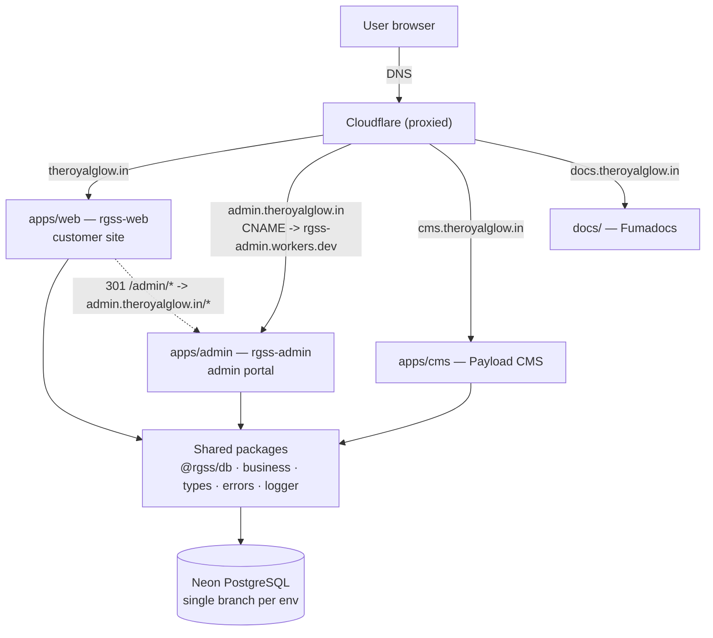
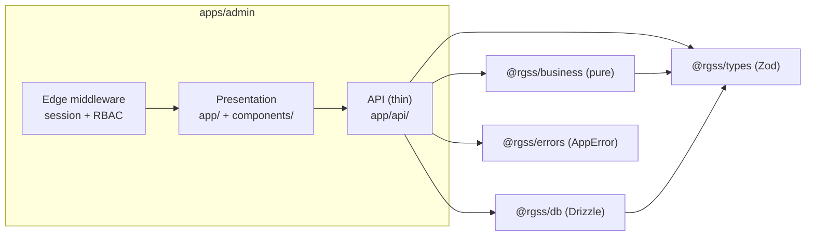
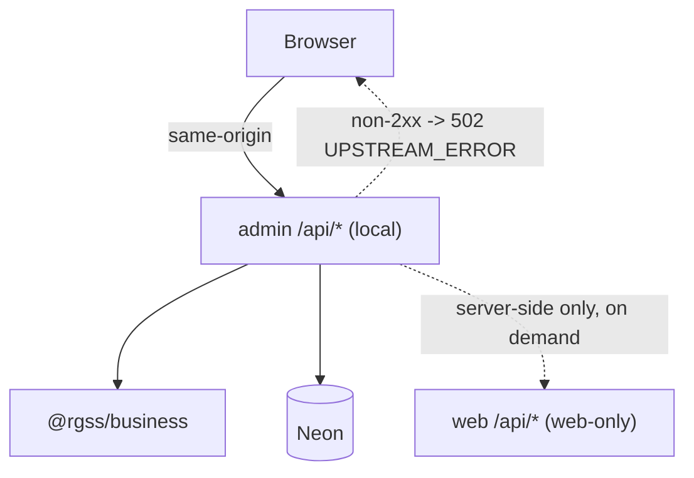
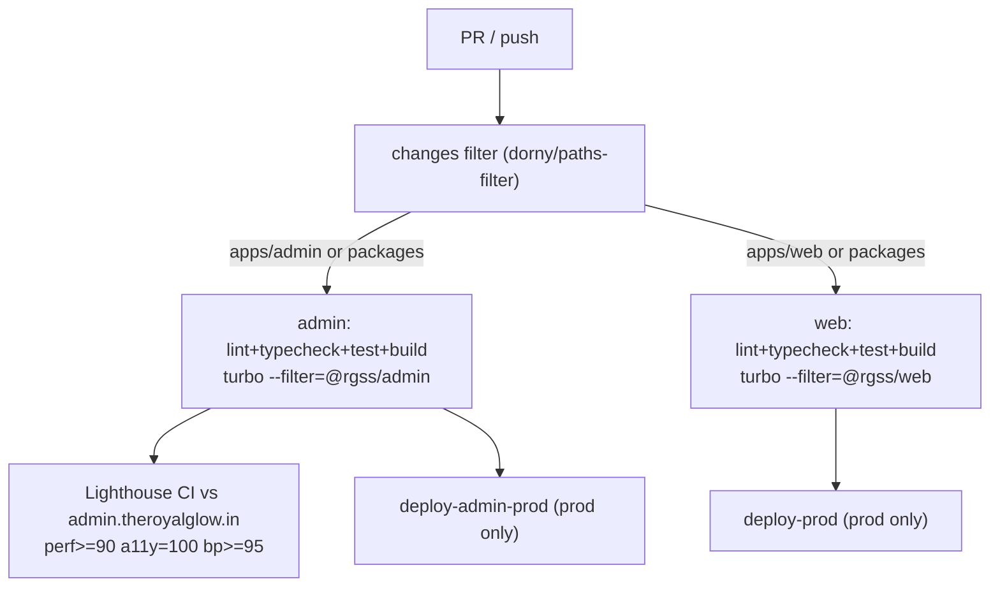

# Design Document — Admin Subdomain Migration

## Overview

This design migrates the admin portal out of `apps/web` into a dedicated Next.js
16 application, `apps/admin`, served from `admin.theroyalglow.in`. The customer
site (`apps/web` → `theroyalglow.in`) keeps customer routes only. Shared logic
stays in the existing workspace packages — `@rgss/db`, `@rgss/business`,
`@rgss/types`, `@rgss/errors`, `@rgss/logger` — consumed by both apps via the
`workspace:*` protocol. No database schema changes are introduced; both apps
read and write the same Neon tables through `@rgss/db`.

The migration is delivered in verifiable phases (scaffold → page migration → API
migration → auth/RBAC → deploy → cleanup) so the legacy `apps/web/admin` routes
keep working until the new subdomain passes health and smoke checks, after which
the customer app is cleaned up and `theroyalglow.in/admin/*` issues a 301 to the
new subdomain.

### Grounding Notes (verified against the current codebase)

These facts were confirmed by reading the repository and shape the design. Where
the requirements glossary differs from the code, the code wins and the
difference is called out so the spec stays executable.

| Topic | Requirements wording | Actual in repo | Design decision |
|-------|----------------------|----------------|-----------------|
| Workspace scope | `@repo/*`, filter `@repo/admin` | Packages are `@rgss/*`; web is `@rgss/web`, cms is `@rgss/cms` | Use `@rgss/admin`; turbo filter is `--filter=@rgss/admin` |
| Ably key | `ABLY_API_KEY` | Server reads `ABLY_PRIVATE_KEY`, client `NEXT_PUBLIC_ABLY_KEY` | Admin reuses `ABLY_PRIVATE_KEY` / `NEXT_PUBLIC_ABLY_KEY` |
| Session validation | "verify against session table via local session endpoint" | Web middleware does `fetch('/api/auth/get-session')` (Better Auth), cookie `better-auth.session_token` | Admin middleware mirrors the same `fetch` against its own local auth route |
| Rate limiting | `@upstash/ratelimit` sliding window | `lib/api/rate-limit.ts` is in-memory, marked TODO-Upstash | Admin ships the Upstash-backed limiter (Req 7.4) and the shared util can be promoted later |
| `admin.theroyalglow.in` today | New admin app | `apps/web/next.config.ts` image `remotePatterns` still references `admin.theroyalglow.in` as the CMS/Payload image origin | CMS already lives at `cms.theroyalglow.in` (Render). This migration claims `admin.theroyalglow.in` for the admin app and **corrects** the web image host reference to `cms.theroyalglow.in` (IN scope here — see Conflict C1, resolved) |

### Resolved decisions (recorded for traceability)

- **C1 — Subdomain ownership (RESOLVED).** CMS is confirmed hosted at
  `cms.theroyalglow.in` on Render (Payload CMS only); `apps/cms` stays exactly
  as-is and is not moved or restructured by this spec. Because the CMS already
  lives on its own subdomain, `admin.theroyalglow.in` is **free** and available
  for the new admin app. The admin DNS cutover (Req 6) is therefore **no longer
  blocked** by any external/CMS-move spec — it can proceed directly once the
  admin app passes health and smoke checks on `rgss-admin.workers.dev`. The one
  remaining correction owned by this spec is the web `next.config.ts` image
  `remotePatterns` host, which still points at `admin.theroyalglow.in` and must
  be changed to `cms.theroyalglow.in` so the customer site loads CMS/Payload
  images from the correct origin (now IN scope here — see §9).
- **C2 — Better Auth cookie domain.** `auth-server.ts` does not set a
  cross-subdomain cookie domain today. Sharing sessions across subdomains
  (Req 4.1, 4.8) requires enabling Better Auth `advanced.crossSubDomainCookies`
  with `domain: '.theroyalglow.in'`. This changes a production auth cookie and
  is a coordinated, reversible change (see Phased Cutover).

### Requirements coverage map

| Design section | Requirements satisfied |
|----------------|------------------------|
| Application Scaffold | 1, 12 |
| Route & Component Migration | 2, 13 |
| API Migration & Shared-vs-Local Strategy | 3, 8 (token/webhooks) |
| Authentication & Session Sharing | 4, 9 (shared routes) |
| RBAC Middleware | 4, 5 |
| Realtime & Background Jobs | 8 |
| Security Headers / CORS / Rate Limit | 7 |
| DNS & Deployment | 6 |
| Web App Cleanup & Redirects | 9, 14 |
| CI/CD Pipeline | 10 |
| Shared UI & Design Tokens | 13 |
| Phased Cutover & Rollback | 14 |
| Documentation & Steering Updates | 11 |
| Testing Strategy & Correctness Properties | 5, 9, 15 |

---

## Architecture

### Subdomain topology



The admin app is a sibling Cloudflare Workers (OpenNext) worker (`rgss-admin`). It shares the
session cookie scope `.theroyalglow.in` with the customer site so a user signed
in on `theroyalglow.in` is recognised on `admin.theroyalglow.in` without
re-authenticating. The admin app never renders its own sign-in; unauthenticated
visitors are bounced to the customer domain where Google One Tap / sign-in lives.

### Layered structure (unchanged layer rules)

`apps/admin` occupies the same layers as `apps/web`: Presentation
(`app/`, `components/`) and thin API (`app/api/`). It may import `@rgss/business`,
`@rgss/db`, `@rgss/types`, `@rgss/errors`, `@rgss/logger`. Business logic stays
pure in `packages/business`; data access stays in `packages/db`. API routes
remain thin orchestrators: parse → Zod validate → call business → return the
`{ success, data }` envelope.



### Request / auth flow (admin route access)

```mermaid
sequenceDiagram
  participant Br as Browser
  participant MW as Admin middleware (edge)
  participant Auth as /api/auth/get-session (admin-local)
  participant Pg as Page / route handler

  Br->>MW: GET admin.theroyalglow.in/bookings (Cookie: better-auth.session_token)
  alt no session cookie
    MW-->>Br: 302 -> https://theroyalglow.in
  else cookie present
    MW->>Auth: fetch get-session (forward cookie)
    alt lookup non-2xx (invalid/expired)
      MW-->>Br: clear cookie + 302 -> https://theroyalglow.in
    else lookup network/server error
      MW-->>Br: 302 -> https://theroyalglow.in
    else session valid
      Note over MW: resolve roleLevel; routeMin = lookup(path)
      alt roleLevel < routeMin
        MW-->>Br: 403 (no redirect)
      else roleLevel >= routeMin
        MW->>Pg: forward request
        Pg-->>Br: 200 (rendered page / JSON)
      end
    end
  end
```

This flow is the heart of the migration's correctness and is formalised as
property-based tests (see Correctness Properties P1–P2).

---

## Components and Interfaces

### 1. Application scaffold (`apps/admin/`)

Mirrors `apps/web` conventions. New files:

```
apps/admin/
├── package.json            # name "@rgss/admin", scripts dev/build/start/typecheck/lint
├── next.config.ts          # transpilePackages + withSentryConfig + security headers
├── tsconfig.json           # extends ../../tsconfig.json, paths @/* -> ./src/*
├── postcss.config.mjs       # @tailwindcss/postcss (same as web)
├── components.json          # shadcn/ui config
├── biome.json (or root)     # inherits root Biome config
├── instrumentation.ts       # Sentry init (separate project)
├── sentry.client.config.ts
├── sentry.server.config.ts
├── sentry.edge.config.ts
├── .env.example             # committed
├── .env.local               # gitignored
└── src/
    ├── env.ts               # @t3-oss/env-nextjs + Zod (admin-scoped vars)
    ├── middleware.ts        # session + RBAC (root-path matcher)
    ├── app/                 # migrated admin pages at root paths
    ├── components/          # migrated admin components
    ├── lib/                 # auth-server, auth-client, api helpers, realtime
    └── styles/              # imports shared tokens
```

**`package.json` (scripts mirror web):**

```jsonc
{
  "name": "@rgss/admin",
  "private": true,
  "type": "module",
  "scripts": {
    "dev": "next dev --turbopack -p 3001",
    "build": "next build",
    "start": "next start",
    "typecheck": "tsc --noEmit",
    "lint": "biome check ./src"
  }
  // dependencies: @rgss/{business,db,errors,logger,types} workspace:*,
  // better-auth, @better-auth/infra, @t3-oss/env-nextjs, @sentry/nextjs,
  // @upstash/ratelimit, @upstash/redis, next 16.2.9, react 19, tailwindcss v4,
  // shadcn deps. Dev: vitest, @playwright/test, testing-library, faker, msw.
}
```

port 3001 avoids web (3000) and cms (3002). `turbo.json` requires **no change**:
its tasks (`build`, `dev`, `lint`, `typecheck`, `test`) already glob all
workspaces, so adding `apps/admin` is picked up automatically (Req 1.5, 10.5).
`turbo run build --filter=@rgss/admin` builds it in isolation.

### 2. Route migration map (Root-Path Convention)

Every admin page drops the `/admin` prefix because the subdomain provides the
namespace. The current `apps/web/src/app/admin/` tree (verified) plus the
route→role table from features steering map as follows:

| Web (today) | Admin (new) | Min role | Source verified |
|-------------|-------------|----------|-----------------|
| `/admin` | `/` | Receptionist (2) | `admin/page.tsx` |
| `/admin/bookings`, `/[id]` | `/bookings`, `/bookings/[id]` | Receptionist (2) | exists |
| `/admin/waitlist` | `/waitlist` | Receptionist (2) | nav item (page to add) |
| `/admin/customers`, `/[id]` | `/customers`, `/customers/[id]` | Receptionist (2) | exists |
| `/admin/leads`, `/[id]` | `/leads`, `/leads/[id]` | Receptionist (2) | exists |
| `/admin/billing` | `/billing` | Receptionist (2) | nav item |
| `/admin/leave` | `/leave` | Receptionist (2) | exists |
| `/admin/memberships`, `/[id]`, `/new` | `/memberships`, … | Receptionist (2) | exists |
| `/admin/services` | `/services` | Manager (3) | nav item |
| `/admin/offers` | `/offers` | Manager (3) | exists |
| `/admin/staff` | `/staff` | Manager (3) | nav item |
| `/admin/schedule` | `/schedule` | Manager (3) | exists |
| `/admin/reports` | `/reports` | Manager (3) | nav item |
| `/admin/settings` | `/settings` | Manager (3) | nav item |
| `/admin/branches` | `/branches` | Owner (4) | nav item |
| `/admin/users` | `/users` | Owner (4) | nav item |
| `/admin/integrations` | `/integrations` | Developer (5) | nav item |
| `/admin/logs` | `/logs` | Developer (5) | nav item |

The admin shell (`admin-shell.tsx`, `AdminSidebar.tsx`) and all feature
components (`*-table.tsx`, `*-list.tsx`, dialogs, grids) move verbatim; internal
links are rewritten from `/admin/x` to `/x`. The `AdminSidebar`
`CURRENT_ROLE = 'developer'` placeholder is replaced with the real role from
session context (see RBAC, below) so nav visibility reflects the signed-in user
(Req 5.4).

### 3. API migration and shared-vs-local strategy

Admin API routes move from `apps/web/src/app/api/admin/*` to
`apps/admin/src/app/api/*` (dropping `/admin`), preserving HTTP methods and the
response envelope (Req 3.1–3.3):

| Web (today) | Admin (new) |
|-------------|-------------|
| `/api/admin/bookings` | `/api/bookings` |
| `/api/admin/customers` | `/api/customers` |
| `/api/admin/leads` | `/api/leads` |
| `/api/admin/leave` | `/api/leave` |
| `/api/admin/membership-tiers` | `/api/membership-tiers` |
| `/api/admin/memberships` | `/api/memberships` |
| `/api/admin/offers` | `/api/offers` |
| `/api/admin/schedule` | `/api/schedule` |
| `/api/admin/staff` | `/api/staff` |
| `/api/admin/tags` | `/api/tags` |

**Shared-vs-local decision (Req 3.4, 3.5):**

- **Hosted locally in admin** (browser talks same-origin): auth catch-all
  (`/api/auth/[...all]`), Ably token (`/api/ably/token`), health
  (`/api/health`), and the QStash webhook receivers it owns. Each is its own
  thin handler configured against the same backing services (same Neon DB, same
  `BETTER_AUTH_SECRET`, same Ably key). This avoids any browser cross-origin call
  between subdomains.
- **Web-only endpoint needed by admin** (rare): admin calls it **server-side**
  and maps any non-2xx to `502 UPSTREAM_ERROR` via `AppError` without leaking
  upstream detail (Req 3.5, 7.6).



### 4. Authentication & session sharing

- **Admin auth route** `apps/admin/src/app/api/auth/[...all]/route.ts` reuses the
  same pattern as web (`toNextJsHandler(auth)`), pointing
  `auth-server.ts` at the same Neon DB and the **same `BETTER_AUTH_SECRET`** so
  both apps validate the same tokens (Req 4.2).
- **Cross-subdomain cookie (C2).** Better Auth config in **both** apps adds:

  ```ts
  advanced: {
    crossSubDomainCookies: { enabled: true, domain: '.theroyalglow.in' },
    defaultCookieAttributes: { sameSite: 'lax', secure: true, httpOnly: true },
  }
  ```

  This produces `Set-Cookie: better-auth.session_token=…; Domain=.theroyalglow.in;
  SameSite=Lax; Secure; HttpOnly` (Req 4.1, 4.8). For local dev (no shared
  parent domain) the domain is omitted via env so `localhost` still works.
- **No sign-in on admin** (Req 4.7). Unauthenticated → 302 to
  `https://theroyalglow.in`.
- **`NEXT_PUBLIC_APP_URL`** for admin is `https://admin.theroyalglow.in`;
  `BETTER_AUTH_URL` for admin is the admin origin so OAuth/session URLs resolve
  to the admin host while validating the shared cookie.

### 5. RBAC middleware (`apps/admin/src/middleware.ts`)

A pure decision core wrapped by the edge handler. The pure functions live in
`apps/admin/src/lib/rbac.ts` so they are unit/property testable without the edge
runtime:

```ts
// lib/rbac.ts — pure, no I/O
export const ROLE_LEVELS = {
  customer: 0, staff: 1, receptionist: 2, manager: 3, owner: 4, developer: 5,
} as const

export function resolveRoleLevel(role: string | null | undefined): number {
  return (role && role in ROLE_LEVELS)
    ? ROLE_LEVELS[role as keyof typeof ROLE_LEVELS]
    : 0 // unknown/absent -> lowest (Req 5.7)
}

// Ordered most-specific first; first prefix match wins.
export const ROUTE_MIN_LEVEL: ReadonlyArray<[string, number]> = [
  ['/integrations', 5], ['/logs', 5],
  ['/branches', 4], ['/users', 4],
  ['/services', 3], ['/offers', 3], ['/staff', 3], ['/schedule', 3],
  ['/reports', 3], ['/settings', 3],
  ['/bookings', 2], ['/waitlist', 2], ['/customers', 2], ['/leads', 2],
  ['/billing', 2], ['/leave', 2], ['/memberships', 2],
  ['/', 2], // dashboard root, checked last
]

export function routeMinLevel(pathname: string): number { /* longest-prefix match */ }

export type AuthState =
  | { kind: 'no_cookie' }
  | { kind: 'invalid' }       // session lookup returned non-2xx
  | { kind: 'error' }         // network/server failure during lookup
  | { kind: 'valid'; roleLevel: number }

export type Decision =
  | { action: 'redirect' }                 // -> https://theroyalglow.in
  | { action: 'clear_and_redirect' }       // clear cookie, then redirect
  | { action: 'forbid' }                   // 403, no redirect
  | { action: 'allow' }

export function decide(state: AuthState, routeMin: number): Decision {
  switch (state.kind) {
    case 'no_cookie': return { action: 'redirect' }            // Req 4.4, 5.5
    case 'invalid':   return { action: 'clear_and_redirect' }  // Req 4.5
    case 'error':     return { action: 'redirect' }            // Req 4.6, 5.6
    case 'valid':
      return state.roleLevel < routeMin
        ? { action: 'forbid' }                                 // Req 4.6(role), 5.2
        : { action: 'allow' }
  }
}
```

The edge `middleware.ts` reads the cookie, calls `fetch('/api/auth/get-session')`
(forwarding the cookie, same as web), classifies the result into `AuthState`,
computes `routeMin`, calls `decide`, and renders the `NextResponse`
(redirect / cookie-clear+redirect / 403 / next). Matcher covers all admin paths:

```ts
export const config = { matcher: ['/((?!_next|favicon.ico|api/health|api/auth).*)'] }
```

Nav visibility uses the same `resolveRoleLevel` + per-item min level so the
sidebar shows only permitted items and hides empty sections (Req 5.4).

### 6. Realtime & background jobs (`apps/admin`)

- **Token route** `/api/ably/token` (local): `requireRole('receptionist')`, then
  `createAblyTokenRequest` issuing **subscribe-only** capability scoped to admin
  channels `admin:bookings:*`, `admin:schedule:*`, `admin:leave`, `booking:*`
  (Req 8.1). Reuses `ABLY_PRIVATE_KEY`; 503 when unset (graceful, same as web).
- **Subscriptions**: admin pages subscribe to
  `admin:bookings:{branchId}`, `admin:schedule:{YYYY-MM-DD}`, `admin:leave`
  using identical channel names/event schemas (Req 8.2, 8.3). A client realtime
  provider shows a "reconnecting" indicator within 2s of connection loss and
  re-subscribes on recovery (Req 8.5).
- **QStash receivers** `/api/jobs/stale-booking-alert`, `/api/jobs/noshow-check`
  move to admin, keeping the raw-body → `verifyQStashSignature` (HMAC) → process
  → heartbeat → 200 shape (Req 8.4). QStash publish targets/payloads are
  unchanged; only the receiver host moves. **Note:** QStash schedules that point
  at `theroyalglow.in/api/jobs/*` for these two jobs must be repointed to
  `admin.theroyalglow.in/api/jobs/*` during cutover.

### 7. Security: CORS, CSP, rate limit, headers

`apps/admin/next.config.ts` sets headers and the middleware injects a per-request
CSP nonce:

- **CORS** (Req 7.1, 7.2): allowed origin is exactly
  `https://admin.theroyalglow.in`. A small `lib/cors.ts` reflects the
  `Origin` header only when it equals the allowed origin; otherwise it omits
  `Access-Control-Allow-Origin` entirely.
- **CSP** (Req 7.3): `default-src 'self'; script-src 'self' 'nonce-<per-request>'`
  generated in middleware and passed to the document.
- **Rate limit** (Req 7.4, 7.5): `@upstash/ratelimit` sliding window of 20
  requests / 10s keyed by authenticated user id; on exceed return 429 with
  `Retry-After`. (Promotes the web in-memory limiter to the Upstash-backed one;
  `UPSTASH_REDIS_REST_*` already exist in env.)
- **Clickjacking** (Req 7.7): `X-Frame-Options: DENY`. Plus
  `noindex` robots on the whole app (admin is private).

### 8. DNS & deployment

- Cloudflare Workers (OpenNext) worker `rgss-admin`; proxied CNAME
  `admin.theroyalglow.in → rgss-admin.workers.dev` (Req 6.1, 6.2). The subdomain is
  free for the admin app — CMS already lives at `cms.theroyalglow.in` on Render
  (unchanged by this spec) — so the DNS cutover has **no external blocker** (C1
  resolved). The admin app is validated on its `rgss-admin.workers.dev` URL during
  phases 1–4, then cut over to `admin.theroyalglow.in` directly.
- New workflow `.github/workflows/deploy-admin-prod.yml` triggers on pushes to
  `prod` touching `apps/admin/**` or `packages/**`; builds with
  `bunx opennextjs-cloudflare build` (workingDirectory `apps/admin`), uploads source maps to a **separate
  admin Sentry project**, deploys via `cloudflare/wrangler-action` (`command: deploy`) to the `rgss-admin` worker, then runs a
  health check against `https://admin.theroyalglow.in/api/health` (200 within
  30s, up to 3 attempts, 10s apart; fail → failure notification) (Req 6.3–6.6).

### 9. Web cleanup & redirects (`apps/web`)

- Delete `src/app/admin/`, `src/app/api/admin/`, `src/lib/admin/`,
  `src/components/admin/` (Req 9.1).
- Remove the `/admin/:path*` matcher entry and admin role logic from web
  `middleware.ts`; keep customer-protected matchers (Req 9.2).
- Add a 301 redirect (web `next.config.ts` `redirects()` or middleware) mapping
  `/admin/:path*` → `https://admin.theroyalglow.in/:path*`, dropping the `/admin`
  prefix and preserving the remainder (Req 9.4). Bare `/admin` → subdomain root.
- Keep shared customer routes `/api/auth`, `/api/bookings`, `/api/services`,
  `/api/availability`, `/api/ably/token` (Req 9.3).
- Update the web `next.config.ts` image `remotePatterns` CMS host from
  `admin.theroyalglow.in` to `cms.theroyalglow.in` so the customer site loads
  CMS/Payload images from the correct origin. This is **in scope** for this spec
  (C1 resolved: CMS is confirmed at `cms.theroyalglow.in` on Render, and
  `admin.theroyalglow.in` now belongs to the admin app).

### 10. CI/CD pipeline

`ci.yml` gains path-filtered, parallel per-app jobs (Req 10.1–10.4, 10.7):



Each app job runs independently and reports its own status; total workflow
timeout 15 min. A failed app build blocks only that app's deploy (Req 10.7).
Lighthouse CI runs against the admin URL with the stated thresholds (Req 10.6).

### 11. Shared UI & design tokens

Two viable approaches; this design selects **Option B** (shared package) as the
target, with **Option A** acceptable as an interim:

- **Option A (interim):** copy `components/ui` and import Tailwind v4 tokens from
  a shared CSS file referenced by both apps' `styles/`. Fast, but risks drift.
- **Option B (target, Req 13.2/13.3):** introduce `packages/ui` (`@rgss/ui`)
  holding shadcn/ui primitives and the Tailwind v4 token theme. Both apps consume
  `@rgss/ui` via `workspace:*` and add it to `transpilePackages`. Single source
  of truth, zero duplicate-component type conflicts. Tokens (colours like
  `cocoa-dark`, `cloud-gray`, spacing, radii) live once in `@rgss/ui` and are
  imported by each app's global stylesheet.

Admin meets the same a11y bar: WCAG 2.1 AA, Lighthouse a11y = 100, focus rings,
keyboard nav, `prefers-reduced-motion` (Req 13.4).

### 12. Documentation & steering updates (Req 11)

- `project-overview.md`: add `apps/admin/` to the structure tree (Next.js App
  Router, `admin.theroyalglow.in`); document the full subdomain map; add
  `apps/admin/` to the Layer Rules table with the same permissions as `apps/web`.
- `coding-standards.md`: document the Root-Path Convention under Route Groups.
- `implementation-tasks.md`: repoint Phase 3 paths from `apps/web/app/admin/` to
  `apps/admin/app/` and retitle Phase 3.
- `features.md`: note admin is served at `admin.theroyalglow.in` root paths.
- `deployment.md`: add an Admin_App section (project name `rgss-admin`, workflow
  `deploy-admin-prod.yml`, build command, output dir `apps/admin/.next`, health
  path `/api/health`).

---

## Data Models

This migration introduces **no database schema changes** (Req 14.5). The data
models below are the in-memory configuration and contract types that the
migration adds; all persistent data continues through `@rgss/db`.

### Role and route access model

```ts
type Role = 'customer' | 'staff' | 'receptionist' | 'manager' | 'owner' | 'developer'
const ROLE_LEVELS: Record<Role, number> // 0..5

type RouteRule = { prefix: string; minLevel: number } // e.g. { '/users', 4 }
type NavItem = { label: string; href: string; minLevel: number }
type NavSection = { title: string; items: NavItem[] }
```

### Middleware decision model

```ts
type AuthState =
  | { kind: 'no_cookie' }
  | { kind: 'invalid' }
  | { kind: 'error' }
  | { kind: 'valid'; roleLevel: number }

type Decision =
  | { action: 'redirect' }
  | { action: 'clear_and_redirect' }
  | { action: 'forbid' }
  | { action: 'allow' }
```

### Redirect mapping model (web → admin)

```ts
// /admin/{rest} -> https://admin.theroyalglow.in/{rest} (301); /admin -> origin root
type RedirectMapping = { from: string; to: string; status: 301 }
```

### Session contract (read-only, unchanged shape)

The admin app reads the existing Better Auth session shape; it adds a `role`
field already present on `user` (used by web's `requireRole`). No new columns.

```ts
type SessionUser = { id: string; role?: Role /* + existing Better Auth fields */ }
```

### API response envelope (unchanged, reused from web)

```ts
type ApiSuccess<T> = { success: true; data: T; meta?: { page?: number; totalPages?: number; totalCount?: number } }
type ApiError = { success: false; error: { code: string; message: string; statusCode: number; requestId: string; retryable?: boolean; details?: unknown } }
```

### Environment model (`apps/admin/src/env.ts`)

Admin-scoped variables (Req 12). Includes shared DB/auth/realtime; **excludes**
customer-only tracking vars (Meta Pixel, PostHog, Clarity, VAPID public).

| Scope | Variable | Zod | Notes |
|-------|----------|-----|-------|
| server | `DATABASE_URL` | `string().url()` | same Neon branch as web (Req 12.2) |
| server | `DATABASE_URL_UNPOOLED` | `string().url()` | migrations/direct (Req 12.2) |
| server | `BETTER_AUTH_SECRET` | `string().min(32)` | **same value as web** (Req 4.2) |
| server | `BETTER_AUTH_URL` | `string().url()` | admin origin |
| server | `GOOGLE_OAUTH_CLIENT_ID` / `_SECRET` | `string().min(1)` | shared OAuth app |
| server | `ABLY_PRIVATE_KEY` | `string().min(1)` | shared realtime key |
| server | `UPSTASH_REDIS_REST_URL` / `_TOKEN` | url / min(1) | rate limit |
| server | `QSTASH_CURRENT_SIGNING_KEY` / `_NEXT_SIGNING_KEY` | min(1) | webhook HMAC |
| client | `NEXT_PUBLIC_APP_URL` | `string().url()` | `https://admin.theroyalglow.in` in prod (Req 12.3) |
| client | `NEXT_PUBLIC_SENTRY_DSN` | `string().url()` | separate admin project (Req 6.6, 12.3) |
| client | `NEXT_PUBLIC_GOOGLE_CLIENT_ID` | `string().min(1)` | One Tap (if used) |
| client | `NEXT_PUBLIC_ABLY_KEY` | `string().min(1)` | client realtime |

`skipValidation: !!process.env.SKIP_ENV_VALIDATION` for CI/Docker (Req 12.6).
`.env.example` is committed; `.env.local` is gitignored (Req 12.4).

---

## Correctness Properties

*A property is a characteristic or behavior that should hold true across all
valid executions of a system — essentially, a formal statement about what the
system should do. Properties serve as the bridge between human-readable
specifications and machine-verifiable correctness guarantees.*

Most of this migration is infrastructure, configuration, routing, and UI parity
— verified by smoke, snapshot, integration, and deploy checks (see Testing
Strategy). The genuinely input-varying logic is the pure RBAC / middleware /
redirect / CORS / realtime-gating core, which is extracted into pure functions
(`apps/admin/src/lib/rbac.ts`, `lib/cors.ts`, realtime + jobs helpers) and is
property-tested below. Each property is universally quantified and traces to the
acceptance criteria it validates.

### Property 1: RBAC access decision is correct and monotonic in role level

*For any* role string (including unrecognized or absent values, which resolve to
level 0) and *for any* admin route path, access is granted **iff** the resolved
role level is greater than or equal to that route's minimum level; and increasing
the role level never revokes access already granted at a lower level.

**Validates: Requirements 5.1, 5.2, 5.3, 5.7, 15.1**

### Property 2: Middleware auth-state decision maps every state to the correct action

*For any* combination of authentication state — no cookie, cookie-present-but-
invalid/expired (lookup non-2xx), lookup network/server error, or valid session
with a resolved role level — and *for any* route minimum level, the decision is
exactly: no cookie → redirect to `https://theroyalglow.in`; invalid/expired →
clear cookie then redirect; lookup error → redirect (never grant); valid with
level below the route minimum → 403 without redirect; valid with sufficient
level → allow.

**Validates: Requirements 4.3, 4.4, 4.5, 4.6, 5.5, 5.6**

### Property 3: Sidebar navigation visibility matches role level

*For any* role, the set of rendered navigation items equals exactly the items
whose minimum level is less than or equal to the resolved role level, and no
navigation section with zero visible items is rendered.

**Validates: Requirements 5.4**

### Property 4: Web→admin 301 redirect preserves the sub-path

*For any* sub-path `p`, requesting `/admin/{p}` on `theroyalglow.in` yields an
HTTP 301 to `https://admin.theroyalglow.in/{p}` (the `/admin` prefix dropped and
the remainder, including query string, preserved); requesting bare `/admin`
yields a 301 to the admin origin root.

**Validates: Requirements 9.4, 15.5**

### Property 5: CORS reflects the allowed origin only

*For any* request `Origin` value, the admin API response includes
`Access-Control-Allow-Origin: https://admin.theroyalglow.in` **iff** the request
origin equals `https://admin.theroyalglow.in`, and omits the
`Access-Control-Allow-Origin` header for every other origin.

**Validates: Requirements 7.1, 7.2**

### Property 6: Ably token capability is subscribe-only and scoped to admin channels

*For any* requesting user holding a role of Receptionist or higher, the issued
Ably token capability grants only the `subscribe` operation and only on channels
within the admin set (`admin:bookings:*`, `admin:schedule:*`, `admin:leave`,
`booking:*`); *for any* user below Receptionist, no admin token is issued (request
is forbidden).

**Validates: Requirements 8.1**

### Property 7: QStash webhook receivers reject unverified requests before side effects

*For any* request body whose QStash HMAC signature is missing or invalid, the
receiver responds 401 and performs no database writes or notification dispatch;
only requests with a valid signature are processed.

**Validates: Requirements 8.4**

---

## Error Handling

The admin app reuses the customer app's error model (`@rgss/errors` `AppError` +
`withErrorHandler`), keeping the standard error envelope `{ success: false,
error: { code, message, statusCode, requestId, retryable?, details? } }`.

| Scenario | Handling | Status |
|----------|----------|--------|
| Unauthenticated admin route access | Middleware 302 → `https://theroyalglow.in` | 302 |
| Invalid/expired session | Middleware clears `better-auth.session_token`, then 302 | 302 |
| Session lookup network/server error | Middleware 302 (fail closed — never grant) | 302 |
| Authenticated but role too low (route) | Middleware 403, no redirect | 403 |
| API role guard failure | `requireRole` throws `AppError(FORBIDDEN)` | 403 |
| Unauthenticated API call | `requireSession` throws `AppError(UNAUTHENTICATED)` | 401 |
| Validation failure | Zod `safeParse` → `AppError(VALIDATION_ERROR)` with field details | 400 |
| Web-only upstream non-2xx (server-side) | Map to `AppError(UPSTREAM_ERROR)`, no upstream detail leaked | 502 |
| Rate limit exceeded | `AppError(RATE_LIMITED)` + `Retry-After` | 429 |
| Realtime not configured (`ABLY_PRIVATE_KEY` absent) | Token route returns `SERVICE_UNAVAILABLE` (client falls back to polling) | 503 |
| QStash signature invalid/missing | Reject before processing | 401 |
| Unexpected error | `withErrorHandler` logs + Sentry (admin project), generic `INTERNAL_ERROR` | 500 |
| Health: DB down | `/api/health` → `unhealthy` | 503 |
| Env validation failure at build | Build aborts naming the failing variable(s) | build fail |

Fail-closed is the rule for the middleware: any uncertainty (missing cookie,
lookup error) results in redirect rather than access. Cross-subdomain calls
never expose upstream internals to the browser.

---

## Testing Strategy

A dual approach: example/integration/smoke tests for the configuration, routing,
deployment, and UI-parity surface (the bulk of this migration), plus
property-based tests for the pure decision logic.

### Property-based tests (PBT)

- **Library:** `fast-check` integrated with Vitest (TypeScript-native, matches
  the existing Vitest + faker + MSW stack).
- **Do NOT implement PBT from scratch** — use `fast-check` generators.
- **Minimum 100 iterations** per property (`fc.assert(fc.property(...), { numRuns: 100 })`).
- **Each test tagged** with a comment referencing the design property, format:
  `// Feature: admin-subdomain-migration, Property {n}: {property text}`.
- **One property-based test per correctness property (P1–P7).** Targets are the
  pure functions in `apps/admin/src/lib/rbac.ts` (`resolveRoleLevel`,
  `routeMinLevel`, `decide`, nav filter), `lib/cors.ts`, the redirect mapping
  helper (extract the mapping from web's redirect config into a pure function),
  the Ably capability builder, and the QStash verify helper (mock the signing
  keys; assert no side effects via injected fakes/spies).

| Property | Target function | Generators |
|----------|-----------------|------------|
| P1 | `resolveRoleLevel` + access decision | arbitrary role strings (incl. unknown) × route paths |
| P2 | `decide(authState, routeMin)` | tagged-union AuthState × level 0..5 |
| P3 | nav-visibility filter | role level 0..5 over fixed nav config |
| P4 | `mapAdminRedirect(path)` | arbitrary URL sub-paths + query strings |
| P5 | `corsHeader(origin)` | arbitrary origin strings incl. the allowed one |
| P6 | Ably capability builder | role strings; assert ops ⊆ {subscribe}, channels ⊆ allowed |
| P7 | QStash verify gate | arbitrary bodies + valid/invalid signatures (spy on DB/dispatch) |

### Unit & integration tests (Vitest)

- Middleware role-resolution and per-route access matrix (Req 15.1) — also the
  home of P1/P2 implementations.
- Representative admin API routes: method set + response envelope + auth guard
  (Req 3.1–3.3, 2.6) using MSW/in-memory DB.
- Cross-app session validation: a cookie issued under web's Better Auth config
  validates under admin's config against the same DB (Req 4.2).
- Set-Cookie attribute assertions: `Domain=.theroyalglow.in; SameSite=Lax;
  Secure; HttpOnly` (Req 4.1, 4.8).
- Env validation: build fails on a missing required var; passes with
  `SKIP_ENV_VALIDATION` (Req 12.1, 12.6); schema includes shared vars and
  excludes customer-only tracking vars (Req 12.2–12.5).
- Rate-limit boundary: at/over 20 req / 10s → 429 + `Retry-After` (Req 7.4, 7.5).
- Header assertions: CSP (`default-src 'self'`, `script-src 'self' 'nonce-…'`),
  `X-Frame-Options: DENY` (Req 7.3, 7.7).
- Health-check retry/backoff helper unit test (Req 6.4).

### Smoke tests (single execution)

- `turbo run build --filter=@rgss/admin` exits 0 (Req 1.1, 1.5, 2.5).
- One render-without-error test per migrated top-level route for an authorized
  role (Req 2.1, 15.3).
- Old web paths `/admin/*` and `/api/admin/*` return the expected redirect/404
  after cutover (Req 3.6, 9.4); web build has zero unresolved admin imports
  (Req 9.5).
- CI path-assertion: zero admin artifacts under `apps/web` (Req 2.2, 2.7, 9.1);
  web middleware has no `/admin` matcher (Req 9.2).
- Migration-diff check: no new DB migrations introduced (Req 14.5).

### E2E tests (Playwright)

- Unauthenticated visitor → redirected to `https://theroyalglow.in` (Req 15.2).
- Receptionist reaches `/bookings`, gets 403 on `/users`; Owner reaches `/users`;
  Developer reaches `/logs` (Req 15.2) using seeded role accounts.
- 301 redirect verification for `/admin` and `/admin/bookings` resolving to the
  admin subdomain (Req 15.5; general case covered by P4).

### Pipeline gates

- Admin and web run as separate parallel CI jobs, path-filtered; each reports its
  own status within a 15-min total budget; a failed app build blocks only that
  app's deploy (Req 10.1–10.4, 10.7, 15.4).
- Lighthouse CI against `admin.theroyalglow.in`: performance ≥ 90, accessibility
  = 100, best practices ≥ 95 (Req 10.6, 13.4).
- Post-deploy health check: GET `/api/health` returns 200 within 30s, 3 attempts
  at 10s intervals; failure → failure notification (Req 6.4, 6.5).

> Per coding standards, test files are committed only when explicitly requested;
> the tasks phase will create them as part of implementation.
