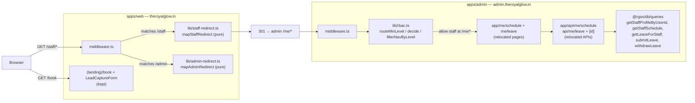

# Design Document

## Overview

This feature completes the admin→web separation by relocating the remaining **staff
self-service** surfaces (own schedule view + own leave submit/withdraw) out of `apps/web`
and onto the admin subdomain (`apps/admin`, served at `admin.theroyalglow.in` under the
Root-Path Convention). After this change `apps/web` contains only public/customer code and
permanently (301) redirects legacy `/staff/*` and `/admin/*` links to the admin subdomain.

The work splits into five cohesive parts:

1. **Relocated Admin pages** — `/me/schedule` and `/me/leave` (plus the leave panel
   component) under `apps/admin/src/app/me/*`, reusing the admin shell, session, and query
   conventions.
2. **Relocated Admin APIs** — `/api/me/schedule`, `/api/me/leave`, `/api/me/leave/[id]`
   under `apps/admin/src/app/api/me/*`, reusing `withErrorHandler`/`apiSuccess`/`requireRole`
   and the existing query layer, preserving 409-on-duplicate-date and uniform-404-on-withdraw.
3. **RBAC changes** — new `ROUTE_MIN_LEVEL` entries for `/me`, a new `ADMIN_NAV`
   self-service section, both at `staff` level (1), while `/staff` stays at manager level (3).
   Longest-prefix matching keeps the two namespaces independent.
4. **Web redirect strategy** — a new pure `mapStaffRedirect` in
   `apps/web/src/lib/staff-redirect.ts` (mirroring `mapAdminRedirect`), wired into
   `apps/web/src/middleware.ts` **before** any session check, emitting a 301 that preserves
   the deep-link sub-path and query and is idempotent.
5. **Cleanup + verification** — delete the web staff pages/APIs, leave breadcrumb comments,
   keep `(landing)/book` + `LeadCaptureForm`, ensure no dead imports, and add static +
   property + example tests proving the separation.

### Key design decision: the `/me/*` self-service namespace

The requirements leave one decision open: where do the relocated staff self-service surfaces
live on the admin subdomain, given that `/staff` already means **manager-level staff
management** (level 3)?

**Decision: introduce a dedicated `/me/*` namespace at `staff` level (1).**

| Option | Verdict |
|--------|---------|
| Reuse `/staff/*` for self-service | ✗ Collides with manager-level Staff_Management; would force lowering `/staff` to level 1 or adding fragile deeper-prefix exceptions. |
| Add a longest-prefix exception like `/staff/me` at level 1 under `/staff` (level 3) | ✗ Works mechanically (longest-prefix wins) but couples self-service to the management prefix and is easy to break when `/staff/*` sub-routes are added. |
| **Dedicated `/me/*` namespace at level 1** | ✓ Zero overlap with `/staff`. `routeMinLevel` resolves `/me/*` to 1 and `/staff/*` to 3 independently. Clear ownership, clear nav grouping, future-proof. |

`/me/*` is self-documenting ("my own"), never collides with management routes, and needs only
two additive `ROUTE_MIN_LEVEL` rows plus one nav section. This is the approach specified
throughout this design.

### Path mapping decision

Legacy web paths map onto the new admin namespace by replacing the `/staff` prefix with `/me`
on the admin origin:

| Legacy (web) | Canonical (admin) |
|--------------|-------------------|
| `https://theroyalglow.in/staff` | `https://admin.theroyalglow.in/me` |
| `https://theroyalglow.in/staff/schedule` | `https://admin.theroyalglow.in/me/schedule` |
| `https://theroyalglow.in/staff/leave` | `https://admin.theroyalglow.in/me/leave` |
| `https://theroyalglow.in/staff/leave?from=email` | `https://admin.theroyalglow.in/me/leave?from=email` |

The mapping is a generic prefix swap (`/staff` → `/me`), so any future deep link under
`/staff/*` is preserved automatically.

## Architecture



Request flow for a relocated surface:

1. A browser hits legacy `theroyalglow.in/staff/schedule`.
2. `Web_Middleware` matches the `/staff` branch **before** any session check and returns
   `301 → https://admin.theroyalglow.in/me/schedule` (sub-path + query preserved).
3. The browser follows the redirect to the admin subdomain. The `Shared_Session_Cookie`
   (`.theroyalglow.in` scope) is sent automatically — no re-authentication.
4. `Admin_Middleware` classifies the session, computes `routeMinLevel('/me/schedule') = 1`,
   and `decide` returns `allow` for a `staff` (level 1) user.
5. The admin page resolves the staff profile and renders the schedule (or the "no profile"
   state). API calls go to `/api/me/*`, gated by `requireRole('staff')`.

### Layer boundaries (unchanged)

Relocated code obeys the existing layer rules: pages/APIs are thin presentation/orchestration,
business helpers stay in `@rgss/business`, and all DB access goes through `@rgss/db/queries`.
No new business logic or queries are introduced — the relocation reuses
`getStaffProfileByUserId`, `getStaffSchedule`, `getLeaveForStaff`, `getLeaveForStaffOnDate`,
`submitLeave`, and `withdrawLeave` exactly as the web routes used them.

## Components and Interfaces

### 1. Admin pages — `apps/admin/src/app/me/*`

Target file layout:

```
apps/admin/src/app/me/
├── layout.tsx              # session gate + self-service metadata (noindex)
├── schedule/
│   └── page.tsx            # relocated StaffSchedulePage (server component)
└── leave/
    ├── page.tsx            # relocated StaffLeavePage (server component)
    └── me-leave-panel.tsx  # relocated StaffLeavePanel (client component)
```

- **`me/layout.tsx`** — Resolves the session server-side (mirrors the admin root layout
  pattern) and `redirect()`s to the web origin if absent, as a defence-in-depth complement to
  the edge middleware (which already gates `/me/*` at level 1). It does **not** re-render the
  full admin chrome — the admin `RootLayout` already wraps every page in `AdminShell`, and the
  sidebar is filtered to show only the self-service section for a `staff` user (see RBAC
  below). The layout sets `robots: { index: false, follow: false }` and a `%s | Royal Glow`
  title template. This satisfies Req 1.3 (session-gated + navigation limited to self-service).
- **`me/schedule/page.tsx`** — Server component ported from the web `StaffSchedulePage`.
  Resolves `getStaffProfileByUserId(session.user.id)`; when null, renders the explicit
  "no staff profile" state (Req 1.4); otherwise renders the read-only 7-day grid via
  `getStaffSchedule(staff.id)`. Time formatting uses the admin helper `formatTime12h` from
  `@/lib/admin/bookings`; `dayOfWeekLabel` continues to come from `@rgss/business`. (Req 1.1)
- **`me/leave/page.tsx` + `me-leave-panel.tsx`** — Server page ports the header; the client
  panel ports `StaffLeavePanel`, retargeting its `fetch` URLs from `/api/staff/leave*` to
  `/api/me/leave*`. `formatDateDDMMYYYY` is imported from the admin `@/lib/admin/bookings`
  helper. The panel keeps the submit form, history list, and the per-item withdraw action
  for `pending` rows. (Req 1.2, 1.5)

### 2. Admin APIs — `apps/admin/src/app/api/me/*`

Target file layout:

```
apps/admin/src/app/api/me/
├── schedule/route.ts       # GET own schedule
└── leave/
    ├── route.ts            # GET own leave history, POST submit leave
    └── [id]/route.ts       # DELETE withdraw own pending leave
```

All three reuse the admin infrastructure verbatim: `withErrorHandler`, `apiSuccess` from
`@/lib/api/error-handler`; `requireRole('staff')` from `@/lib/api/session`; the
`@rgss/db/queries` functions; and `@rgss/errors` / `@rgss/types` helpers. The handler bodies
are identical to the web versions (they are already written against these exact shared
imports), so the relocation is a move + import-base change, not a rewrite. (Req 2.6, 8.4)

| Endpoint | Method | Min role | Behavior | Requirements |
|----------|--------|----------|----------|--------------|
| `/api/me/schedule` | GET | staff | Resolve profile → `getStaffSchedule`; 404 if no profile | 2.1 |
| `/api/me/leave` | GET | staff | Resolve profile → `getLeaveForStaff`; 404 if no profile | 2.2 |
| `/api/me/leave` | POST | staff | Validate `submitLeaveSchema`; pre-check `getLeaveForStaffOnDate` → **409** on duplicate; else `submitLeave` (status `pending`, 201) | 2.3, 2.4 |
| `/api/me/leave/[id]` | DELETE | staff | `withdrawLeave(id, staff.id)`; **uniform 404** when null (not theirs / already decided / missing) | 2.5 |

Preserved invariants (carried over unchanged):

- **409 on duplicate date** — `getLeaveForStaffOnDate(staff.id, date)` is checked before
  `submitLeave`, throwing `conflict(ERROR_CODES.CONFLICT, …)` instead of surfacing a raw
  unique-constraint violation. (Req 2.4)
- **Uniform 404 on withdraw** — `withdrawLeave` only matches a row that is the caller's AND
  `pending`; a null result becomes one `notFound(…)` message regardless of cause, so it never
  reveals another staff member's data. (Req 2.5)
- **Strict self-scoping** — every handler resolves the staff profile from
  `session.user.id`; no caller-supplied staff id is ever trusted. (Req 2.1, 2.2)

### 3. Admin RBAC — `apps/admin/src/lib/rbac.ts`

Three additive edits, no behavior change to existing routes:

**(a) `ROUTE_MIN_LEVEL` — add `/me` at level 1.**

```ts
export const ROUTE_MIN_LEVEL: ReadonlyArray<readonly [string, number]> = [
  ['/integrations', 5],
  ['/logs', 5],
  ['/branches', 4],
  ['/users', 4],
  ['/services', 3],
  ['/offers', 3],
  ['/staff', 3],     // manager-level Staff_Management — UNCHANGED
  ['/schedule', 3],
  ['/reports', 3],
  ['/settings', 3],
  ['/bookings', 2],
  ['/waitlist', 2],
  ['/customers', 2],
  ['/leads', 2],
  ['/billing', 2],
  ['/leave', 2],
  ['/memberships', 2],
  ['/me', 1],        // NEW — staff self-service namespace (level 1)
  ['/', 2],          // dashboard root — matched last
] as const
```

Because `routeMinLevel` uses **longest-prefix matching**, `/me` and `/me/schedule` and
`/me/leave` all resolve to level 1, while `/staff` and `/staff/anything` still resolve to
level 3. The two prefixes share no common path segment (`/me` is not a prefix of `/staff`,
and vice versa), so adding `/me` cannot weaken `/staff`. (Req 3.1, 3.4)

**(b) `ADMIN_NAV` — add a Self-Service section at level 1.**

```ts
{
  title: 'Self-Service',
  items: [
    { label: 'My Schedule', href: '/me/schedule', minLevel: 1 },
    { label: 'My Leave', href: '/me/leave', minLevel: 1 },
  ],
},
```

`filterNavByLevel(ADMIN_NAV, 1)` then yields **only** this section for a `staff` user (every
other item has `minLevel >= 2`, so all other sections are dropped). Receptionist+ users
(level ≥ 2) also see this section, which is acceptable — managers acting on their own leave is
harmless — but if the product later wants to hide it from higher roles that would be a
separate change. For this feature the requirement is that staff see only self-service nav
(Req 3.6), which holds. (Req 3.6)

**(c) No change to `decide`, `routeMinLevel`, `filterNavByLevel`, `resolveRoleLevel`** — their
existing logic already produces the required outcomes once the table/nav rows are added.

Resulting access matrix (via `decide(classify(...), routeMinLevel(path))`):

| Role (level) | `/me/schedule` | `/me/leave` | `/` (dashboard) | `/bookings` (2) | `/staff` (3) |
|--------------|----------------|-------------|-----------------|-----------------|--------------|
| customer (0) | forbid | forbid | forbid | forbid | forbid |
| **staff (1)** | **allow** | **allow** | **forbid (403)** | **forbid (403)** | **forbid (403)** |
| receptionist (2) | allow | allow | allow | allow | forbid |
| manager (3) | allow | allow | allow | allow | allow |

This is exactly Req 3.2 (staff allowed on self-service), Req 3.3 (staff forbidden on dashboard
root and all receptionist+ routes), and Req 3.5 (below-staff denied).

### 4. Web redirect — `apps/web/src/lib/staff-redirect.ts` + `middleware.ts`

**New pure module `staff-redirect.ts`** mirrors `admin-redirect.ts`:

```ts
export const ADMIN_ORIGIN = 'https://admin.theroyalglow.in'

/**
 * Map a legacy `/staff/*` path on the customer domain to its canonical
 * Admin_App destination under the `/me` self-service namespace.
 *
 * - `/staff/{rest}` -> `${ADMIN_ORIGIN}/me/{rest}` (prefix swapped, remainder preserved)
 * - bare `/staff` and `/staff/` -> `${ADMIN_ORIGIN}/me`
 * - an already-canonical `/me{...}` path -> `${ADMIN_ORIGIN}/me{...}` (idempotent re-map)
 * - the query string, when provided, is preserved verbatim
 * Pure: no framework / edge-runtime dependency.
 */
export function mapStaffRedirect(path: string, search?: string): string
```

Behavior specification:

1. Normalize `search` exactly as `mapAdminRedirect` does (accept `"?a=b"`, `"a=b"`, empty,
   `"?"`, or `undefined`).
2. Compute the remainder under the self-service namespace:
   - `path === '/staff' || path === '/staff/'` → `rest = '/me'`
   - `path.startsWith('/staff/')` → `rest = '/me' + path.slice('/staff'.length)` (keeps the
     leading slash of the remainder, e.g. `/staff/schedule` → `/me/schedule`)
   - `path === '/me' || path.startsWith('/me/')` → `rest = path` (already canonical →
     identity, which gives **idempotence**, Req 4.6)
   - any other path (defensive) → `rest = '/me'`
3. Return `` `${ADMIN_ORIGIN}${rest}${query}` ``.

Purity (Req 4.7): the function imports nothing, performs no I/O, and is a deterministic
function of `(path, search)` — directly property-testable without the edge runtime.

**`middleware.ts` wiring** — add a `/staff` branch immediately after the existing `/admin`
branch, both **before** the session-cookie check:

```ts
import { mapAdminRedirect } from './lib/admin-redirect'
import { mapStaffRedirect } from './lib/staff-redirect'
// ...
if (pathname === '/admin' || pathname.startsWith('/admin/')) {
  return NextResponse.redirect(mapAdminRedirect(pathname, search), 301)
}
if (pathname === '/staff' || pathname.startsWith('/staff/')) {
  return NextResponse.redirect(mapStaffRedirect(pathname, search), 301)
}
// ...session checks below, unchanged
```

The existing matcher already includes `'/staff/:path*'`; add `'/staff'` so the bare path is
also matched. Because both redirect branches run before the session check, unauthenticated
visitors are redirected too (Req 4.5). The 301 status and sub-path/query preservation match
the established `mapAdminRedirect` convention (Req 4.1–4.4). The middleware retains no
RBAC/role logic beyond these two redirect branches (Req 5.6).

### 5. Cleanup — `apps/web`

Delete (Req 1.6, 2.7, 5.4, 5.5, 8.2):

```
apps/web/src/app/staff/layout.tsx
apps/web/src/app/staff/schedule/page.tsx
apps/web/src/app/staff/leave/page.tsx
apps/web/src/app/staff/leave/staff-leave-panel.tsx
apps/web/src/app/api/staff/schedule/route.ts
apps/web/src/app/api/staff/leave/route.ts
apps/web/src/app/api/staff/leave/[id]/route.ts
```

After deletion the `apps/web/src/app/staff` and `apps/web/src/app/api/staff` directories are
removed entirely (no residual page/route files; the legacy redirect lives in middleware, not
in a page). (Req 5.4 — "except surfaces required solely for the legacy redirect" is satisfied
by the middleware branch, so no `/staff` page is retained.)

**Breadcrumb comments** (Req 8.1): add a short comment in `staff-redirect.ts` and at the
`/staff` branch in `middleware.ts` recording the canonical destination
(`admin.theroyalglow.in/me/*`). The redirect handler itself is the primary breadcrumb.

**Kept (Req 6):** `apps/web/src/app/(landing)/book` and
`apps/web/src/components/lead/LeadCaptureForm.tsx` are untouched. The `/staff` and `/admin`
redirect branches never match `/book`, and `(landing)/book` is not behind the auth matcher, so
the lead-capture page stays public and is never redirected. (Req 6.1–6.4)

**No dead imports** (Req 8.3, 9.3): the deleted web files were the only consumers of
`@/lib/format`'s `formatTime12h`/`formatDateDDMMYYYY` for staff surfaces and of the staff
query imports within `apps/web`. After deletion, verify no remaining `apps/web` module imports
a relocated staff module (static grep + typecheck).

## Data Models

No new persistent data models, schemas, or migrations are introduced (Req 9.7). The relocated
surfaces reuse existing `staff_profile`, `staff_schedule`, and `staff_time_off` (leave) tables
through the existing query layer. The only "models" are the transport/UI shapes carried over
unchanged from the web implementation.

Leave row shape (client panel, mirrors `GET /api/me/leave`):

```ts
interface LeaveRow {
  id: string
  leaveType: 'sick' | 'casual' | 'personal' | 'other' | string
  date: string                 // 'YYYY-MM-DD'
  reason: string | null
  approvalStatus: 'pending' | 'approved' | 'rejected'
  rejectionReason: string | null
  createdAt: string
}
```

Schedule row shape (`GET /api/me/schedule`, one per working day): `dayOfWeek` (0–6),
`isWorking`, `startTime`/`endTime` (`"HH:MM[:SS]"` or null).

Submit-leave input (`submitLeaveSchema` from `@rgss/types`, unchanged): `{ leaveType, date,
reason? }`.

RBAC types (existing, in `rbac.ts`): `Role`, `AuthState` (tagged union), `Decision` (tagged
union), `NavItem`, `NavSection`. The `/me` route table row and the Self-Service `NavSection`
are added as data, not new types.

## Correctness Properties

*A property is a characteristic or behavior that should hold true across all valid executions
of a system — essentially, a formal statement about what the system should do. Properties serve
as the bridge between human-readable specifications and machine-verifiable correctness
guarantees.*

The testable surfaces here are two **pure functions**: `mapStaffRedirect` (the redirect map)
and the existing RBAC core (`routeMinLevel` + `decide`) extended with the `/me` entries. Both
are ideal for property-based testing: deterministic, input-varied, in-memory. The Admin page
"no profile" rendering, the 409/404 API behaviors, and the cross-subdomain session sharing are
example/integration concerns (covered in Testing Strategy), and the "no staff dirs remain"
checks are static invariants — none of those are property tests.

### Property 1: Staff redirect preserves the deep-link sub-path

*For any* legacy path of the form `/staff/{rest}` (with `rest` a non-empty sub-path), the
result of `mapStaffRedirect` SHALL equal `https://admin.theroyalglow.in/me/{rest}` — i.e. the
`/staff` prefix is replaced by `/me` and the entire remainder is preserved unchanged.

**Validates: Requirements 4.1, 4.2**

### Property 2: Staff redirect preserves the query string verbatim

*For any* legacy `/staff/*` path and *any* query string, the destination produced by
`mapStaffRedirect` SHALL end with that query string exactly as supplied (after leading-`?`
normalization), with no characters added, dropped, or re-encoded.

**Validates: Requirements 4.3**

### Property 3: Staff redirect is idempotent

*For any* legacy `/staff/*` path, applying `mapStaffRedirect` and then re-applying the mapping
to the resulting Admin_App path (the `/me/...` path) SHALL produce the same Admin_App
destination URL.

**Validates: Requirements 4.6**

### Property 4: Staff redirect always targets the admin `/me` namespace

*For any* path matched by the `/staff` middleware branch (`/staff`, `/staff/`, or any
`/staff/`-prefixed path), the result of `mapStaffRedirect` SHALL be an absolute URL whose
origin is `https://admin.theroyalglow.in` and whose path begins with `/me`, and SHALL never
contain the `/staff` prefix.

**Validates: Requirements 4.1, 4.2, 4.7**

### Property 5: Staff is granted access to exactly the self-service routes

*For any* path in the admin route table, a valid session at the `staff` Role_Level (1) SHALL
be `allow`ed by `decide(routeMinLevel(path))` if and only if that path resolves under the
`/me` namespace; for the dashboard root and every route whose minimum level is `receptionist`
(2) or higher, the same staff session SHALL be `forbid`den.

**Validates: Requirements 3.2, 3.3, 3.5**

### Property 6: Adding `/me` does not weaken the manager-level `/staff` route

*For any* path under the `/staff` namespace (`/staff` or any `/staff/`-prefixed path),
`routeMinLevel(path)` SHALL equal `3` (manager) regardless of the presence of the `/me` entry
— longest-prefix matching keeps the two namespaces independent.

**Validates: Requirements 3.4**

### Property 7: Self-service navigation visibility matches role level

*For any* role level, `filterNavByLevel(ADMIN_NAV, level)` SHALL include the `My Schedule` and
`My Leave` self-service entries if and only if `level >= 1`, and for a staff user (level 1) the
filtered result SHALL contain **only** the Self-Service section (no receptionist+ entries).

**Validates: Requirements 3.6**

## Error Handling

Relocated APIs use the admin `withErrorHandler` envelope unchanged, so error shapes match the
rest of the admin app (`{ success: false, error: { code, message, statusCode, requestId, … } }`).

| Condition | Response | Source |
|-----------|----------|--------|
| No session / invalid session at `/me/*` (edge) | 301/302 bounce to web origin (no_cookie/error → redirect; invalid → clear+redirect) | `decide` in middleware |
| Valid session, level < 1 (customer) at `/me/*` | 403 Forbidden | middleware `forbid` |
| API called without `staff` role | 403 `FORBIDDEN` | `requireRole('staff')` |
| No staff profile linked | 404 `notFound('No staff profile for this account.')` (API); "no profile" state (page) | query returns null |
| Duplicate leave date on POST | **409** `CONFLICT` with descriptive message | pre-check `getLeaveForStaffOnDate` |
| Withdraw non-own / decided / missing leave | **404** uniform `notFound` (no data leak) | `withdrawLeave` returns null |
| Invalid POST body | 400 `badRequest` with field errors | `submitLeaveSchema.safeParse` |
| Per-user rate limit exceeded | 429 with `Retry-After` | `requireSession` → `enforceRateLimit` |
| Unexpected error | 500 `INTERNAL_ERROR` + Sentry | `withErrorHandler` catch |

The pure `mapStaffRedirect` never throws: defensive non-`/staff` inputs collapse to
`${ADMIN_ORIGIN}/me`, and malformed/empty query strings normalize to empty.

## Testing Strategy

PBT **applies** to the two pure cores (redirect map, RBAC decision) and is used there. The
relocated pages/APIs, cross-subdomain session sharing, and "no leftover dirs" checks are
example/integration/static concerns and are tested without PBT.

### Property-based tests (fast-check + Vitest, ≥100 iterations each)

Place alongside the modules under test. Each test is tagged
**`Feature: admin-web-separation, Property {n}: {property text}`** and runs a minimum of 100
iterations. Use fast-check generators for path segments (alphanumeric + safe URL chars), query
strings, and role levels (0–5).

- `apps/web/src/lib/staff-redirect.test.ts` — Properties 1–4 (`mapStaffRedirect`).
  - Generators: random non-empty sub-path segments joined under `/staff/...`; random query
    strings with/without leading `?`; the bare `/staff` and `/staff/` cases as fixed seeds.
- `apps/admin/src/lib/rbac.test.ts` (extend existing) — Properties 5–7.
  - Property 5/6: generate a path by sampling from the known route prefixes (`/me/...`,
    `/staff/...`, `/bookings`, `/`, etc.) and assert `decide({kind:'valid',roleLevel:1},
    routeMinLevel(path))` and `routeMinLevel('/staff/*') === 3`.
  - Property 7: generate `level ∈ 0..5`, assert self-service visibility iff `level >= 1` and
    that level 1 yields only the Self-Service section.

### Example / unit tests (Vitest)

- **Redirect mapping examples** (Req 9.5): `/staff` → `…/me`, `/staff/schedule` →
  `…/me/schedule`, `/staff/leave?from=email` → `…/me/leave?from=email`.
- **RBAC matrix examples** (Req 9.6): explicit assertions for the access matrix rows above
  (staff allowed on `/me/*`; staff 403 on `/`, `/bookings`, `/staff`).
- **API behavior**: 409 on duplicate-date POST (mock `getLeaveForStaffOnDate` returning a row);
  uniform 404 when `withdrawLeave` returns null; 404 "no staff profile" when
  `getStaffProfileByUserId` returns null. Mock the query layer (no real DB).
- **Page rendering**: `/me/schedule` renders the "no staff profile" state when the profile is
  null (React Testing Library), and renders 7 day rows when a schedule is present.

### Integration tests

- **Middleware redirect** (Req 4.1, 4.5): a request to `/staff/schedule` (authenticated and
  unauthenticated) returns a 301 to `https://admin.theroyalglow.in/me/schedule` before any
  session check; `/admin/*` still redirects via `mapAdminRedirect`; `/book` is never
  redirected (Req 6.4).
- **Admin route gating** (Req 3.x, 7.3): with a `staff` session cookie, `/me/schedule` is
  allowed and `/` returns 403 — exercised against the admin middleware/`decide` path. Extend
  the existing `apps/admin/src/app/__tests__/migrated-routes.smoke.test.tsx` to include the
  `/me/*` routes.

### Static / verification checks (Requirement 9)

A verification step (script + CI, no new migration) asserts:

1. **No leftover staff dirs** (Req 9.4): `apps/web/src/app/staff` and
   `apps/web/src/app/api/staff` do not exist (filesystem existence check / glob count === 0).
   Implementable as a Vitest test using `node:fs` that fails if either path resolves.
2. **No dead staff imports** (Req 9.3): grep `apps/web/src` for imports referencing relocated
   staff modules or the removed staff API paths → must return zero matches.
3. **Typecheck clean** (Req 9.1): `turbo run typecheck` reports no new errors.
4. **Lint clean** (Req 9.2): `biome check` (via `turbo run lint`) reports no new errors.
5. **Kept surfaces present** (Req 6.1, 6.2): assert `(landing)/book` and
   `components/lead/LeadCaptureForm.tsx` still exist.
6. **No migration added** (Req 9.7): assert no new files under `packages/db/migrations/`.

These run in the existing CI `lint` + `typecheck` + `test` pipeline (`turbo.json`), so the
separation is verified on every push.
