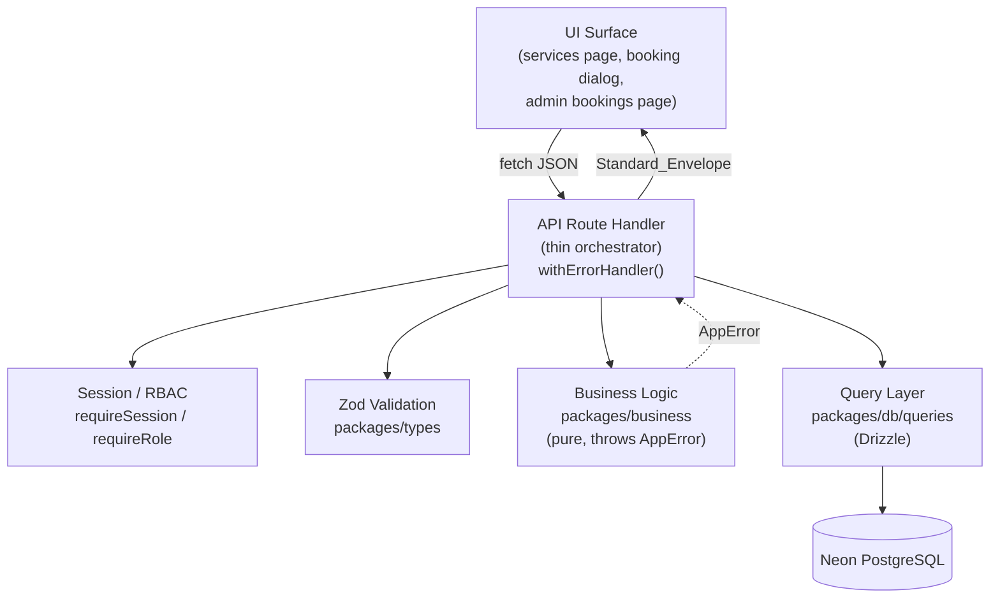
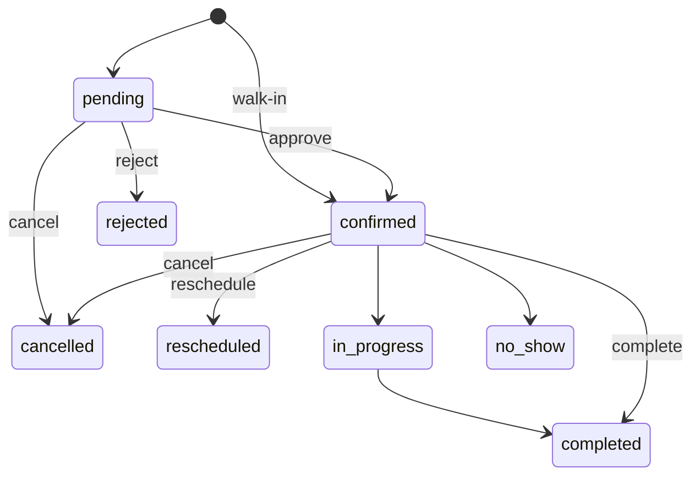

# Design Document

## Overview

The Backend API connects the RGSS customer and admin UIs to the live Neon PostgreSQL database through a strict layered architecture. The design follows the established RGSS contract: API routes are **thin orchestrators** (parse → Zod validate → call business logic / queries → return the standard envelope), business rules live in `packages/business/` as **pure functions** that throw `AppError`, and **all** database access is isolated in `packages/db/queries/` using Drizzle ORM.

This feature is delivered in layers, built in priority order:

1. **API Foundation** — `withErrorHandler()`, response helpers (`apiSuccess`/`ok`/`created`/`noContent`), session/RBAC helpers, and the shared Zod envelope schemas in `packages/types/`.
2. **Query Layer** — Drizzle query builders in `packages/db/queries/` for services, bookings, leads, invoices, loyalty, and admin booking management.
3. **Business Layer** — pure functions in `packages/business/` for booking-number generation, pricing, availability slot rules, reschedule eligibility, GST split, and gems calculation.
4. **Customer API Routes** — `/api/services`, `/api/services/[slug]`, `/api/availability`, `/api/bookings` (+ `[id]`, `/cancel`, `/reschedule`), `/api/leads`.
5. **Admin API Routes** — booking listing, approval/rejection/assignment, and completion (invoice + gems) served from `apps/admin/app/api/`.
6. **UI Wiring** — the services page, the booking dialog, and the admin bookings page consume the new endpoints with loading and error states.

Many of the values in scope are pure functions over a large input space (booking numbers, GST splits, gems, pricing totals, slot grids, the response envelope). Where that is true the design specifies universally-quantified correctness properties for property-based testing. Side-effecting concerns (background jobs, email, realtime, PDF generation, payment gateways) are out of scope; routes expose extension points but do not implement the external integration.

### Design Goals

- **Uniform contract.** Every endpoint returns exactly one of two envelope shapes. Frontends handle success and failure identically across the app.
- **Strict layering.** No DB access in routes, no framework/IO in business logic, no business logic in queries. This keeps business rules unit- and property-testable in isolation.
- **Integer money.** All monetary math is integer paise; rupee/display conversion happens only at the edges. No floating point in stored or computed money.
- **IST-correct time.** Dates and availability are evaluated against the salon's IST wall clock, not the server's UTC clock.
- **Fail safe.** Best-effort side effects (job enqueues) can never break or alter the primary response.

### Alignment With Existing Code

The repository already contains the foundation (`apps/web/src/lib/api/`), the query layer (`packages/db/src/queries/`), the business layer (`packages/business/src/`), the shared types (`packages/types/src/`), and most route handlers. This design documents the intended architecture and the contracts those modules satisfy, and identifies the remaining wiring (admin app routes and the three UI surfaces). Where an implementation already exists, the design reflects its actual behavior so the document is a faithful specification rather than a divergent plan.

## Architecture

### Layered Request Flow



A route handler does only orchestration:

1. Resolve session / enforce role (where the endpoint is protected).
2. Parse the request body or query string.
3. Validate with a Zod schema via `.safeParse()`; on failure throw `VALIDATION_ERROR` (400) with field errors in `details`.
4. Read required rows through the query layer.
5. Call pure business functions for any rule or computation; let thrown `AppError`s propagate.
6. Persist through the query layer.
7. Return the success envelope. `withErrorHandler()` converts any thrown error into the error envelope.

### Module Boundaries

| Layer | Location | May import | Must not import |
|-------|----------|-----------|-----------------|
| API (customer) | `apps/web/src/app/api/` | business, db/queries, types, errors, lib/api | UI components |
| API (admin) | `apps/admin/app/api/` | business, db/queries, types, errors, lib/api | UI components |
| API foundation | `apps/web/src/lib/api/`, `apps/admin/src/lib/api/` | errors, types, auth-server | business internals, db |
| Business | `packages/business/` | types, errors | db, framework, UI |
| Queries | `packages/db/queries/` | db schema, types | business, framework, UI |
| Types | `packages/types/` | — | everything else |

### Error Propagation Strategy

`withErrorHandler()` is the single seam where errors become HTTP responses. Business functions and query helpers throw `AppError` (or rely on factory helpers `notFound`/`forbidden`/`badRequest`/`conflict`). The wrapper:

- serializes a thrown `AppError` into `{ success: false, error: { code, message, statusCode, requestId, retryable, details? } }` using the AppError's own `statusCode` as the HTTP status;
- maps any non-`AppError` to `INTERNAL_ERROR` / 500 / `retryable: true` and reports it to Sentry;
- attaches a `requestId` taken from the `x-request-id` header, or generates `req_{nanoid(12)}` when absent.

### Request Correlation

Request IDs originate in middleware (or are generated by the handler when missing) and are echoed in every error envelope. Unexpected errors are logged with the request ID and captured by Sentry; expected `AppError`s are not reported (they are operational, client-facing outcomes).

### Caching and Performance (non-functional, noted)

The service catalogue is read-mostly, but `/api/services` currently calls the Drizzle query layer and reads Neon directly. No Upstash read-through cache, TTL, or Redis invalidation is implemented. A 5-minute Upstash cache remains a planned optimization; Cloudflare Worker KV is not part of this architecture.

## Components and Interfaces

### API Foundation (`apps/web/src/lib/api/`)

**`withErrorHandler<Ctx>(handler)`** — wraps a `(req, ctx) => Promise<Response>` handler with the try/catch that produces the standard error envelope and request-id correlation.

**`apiSuccess<T>(data, meta?, status = 200)`** — builds `{ success: true, data, meta? }`. `meta` carries `page`, `totalPages`, `totalCount` for paginated endpoints.

**`ok` / `created` / `noContent`** (`response.ts`) — convenience builders for 200/201/204 with the same envelope.

**Session helpers** (`session.ts`):

- `requireSession()` → resolves the Better Auth session or throws `UNAUTHENTICATED` (401).
- `getOptionalSession()` → returns the session or `null` (used by public-but-personalized endpoints).
- `requireRole(minRole)` → resolves the session, compares the user's role against the RBAC hierarchy `customer < staff < receptionist < manager < owner < developer`, and throws `FORBIDDEN` (403) when the level is insufficient.

**Rate limiting** (`rate-limit.ts`) — per-endpoint sliding-window limiter (Upstash). Applied to public write endpoints such as lead capture; returns `RATE_LIMITED` (429) when exceeded.

The admin app (`apps/admin/`) uses a parallel foundation with the same contracts so admin routes share the identical envelope and RBAC semantics.

### Shared Types (`packages/types/`)

- `api.ts` — `apiSuccessSchema<T>` (generic success wrapper with optional pagination `meta`) and `apiErrorResponseSchema` (fixed error shape). These are the canonical envelope contracts.
- `service.ts`, `booking.ts`, `lead.ts`, `admin-booking.ts` — input schemas for catalogue management, booking create/cancel/reschedule, lead capture, and admin booking actions (`approve`/`reject`/`assign` discriminated union, `complete` with payment method).

### Business Layer (`packages/business/`)

| Function | Module | Contract |
|----------|--------|----------|
| `generateBookingNumber(branchCode, serviceType, date)` | `booking/booking-number.ts` | Returns `BK-{branchCode}-{YYMM}-{H\|S}-{5 digits}`. `H` for salon, `S` for spa. |
| `calculateBookingTotal(services)` | `booking/pricing.ts` | Sums `pricePaise` and `durationMinutes` over the selected services. |
| `addMinutesToTime(time, minutes)` | `booking/pricing.ts` | Adds minutes to an `HH:MM` string, wrapping at 24h. |
| `checkReschedulable({ status, rescheduleCount })` | `booking/reschedule.ts` | Discriminated result gating reschedule by status and `MAX_RESCHEDULES = 2`. |
| `isBookableSlotStart(startTime, durationMinutes)` | `booking/reschedule.ts` | A start aligns to the 30-min grid within open hours and finishes before close. |
| `splitGST(inclusivePaise)` | `invoicing/gst.ts` | Back-calculates base, GST, and equal CGST/SGST halves; `base + gst === inclusive` exactly. |
| `calculateGemsEarned(totalPaise)` | `loyalty/gems.ts` | `floor(totalPaise / 10000)` — 1 gem per ₹100. |

The membership-session suffix (`-M`, Requirement 4.5) is applied by the booking-creation flow when `isMembershipSession` is true. The design extends booking-number handling so the `-M` suffix is appended to the generated number for membership sessions (see Data Models → Booking Number).

### Query Layer (`packages/db/queries/`)

Representative query builders consumed by this feature (all parameterized Drizzle queries):

- `services.ts` — `getActiveCatalogue()` (active categories ordered by `displayOrder`, each with active services ordered by `displayOrder`), `getServiceBySlug(slug)`, `getServicesByIds(ids)`.
- `bookings.ts` — `getBookingsByCustomer(customerId, statusFilter?)`, `getBookingByIdForCustomer(id, customerId)`, `createBookingWithServices(booking, serviceRows)`, `getDefaultStaffForService(serviceId)`, `cancelBooking(...)`, `rescheduleBooking(...)`, `insertStatusLog(...)`.
- `branches.ts` — `getBranchById(id)`.
- `admin-bookings.ts` — `listBookings(filters)`, `approveBooking(...)`, `rejectBooking(...)`, `assignStaff(...)`, `completeBookingWithInvoice(...)`.
- `leads.ts` — `createLead(...)`.
- `invoices.ts`, `loyalty.ts` — invoice creation and gems crediting used during completion.

Writes that must be atomic (booking + its services; completion + invoice + invoice items + gems credit + status log) are wrapped in a single Drizzle transaction inside the query layer.

### Customer API Routes (`apps/web/src/app/api/`)

| Method & path | Auth | Behavior |
|---------------|------|----------|
| `GET /api/services` | public | Returns active categories with active services, ordered. |
| `GET /api/services/[slug]` | public | Returns one active service or `NOT_FOUND` (404). |
| `GET /api/availability?date=&branchId=` | public | Returns 30-min slots with availability flags; rejects past dates (400). |
| `GET /api/bookings` | customer | Returns only the caller's bookings; supports `status` filter. |
| `POST /api/bookings` | customer | Validates branch/services/slot, computes totals, snapshots, creates `pending` (or `confirmed` for walk-in), returns id + number. |
| `GET /api/bookings/[id]` | customer | Returns the caller's booking with services/status/timestamps, else `NOT_FOUND` (404). |
| `POST /api/bookings/[id]/cancel` | customer | Cancels a `pending`/`confirmed` booking; logs the transition. |
| `POST /api/bookings/[id]/reschedule` | customer | Moves a booking to a new slot; enforces `MAX_RESCHEDULES`; logs it. |
| `POST /api/leads` | public | Creates a `new` lead; validates Indian phone; stores UTM. |

### Admin API Routes (`apps/admin/app/api/`, root-path convention)

| Method & path | Min role | Behavior |
|---------------|----------|----------|
| `GET /api/bookings` | receptionist | Lists bookings across customers with customer/services/staff/status; supports status, date, service-type filters. |
| `PATCH /api/bookings/[id]` | receptionist | Discriminated action: `approve` (→ confirmed + assign staff), `reject` (→ rejected + reason), `assign` (reassign staff). Logs transitions with acting user. |
| `POST /api/bookings/[id]/complete` | receptionist | `confirmed`/`in_progress` → `completed`; creates a service invoice (GST split) and awards gems (zero for membership sessions). |

### UI Wiring

- **Services page** (`apps/web/src/app/(customer)/services`) — fetches `GET /api/services`, renders categories/services, shows a loading state while pending and an error state with retry on failure.
- **Booking dialog** (`apps/web/src/components/booking/`) — on open loads catalogue from `GET /api/services`; on date selection loads `GET /api/availability`; on submit calls `POST /api/bookings` and shows the returned booking number, or the error message on failure.
- **Admin bookings page** (`apps/admin/app/bookings`) — loads from `GET /api/bookings`, re-requests on filter change, and shows a loading state while the request is in flight.

## Data Models

### Standard Response Envelope

```typescript
// Success
{ success: true, data: T, meta?: { page: number, totalPages: number, totalCount: number } }

// Error
{ success: false, error: {
    code: string,          // ErrorCode from packages/errors/codes.ts
    message: string,
    statusCode: number,    // 400–599, equals HTTP status
    requestId: string,     // req_{nanoid} correlation id
    retryable?: boolean,
    details?: unknown       // e.g. Zod fieldErrors on VALIDATION_ERROR
} }
```

### AppError

```typescript
class AppError extends Error {
  code: ErrorCode
  statusCode: number
  isOperational: boolean   // default true — safe to expose
  retryable: boolean       // default false — hints caller to retry
  details?: unknown
}
```

Error codes are a closed registry (`packages/errors/codes.ts`): generic (`VALIDATION_ERROR`, `UNAUTHENTICATED`, `FORBIDDEN`, `NOT_FOUND`, `INTERNAL_ERROR`, …) plus domain codes (`BOOKING_SLOT_UNAVAILABLE`, `BOOKING_ALREADY_CANCELLED`, `BOOKING_MAX_RESCHEDULES`, `BOOKING_INVALID_STATUS_TRANSITION`, …).

### Service Catalogue (read shape)

```typescript
type CatalogueCategory = {
  id: string
  name: string
  serviceType: 'salon' | 'spa'
  displayOrder: number
  services: CatalogueService[]   // active only, ordered by displayOrder
}

type CatalogueService = {
  id: string
  categoryId: string
  categoryName: string
  name: string
  slug: string
  durationMinutes: number
  pricePaise: number             // GST-inclusive, integer paise
  gemsRedeemable: boolean
  gemsRequired: number | null
}
```

Only categories with `isActive = true` and services with `isActive = true` are returned. Categories are ordered by ascending `displayOrder`, and services within each category by ascending `displayOrder`.

### Availability Slot

```typescript
type Slot = { startTime: string; endTime: string; available: boolean } // "HH:MM"
```

Slots are generated at fixed 30-minute intervals within branch business hours (10:00 open, last slot starts 20:30, close 21:00). A slot is `available: false` when it falls outside business hours, the date is a recorded holiday, or (for today) its start is earlier than the current IST time. Past dates are rejected with `VALIDATION_ERROR` (400) before any slot generation.

### Booking and Booking Number

Booking rows (table `booking`) carry `status`, `serviceType`, `bookingDate`, `startTime`/`endTime`, `totalAmountPaise`, `totalDurationMinutes`, `isWalkin`, `isMembershipSession`, `rescheduleCount`, and lifecycle timestamps. Each selected service is snapshotted in `booking_service` with `serviceNameSnapshot`, `priceAtBookingPaise`, and `durationMinutes`. Status transitions are recorded in `booking_status_log` (`fromStatus`, `toStatus`, `changedById`).

Booking number format:

```
BK-{branchCode}-{YYMM}-{H|S}-{5 alphanumeric}[-M]
```

- `H` = salon, `S` = spa.
- `YYMM` is derived from the booking creation date (2-digit year + 2-digit month).
- The 5-character random segment is alphanumeric (currently numeric digits; the property treats it as alphanumeric per Requirement 4.4).
- The `-M` suffix is appended only when the booking is a membership session.

### Lifecycle State Machine



Cancellation is allowed only from `pending`/`confirmed`. Cancelling an already-`cancelled` booking returns `BOOKING_ALREADY_CANCELLED` (409); from `completed`/`in_progress`/`no_show` returns `BOOKING_INVALID_STATUS_TRANSITION` (409). Approve/reject require `pending`; completion requires `confirmed`/`in_progress`.

### Invoice and GST

```typescript
type InvoiceMoney = {
  subtotalPaise: number
  taxableValuePaise: number   // round(total / 1.18)
  gstAmountPaise: number      // total - taxableValue
  totalAmountPaise: number
  gemsEarned: number          // floor(total / 10000), 0 for membership sessions
}
```

`splitGST` guarantees integer reconstruction: `taxableValuePaise + gstAmountPaise === totalAmountPaise`, with GST split into equal CGST/SGST halves (the remainder paise assigned to SGST).

### Lead

```typescript
type Lead = {
  id: string
  name: string
  phone: string                 // normalized +91XXXXXXXXXX
  serviceInterestedId?: string
  status: 'new'                 // on creation
  source: string                // default 'meta_ad'
  utmSource?: string; utmMedium?: string; utmCampaign?: string
}
```

Indian phone validation: `^(?:\+?91|0)?[6-9]\d{9}$`. Invalid phones return `VALIDATION_ERROR` (400). Lead capture requires no authentication.

## Correctness Properties

*A property is a characteristic or behavior that should hold true across all valid executions of a system — essentially, a formal statement about what the system should do. Properties serve as the bridge between human-readable specifications and machine-verifiable correctness guarantees.*

These properties were derived from the acceptance criteria via the prework analysis and consolidated to remove redundancy. Each is universally quantified and intended to be implemented as a single property-based test (minimum 100 iterations). Pure business functions (`generateBookingNumber`, `calculateBookingTotal`, `splitGST`, `calculateGemsEarned`, `isBookableSlotStart`, `checkReschedulable`) and pure helpers (envelope builders, catalogue filtering, availability slot generation, phone validation, RBAC level comparison) are tested directly; route-level properties use in-memory fakes/mocks for the query layer so no real database or external service is exercised.

### Property 1: Success envelope wraps data and pagination

*For any* JSON-serializable value `data` and any optional pagination meta `{ page, totalPages, totalCount }` of non-negative integers, the success helper produces a body equal to `{ success: true, data }` (with `data` preserved exactly), and includes the `meta` object unchanged exactly when meta is supplied.

**Validates: Requirements 1.1, 1.2**

### Property 2: AppError serializes to the error envelope with its status

*For any* `AppError` with an arbitrary code, message, `statusCode` in 400–599, optional `details`, and `retryable` flag, `withErrorHandler` produces a body `{ success: false, error: { code, message, statusCode, requestId, retryable } }` with the HTTP status equal to `statusCode`, includes `details` exactly when the AppError carries `details`, and echoes the `x-request-id` header value in `requestId` when present.

**Validates: Requirements 1.3, 1.4, 1.6**

### Property 3: Unexpected errors become INTERNAL_ERROR 500

*For any* thrown value that is not an `AppError`, `withErrorHandler` produces an error envelope with code `INTERNAL_ERROR`, `statusCode` 500, `retryable` true, and a present `requestId` (the header value when supplied, otherwise a generated `req_` id).

**Validates: Requirements 1.5, 1.6**

### Property 4: Catalogue returns exactly the active, ordered records

*For any* generated set of categories and services with random `isActive` flags and `displayOrder` values, the catalogue result contains exactly the categories whose `isActive` is true, each containing exactly its services whose `isActive` is true, with categories ordered by non-decreasing category `displayOrder` and services within each category ordered by non-decreasing service `displayOrder`.

**Validates: Requirements 2.1, 2.2, 2.3**

### Property 5: Service-by-slug returns the matching active service with full projection

*For any* active service in the catalogue, fetching by its slug returns that service including its category name, price in paise, duration in minutes, and gem-redemption fields.

**Validates: Requirements 2.4**

### Property 6: Unknown or inactive slug yields NOT_FOUND

*For any* slug that does not correspond to an active service, the single-service lookup returns a `NOT_FOUND` error with `statusCode` 404.

**Validates: Requirements 2.5**

### Property 7: Availability slots form a 30-minute grid with correct flags

*For any* valid (non-past) date and branch business hours, the generated slots start on a fixed 30-minute grid within the business-hours window with each slot's `endTime` exactly 30 minutes after its `startTime`; a slot is flagged unavailable when it falls outside business hours or the date is a recorded holiday, and — when the date equals today (IST) — when its start is earlier than the current IST time.

**Validates: Requirements 3.1, 3.2, 3.3, 3.5, 3.6**

### Property 8: Past dates are rejected

*For any* requested date earlier than the current date in IST, the availability service returns a `VALIDATION_ERROR` with `statusCode` 400 and generates no slots.

**Validates: Requirements 3.4**

### Property 9: Booking number matches the structured format

*For any* branch code, service type, creation date, and membership flag, the generated booking number matches `BK-{branchCode}-{YYMM}-{H|S}-{5 alphanumeric}` where the type initial is `H` for salon and `S` for spa, `YYMM` equals the two-digit year and two-digit month of the creation date, the random segment is exactly five alphanumeric characters, and the suffix `-M` is present exactly when the booking is a membership session.

**Validates: Requirements 4.1, 4.2, 4.3, 4.4, 4.5**

### Property 10: Booking totals equal the sums of selected services

*For any* set of selected services, the booking total amount in paise equals the integer sum of the services' prices in paise and the total duration equals the sum of the services' durations in minutes.

**Validates: Requirements 5.5, 5.6**

### Property 11: Each selected service is snapshotted

*For any* set of selected services, the booking creates one snapshot row per service whose name snapshot and price snapshot equal the source service's current name and price in paise.

**Validates: Requirements 5.7**

### Property 12: Mixed service types are rejected

*For any* set of selected services, booking creation is rejected with a `VALIDATION_ERROR` (400) exactly when the set contains more than one distinct service type (salon mixed with spa).

**Validates: Requirements 5.4**

### Property 13: Walk-in bookings start confirmed

*For any* otherwise-valid booking input, the created booking's initial status is `confirmed` when the booking is a walk-in and `pending` otherwise.

**Validates: Requirements 5.9**

### Property 14: Customer listing respects ownership and status filter

*For any* dataset of bookings across multiple customers and any optional status filter, requesting bookings as a given customer returns only bookings owned by that customer, and — when a status filter is supplied — only those whose status matches the filter.

**Validates: Requirements 6.2, 6.3**

### Property 15: Owned single booking returns full detail

*For any* booking owned by the requesting customer, fetching it by identifier returns the booking with its services, status, and timestamps.

**Validates: Requirements 6.4**

### Property 16: Cross-customer booking access yields NOT_FOUND

*For any* booking not owned by the requesting customer, fetching it by identifier returns a `NOT_FOUND` error with `statusCode` 404.

**Validates: Requirements 6.5**

### Property 17: Cancelling an active booking transitions to cancelled and logs it

*For any* booking owned by the customer whose status is `pending` or `confirmed`, cancellation sets the status to `cancelled`, records the cancellation timestamp, records a status-log entry capturing the prior and new status, and stores the cancellation reason exactly when one is supplied.

**Validates: Requirements 7.1, 7.4, 7.5**

### Property 18: Cancellation transition guards reject invalid states

*For any* booking, attempting to cancel returns `BOOKING_ALREADY_CANCELLED` (409) when its status is already `cancelled`, and `BOOKING_INVALID_STATUS_TRANSITION` (409) when its status is `completed`, `in_progress`, or `no_show`.

**Validates: Requirements 7.2, 7.3**

### Property 19: Rescheduling updates the slot, increments the count, and logs it

*For any* owned reschedulable booking and any valid new date and start time, rescheduling updates the booking date and start/end times, increments the reschedule count by exactly one, and records a status-log entry capturing the reschedule.

**Validates: Requirements 8.1, 8.4**

### Property 20: Reschedule is gated by status and maximum count

*For any* booking status and reschedule count, the reschedule-eligibility check permits the reschedule only when the status is reschedulable (`pending`/`confirmed`) and the reschedule count is below `MAX_RESCHEDULES` (2); when the count has reached the maximum it reports `MAX_RESCHEDULES` (mapped to `BOOKING_MAX_RESCHEDULES`, 409).

**Validates: Requirements 8.2**

### Property 21: Slot bookability aligns to the grid within open hours

*For any* start time and service duration, the requested start is bookable only when it sits on the 30-minute grid within opening hours and the full duration finishes by closing time; otherwise the slot is treated as unavailable (`BOOKING_SLOT_UNAVAILABLE`, 409).

**Validates: Requirements 8.3**

### Property 22: Indian mobile validation accepts only valid numbers

*For any* candidate phone string, lead creation accepts it (status `new`) exactly when it matches the Indian mobile format `^(?:\+?91|0)?[6-9]\d{9}$`, and otherwise rejects it with a `VALIDATION_ERROR` (400).

**Validates: Requirements 9.3**

### Property 23: Admin access requires at least Receptionist

*For any* user role, the admin booking endpoints permit the request exactly when the role's hierarchy level is at least Receptionist, and otherwise return a `FORBIDDEN` error with `statusCode` 403.

**Validates: Requirements 10.1**

### Property 24: Admin listing filters are honoured

*For any* dataset of bookings and any combination of status, date, and service-type filters, every booking returned by the admin listing matches all supplied filters.

**Validates: Requirements 10.3, 10.4, 10.5**

### Property 25: Approval and rejection transition only from pending and are logged

*For any* booking, an approve action sets the status to `confirmed` and persists the staff assignment, a reject action sets the status to `rejected` and stores the rejection reason, and both record a status-log entry capturing the prior status, new status, and acting user — but only when the booking is in status `pending`; from any other status both actions return `BOOKING_INVALID_STATUS_TRANSITION` (409).

**Validates: Requirements 11.1, 11.2, 11.3, 11.4**

### Property 26: Completion transitions to completed and creates a service invoice

*For any* booking in status `confirmed` or `in_progress`, completion sets the status to `completed` and creates a service invoice; for any booking already `completed`, completion returns `BOOKING_INVALID_STATUS_TRANSITION` (409).

**Validates: Requirements 12.1, 12.5**

### Property 27: GST split reconstructs the total exactly

*For any* total amount in paise, the service invoice's taxable value equals `round(total / 1.18)` and its GST amount equals `total − taxable`, so that taxable value plus GST amount equals the original total exactly.

**Validates: Requirements 12.2**

### Property 28: Gems award is floor of rupees, zero for membership sessions

*For any* invoice total in paise, the gems awarded equal `floor(totalPaise / 10000)` (1 gem per ₹100) when the completed booking is a regular service, and equal exactly zero when the completed booking is a membership session.

**Validates: Requirements 12.3, 12.4**

## Error Handling

### Single Seam

All HTTP error responses are produced by `withErrorHandler()`. Handlers and business code never build error bodies directly; they throw `AppError` (via the constructor or the `notFound`/`forbidden`/`badRequest`/`conflict`/`serviceUnavailable` factories). This guarantees every error — expected or not — leaves the API in the standard envelope with a correlation id.

### Error Categories

| Category | Code(s) | Status | Source |
|----------|---------|--------|--------|
| Input validation | `VALIDATION_ERROR` | 400 | `badRequest` after Zod `.safeParse()` failure; field errors in `details` |
| Authentication | `UNAUTHENTICATED` | 401 | `requireSession` |
| Authorization | `FORBIDDEN` | 403 | `requireRole` |
| Missing resource | `NOT_FOUND` | 404 | `notFound` (service slug, cross-customer booking) |
| Booking conflicts | `BOOKING_SLOT_UNAVAILABLE`, `BOOKING_ALREADY_CANCELLED`, `BOOKING_MAX_RESCHEDULES`, `BOOKING_INVALID_STATUS_TRANSITION` | 409 | `conflict` |
| Rate limiting | `RATE_LIMITED` | 429 | rate-limit helper |
| Upstream failure | `UPSTREAM_ERROR` | 502 (retryable) | `serviceUnavailable` |
| Unexpected | `INTERNAL_ERROR` | 500 (retryable) | `withErrorHandler` catch-all + Sentry |

### Operational vs Programmer Errors

`AppError.isOperational` distinguishes safe-to-expose, expected outcomes (default true) from programming faults. Operational `AppError`s are returned to the client with their own message and are **not** reported to Sentry. Any non-`AppError` (or non-operational error) is logged with the request id and captured by Sentry, then surfaced as a generic `INTERNAL_ERROR` so internal details never leak.

### Validation Strategy

Every route validates input at the boundary with a Zod schema from `packages/types/` using `.safeParse()` (never `.parse()`). The flattened field errors are attached to the `AppError.details` so the frontend can present field-level feedback. Past the API boundary, business and query layers trust the validated, typed input.

### Best-Effort Side Effects

Triggered job enqueues (stale-pending alert, no-show check) and other side effects are best-effort: the enqueue helper never throws and no-ops without its credentials, so a side-effect failure can never break or alter the primary response. Synchronous external calls that are essential (e.g. invoice email during completion, when later implemented) map failures to `UPSTREAM_ERROR` (502, retryable) rather than corrupting the transaction.

## Testing Strategy

This feature mixes pure logic (highly suited to property-based testing) with thin orchestration, UI wiring, and infrastructure (suited to example, integration, and component tests). The strategy uses both approaches where each is strongest.

### Property-Based Tests

PBT applies to the pure business functions and pure helpers. The repository already uses **`fast-check`** (present in `apps/web` dev dependencies) alongside **Vitest**; property tests use that combination. We do not implement property generation or shrinking from scratch.

Requirements and conventions:

- Each correctness property above is implemented by a **single** property-based test.
- Each property test runs a **minimum of 100 iterations**.
- Route-level properties (envelope, catalogue filtering, ownership/filter, transition guards, RBAC) run against **in-memory fakes** of the query layer and a mocked session/Sentry — no real database or external service is exercised, keeping 100+ iterations fast and deterministic.
- Each property test is tagged with a comment referencing the design property, in the format:
  `// Feature: backend-api, Property {number}: {property title}`

Target locations:

- Pure functions: colocated `*.test.ts` in `packages/business/src/**` (e.g. `booking-number.test.ts`, `pricing.test.ts`, `gst.test.ts`, `gems.test.ts`, `reschedule.test.ts`). Some already exist and are extended to cover the properties.
- Envelope and route logic: `apps/web/src/lib/api/*.test.ts` and `apps/web/src/app/api/**/route.test.ts` (and the admin equivalents) using fakes.
- Phone validation: `packages/business/src/lead/phone.test.ts` (or alongside the `lead` Zod schema).

### Unit and Example Tests

For criteria that are deterministic single-scenario behaviors rather than universal properties:

- Auth gates returning 401 without a session (5.1, 6.1) and the public lead endpoint (9.2).
- Sentry reporting of unexpected errors (1.7): mock Sentry, assert `captureException` is called once for a non-`AppError` and not for an `AppError`.
- Validation edge cases: empty `serviceIds` → 400 (5.3) and a forced unavailable slot → 409 (5.8).
- UTM persistence on lead creation (9.4) and admin listing projection fields (10.2).

### Integration Tests

For end-to-end orchestration that crosses the route → query → DB boundary:

- Booking creation happy path (5.2): valid input yields a `pending` booking and a returned id + booking number, services snapshotted, with the booking + booking_service rows written atomically.
- Lead creation happy path (9.1): valid input yields a `new` lead and a returned id.
- Completion happy path (12.1): a `confirmed`/`in_progress` booking becomes `completed` with an invoice and gems credited in one transaction.

These run against a disposable Neon test branch (or a transaction rolled back per test) with 1–3 representative cases, not 100 iterations.

### Component / UI Tests

For the three UI surfaces (Requirements 13, 14, 15), using Vitest + React Testing Library with MSW to mock the endpoints:

- Services page: sources data from `GET /api/services` (13.1), shows a loading state while pending (13.2), and an error state with a retry control on failure (13.3).
- Booking dialog: loads catalogue on open (14.1), loads availability on date selection (14.2), submits to `POST /api/bookings` and shows the returned booking number (14.3), and shows the error message on failure (14.4).
- Admin bookings page: sources data from `GET /api/bookings` (15.1), re-requests on filter change with filter params (15.2), and shows a loading state during the request (15.3).

### Coverage Mapping Summary

| Requirement group | Primary test type |
|-------------------|-------------------|
| 1 (envelope/errors) | Property (1–3) + example (1.7 Sentry) |
| 2 (catalogue) | Property (4–6) |
| 3 (availability) | Property (7–8) |
| 4 (booking number) | Property (9) |
| 5 (booking create) | Property (10–13) + example/edge (5.1–5.3, 5.8) + integration (5.2) |
| 6 (customer retrieval) | Property (14–16) + example (6.1) |
| 7 (cancel) | Property (17–18) |
| 8 (reschedule) | Property (19–21) |
| 9 (leads) | Property (22) + example/integration (9.1, 9.2, 9.4) |
| 10 (admin list) | Property (23–24) + example (10.2) |
| 11 (approve/reject/assign) | Property (25) |
| 12 (completion) | Property (26–28) + integration (12.1) |
| 13–15 (UI wiring) | Component tests + smoke |
