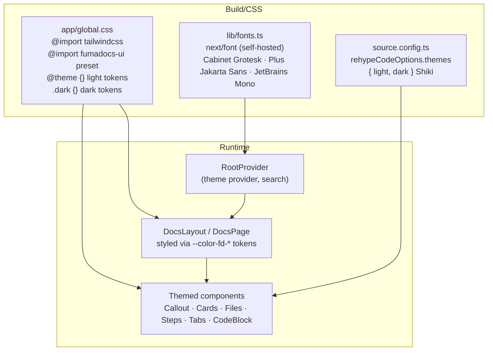
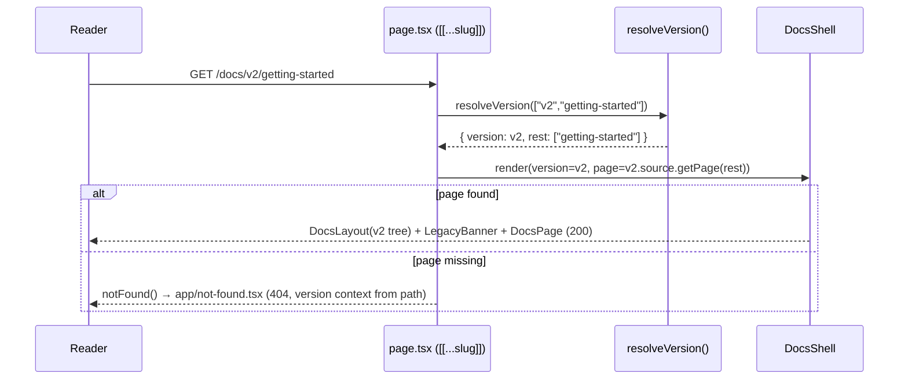

# Design Document — Docs Theming and Versioning

## Overview

This feature records two coordinated changes from the former Fumadocs
implementation under `docs/`. The live `docs.theroyalglow.in` site is hosted by
Mintlify and remains outside both AWS/SST app compute and Cloudflare compute:

1. **Visual restyle** — a custom Fumadocs theme (color tokens, typography,
   spacing/density, component styling, dual-theme code blocks, page affordances)
   that reproduced the polished look and feel of the two reference sites
   (`sunar.js.org/docs`, `expostarter.com/docs`).
2. **Path-based multi-version documentation** — the historical implementation
   kept latest docs at the documentation root and older releases under `/v{N}`
   path prefixes, with a version switcher, legacy banner, version-scoped search,
   navigation, canonical/SEO behavior, and a repeatable release workflow.

Both changes preserve every existing MDX document and URL, keep dark/light mode
and `prefers-reduced-motion` working, and hold the project quality bars
(WCAG 2.1 AA, Lighthouse Accessibility/SEO = 100, Performance ≥ 95).

### Research findings that shape this design

The design is grounded in the live Fumadocs documentation and the current code in
`docs/`. Key findings:

- **Theming model (Fumadocs v15/v16, Tailwind v4 CSS-first).** Theme is set in
  `app/global.css` via `@import 'tailwindcss'`, a preset import
  (`fumadocs-ui/css/<preset>.css`), `fumadocs-ui/css/preset.css`, and a
  `@source` directive scanning the UI package. Colors are overridden by
  redefining `--color-fd-*` tokens inside `@theme {}` (light) and `.dark {}`
  (dark). The full token set is:
  `--color-fd-background`, `-foreground`, `-muted`, `-muted-foreground`,
  `-popover`, `-popover-foreground`, `-card`, `-card-foreground`, `-border`,
  `-primary`, `-primary-foreground`, `-secondary`, `-secondary-foreground`,
  `-accent`, `-accent-foreground`, `-ring`. Layout width is set with
  `--fd-layout-width`. The current code already uses the `neutral` preset.
- **Code blocks.** Shiki light/dark themes are configured via
  `rehypeCodeOptions.themes` in `source.config.ts` `mdxOptions`.
- **Reference-site affordances (observed).** Both reference sites render: a
  `Ctrl K` search trigger, a **Copy Markdown** + **Open** control on each page, a
  **"How is this guide? Good / Bad"** feedback control, and a **"Last updated
  on …"** indicator — exactly the Page_Affordances in Requirement 14.
- **Versioning.** Fumadocs ships no built-in versioned router; it provides
  primitives (`defineDocs` collections, `loader()` with a per-source `baseUrl`,
  multiple page trees, a `sidebar.banner` slot in `DocsLayout`). Official
  guidance distinguishes *partial* versioning (separate content folders on one
  deployment) from *full* versioning (separate branch/subdomain per version).
  Our requirements (single domain, path prefixes, preserve existing URLs) map to
  a **custom multi-source, single-deployment** implementation built from those
  primitives.
- **Exact reference color/font hex values could not be programmatically
  extracted** from the reference sites' compiled CSS in this environment. Per
  **Requirement 1.5**, the palette therefore derives from the documented RGSS
  premium brand tokens (`knowledge-base/design.md`), adapted to the
  `--color-fd-*` contract and to WCAG AA, while the *structural* qualities
  (type scale, spacing density, single-accent minimalism, dual-theme code,
  page affordances) are matched to the reference sites. Every such substitution
  is recorded in the Design_Tokens section.

### Two architecture decisions resolved up front

**Decision A — the documentation root stays at `/docs` (latest is unversioned
there); legacy versions are served under `/docs/v{N}`.**

The requirements contain an apparent tension: Requirement 5 wants the
Latest_Version at the "documentation root … with no version path segment", while
Requirement 4.2 requires every pre-existing documentation URL to resolve with
HTTP 200 **and no redirect**, and Requirement 5.3 requires every previously valid
URL to resolve to the same page. Today the docs are mounted at `/docs`
(`loader({ baseUrl: '/docs' })`) and the bare root `/` is a separate landing
page (`app/(home)/page.tsx`).

Moving the docs to the bare root `/` would break or redirect every existing
`/docs/*` URL, directly violating Requirement 4.2 ("without introducing a
redirect"). Therefore the **documentation root is `/docs`**: the Latest_Version
keeps `baseUrl: '/docs'` unchanged (zero existing URLs change, no redirects), and
the "version path segment" that Requirement 5.1 prohibits for latest is the
`/v{N}` prefix — latest carries none, legacy versions carry `/v2`, `/v3`, … which
resolve to `/docs/v2`, `/docs/v3`. `/v{N}` is the version path prefix required by
Requirement 6.1; mounting it beneath the docs root does not weaken that.
(If the maintainer ever wants bare-root docs, that is a separate migration that
would require redirects and is explicitly out of scope here because 4.2 forbids
redirects.)

**Decision B — each version lives in its own top-level content directory with its
own collection and loader.**

Two folder strategies were evaluated:

| Strategy | Layout | Verdict |
|---|---|---|
| **Separate top-level dirs (chosen)** | `content/docs` (latest), `content/docs-v2`, `content/docs-v3` | Strong isolation: each version is a distinct `defineDocs` collection + `loader`. Editing one cannot affect another (Req 6.5). No glob overlap. |
| Nested version folders | `content/docs/v2`, `content/docs/v3` under the latest dir | Rejected: the latest collection (`dir: 'content/docs'`) would glob the `v2/` subtree as latest pages at `/docs/v2/*`, colliding with the legacy router and coupling MDX recompilation across versions. Weak isolation. |

Separate top-level directories give the cleanest isolation and the simplest
version-cutting workflow (copy the latest dir to `content/docs-v{N}`), satisfying
Requirements 6.5 and 10.4.

## Architecture

### Theming layer



The Theme_System is pure CSS tokens + `next/font` + Shiki config. No component
forks are required: Fumadocs components read `--color-fd-*`, so overriding the
tokens restyles every component (sidebar, TOC, callouts, cards, file trees, code
blocks) consistently (Req 2.5). Dark mode is the `.dark` class toggled by
Fumadocs' `RootProvider` / `next-themes`; reduced motion is enforced with a
global `@media (prefers-reduced-motion: reduce)` rule.

### Versioning routing and content-source model

```mermaid
flowchart TD
  REQ["Request /docs/<...slug>"]
  REG["lib/versions.ts\nVersion registry (single source of truth)\n[ latest /docs, v2 /docs/v2, v3 /docs/v3 ]"]
  RESOLVE["resolveVersion(slug)\nmatch /^v([1-9]\\d*)$/ on slug[0]"]
  REQ --> RESOLVE
  RESOLVE -->|slug[0] is registered vN| LEG["legacy source.getPage(rest)"]
  RESOLVE -->|slug[0] is vN but NOT registered| NF1["notFound() → version-aware 404"]
  RESOLVE -->|no vN prefix| LAT["latest source.getPage(slug)"]
  REG --> RESOLVE
  REG --> SW["VersionSwitcher (sidebar banner)"]
  REG --> SM["app/sitemap.ts (all versions once)"]
  REG --> CAN["generateMetadata canonical"]
  LAT --> SHELL
  LEG --> SHELL
  subgraph SHELL["DocsShell (version-aware)"]
    DLY["DocsLayout tree = version.source.pageTree\nsidebar.banner = VersionSwitcher\nfooter = Page_Affordances"]
    LB["LegacyBanner (only when !isLatest)"]
    PAGE["DocsPage + DocsBody (MDX)"]
  end
```

**Single catch-all route.** Because latest (`/docs/*`) and legacy
(`/docs/v{N}/*`) both live under `/docs`, an optional catch-all
`app/docs/[[...slug]]/page.tsx` is the only docs route. A sibling dynamic
`[version]` segment is impossible (Next.js forbids a slug and an optional
catch-all at the same level), so version dispatch happens in code via
`resolveVersion(slug)`.

**Version-aware shell rendered in the route.** Because an optional catch-all
layout (`app/docs/layout.tsx`) does not receive the slug params, the
version-aware `DocsLayout` (with the correct page tree, version switcher banner,
and legacy banner) is rendered by a shared server component `DocsShell` invoked
from the page. `app/docs/layout.tsx` becomes a thin pass-through. Tradeoff: the
layout re-renders per navigation rather than persisting; acceptable for a docs
site and required by the single-mount/URL-preservation constraint.



### Affected files (map of changes)

| File | Change |
|---|---|
| `docs/source.config.ts` | Add per-version `defineDocs` collections; add `rehypeCodeOptions.themes` (Shiki light/dark); enable `lastModifiedTime: 'git'`. |
| `docs/lib/source.ts` | Export one `loader` per version (latest `baseUrl:'/docs'`, v2 `'/docs/v2'`, …). |
| `docs/lib/versions.ts` *(new)* | Version registry: ordered list + helpers (`resolveVersion`, `equivalentPath`, `getCanonicalUrl`). Single source of truth. |
| `docs/lib/fonts.ts` *(new)* | `next/font` self-hosted font definitions + CSS variable bindings. |
| `docs/lib/layout.shared.tsx` *(new)* | Shared `baseOptions()` for layouts. |
| `docs/app/global.css` | Replace `neutral` preset tokens with RGSS Design_Tokens (`@theme` + `.dark`), font variables, reduced-motion rule, touch-target sizing. |
| `docs/app/layout.tsx` | Apply font variables; keep `RootProvider`; enable search. |
| `docs/app/docs/layout.tsx` | Thin pass-through (`return children`). |
| `docs/app/docs/[[...slug]]/page.tsx` | Version dispatch via `resolveVersion`; render `DocsShell`; version-aware `generateMetadata` (canonical/robots) and `generateStaticParams` across all versions. |
| `docs/components/docs-shell.tsx` *(new)* | Version-aware `DocsLayout` wrapper + `LegacyBanner` + Page_Affordances. |
| `docs/components/version-switcher.tsx` *(new)* | Client dropdown in `sidebar.banner`. |
| `docs/components/legacy-banner.tsx` *(new)* | Legacy notice with link to equivalent latest page. |
| `docs/components/page-affordances.tsx` *(new)* | Last-updated, copy/open markdown, report-issue, feedback. |
| `docs/components/feedback.tsx` *(new)* | "Was this helpful?" client control. |
| `docs/app/api/search/route.ts` *(new)* | Version-tagged Orama search endpoint. |
| `docs/app/sitemap.ts` *(new)* | Enumerate every version's pages once. |
| `docs/app/robots.ts` *(new)* | Allow indexing/following; reference sitemap. |
| `docs/app/not-found.tsx` *(new)* | Themed, version-aware 404. |
| `docs/scripts/cut-version.mjs` *(new)* | Version_Workflow automation (copy latest → `content/docs-v{N}`, register, guard duplicates). |

## Components and Interfaces

### Theme_System

- **Surface:** `app/global.css` token blocks + `lib/fonts.ts`.
- **Light tokens** in `@theme {}`, **dark tokens** in `.dark {}` (see
  Design_Tokens). All Fumadocs components inherit automatically (Req 2.5).
- **Fonts** (Req 1.4, 1.7): self-hosted via `next/font`, exposed as CSS
  variables; no render-blocking third-party requests. Fallback stacks declared on
  each variable.

  | Role | Family | Source | CSS var | Fallback stack |
  |---|---|---|---|---|
  | Headings | Cabinet Grotesk | `next/font/local` (woff2) | `--font-heading` | `'Segoe UI', system-ui, sans-serif` |
  | Body / UI | Plus Jakarta Sans | `next/font/google` (self-hosted by next/font) | `--font-body` | `system-ui, -apple-system, sans-serif` |
  | Code | JetBrains Mono | `next/font/google` | `--font-mono` | `ui-monospace, 'Cascadia Code', monospace` |

- **Code blocks** (Req 2.4): `source.config.ts` →
  `rehypeCodeOptions: { themes: { light: 'github-light', dark: 'github-dark' } }`
  (warm, high-contrast, matches reference density). Both themes selected to pass
  AA on their own surfaces.
- **Theme toggle** (Req 3.1–3.4): provided by `RootProvider` (`next-themes`),
  offering light / dark / system, persisted to `localStorage`, defaulting to
  `prefers-color-scheme` when unset. No code change beyond keeping the provider.
- **Reduced motion** (Req 3.5): global rule —
  `@media (prefers-reduced-motion: reduce) { *,*::before,*::after { animation-duration:.01ms!important; transition-duration:.01ms!important; } }`
  plus an allowance for ≤100ms opacity transitions on state-bearing elements.

### Version_Router

- **Surface:** `lib/versions.ts` + `app/docs/[[...slug]]/page.tsx`.
- **Registry interface:**

  ```ts
  type DocVersion = {
    id: 'latest' | `v${number}`   // 'latest', 'v2', 'v3'
    label: string                 // 'Latest', 'v2', 'v3'
    versionNumber: number | null  // null for latest, else N
    basePath: `/docs${string}`    // '/docs', '/docs/v2'
    source: Source                // fumadocs loader instance
    isLatest: boolean
  }

  const versions: DocVersion[]                       // ordered most-recent-first
  function resolveVersion(slug?: string[]):
    | { version: DocVersion; rest: string[] }        // matched (latest or legacy)
    | { unknownVersion: string }                     // /vN where N not registered
  function equivalentPath(relSlug: string[], to: DocVersion): string
  function getCanonicalUrl(version: DocVersion, relSlug: string[]): string
  ```

- **`resolveVersion` rules** (Req 5, 6, 12.5):
  - If `slug[0]` matches `/^v([1-9]\d*)$/` (positive integer, **no leading
    zeros**, Req 6.1) and that number is a registered legacy version → return that
    version with `rest = slug.slice(1)`.
  - If `slug[0]` matches `/^v([1-9]\d*)$/` but is **not** registered → return
    `{ unknownVersion }` → page calls `notFound()` (Req 6.3).
  - Otherwise (no version prefix) → return the latest version with `rest = slug`
    (Req 5.4, 12.5). A latest path that does not exist → `notFound()`, never
    falls back to a legacy version (Req 5.5).
- **`generateStaticParams`** unions every version's params (latest slugs +
  `['v2', ...slug]` per legacy page), so the static build emits navigable output
  for all present versions (Req 10.5).

### Version_Switcher

- **Surface:** `components/version-switcher.tsx` (client), mounted in
  `DocsLayout` `sidebar.banner`.
- Reads the registry (passed as serializable props) and the active version; reads
  the current relative slug via `usePathname()`.
- Renders a labelled dropdown (`aria-label="Select documentation version"`,
  Req 7.5), keyboard operable (Radix/Fumadocs primitive — focus, open, arrow,
  Enter), listing every version most-recent-first with Latest marked "Latest"
  (Req 7.1, 7.2); the active version is visually marked selected (Req 7.1).
- On select, computes `equivalentPath(relSlug, target)`; if the equivalent page
  exists in the target version → navigate there, else → target landing page
  (Req 7.3, 7.4, 12.6); navigation via `router.push` (client, < 2s).

### Legacy_Banner

- **Surface:** `components/legacy-banner.tsx`, rendered by `DocsShell` only when
  `!version.isLatest` (Req 8.1, 8.5). Persists on every legacy page because it is
  part of the shell (Req 8.4).
- States the viewed version label and that it is not the latest (Req 8.1);
  provides a link to the equivalent latest page, or the latest landing page when
  no equivalent exists (Req 8.2, 8.3), computed with `equivalentPath(relSlug,
  latest)` + an existence check.

### Page_Affordances

- **Surface:** `components/page-affordances.tsx` + `components/feedback.tsx`,
  rendered inside `DocsPage` (footer slot) for every content page.
- **Last updated** (Req 14.1): `page.data.lastModified` from
  `lastModifiedTime: 'git'` (fallback to frontmatter `lastModified`), formatted
  `DD/MM/YYYY` (`en-IN`).
- **Copy / open Markdown** (Req 14.2, 14.3): a control that copies the page's raw
  MDX (served from a co-located `*.mdx` raw route or `page.data.raw`) to the
  clipboard with a visible confirmation, and an "Open" link to the raw source —
  mirrors the reference sites' "Copy Markdown / Open".
- **Report an issue** (Req 14.4): link to the GitHub new-issue / edit URL for the
  page's source path.
- **Feedback** (Req 14.5, 14.6): "Was this page helpful? Good / Bad". On submit,
  shows an inline acknowledgement and does **not** navigate away; posts to an
  endpoint (or no-op analytics event) — submission is fire-and-forget so failure
  never blocks the acknowledgement.
- All affordances are keyboard operable and meet AA contrast/focus (Req 14.7).

### Search_System

- **Surface:** `app/api/search/route.ts` using Fumadocs `createFromSource` over
  **all** version sources, each page indexed with a `tag` equal to its version id
  (Req 11). The client search dialog (enabled in `RootProvider`) passes the active
  version as the `tag` filter, scoping results to the current version (Req 11.2,
  11.5). Results capped at 20, relevance-ordered (Req 11.3); empty → no-results
  message scoped to the current version (Req 11.4); transport error → "search
  temporarily unavailable" with the query preserved (Req 11.6). Search control is
  on every page (Req 11.1) and fully keyboard operable (`Ctrl/Cmd K`, arrows,
  Enter — Req 11.7).
- **Hosting note:** live documentation is hosted by Mintlify and is not deployed with
  either AWS/SST app compute or Cloudflare compute. If this historical Fumadocs
  search implementation is reused elsewhere, precompute the Orama index to static
  JSON when request-time cold starts are a concern.

### Not_Found_Page

- **Surface:** `app/not-found.tsx` (server) + a small client child reading
  `usePathname()`.
- Triggered by `notFound()` from the catch-all (returns HTTP 404, Req 15.5).
- Styled with Design_Tokens (Req 15.1); links to the latest docs root `/docs`
  (Req 15.2); exposes the search control (Req 15.3); when the path carries a
  `/v{N}` segment, indicates the version context the missing page was requested
  under, distinguishing "version not found" (N not in registry) from "page not
  found in v{N}" (N registered) (Req 15.4); conforms to AA (Req 15.5).

### Responsive / mobile behavior (Req 13)

Fumadocs `DocsLayout` already provides: no horizontal overflow 320–1920px
(Req 13.1); sidebar collapses to a toggle below the mobile breakpoint
(Req 13.2, 13.3); the search trigger remains in the mobile navbar (Req 13.4); the
TOC collapses/relocates on small viewports (Req 13.6). This design adds: the
Version_Switcher is placed so it remains reachable in the mobile navbar/sidebar
toggle (Req 13.4), and all interactive nav/switcher/search controls are sized to
a minimum 24×24px touch target via a token (`--fd-touch-min: 24px`) applied in
`global.css` (Req 13.5).

## Data Models

### Version registry entry

```ts
type DocVersion = {
  id: 'latest' | `v${number}`
  label: string
  versionNumber: number | null      // null ⇒ latest
  basePath: `/docs${'' | `/v${number}`}`
  isLatest: boolean
  source: ReturnType<typeof loader>  // fumadocs source for this version
}
```

The ordered `versions` array (most-recent-first) is the **single source of
truth** consumed by the router, switcher, legacy banner, canonical metadata, and
sitemap (Req 7.2, 10.2).

### Content layout on disk (Req 10.4, 6.5)

```
docs/content/
  docs/         ← Latest_Version (unchanged; baseUrl /docs)
    index.mdx, getting-started.mdx, …, meta.json
    product/  features/  system-design/  api-reference/
  docs-v2/      ← Legacy v2 (baseUrl /docs/v2)  [created on cut]
  docs-v3/      ← Legacy v3 (baseUrl /docs/v3)  [created on cut]
```

Each directory is an independent `defineDocs` collection; no directory references
another. Version metadata (label, number) lives in `lib/versions.ts`, co-located
conceptually with the content directory it describes.

### Content source configuration

```ts
// source.config.ts
export const docs   = defineDocs({ dir: 'content/docs' })
export const docsV2 = defineDocs({ dir: 'content/docs-v2' })
// + rehypeCodeOptions.themes, lastModifiedTime: 'git'

// lib/source.ts
export const latestSource = loader({ baseUrl: '/docs',    source: docs.toFumadocsSource() })
export const v2Source     = loader({ baseUrl: '/docs/v2', source: docsV2.toFumadocsSource() })
```

### Per-page MDX metadata (frontmatter)

Unchanged from today (`title`, `description`, optional `full`), plus optional
`lastModified` as a git-fallback. No frontmatter changes are required of existing
documents (Req 4.1).

### Canonical / SEO data (derived, Req 9)

For a rendered page the metadata layer derives:
`canonical` (latest self-canonical; legacy → equivalent latest URL, else legacy
self), `robots: { index: true, follow: true }` for all versions, and an absolute
`url`. The sitemap derives one entry per page per version.

### Design_Tokens (color, typography, spacing) and recorded substitutions

> **Substitution record (Requirement 1.5).** Exact color/font hex values could
> not be programmatically extracted from the reference sites' compiled CSS in
> this environment. The color palette below therefore derives from the documented
> RGSS premium brand tokens (`knowledge-base/design.md`), adapted to the
> `--color-fd-*` contract and to WCAG AA. The reference sites' single-accent
> minimal surfaces, type scale, spacing density, dual-theme code blocks, and page
> affordances **are** matched. The accent hue is intentionally RGSS gold rather
> than the reference sites' accent (sunar ≈ violet, expostarter ≈ near-grayscale),
> because matching a foreign brand accent would conflict with RGSS identity — this
> is the recorded substitution.

**Color tokens** (HSL written as Fumadocs expects; approximate hex and the
text-on-background contrast intent in parentheses). Light values go in `@theme {}`,
dark values in `.dark {}`.

| Token | Light (≈hex) | Dark (≈hex) | Notes |
|---|---|---|---|
| `--color-fd-background` | `hsl(40 44% 98%)` (#FDFBF6) | `hsl(24 30% 7%)` (#170F0A) | warm canvas / cocoa near-black |
| `--color-fd-foreground` | `hsl(24 40% 10%)` (#241710) | `hsl(40 40% 92%)` (#F2E8D6) | body text — ≈15–16:1 on bg (AAA) |
| `--color-fd-muted-foreground` | `hsl(28 12% 33%)` (#5C5147) | `hsl(36 18% 70%)` (#C2B4A0) | secondary text — ≈7:1 / ≈8.8:1 (AA pass) |
| `--color-fd-muted` | `hsl(40 30% 95%)` | `hsl(24 22% 12%)` | muted surface |
| `--color-fd-card` | `hsl(40 40% 99%)` | `hsl(24 25% 10%)` | card surface |
| `--color-fd-card-foreground` | = foreground | = foreground | |
| `--color-fd-popover` | `hsl(40 40% 99%)` | `hsl(24 25% 9%)` | |
| `--color-fd-popover-foreground` | = foreground | = foreground | |
| `--color-fd-border` | `hsl(30 20% 50% / 0.25)` | `hsl(40 30% 70% / 0.15)` | hairline borders |
| `--color-fd-primary` | `hsl(40 75% 28%)` (#7D5C12) | `hsl(42 80% 65%)` (#E8C266) | links/accents — deep bronze ≈6.8:1 (light), bright gold ≈10.5:1 (dark) on bg |
| `--color-fd-primary-foreground` | `hsl(40 44% 98%)` | `hsl(24 30% 7%)` | text on primary fill |
| `--color-fd-secondary` | `hsl(40 30% 93%)` | `hsl(24 20% 13%)` | |
| `--color-fd-secondary-foreground` | = foreground | = foreground | |
| `--color-fd-accent` | `hsl(40 60% 50% / 0.12)` | `hsl(42 80% 60% / 0.18)` | hover surface |
| `--color-fd-accent-foreground` | = primary (light) | = primary (dark) | |
| `--color-fd-ring` | `hsl(40 75% 38%)` | `hsl(42 80% 60%)` | focus ring — 2px, 2px offset |

All text/background pairings above are designed to clear **4.5:1 normal / 3:1
large** in both modes (Req 1.1, 3.6); the exact ratios are re-verified by the
automated accessibility checks in the Testing Strategy. The brand rule "never
gold text on white for body" is honored by using the **deep-bronze** primary for
text/link contexts in light mode (not the bright royal-gold, which is reserved
for fills with dark text in bespoke components such as the landing hero CTA).

**Typography scale** (matched to reference density; `clamp()` for fluid headings):

| Element | Family (var) | Size | Weight | Line height |
|---|---|---|---|---|
| H1 | `--font-heading` | `clamp(1.9rem, 1.4rem + 2.2vw, 2.6rem)` | 800 | 1.1 |
| H2 | `--font-heading` | `clamp(1.5rem, 1.2rem + 1.2vw, 1.85rem)` | 700 | 1.2 |
| H3 | `--font-heading` | `1.25rem` | 700 | 1.3 |
| H4 | `--font-heading` | `1.05rem` | 600 | 1.35 |
| Body | `--font-body` | `0.975rem` (≈15.6px) | 400 | 1.7 |
| Small / meta | `--font-body` | `0.825rem` | 500 | 1.5 |
| Inline / block code | `--font-mono` | `0.9em` | 400 | 1.6 |

**Spacing / density / radius / layout:**

| Token | Value | Usage |
|---|---|---|
| `--fd-layout-width` | `90rem` (1440px) | docs content max width |
| Content rhythm | `1.5rem` block gap, `4rem` section gap | reading density |
| `--radius` (cards/code/callouts) | `0.625rem` (10px) | matches reference rounded surfaces |
| Pill radius | `9999px` | switcher, badges |
| `--fd-touch-min` | `24px` | minimum touch target (Req 13.5) |
| Focus ring | `2px solid var(--color-fd-ring)`, `2px` offset | all interactive elements |

**Code-block themes (Shiki, Req 2.4):** light `github-light`, dark `github-dark`,
set in `source.config.ts` `rehypeCodeOptions.themes`.

## Correctness Properties

*A property is a characteristic or behavior that should hold true across all
valid executions of a system — essentially, a formal statement about what the
system should do. Properties serve as the bridge between human-readable
specifications and machine-verifiable correctness guarantees.*

These property-based tests cover this feature's **pure logic layer** — the
version registry, path/version resolution, cross-version equivalence, canonical
and robots derivation, sitemap generation, search scoping, and the contrast of
the defined Design_Tokens. The theming, component rendering, responsiveness, and
per-page UI interactions are validated by example/integration tests (Lighthouse,
axe, e2e) as described in the Testing Strategy, not by PBT.

The following properties were consolidated during prework reflection to remove
redundancy.

### Property 1: Token contrast meets WCAG AA

*For any* defined text-on-background token pairing in both the light and dark
Design_Token sets, the computed WCAG contrast ratio is at least 4.5:1 for normal
text and at least 3:1 for large text.

**Validates: Requirements 1.1, 3.6**

### Property 2: Sidebar tree mirrors the content directory

*For any* generated content directory, the page tree produced by that version's
loader contains exactly the leaf slugs corresponding to its MDX files (excluding
meta files) and preserves their folder nesting — no extra and no missing entries.

**Validates: Requirements 2.1**

### Property 3: Every existing document resolves and renders

*For any* slug derived from an existing file under `content/docs`, the latest
source's `getPage(slug)` returns a defined, renderable page (and the build emits
it without error).

**Validates: Requirements 4.1**

### Property 4: Pre-existing URLs are preserved

*For any* documentation path that was valid before versioning was introduced,
`resolveVersion(slug)` returns the latest version with `rest` strictly equal to
the original slug and a resolvable page, introducing no redirect — i.e. the URL
maps to the same page it mapped to before.

**Validates: Requirements 4.2, 5.3**

### Property 5: Unversioned paths always resolve to latest

*For any* slug whose first segment is not a registered `/v{N}` prefix (including
slugs that match no page), `resolveVersion(slug)` returns the Latest_Version and
never a Legacy_Version.

**Validates: Requirements 5.1, 5.4, 5.5, 12.5**

### Property 6: Version-prefix grammar

*For any* string `s`, `s` is treated as a version prefix yielding integer `N` if
and only if `s` matches `^v([1-9]\d*)$` (a positive integer with no leading
zeros); strings such as `v0`, `v01`, `v1.2`, `V2`, or `vx` are never treated as
version prefixes.

**Validates: Requirements 6.1**

### Property 7: Registered legacy paths resolve to their version

*For any* registered Legacy_Version and any slug of one of its pages,
`resolveVersion(['v{N}', ...rest])` returns that version with `rest` equal to the
remaining slug, and that version's `getPage(rest)` resolves.

**Validates: Requirements 6.2**

### Property 8: Unregistered version prefixes are unknown

*For any* positive integer `N` not present in the registry,
`resolveVersion(['v{N}', ...])` returns an `unknownVersion` result (causing the
caller to respond 404), and never serves any other version's content.

**Validates: Requirements 6.3**

### Property 9: Versions are isolated

*For any* two distinct versions A and B, the set of slugs resolvable in A is
independent of B's content source — a change applied to B's content produces no
change in the pages A resolves or serves.

**Validates: Requirements 6.5, 10.4**

### Property 10: Version switcher ordering and completeness

*For any* version registry, the switcher's options are exactly all registered
versions ordered most-recent-first (descending version number with Latest first),
with the Latest_Version carrying the latest label.

**Validates: Requirements 7.2**

### Property 11: Cross-version equivalent target

*For any* current page (relative slug) and any target version, the navigation
target is the page at the same relative slug in the target version when such a
page exists, and otherwise the target version's landing page. Furthermore, for
any page that exists in both versions, mapping the relative slug from A to B and
back to A yields the original relative slug (round-trip invariance).

**Validates: Requirements 7.3, 7.4, 8.2, 8.3, 12.6**

### Property 12: Legacy banner visibility

*For any* version and page, the Legacy_Banner is displayed if and only if the
version is not the Latest_Version, and when displayed it carries that version's
label.

**Validates: Requirements 8.1, 8.5**

### Property 13: Canonical URL derivation

*For any* version and page, `getCanonicalUrl` returns exactly one absolute
(`https`) URL, where: a Latest_Version page is self-canonical; a Legacy_Version
page that has an equivalent Latest_Version page (same relative slug) canonicalizes
to that latest URL; and a Legacy_Version page with no equivalent is
self-canonical.

**Validates: Requirements 9.1, 9.2, 9.3, 9.4**

### Property 14: Sitemap coverage is exact and duplicate-free

*For any* registry and content sources, the generated sitemap URL set contains no
duplicates and equals exactly the union of every published page across all
versions, with every entry an absolute URL.

**Validates: Requirements 9.5**

### Property 15: Robots directive is index+follow for every page

*For any* version and page, the emitted robots directive is
`{ index: true, follow: true }`, independent of version.

**Validates: Requirements 9.6, 9.7**

### Property 16: Cutting a version is additive and preserves existing versions

*For any* registry, applying the version cut for an integer `N` not already
present yields a registry in which `v{N}` exists and every pre-existing version's
resolvable page set is unchanged.

**Validates: Requirements 10.3**

### Property 17: Cutting an existing version is rejected without side effects

*For any* registry and any integer `N` already present, the version cut halts with
an error that identifies the conflicting `/v{N}` prefix and leaves the registry
and all existing versions unchanged.

**Validates: Requirements 10.6**

### Property 18: Search results are version-scoped and capped

*For any* indexed corpus, active version, and query, every returned search result
belongs to the active version and the number of returned results is at most 20.

**Validates: Requirements 11.2, 11.3**

### Property 19: Sidebar is scoped to the active version

*For any* active version, the page tree passed to the layout contains only that
version's slugs and excludes every other version's slugs.

**Validates: Requirements 12.1**

### Property 20: Internal links stay within the active version

*For any* active version and any internal documentation target slug, the resolved
href lies under that version's `basePath`, so following it cannot switch the
reader to a different version.

**Validates: Requirements 12.2**

### Property 21: Not-found version context classification

*For any* requested path, the Not_Found_Page version context is: latest context
when the path has no `/v{N}` segment; "page not found in v{N}" when `N` is a
registered version; and "version not found" when `N` is not registered.

**Validates: Requirements 15.4**

## Error Handling

| Condition | Handling | Requirement |
|---|---|---|
| Unversioned path with no matching page | `getPage` returns undefined → `notFound()` → themed 404; never falls back to legacy | 5.5, 15.1 |
| `/v{N}` where N not registered | `resolveVersion` → `unknownVersion` → `notFound()`; 404 page shows "version not found" | 6.3, 15.4 |
| `/v{N}` registered but page missing | `getPage` undefined → `notFound()`; 404 page shows "page not found in v{N}" | 6.4, 15.4 |
| Existing MDX fails to compile | Fumadocs MDX build fails with the offending file path; CI build gate blocks deploy | 4.3 |
| Theme web font fails to load | `font-display: swap` + declared fallback stack render text immediately; no blocking | 1.7 |
| Code-block clipboard copy fails | Catch the rejection; show a visible "copy failed" indication; leave code unchanged | 2.7 |
| Copy-Markdown clipboard fails | Same pattern: visible failure indication, no navigation | 14.3 |
| Feedback submission fails | Fire-and-forget; the acknowledgement still shows and the reader is not navigated away | 14.6 |
| Search backend unavailable / errors | Search UI shows "search temporarily unavailable" and preserves the entered query | 11.6 |
| Duplicate version cut | `cut-version` script throws a conflict error identifying `/v{N}`; no files written, registry untouched | 10.6 |
| Reduced-motion users | Global media query neutralizes decorative animation regardless of component | 3.5 |

Network-exposed surface: the only new endpoint is `GET /api/search`. It is
read-only over public documentation content, returns version-scoped results, and
requires no authentication because all documentation is public; it must be rate-
limited at the edge and must not echo back anything other than indexed public
content.

## Testing Strategy

A dual approach: **property tests** for the pure logic layer and **example /
integration tests** for configuration, rendering, accessibility, and end-to-end
behavior.

### Property-based tests

- **Library:** `fast-check` with Vitest (the project's unit test runner). Do not
  hand-roll generators framework code.
- **Iterations:** each property test runs a **minimum of 100 iterations**.
- **Tag:** each test references its design property with a comment in the format
  **`Feature: docs-theming-and-versioning, Property {number}: {property text}`**.
- **One property → one property test.** Properties 1–21 above each map to a single
  `fast-check` property over generated inputs:
  - Generators: random slug arrays (with/without `/v{N}` prefixes, leading-zero
    and non-numeric variants for Property 6), random version registries
    (Properties 9, 10, 16, 17), random content corpora and queries
    (Properties 2, 3, 14, 18), random relative slugs and version pairs
    (Properties 11, 13, 21), and the static Design_Token table (Property 1).
  - The pure functions under test (`resolveVersion`, `parseVersionPrefix`,
    `equivalentPath`, `getCanonicalUrl`, `buildSitemap`, `scopeSearchResults`,
    `cutVersion`, `contrastRatio`) live in `lib/` and are imported directly, so
    no rendering or I/O is needed.

### Example / unit tests

- TOC present/absent for pages with and without h2–h4 (Req 2.2, 2.3).
- Theme toggle states, persistence, and system-default fallback (Req 3.1–3.4).
- Code-block copy success/failure and Copy-Markdown behaviors (Req 2.6, 2.7, 14.3).
- Feedback control acknowledgement without navigation (Req 14.6).
- Switcher selected-state and accessible label (Req 7.1, 7.5).
- Not-found page renders themed content, latest link, and search (Req 15.1–15.3).

### Integration / build tests

- **Build-with-multiple-versions:** a fixture adds a `content/docs-v2`; the build
  must succeed and emit navigable output for both versions (Req 10.5).
- **URL-preservation check:** crawl the pre-restyle list of `/docs/*` paths and
  assert each returns HTTP 200 with no redirect after the changes (Req 4.2).
- **Self-hosted fonts:** assert no third-party font-origin requests on first load
  (Req 1.4).
- **Search latency/scope smoke:** representative queries return version-scoped
  results under 2s (Req 11.2).

### Accessibility & performance gates (CI)

- **axe** automated checks: zero violations on the landing page and one content
  page per top-level section, light and dark (Req 4.6, WCAG 2.1 AA).
- **Lighthouse CI** (reuses `.github/lighthouse/lighthouserc.json`): Accessibility
  = 100, SEO = 100, Performance ≥ 95 on the landing page and one page per section
  (Req 4.4, 4.5).
- Keyboard-only e2e pass over search and version switcher (Req 7.5, 11.7, 14.7).

## Version_Workflow (cutting a new `/v{N}`)

Documented, repeatable steps (automated by `docs/scripts/cut-version.mjs`),
satisfying Requirement 10:

1. **Guard.** The script reads `lib/versions.ts`. If `v{N}` already exists, it
   **halts** and prints the conflicting prefix; nothing is changed (Req 10.6).
2. **Promote content.** Copy the current latest directory `content/docs` to
   `content/docs-v{N}` (an isolated, independent copy) (Req 10.1, 10.4, 6.5).
3. **Register the collection + loader.** Add a `defineDocs({ dir:
   'content/docs-v{N}' })` collection in `source.config.ts` and a
   `loader({ baseUrl: '/docs/v{N}', source })` in `lib/source.ts`.
4. **Register in the registry.** Prepend/insert the new `DocVersion` entry in the
   ordered `versions` array in `lib/versions.ts`; the switcher, sitemap,
   canonical, and router pick it up automatically because the registry is the
   single source of truth (Req 10.2, 7.2).
5. **Verify.** Run the build; confirm the new version and every pre-existing
   version remain navigable and unchanged (Req 10.3, 10.5).

Because each version is an isolated directory + loader, cutting `v{N}` never
alters any existing version's served pages (Req 10.3).

## Requirements Traceability

| Req | Satisfied by (design element) |
|---|---|
| 1.1, 3.6 | Design_Tokens table + Property 1 (contrast) |
| 1.2, 1.3 | Design_Tokens typography/spacing; `@theme` tokens |
| 1.4, 1.7 | `lib/fonts.ts` self-hosted `next/font` + fallback stacks |
| 1.5 | Recorded substitution note in Design_Tokens |
| 1.6, 3.1–3.4 | `RootProvider` theme toggle + `--color-fd-*` token sets |
| 2.1 | Loader-generated page tree (Property 2) |
| 2.2, 2.3 | `DocsPage` TOC from `page.data.toc` |
| 2.4 | `rehypeCodeOptions.themes` (Shiki light/dark) |
| 2.5 | Token-only component styling (no out-of-token values) |
| 2.6, 2.7 | Code-block copy control + failure handling |
| 2.8 | Token-styled landing feature cards |
| 3.5 | Global `prefers-reduced-motion` rule |
| 4.1 | Property 3 + build gate over all existing MDX |
| 4.2, 5.3 | `baseUrl:'/docs'` unchanged + Property 4 (URL preservation) |
| 4.3 | Fumadocs MDX build failure with file path |
| 4.4, 4.5, 4.6 | Lighthouse CI + axe gates |
| 5.1, 5.4, 5.5, 12.5 | `resolveVersion` + Property 5 |
| 5.2 | Empty-slug → latest landing |
| 6.1 | `parseVersionPrefix` grammar + Property 6 |
| 6.2 | Legacy resolution + Property 7 |
| 6.3 | `unknownVersion` → 404 + Property 8 |
| 6.4 | Missing legacy page → `notFound()` |
| 6.5, 10.4 | Separate top-level dirs/loaders + Property 9 |
| 7.1, 7.5 | `VersionSwitcher` selected-state, aria-label, keyboard |
| 7.2 | Registry ordering + Property 10 |
| 7.3, 7.4, 8.2, 8.3, 12.6 | `equivalentPath` + Property 11 |
| 8.1, 8.5 | `LegacyBanner` visibility + Property 12 |
| 8.4 | Banner part of `DocsShell` (persists) |
| 9.1–9.4 | `getCanonicalUrl` + Property 13 |
| 9.5 | `app/sitemap.ts` + Property 14 |
| 9.6, 9.7 | Robots directive + Property 15 |
| 10.1, 10.2 | Version_Workflow steps + `cut-version.mjs` |
| 10.3 | Additive cut + Property 16 |
| 10.5 | Build-with-multiple-versions integration test |
| 10.6 | Cut guard + Property 17 |
| 11.1 | Search control in `RootProvider` on every page |
| 11.2, 11.3 | Version-tagged Orama search + Property 18 |
| 11.4, 11.6 | No-results / error states |
| 11.5 | Result navigation within version |
| 11.7 | Keyboard-operable search |
| 12.1 | Version-scoped page tree + Property 19 |
| 12.2 | Version-prefixed internal links + Property 20 |
| 12.3 | Missing internal target → `notFound()` in-version |
| 12.4 | `DocsLayout` active-item marking |
| 13.1–13.6 | Fumadocs responsive layout + `--fd-touch-min` token |
| 14.1 | `lastModifiedTime: 'git'` last-updated indicator |
| 14.2–14.4 | `PageAffordances` copy/open Markdown + report-issue |
| 14.5, 14.6 | `Feedback` control + acknowledgement |
| 14.7 | Keyboard + AA on affordances |
| 15.1–15.3, 15.5 | `app/not-found.tsx` themed 404 + status |
| 15.4 | Path-based version context + Property 21 |
