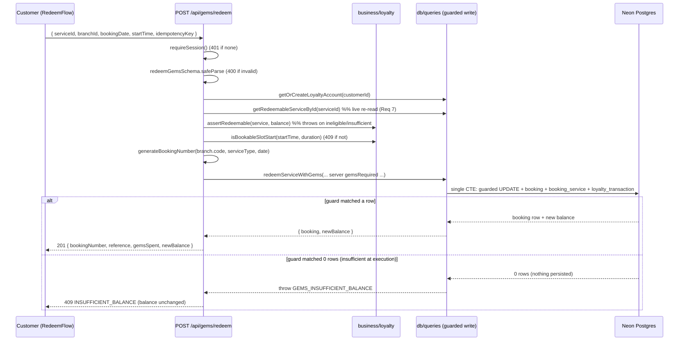

# Design Document — Gems Redemption

## Overview

This feature turns the read-only `/gems` catalogue into a working **online gems
redemption** flow on `apps/web`. The resolved product decision is:

> A successful redemption creates a **real ₹0 booking** with a chosen date + time
> slot (mirroring the normal booking flow), paid entirely in gems, that **earns
> zero gems** and **can never combine with a monetary offer**.

So redemption reuses the existing booking primitives — date/slot selection,
`/api/availability`, slot validation (`isBookableSlotStart`), booking-number
generation, and the `booking` + `booking_service` snapshot model — but for
**exactly one** redeemable service, priced **0 paise**, paid with gems.

This resolves the requirements' open considerations:

| Open consideration (Req) | Resolution |
| --- | --- |
| 9.4 Redemption output form | A ₹0 `booking` (option a), marked `is_gems_redemption = true`. |
| 9.5 Date/slot timing | Chosen **at redemption time** (customer picks date + slot before confirming). |
| 6.2 Idempotency mechanism | **Client-supplied idempotency key** persisted on `booking.redemption_key`, enforced by a partial unique index. |
| 4 (Atomic write strategy) | A **single data-modifying-CTE statement** with a guarded conditional balance UPDATE (since neon-http `db.batch()` cannot conditionally abort). |

The design honours the project's layered architecture: a thin API route on
`apps/web/app/api/gems/*` orchestrates Zod validation → pure business helpers
(`packages/business/loyalty`) → a guarded data-access write
(`packages/db/queries`). Money stays in integer paise, gems stay whole integers,
and every response uses the standard success/error envelope.

### Goals

- Customer can browse the gems catalogue with a per-service affordability flag.
- Customer can redeem exactly one redeemable service, picking a date + slot.
- Redemption is all-or-nothing, atomic, race-safe, idempotent, and re-validated
  server-side against live catalogue data.
- The resulting ₹0 booking earns zero gems and is flagged so it never stacks with
  an offer.

### Non-Goals (per requirements "Out of Scope")

- Admin/receptionist-initiated redemption (`apps/admin`).
- Gems earning (already implemented, unchanged).
- Expiry-ordering interplay (deducts from the single integer balance).
- Money/gems split. Redemption at normal checkout.

---

## Architecture

### Layered flow

```
Presentation        apps/web/(customer)/gems/page.tsx  (server: balance + catalogue)
                    apps/web/components/gems/RedeemFlow.tsx  ('use client': pick → date/slot → confirm)
                          │  fetch
                          ▼
API (thin)          GET  /api/gems          → balance + catalogue (affordability)
                    POST /api/gems/redeem    → requireSession → Zod → re-validate → redeem
                          │  calls
                          ▼
Business (pure)     assertRedeemable(service, balance)         → throws AppError
                    computeAffordability(balance, services)    → affordability flags
                    isBookableSlotStart / addMinutesToTime / generateBookingNumber (reused)
                          │  parameters only
                          ▼
Data Access         redeemServiceWithGems(...)  → single guarded atomic CTE write
                    getRedeemableServices / getRedeemableServiceById / getDefaultStaffForService
                    getOrCreateLoyaltyAccount / getLoyaltySummary  (reused)
```

API routes never run Drizzle queries directly (steering: thin API). Business
helpers are pure (no I/O). The guarded write lives entirely in the data-access
layer.

### Redemption sequence



### Atomic write strategy (Req 4 + Req 5) — the core decision

**Constraint:** neon-http has no interactive transactions; `db.transaction()`
throws. The existing code uses `db.batch([...])`, which runs all statements in one
implicit transaction **but cannot conditionally abort** — every statement in the
batch always executes. A guarded balance update placed in a `db.batch` would not
stop the sibling `INSERT`s from persisting when the balance is insufficient, so a
plain `db.batch` cannot satisfy Req 5.2 ("leave balance unchanged AND persist
nothing").

**Chosen strategy — a single data-modifying-CTE statement** executed via Drizzle's
parameterized `sql` template (`db.execute(sql\`...\`)`). All ids are pre-generated
with `nanoid()` in the query function. The statement is:

```sql
WITH guard AS (
  UPDATE loyalty_account
     SET gems_balance        = gems_balance - {gemsRequired},
         total_gems_redeemed = total_gems_redeemed + {gemsRequired},
         updated_at          = now()
   WHERE id = {accountId}
     AND gems_balance >= {gemsRequired}        -- the guard
  RETURNING id, gems_balance AS new_balance
),
new_booking AS (
  INSERT INTO booking
    (id, booking_number, branch_id, customer_id, status, service_type,
     booking_date, start_time, end_time, total_amount_paise,
     total_duration_minutes, is_walkin, is_gems_redemption, gems_redeemed,
     redemption_key)
  SELECT {bookingId}, {bookingNumber}, {branchId}, {customerId}, 'pending',
         {serviceType}, {bookingDate}, {startTime}, {endTime}, 0,
         {durationMinutes}, false, true, {gemsRequired}, {idempotencyKey}
  FROM guard                                   -- only when guard matched a row
  RETURNING id, booking_number
),
new_booking_service AS (
  INSERT INTO booking_service
    (id, booking_id, service_id, staff_id, service_name_snapshot,
     price_at_booking_paise, duration_minutes, display_order)
  SELECT {bookingServiceId}, nb.id, {serviceId}, {staffId}, {serviceName},
         0, {durationMinutes}, 0
  FROM new_booking nb
  RETURNING id
)
INSERT INTO loyalty_transaction
  (id, loyalty_account_id, type, gems_amount, booking_id, description)
SELECT {txId}, {accountId}, 'redeemed', {gemsRequired}, nb.id, {description}
FROM new_booking nb
RETURNING id;
```

Why this is correct:

- **Single statement = single implicit transaction.** All four writes commit
  together or not at all → satisfies Req 4.4 strictly (no compensation window).
- **The guard gates everything.** Every downstream `INSERT … SELECT … FROM guard`
  (transitively from `new_booking`) inserts **zero rows** when the guarded UPDATE
  matched zero rows. So on insufficient balance: balance unchanged, no booking, no
  booking_service, no transaction → satisfies Req 5.2 and Req 3.2.
- **Race-safe / double-spend-safe (Req 5.3, 5.4).** The `UPDATE … WHERE
  gems_balance >= req` takes a row-level lock and re-reads the balance inside the
  write (Req 5.1). Two concurrent redemptions serialise on that row; the second
  sees the already-decremented balance and its guard fails if the remaining
  balance is short. The sum of accepted deductions can never exceed the starting
  balance, and `gems_balance` can never go negative (the guard forbids it).
- **Idempotent (Req 6).** `redemption_key` carries a partial unique index. A
  retried submission with the same key hits a unique-constraint violation, which
  rolls back the whole statement (no second deduction); the route catches it and
  returns the already-created booking.

The query function inspects whether the final `RETURNING` produced a row:

- **1 row** → success; read the new balance from the `guard` CTE (returned via a
  combined projection) and return `{ booking, newBalance, gemsSpent }`.
- **0 rows** → throw `GEMS_INSUFFICIENT_BALANCE` (the route maps to 409). Nothing
  persisted.

> This is parameterized SQL via Drizzle's `sql` tag (bound parameters, **not**
> string concatenation), which complies with the data-access standard. It is the
> one place a raw `sql` statement is justified, because Drizzle's query builder /
> `db.batch` cannot express a conditional multi-table atomic write on neon-http.

---

## Components and Interfaces

### 1. Types — `packages/types/src/loyalty.ts` (new)

```ts
import { z } from 'zod'

// POST /api/gems/redeem body. Mirrors createBookingSchema's date/time formats.
export const redeemGemsSchema = z.object({
  serviceId: z.string().min(1),
  branchId: z.string().min(1),
  bookingDate: z.string().regex(/^\d{4}-\d{2}-\d{2}$/),
  startTime: z.string().regex(/^\d{2}:\d{2}$/),
  // Client-supplied idempotency key (e.g. crypto.randomUUID()). De-dupes
  // double-clicks / retries. Bounded length; opaque to the server.
  idempotencyKey: z.string().min(8).max(64),
})
export type RedeemGemsInput = z.infer<typeof redeemGemsSchema>
```

Exported from `packages/types/src/index.ts` alongside the booking schemas.

### 2. Business (pure) — `packages/business/src/loyalty/redeem.ts` (new)

```ts
// Inputs are pre-validated; functions are pure and throw AppError on rule breaks.

export type RedeemableServiceView = {
  id: string
  name: string
  gemsRequired: number | null
  pricePaise: number
}

// Req 2: per-service affordability under the all-or-nothing rule.
export function computeAffordability<T extends { gemsRequired: number | null }>(
  balance: number,
  services: T[],
): (T & { affordable: boolean })[] {
  return services.map((s) => ({
    ...s,
    affordable: s.gemsRequired != null && s.gemsRequired > 0 && balance >= s.gemsRequired,
  }))
}

export type AssertableService = {
  isActive: boolean
  gemsRedeemable: boolean
  gemsRequired: number | null
}

// Req 3 + Req 7: throws GEMS_SERVICE_NOT_REDEEMABLE for ineligible services
// (inactive / not redeemable / null gemsRequired) and GEMS_INSUFFICIENT_BALANCE
// when balance < gemsRequired. Returns the validated integer cost on success.
export function assertRedeemable(service: AssertableService, balance: number): number {
  if (!service.isActive || !service.gemsRedeemable || service.gemsRequired == null
      || service.gemsRequired <= 0) {
    throw new AppError({ code: ERROR_CODES.GEMS_SERVICE_NOT_REDEEMABLE,
      message: 'This service cannot be redeemed with gems.', statusCode: 400 })
  }
  if (balance < service.gemsRequired) {
    throw new AppError({ code: ERROR_CODES.GEMS_INSUFFICIENT_BALANCE,
      message: 'You do not have enough gems to redeem this service.', statusCode: 409 })
  }
  return service.gemsRequired
}
```

Reused pure helpers (unchanged): `isBookableSlotStart`, `addMinutesToTime`,
`generateBookingNumber`.

### 3. Data access — `packages/db/src/queries/redemptions.ts` (new)

```ts
// Live re-read of a single service joined to its category for serviceType,
// including the gem fields + isActive used for execution-time re-validation (Req 7).
export async function getRedeemableServiceById(serviceId: string): Promise<{
  id: string; name: string; serviceType: 'salon' | 'spa'; durationMinutes: number
  pricePaise: number; isActive: boolean; gemsRedeemable: boolean; gemsRequired: number | null
} | null>

// The guarded atomic write described in "Atomic write strategy".
// Returns the created booking + new balance, or throws GEMS_INSUFFICIENT_BALANCE
// (0-row guard) / re-maps a redemption_key unique violation for the caller.
export async function redeemServiceWithGems(input: {
  accountId: string
  customerId: string
  branchId: string
  bookingNumber: string
  serviceType: 'salon' | 'spa'
  bookingDate: Date
  startTime: string
  endTime: string
  durationMinutes: number
  gemsRequired: number          // server-side amount (Req 7.3)
  serviceId: string
  serviceName: string           // snapshot
  staffId: string
  idempotencyKey: string
  description: string
}): Promise<{
  bookingId: string; bookingNumber: string; gemsSpent: number; newBalance: number
} | { duplicate: true; bookingId: string; bookingNumber: string }>
```

Reused (unchanged): `getRedeemableServices`, `getDefaultStaffForService`,
`getOrCreateLoyaltyAccount`, `getLoyaltySummary`, `getBranchById`.

### 4. API routes — `apps/web/src/app/api/gems/`

**`GET /api/gems/route.ts`** — balance + catalogue with affordability.

- `requireSession()` → 401 if unauthenticated (Req 1.6 / 8.3).
- `getOrCreateLoyaltyAccount` + `getLoyaltySummary` → balance (0 if none, Req 11.3).
- `getRedeemableServices()` (already filters `gemsRedeemable && isActive`, orders
  by `gemsCatalogueOrder` nulls last, and only returns non-null `gemsRequired`
  rows are still possible — the route drops `gemsRequired == null` per Req 1.3).
- `computeAffordability(balance, services)` → response.
- Envelope: `apiSuccess({ balance, totalEarned, totalRedeemed, catalogue })`.

**`POST /api/gems/redeem/route.ts`** — execute a redemption.

```
requireSession()                                  // 401 (Req 8.3)
redeemGemsSchema.safeParse(body)                  // 400 VALIDATION_ERROR (Req 11)
account = getOrCreateLoyaltyAccount(user.id)      // balance 0 if new (Req 11.3)
branch  = getBranchById(branchId)                 // 400 if missing/!operational
service = getRedeemableServiceById(serviceId)     // 404 NOT_FOUND if null (Req 11.2)
gemsRequired = assertRedeemable(service, account.gemsBalance)  // Req 3/7; throws
endTime = addMinutesToTime(startTime, service.durationMinutes)
if (!isBookableSlotStart(startTime, service.durationMinutes))  // 409 slot (Req mirrors booking)
staffId = getDefaultStaffForService(serviceId)    // 400 if none
bookingNumber = generateBookingNumber(branch.code, service.serviceType, date)
result = redeemServiceWithGems({ ... gemsRequired (server) ... })  // guarded atomic write
return apiSuccess({ bookingNumber, reference: bookingNumber, gemsSpent, newBalance }, _, 201)
```

The route passes the **server-side** `gemsRequired` to the write; any client value
is ignored (Req 7.3 — the schema does not even accept a gems amount).

### 5. Presentation

- **`apps/web/(customer)/gems/page.tsx`** (server component, edited): keep the
  balance hero + history; replace the read-only "ask at counter" copy. Render the
  catalogue through the new client flow, passing initial `balance` + `catalogue`
  (with affordability). Remove the "No online redemption" sentence.
- **`apps/web/src/components/gems/RedeemFlow.tsx`** (new, `'use client'`): for an
  affordable service → open a dialog → pick date → fetch `GET /api/availability`
  → pick slot → confirm → `POST /api/gems/redeem` with a generated
  `idempotencyKey` (stable per attempt) → show the confirmation reference +
  updated balance; disable the confirm button while in-flight (defence-in-depth on
  top of server idempotency). Non-affordable services stay disabled with a
  "Not enough gems" hint. WCAG 2.1 AA: dialog focus trap, labelled controls,
  `aria-live` on the result.

---

## Data Models

All schema changes are **additive and nullable** — no destructive migration.
Applied with `cd packages/db && bunx drizzle-kit push`.

### `booking` (additions) — `packages/db/src/schema/booking.ts`

```ts
// Marks a ₹0 gems-redemption booking. Earns zero gems and never combines with an
// offer (Req 10). Defaults false so every existing/normal booking is unaffected.
isGemsRedemption: boolean('is_gems_redemption').notNull().default(false),

// Gems spent to create this redemption booking (null for normal bookings).
gemsRedeemed: integer('gems_redeemed'),

// Idempotency key for redemption (null for normal bookings). Partial UNIQUE index
// de-dupes retried submissions (Req 6).
redemptionKey: text('redemption_key'),
```

New partial unique index:

```ts
uniqueIndex('booking_redemption_key_uidx')
  .on(table.redemptionKey)
  .where(sql`redemption_key IS NOT NULL`),
```

### `loyalty_transaction` (addition) — `packages/db/src/schema/loyalty.ts`

```ts
// Links a 'redeemed' transaction to the ₹0 booking it created (null for earned/
// expired/adjusted). ON DELETE set null keeps history if a booking is ever removed.
bookingId: text('booking_id').references(() => booking.id, { onDelete: 'set null' }),
```

> Note: `loyalty.ts` currently imports only `invoice`. Adding a `booking` FK
> introduces a schema import; to avoid a circular import the column references
> `booking.id` via the same lazy `() =>` reference pattern already used elsewhere.

### Gems-amount convention (Req 4.5)

Existing `earned` rows store a **positive** `gemsAmount`; the history UI applies
the `-` sign for `redeemed` at display (`TX_META.redeemed.sign = '-'`,
`Math.abs(...)`). Therefore a `redeemed` transaction stores a **positive**
`gemsAmount = gemsRequired` — consistent with the convention the history display
already expects. No UI change needed for history rendering.

### Field mapping for a redemption booking

| Column | Value |
| --- | --- |
| `status` | `'pending'` (admin confirms like any booking) |
| `serviceType` | from the service's category (`salon`/`spa`) |
| `totalAmountPaise` | `0` |
| `totalDurationMinutes` | service duration |
| `isWalkin` | `false` |
| `isMembershipSession` | `false` |
| `offerId` | `null` (never combines with an offer — Req 10.2) |
| `isGemsRedemption` | `true` |
| `gemsRedeemed` | `gemsRequired` (server-side) |
| `redemptionKey` | client idempotency key |
| `booking_service.priceAtBookingPaise` | `0` |
| `booking_service.staffId` | `getDefaultStaffForService(serviceId)` |

### No-gems-on-completion (Req 10.1, 10.3)

Gems earning keys off `invoice_type = 'service'`. A ₹0 redemption booking, when
completed, produces a ₹0 service amount → `calculateGemsEarned(0)` already returns
`floor(0/10000) = 0`. The `is_gems_redemption` flag is the explicit marker the
completion/invoice path checks to force zero gems and block offer stacking; the
₹0 total makes the floor calculation award zero regardless.

---

## Correctness Properties

*A property is a characteristic or behavior that should hold true across all valid
executions of a system — essentially a formal statement about what the system
should do. Properties serve as the bridge between human-readable specifications and
machine-verifiable correctness guarantees.*

These properties target the **pure cores** (`computeAffordability`,
`assertRedeemable`) and a **pure in-memory model of the guarded write** (a reducer
that mirrors the `UPDATE … WHERE gems_balance >= req` semantics). The actual DB
transaction (Req 4.4 atomicity) and SQL ordering (Req 1.5) are verified by
integration tests, not PBT — see Testing Strategy.

After reflection, the single-success arithmetic (deduct exactly / increment totals)
and the "charge server-side amount" check were folded into Property 4 and Property 3
respectively to remove redundancy.

### Property 1: Catalogue filter admits exactly the eligible services

*For any* set of services, the gems catalogue contains a service **if and only if**
that service has `gemsRedeemable === true` AND `isActive === true` AND
`gemsRequired != null`.

**Validates: Requirements 1.2, 1.3**

### Property 2: Affordability is all-or-nothing

*For any* integer balance and *any* list of catalogue services, each item's
`affordable` flag is `true` **if and only if** `gemsRequired != null && gemsRequired > 0 && balance >= gemsRequired`.

**Validates: Requirements 2.1, 2.2, 2.3**

### Property 3: Eligibility gate charges the server-side amount or rejects

*For any* service descriptor (`isActive`, `gemsRedeemable`, `gemsRequired`) and *any*
balance, `assertRedeemable(service, balance)`:
- returns exactly `service.gemsRequired` **iff** the service is active AND
  redeemable AND `gemsRequired` is a positive integer AND `balance >= gemsRequired`;
- throws `GEMS_SERVICE_NOT_REDEEMABLE` when the service is inactive, not redeemable,
  or has a null/non-positive `gemsRequired`;
- throws `GEMS_INSUFFICIENT_BALANCE` when the service is eligible but
  `balance < gemsRequired`.
The returned charge equals the server-read `gemsRequired` and never any
client-supplied value.

**Validates: Requirements 3.1, 3.4, 3.5, 3.6, 7.2, 7.3**

### Property 4: Guarded deduction preserves the balance invariant

*For any* initial balance and *any* sequence of redemption attempts (each with an
integer cost), applying the guarded-deduction model in order yields a final state
where:
- every **accepted** attempt reduced the balance by exactly its cost and increased
  `totalGemsRedeemed` by exactly its cost (and recorded exactly one `redeemed`
  transaction of that amount);
- every **rejected** attempt (cost > balance-at-that-point) left the balance,
  totals, and transaction log unchanged;
- the balance is **never negative**;
- the sum of all accepted deductions is **≤ the initial balance**.

**Validates: Requirements 3.1, 3.2, 4.1, 4.3, 5.2, 5.3, 5.4**

### Property 5: Idempotent redemption deducts at most once per key

*For any* sequence of redemption attempts in which one idempotency key appears more
than once, the guarded-deduction model deducts gems for that key **at most once**,
and every duplicate submission of an already-succeeded key returns the same
redemption record without further deducting gems.

**Validates: Requirements 6.1**

---

## Error Handling

All errors flow through `withErrorHandler`, returning the standard envelope
`{ success: false, error: { code, message, statusCode, requestId, retryable?, details? } }`
(Req 11.4). Business helpers throw `AppError`; the data-access guard throws on the
0-row case; the route maps service lookups to not-found.

| Condition | Code | HTTP | Persisted? | Requirement |
| --- | --- | --- | --- | --- |
| No valid session | `UNAUTHENTICATED` | 401 | nothing | 1.6, 8.3 |
| Body fails Zod validation | `VALIDATION_ERROR` | 400 | nothing | 11 (envelope), 6 (key required) |
| `serviceId` does not exist | `NOT_FOUND` | 404 | nothing | 11.2 |
| Service inactive / not redeemable / `gemsRequired` null | `GEMS_SERVICE_NOT_REDEEMABLE` | 400 | nothing | 3.4, 3.5, 3.6, 7.2 |
| Balance < `gemsRequired` (pre-check) | `GEMS_INSUFFICIENT_BALANCE` | 409 | nothing | 3.2, 11.1, 11.3 |
| Guard re-check fails inside the write (0 rows) | `GEMS_INSUFFICIENT_BALANCE` | 409 | nothing | 5.2, 5.3 |
| Branch missing / not operational | `VALIDATION_ERROR` | 400 | nothing | mirrors booking flow |
| Requested slot not bookable | `BOOKING_SLOT_UNAVAILABLE` | 409 | nothing | mirrors booking flow |
| No staff available for service | `VALIDATION_ERROR` | 400 | nothing | mirrors booking flow |
| Duplicate `redemptionKey` (retry) | — (no error) | 201 | first write only | 6.1 |
| Unexpected DB/transient error | `INTERNAL_ERROR` | 500 | rolled back | 4.4 |

Key guarantees:
- **`GEMS_INSUFFICIENT_BALANCE` is distinct** from `GEMS_SERVICE_NOT_REDEEMABLE`,
  `NOT_FOUND`, and validation errors (Req 11.1) — the UI can message each precisely.
- **Balance unchanged on every rejection.** The pre-check throws before any write;
  the in-write guard, when it fails, persists nothing (the CTE gating).
- **No-account customers** are treated as balance 0 via `getOrCreateLoyaltyAccount`,
  so any non-zero `gemsRequired` rejects as `GEMS_INSUFFICIENT_BALANCE` (Req 11.3).
- **Idempotency replay** returns the original booking with 201 and the deducted-once
  balance; the unique-constraint violation is caught in `redeemServiceWithGems` and
  re-resolved to the existing booking, never a 500.

---

## Testing Strategy

Dual approach: property-based tests for the pure cores + an in-memory model, and
example/integration tests for wiring, persistence, ordering, and DB atomicity.

### Property-based tests (fast-check + Vitest)

- Library: **fast-check** with **Vitest**, **minimum 100 iterations** per property
  (`fc.assert(fc.property(...), { numRuns: 100 })`).
- Each test tagged: `// Feature: gems-redemption, Property {n}: {property text}`.
- One property-based test per correctness property:
  - **Property 1** — generate random service arrays (random `gemsRedeemable`,
    `isActive`, nullable `gemsRequired`); assert the filtered catalogue membership
    iff-condition.
  - **Property 2** — generate random `balance` + random service lists; assert each
    `affordable` flag matches the all-or-nothing predicate.
  - **Property 3** — generate random service descriptors + balances; assert
    `assertRedeemable` returns `gemsRequired` or throws the correct code; include a
    random "client value" to confirm the returned charge ignores it.
  - **Property 4** — generate a random initial balance + a random sequence of
    integer costs; run the guarded-deduction model; assert balance never negative,
    cumulative accepted ≤ initial, per-accept arithmetic exact, rejects no-op.
  - **Property 5** — generate sequences with repeated idempotency keys; assert each
    key deducts at most once and duplicates return the same record.
- Generators must cover **edge cases**: `gemsRequired` = null, 0, negative;
  `balance` = 0; cost sequences that exactly exhaust the balance; duplicate keys
  interleaved with distinct ones.

### Unit / example tests (Vitest)

- `redeemGemsSchema`: rejects missing/short `idempotencyKey`, malformed
  date/time, empty ids; accepts a valid body.
- `calculateGemsEarned(0) === 0` (Req 10.1/10.3 reduction).
- Catalogue item shape carries `name`, `gemsRequired`, `pricePaise` (Req 1.4).

### Route tests with an in-memory fake (Vitest)

A fake data layer implementing `redeemServiceWithGems` with the same guarded
semantics (single accepted deduction, 0-row reject, key dedupe):
- **Insufficient → unchanged**: balance below cost ⇒ 409 `GEMS_INSUFFICIENT_BALANCE`,
  no booking/transaction, balance identical (Req 3.2, 5.2, 11.1).
- **Success → deduct + booking + txn**: balance ≥ cost ⇒ 201; booking created with
  `isGemsRedemption=true`, `gemsRedeemed=cost`, `totalAmountPaise=0`, `offerId=null`;
  one `redeemed` transaction linked via `bookingId`; `newBalance = balance - cost`
  (Req 4.1, 4.2, 4.3, 9.1, 10.1, 10.2).
- **Concurrency / double-spend simulation**: two redemptions whose combined cost
  exceeds the balance ⇒ at most the feasible subset succeeds, the rest 409; balance
  never negative (Req 5.3, 5.4).
- **Idempotency**: same `idempotencyKey` twice ⇒ second returns the same booking,
  balance deducted once (Req 6.1).
- **Auth/scoping**: no session ⇒ 401, no write (Req 8.3); account resolved from
  session, not client ids (Req 8.1, 8.2).
- **Re-validation**: service mutated to inactive/non-redeemable between read and
  redeem ⇒ rejected (Req 7.1, 7.2); client-sent gems amount (if any) ignored — the
  charged amount equals the server value (Req 7.3).
- **Not found / no account**: unknown `serviceId` ⇒ 404 (Req 11.2); no loyalty
  account ⇒ balance 0 ⇒ non-zero cost rejects as insufficient (Req 11.3).

### Integration test (happy path, real DB transaction — Req 4.4 / 1.5)

- A single redemption against a seeded redeemable service persists **all four
  writes together** (balance deduction, `totalGemsRedeemed` increment, `redeemed`
  transaction, booking + booking_service) — assert all present after success and
  none present after a forced guard failure (atomicity).
- `getRedeemableServices` returns rows ordered by `gemsCatalogueOrder` ascending,
  nulls last (Req 1.5).

### Component test (RedeemFlow)

- Vitest + React Testing Library: affordable service opens the dialog; date/slot
  selection calls `/api/availability`; confirm posts to `/api/gems/redeem` with a
  generated `idempotencyKey`; the confirmation shows the booking reference and the
  updated balance; the confirm button is disabled while the request is in flight;
  non-affordable services are disabled. Accessibility: dialog focus trap, labelled
  controls, `aria-live` result region.

> Per project standards, no test files are committed unless explicitly requested;
> this strategy defines what the implementation tasks will produce.
