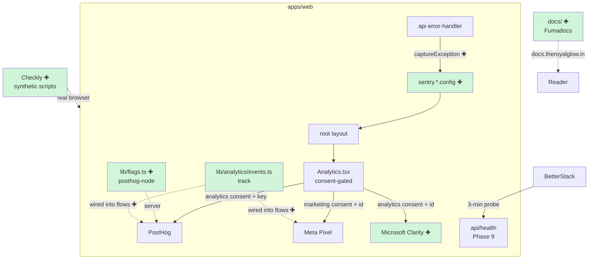

# Design Document — Phase 10: Observability & Launch

## Overview

Phase 10 closes out the build: it wires the **observability stack** into the running app and ships the supporting **launch assets**. Per `observability.md` the stack is five layers — Sentry (errors), BetterStack (uptime/status/heartbeats/logs), PostHog (product analytics + feature flags), Microsoft Clarity (heatmaps/session replay), and Checkly (synthetic monitoring). Phases 6–7 already laid much of the groundwork: the BetterStack heartbeat helper and job pings exist (Phase 6), and the consent-gated PostHog + Meta Pixel loader exists (Phase 7). Phase 10 adds what is missing in code: **Sentry runtime init**, **Microsoft Clarity** (consent-gated, alongside PostHog), a **PostHog feature-flags** server helper, a **typed funnel-event** wiring into the real booking/lead flows, **Checkly synthetic check scripts**, and the **Fumadocs documentation site** (`docs.theroyalglow.in`). It also delivers a machine-checkable **launch readiness** surface that builds on the Phase 9 `/api/health` endpoint.

Everything stays true to the project's guarded-extension-point convention: with no keys configured, Sentry/Clarity/PostHog/flags are all inert, the consent banner still gates them, and the whole monorepo continues to typecheck, lint, and build. Real provisioning of Sentry/BetterStack/PostHog/Clarity/Checkly accounts, DNS, and the launch-day runbook are **ops** steps documented in `launch-checklist.md`; Phase 10 delivers the code + config that those steps switch on.

### Goals

- **Sentry**: keep guarded client/server/edge runtime config plus each app's `src/lib/api/sentry-server-init.ts`; report unexpected wrapped API exceptions with environment and optional `COMMIT_SHA`. Root `instrumentation.ts` stays absent because it breaks SST/OpenNext packaging. Source-map upload remains unimplemented until CI supplies executable wiring and credentials.
- **Microsoft Clarity**: extend the Phase 7 `Analytics` component to also load Clarity when `analytics` consent is granted AND `NEXT_PUBLIC_CLARITY_ID` is set — double-gated, no-op otherwise, with PII masking noted.
- **PostHog feature flags**: add `apps/web/src/lib/flags.ts` (server) using `posthog-node` (guarded) per `deployment.md`, exposing `isFeatureEnabled(flag, distinctId)` that returns a safe default (`false`) when unconfigured, plus the launch kill-switch flag names as typed constants.
- **Funnel events**: wire the existing `track()` helper (Phase 7 `lib/analytics/events.ts`) into the real flows for the events `observability.md` lists (`booking_started`, `booking_step_completed`, `booking_request_submitted`, `lead_form_submitted`, `offer_clicked`, etc.) — light-touch, client-side, no-op without a loaded provider.
- **Checkly**: add `checkly.config.ts` + the 5 synthetic check scripts (`tests/synthetic/*.check.ts`) from `observability.md` (homepage+services, booking-dialog slots, sign-in, admin dashboard, api/health<500ms) as code; running them needs a Checkly account (ops).
- **Fumadocs docs site**: scaffold `docs/` as a Fumadocs app for `docs.theroyalglow.in` with a minimal content tree (getting-started + architecture overview + an API-reference placeholder), building independently and excluded from the web edge bundle.
- **Launch readiness**: a `LAUNCH.md` runbook derived from `launch-checklist.md` plus confirmation the `/api/health` checks cover the dependencies BetterStack/Checkly probe.

### Non-Goals (deferred / ops)

- **Provisioning accounts, DNS, secrets, and the launch-day execution** — `launch-checklist.md` is the runbook; Phase 10 delivers code/config, not the live wiring.
- **BetterStack monitor/heartbeat/status-page creation** — the heartbeat *pings* already exist in code (Phase 6); creating the monitors and status page is ops.
- **Running Checkly / k6 against production** — scripts are delivered; execution needs the deployed env + account.
- **Brevo/AiSensy marketing automation content** — covered by `email-strategy.md`; not a Phase 10 code deliverable beyond the existing guarded send seams.
- **Full API reference content in Fumadocs** — the site scaffolds with structure + a placeholder; `fumadocs-openapi` auto-generation from a published OpenAPI spec is a follow-up.
- **PostHog dashboards/funnels** — created in the PostHog UI per `observability.md`; the events that feed them are wired here.

## Architecture

### Observability layers → code touchpoints



(✚ = new in Phase 10; the rest exist from Phases 6–9.)

### Consent gating (extends Phase 7 flow)

```
analytics consent granted + NEXT_PUBLIC_POSTHOG_KEY → load PostHog
analytics consent granted + NEXT_PUBLIC_CLARITY_ID  → load Clarity   ← NEW
marketing consent granted + NEXT_PUBLIC_META_PIXEL_ID → load Meta Pixel
Sentry: loads independently of consent (error monitoring, not tracking;
        captures no marketing data) but is no-op without DSN
```

### New & changed files

```
apps/web/
  sentry.client.config.ts          ← Sentry browser init (guarded by DSN)
  sentry.server.config.ts          ← Sentry Node/SSR init (guarded)
  sentry.edge.config.ts            ← Sentry edge runtime init (guarded)
  src/lib/api/sentry-server-init.ts ← runtime-select server/edge config; no root instrumentation.ts
  next.config.ts                   ← (edit) wrap with withSentryConfig (guarded, no-op without org/project)
  src/components/analytics/Analytics.tsx  ← (edit) add consent-gated Clarity loader
  src/lib/analytics/events.ts      ← (edit) add the observability.md funnel event names
  src/lib/flags.ts                 ← (new) posthog-node isFeatureEnabled + flag constants
  src/lib/api/error-handler.ts     ← (edit) captureException on unexpected errors (guarded)
  src/components/booking/*          ← (edit, light) track('booking_started' / step / submitted)
  src/app/(landing)/book / lead form ← (edit, light) track('lead_form_submitted')

tests/synthetic/
  checkly.config.ts                ← Checkly project config (5 checks, schedules)
  homepage.check.ts                ← homepage + services render
  booking-slots.check.ts           ← ?book=1 dialog slots load
  signin.check.ts                  ← sign-in renders
  admin-dashboard.check.ts         ← admin loads (auth)
  health.check.ts                  ← /api/health < 500ms

docs/                              ← Fumadocs app (docs.theroyalglow.in)
  package.json (edit), next.config, source.config, app/, content/docs/*.mdx

LAUNCH.md                          ← launch runbook derived from launch-checklist.md
```

### Layer & dependency rules

- Sentry (`@sentry/nextjs`), `posthog-node`, and Clarity are **guarded**: read keys from `process.env`/`@/env` behind truthy checks; absent keys → inert. `@sentry/nextjs` is added to `apps/web` deps; `posthog-node` likewise (server-only). Clarity is injected as a script tag client-side (no package).
- `withSentryConfig` wraps `next.config.ts` but is a no-op for source-map upload without `SENTRY_ORG`/`SENTRY_PROJECT`/`SENTRY_AUTH_TOKEN` (those are CI-only, per `environment-variables.md`).
- Checkly scripts live under `tests/synthetic/` and are **not** part of the app build; `checkly` is a devDependency, scripts run via the Checkly CLI in ops.
- `docs/` is an independent Fumadocs (Next.js) app in the Bun workspace; it is **not** added to `apps/web` `transpilePackages` and shares nothing at runtime.
- Funnel-event wiring uses the existing `track()` (already no-op-safe); calls are added at cheap, high-signal points only — no business logic in components.

## Components and Interfaces

### Component 1: Sentry runtime

Each Next.js app keeps guarded runtime config files:
`{sentry.client,sentry.server,sentry.edge}.config.ts`, plus
`src/lib/api/sentry-server-init.ts`. A root `instrumentation.ts` is deliberately
absent in both apps and MUST NOT be recreated: SST/OpenNext trace-copy fails when
that entrypoint is present.

Each app's API error handler side-effect-imports `sentry-server-init.ts`. On first
server use, that module checks `NEXT_RUNTIME` and imports the matching server or
edge config. Unexpected non-`AppError` exceptions caught by `withErrorHandler`
are reported with `Sentry.captureException`; expected validation, auth, and
business errors retain their normal responses. This path covers wrapped API
handlers and is not the removed Next.js `onRequestError` global hook.

`next.config.ts` remains wrapped with `withSentryConfig`. Source-map upload is
possible only when a build workflow supplies `SENTRY_ORG`, `SENTRY_PROJECT`, and
`SENTRY_AUTH_TOKEN`; current `deploy-aws.yml` supplies none of them and has no
explicit upload step.

### Component 2: Microsoft Clarity (in `Analytics.tsx`)

A new `loadClarity()` alongside `loadPostHog()`/`loadMetaPixel()`, gated on `analytics` consent + `NEXT_PUBLIC_CLARITY_ID`, injecting Clarity's standard snippet once (guard against double-injection via a module flag / `window.clarity`). PII masking is configured in the Clarity dashboard (ops) but the design notes admin routes should be excluded; the snippet is only mounted on the customer site via the existing root-layout `<Analytics />`.

### Component 3: PostHog feature flags — `lib/flags.ts`

```typescript
export const FLAGS = {
  bookingEnabled: 'booking-enabled',
  membershipEnabled: 'membership-enabled',
  offersEnabled: 'offers-enabled',
  whatsappNotifications: 'whatsapp-notifications',
  gemsLoyalty: 'gems-loyalty',
  spaServices: 'spa-services',
} as const

/** Server-side flag check. Returns `defaultValue` (false) when PostHog is
 *  unconfigured or the call fails — never throws. Uses a guarded posthog-node. */
export async function isFeatureEnabled(
  flag: string,
  distinctId: string,
  defaultValue?: boolean,
): Promise<boolean>
```

Guarded dynamic import of `posthog-node`; if `NEXT_PUBLIC_POSTHOG_KEY` is absent, return `defaultValue ?? false`. A single shared client instance (lazy) with `host` from `NEXT_PUBLIC_POSTHOG_HOST`. Kill-switch usage: server components/route guards call `isFeatureEnabled(FLAGS.bookingEnabled, userId, true)` (default ON so the absence of PostHog never disables core features).

### Component 4: Funnel events (wire `track()`)

The existing `track(event, props?)` is extended with the `observability.md` event union and called at:
- Booking dialog open → `booking_started`; each step → `booking_step_completed` (`{ step }`); submit success → `booking_request_submitted` (`{ bookingId }`).
- Lead form submit success → `lead_form_submitted`.
- Offer banner/CTA click → `offer_clicked` (`{ offerId }`).
These are client-side, fire-and-forget, and no-op without a loaded provider — zero impact on the no-keys build.

### Component 5: Checkly synthetic checks — `tests/synthetic/`

`checkly.config.ts` defines the project, logical IDs, locations, and per-check schedules (10/15/30/5-min per `observability.md`). Each `*.check.ts` is a Playwright-style browser check (Checkly runs `@playwright/test`-compatible scripts). They target `process.env.CHECKLY_TARGET_URL ?? 'https://theroyalglow.in'`. Delivered as code; activation is ops (Checkly account + CLI deploy).

### Component 6: Fumadocs docs site — `docs/`

Scaffold `docs/` (currently just a `package.json`) into a Fumadocs Next.js app: `next.config.mjs` with `fumadocs-mdx`, `source.config.ts`, the `app/` tree (root layout + `[[...slug]]` docs page + `api/search`), and an initial `content/docs/` set: `index.mdx` (project overview), `architecture.mdx` (HLD summary linking the repo docs), and `api-reference.mdx` (placeholder noting `fumadocs-openapi` auto-generation is a follow-up). Builds independently (`bun run build --filter=@rgss/docs`); not part of the web bundle.

### Component 7: Launch runbook — `LAUNCH.md`

A condensed, actionable runbook derived from `launch-checklist.md`: the T-72h→T+24h timeline, the Go/No-Go gates, and a "what's code vs what's ops" table so the single developer can execute launch. It cross-references `/api/health`, the Phase 9 workflows, and the env var canonical names.

## Data Models

No database schema changes. New runtime shapes are the Sentry init options, the `FLAGS` constant map, the funnel-event name union, and the Checkly config — all configuration, none persisted. Feature-flag evaluation reads from PostHog (external), not the DB.

## Money, Date & Currency Conventions

No money or date handling is introduced. Funnel-event props that reference amounts (if any) carry integer paise and are formatted only at display elsewhere; this phase emits IDs and step labels, not money.

## Error Handling

| Scenario | Handling | Result |
|----------|----------|--------|
| `NEXT_PUBLIC_SENTRY_DSN` absent | `Sentry.init` skipped | no-op; app runs; no capture |
| Sentry capture in API handler | guarded `captureException`; only for unexpected errors (AppError is expected) | error logged + sent when configured; never re-throws |
| `NEXT_PUBLIC_CLARITY_ID` absent or no consent | Clarity loader returns early | no script injected |
| `posthog-node` unconfigured / import fails | `isFeatureEnabled` returns `defaultValue` | flags resolve to safe default; core features default ON |
| `track()` with no provider loaded | existing no-op guard | silent |
| Checkly script failure | reported in Checkly (ops) | not part of app runtime |
| Docs build issue | isolated app | does not affect web/cms build |

The rule holds: with no observability keys, `bun run typecheck`/`lint`/`build` pass, `/api/health` is `200`, and nothing throws.

## Security Considerations

- **No secrets client-side**: only `NEXT_PUBLIC_*` identifiers (Sentry DSN, Clarity ID, PostHog key, Pixel ID) reach the browser — all publishable by design. `SENTRY_AUTH_TOKEN`, `posthog-node` server usage, and CI tokens stay server/CI-side.
- **Consent before tracking**: Clarity and PostHog remain behind `analytics` consent; Meta Pixel behind `marketing`. Sentry (error monitoring, no marketing/PII tracking) loads independently but is scrubbed — no request bodies/headers with secrets; `sendDefaultPii: false`.
- **PII masking**: Clarity masking rules (phone/email/name) are configured in its dashboard; admin routes are not instrumented.
- **Feature flags fail safe**: kill-switches default ON for core features so a PostHog outage never takes the site down; experimental flags default OFF.
- **Docs site** is read-only marketing/engineering content with no app data access.
- **Synthetic checks** use a dedicated low-privilege test account for the authenticated admin check (ops).

## Testing Strategy

Per Phase 9 the harness exists. For Phase 10:
- **Unit**: `isFeatureEnabled` returns the safe default when unconfigured and never throws (mock the guarded import); the Clarity loader is a no-op without consent/id; `track()` funnel calls are no-op without a provider.
- **Typecheck/lint**: all new config (sentry, checkly, flags, events) and the docs app typecheck; `bun run lint` clean on new files.
- **Build**: `bun run build` (web) succeeds with `withSentryConfig` wrapped and no Sentry org/token; `docs` builds independently.
- **Manual/ops**: Sentry test error, Clarity session, PostHog event flow, Checkly runs, BetterStack monitors — all per `launch-checklist.md` T-48h verification.
- No exhaustive new test suites beyond the guards (the observability code is mostly thin glue around third-party SDKs).

## Design Decisions & Rationale

1. **Extend, don't duplicate.** Clarity is added to the existing Phase 7 `Analytics` component and the funnel events reuse the existing `track()` helper, so consent gating and the guarded pattern stay in one place.
2. **Sentry loads independent of consent, but scrubbed.** Error monitoring is operational telemetry, not user tracking; it captures stack traces, not marketing data, with `sendDefaultPii: false`. This is the standard, defensible split and keeps errors visible even before a user makes a consent choice.
3. **Feature flags fail ON for core features.** Defaulting `isFeatureEnabled(...,true)` for booking/membership/offers means a PostHog outage or missing key cannot disable the salon's core flows — the flags are a controlled kill-switch, not a hard dependency.
4. **`posthog-node` for server flags, `posthog-js` for client analytics.** Matches `deployment.md`; server-side flag evaluation in RSC/route guards avoids shipping flag logic to the browser.
5. **Checkly scripts as code now, run in ops.** Writing the 5 checks against the documented journeys means zero drift; they activate when the Checkly account + CLI are wired, exactly like the Phase 9 workflows.
6. **Fumadocs as its own workspace app.** Keeps `docs.theroyalglow.in` in the same TS/Next ecosystem without touching the customer edge bundle; scaffolding now (with a content placeholder) establishes the structure and lets the API reference be auto-generated later.
7. **`withSentryConfig` is safe with no token.** Wrapping `next.config.ts` is inert for upload without org/project/token, so local/dev builds are unaffected and CI activates upload via the Phase 9 deploy workflow.
8. **`LAUNCH.md` distils the checklist into a runbook.** A single developer launching solo benefits from one condensed, code-aware runbook over re-reading the full PRR doc each time.

## Correctness Properties

> Design-first spec — requirement IDs are forward references the requirements phase will define.

### Property 1: Observability is inert without keys
With `NEXT_PUBLIC_SENTRY_DSN`, `NEXT_PUBLIC_CLARITY_ID`, and `NEXT_PUBLIC_POSTHOG_KEY` all absent, no Sentry init, no Clarity script, and no PostHog load occurs; `bun run build`/`typecheck`/`lint` pass and `/api/health` returns `200`.
**Validates: Requirements 1.4, 2.3, 5.1**

### Property 2: Clarity is double-gated
The Clarity loader injects its script only when `analytics` consent is granted AND `NEXT_PUBLIC_CLARITY_ID` is configured; otherwise it is a no-op, and it never injects more than once.
**Validates: Requirements 2.1, 2.2**

### Property 3: Sentry captures only unexpected errors, scrubbed
The API error handler sends to Sentry only for non-`AppError` (unexpected) errors, with `sendDefaultPii: false`, and the capture call is a no-op when Sentry is uninitialised; expected `AppError`s are not reported as Sentry errors.
**Validates: Requirements 1.1, 1.2, 1.3**

### Property 4: Feature flags fail safe and never throw
`isFeatureEnabled(flag, id, dflt)` returns `dflt` (defaulting to `false`) when PostHog is unconfigured or the evaluation fails, and never throws; core kill-switches are queried with default `true`.
**Validates: Requirements 3.1, 3.2, 3.3**

### Property 5: Funnel events are no-op-safe
Each wired `track(event)` call is a no-op when no analytics provider is loaded (no consent/keys) and never throws into the booking/lead flow.
**Validates: Requirements 4.1, 4.2**

### Property 6: Checkly checks cover the documented journeys
`tests/synthetic/` contains exactly the five checks from `observability.md` (homepage+services, booking-dialog slots, sign-in, admin dashboard, api/health<500ms) with their schedules, each targeting a configurable base URL.
**Validates: Requirements 5.2**

### Property 7: Docs site builds independently
`docs/` builds as its own Fumadocs app without being imported by `apps/web` and without being in the web `transpilePackages`; a docs build failure does not affect the web or cms build.
**Validates: Requirements 6.1, 6.2**

### Property 8: Health endpoint covers probed dependencies
The Phase 9 `/api/health` checks (database, redis, r2) cover the dependencies that BetterStack and Checkly probe, so a green health response corresponds to the monitored surface.
**Validates: Requirements 5.1**
