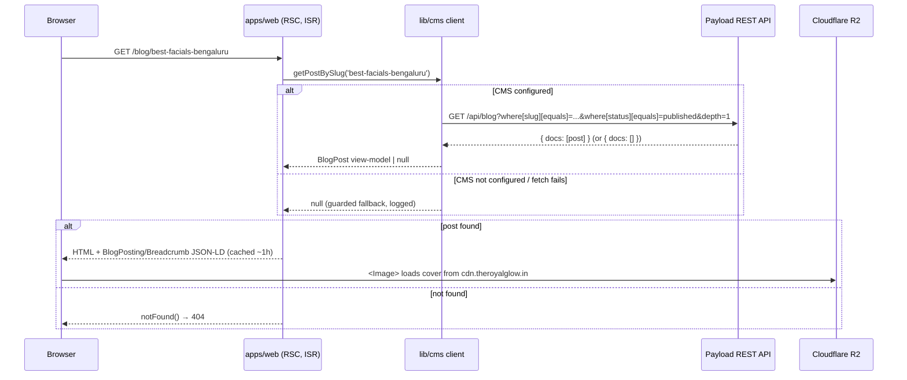

# Design Document — Phase 8: CMS & Blog

## Overview

Phase 8 stands up the marketing content layer for Royal Glow: a **Payload CMS v3** application (`apps/cms`) that owns blog posts, gallery images, team bios, homepage banners, and FAQ entries, plus the **web-app consumption surfaces** (`apps/web`) that render that content — a `/blog` listing, `/blog/[slug]` detail pages, and a `/gallery` page — with the same SEO discipline established in Phase 7 (per-page `buildMetadata`, server-rendered JSON-LD, breadcrumbs, sitemap entries).

Payload is **marketing content only**. Per `tech-stack.md` and `architecture.md`, the service catalogue, bookings, billing, memberships, and the RBAC `/admin` portal stay in the custom Next.js app backed by the `@rgss/db` Drizzle schema. Payload runs as its own Next.js-based app, self-hosted on Render at `admin.theroyalglow.in`, writing to **its own tables** in Neon Postgres via `@payloadcms/db-postgres` and storing media in Cloudflare R2 via the S3 storage adapter. The two systems share the same Neon *database* but never share tables: Payload manages its schema independently and Drizzle never reads or writes Payload tables (and vice-versa).

The defining constraint is **graceful degradation**. Payload needs its own environment (`PAYLOAD_SECRET`, a database URL, R2 credentials). The web app must build, typecheck, lint, and serve `/blog` and `/gallery` even when none of that is configured — showing an empty state or a static fallback, never a build break or a 500. This mirrors the project's guarded-extension-point convention (the same pattern Phase 7 used for analytics keys and Phase 6 used for job/heartbeat env): a thin `lib/cms` client reads `CMS_URL` (and an optional read token), and when the CMS is unreachable or unconfigured it resolves to empty results that the pages render as a friendly "no posts yet" state.

### Goals

- Configure `apps/cms` as a Payload CMS v3 app: `payload.config.ts`, the Postgres adapter pointed at Neon, the Lexical rich-text editor, the S3 storage adapter pointed at R2, and an access model of public read for published content + authenticated admin for writes.
- Define five collections — `blog`, `gallery`, `team`, `banner`, `faq` — with the fields, slugs, statuses, relationships, and SEO fields the marketing site needs.
- Build a thin, framework-aware CMS client in `apps/web/src/lib/cms/*` that fetches published content from Payload's REST API, normalises it into typed view-models, and **degrades to empty/fallback** whenever the CMS is unconfigured or unreachable.
- Render `/blog` (listing) and `/blog/[slug]` (detail) as server components with ISR (~1h revalidation), plus a `/gallery` page; optionally surface `team` on `/about` and active `banner`s on the homepage — all reusing the existing `(customer)` chrome.
- Extend the Phase 7 SEO surfaces: add `blogPostingJsonLd` and `imageObjectJsonLd` builders to `lib/seo/jsonld.ts`, add `buildMetadata` + `BreadcrumbList` to each new page, and extend `app/sitemap.ts` to include published blog slugs (with the existing try/catch fallback so a CMS outage never breaks the sitemap).
- Define how CMS-managed FAQs relate to the existing hard-coded `FAQS` list in `lib/seo/business.ts`: the CMS becomes the source of truth when configured, and the static list remains the fallback so the homepage/`/faq` FAQPage JSON-LD always renders.
- Keep the whole monorepo green: `bun run typecheck`, `bun run lint`, and `bun run build` all pass with **no CMS keys** present.

### Non-Goals (deferred)

- **Real content authoring** — actual blog posts, photographs, and bios are an editorial deliverable. This phase delivers the schema + rendering, not the content. Pages render correctly against an empty CMS.
- **Comments, full-text search, and rich pagination** — the `/blog` listing is a simple reverse-chronological list. Pagination is noted as a light extension (the client accepts `limit`/`page`) but the UI ships a single page.
- **Migrating `/admin` into Payload** — Payload is marketing content only; bookings, services, billing, memberships, and RBAC stay in the custom admin portal on `@rgss/db`.
- **Fumadocs / docs site** — `docs.theroyalglow.in` is a separate workstream.
- **R2 bucket provisioning + DNS for `admin.theroyalglow.in`** — these are deploy-time ops. The design references stable config (env var names, endpoint shape) so the wiring is correct now and the infra is attached later.
- **`Review`/`AggregateRating` and `Person` staff-profile pages** — carried over as deferred from Phase 7; `team` data may be surfaced on `/about` but standalone indexable staff pages are out of scope.
- **Payload→web webhook revalidation (on-publish purge)** — ISR time-based revalidation (~1h) is the shipped mechanism; on-demand revalidation via a Payload `afterChange` hook hitting a Next revalidate route is documented as a future enhancement.

## Architecture

### System view

```mermaid
graph TD
    Editor[Content editor] -->|logs in| PayloadAdmin[Payload Admin UI<br/>admin.theroyalglow.in]
    PayloadAdmin --> PayloadApp[apps/cms — Payload v3<br/>Next.js app on Render]
    PayloadApp -->|@payloadcms/db-postgres| Neon[(Neon Postgres<br/>Payload-owned tables)]
    PayloadApp -->|S3 storage adapter| R2[(Cloudflare R2<br/>media bucket)]

    Visitor[Site visitor] -->|/blog, /blog/slug, /gallery| Web[apps/web — Next.js 16<br/>Cloudflare Workers (OpenNext) + Render origin]
    Web -->|lib/cms client<br/>REST fetch, ISR ~1h| PayloadREST[Payload REST API<br/>CMS_URL/api/*]
    PayloadREST --> PayloadApp
    Web -->|img src| R2pub[R2 public URL / cdn.theroyalglow.in]
    R2 -. served via .-> R2pub

    Web -.->|reads @rgss/db<br/>bookings, services| NeonApp[(Neon Postgres<br/>Drizzle-owned tables)]

    style PayloadApp fill:#f5e9d0
    style Web fill:#d0e9f5
    style Neon fill:#e0e0e0
    style NeonApp fill:#e0e0e0
```

Two independent apps share one Neon database but disjoint table sets. `apps/web` reads marketing content over HTTP from Payload's REST API (never by importing Payload or querying Payload's tables directly), and reads operational data via `@rgss/db` Drizzle as before. Media bytes are served to the browser straight from R2's public URL (`CLOUDFLARE_R2_PUBLIC_URL`, e.g. `cdn.theroyalglow.in`) through Next's `<Image>`.

### Request flow — `/blog/[slug]` (ISR)



### New & changed files

```
apps/cms/
  package.json                      ← (edit) add payload, @payloadcms/* , next, react deps + scripts
  payload.config.ts                 ← Payload v3 config: db, editor, storage, collections, access
  next.config.ts                    ← withPayload() wrapper (Payload is a Next.js app)
  tsconfig.json                     ← strict TS config (extends root)
  .env.example                      ← CMS-specific env template (PAYLOAD_SECRET, DATABASE_URL, R2_*)
  src/
    payload-types.ts                ← (generated) `payload generate:types` output
    collections/
      Blog.ts                       ← blog posts collection
      Gallery.ts                    ← gallery images collection
      Team.ts                       ← team bios collection
      Banner.ts                     ← homepage banners collection
      Faq.ts                        ← FAQ entries collection
      Media.ts                      ← upload collection (R2-backed) shared by the above
      Users.ts                      ← Payload admin users (auth-enabled)
    access/
      published.ts                  ← anyone-can-read-published / admins-write helpers
    app/(payload)/...               ← Payload-generated Next.js admin routes

apps/web/src/
  lib/cms/
    config.ts                       ← isCmsConfigured(), CMS_URL resolution, fetch wrapper + revalidate
    types.ts                        ← BlogPost, BlogListItem, GalleryImage, TeamMember, Banner, CmsFaq view-models
    client.ts                       ← getPublishedPosts, getPostBySlug, getAllPostSlugs, getGalleryImages, getTeamMembers, getActiveBanners, getCmsFaqs
    richtext.ts                     ← Lexical → safe HTML/React serialisation helper
    media.ts                        ← resolve a Payload media doc → { url, alt, width, height }
  app/(customer)/blog/page.tsx      ← /blog listing (ISR)
  app/(customer)/blog/[slug]/page.tsx ← /blog/[slug] detail (ISR + generateStaticParams + generateMetadata)
  app/(customer)/gallery/page.tsx   ← /gallery grid (ISR)
  components/blog/PostCard.tsx       ← listing card (presentation only)
  components/blog/RichText.tsx       ← renders serialised Lexical content
  components/gallery/GalleryGrid.tsx ← responsive image grid (presentation only)

  lib/seo/jsonld.ts                 ← (edit) add blogPostingJsonLd(), imageObjectJsonLd()
  app/sitemap.ts                    ← (edit) append published blog slugs (guarded)
  app/(customer)/about/page.tsx     ← (optional edit) source team from CMS, fall back to static array
  env.ts / .env.example             ← (edit) add CMS_URL (+ optional CMS_READ_TOKEN) as optional
```

### Layer & dependency rules (carried from steering)

- `apps/web` consumes the CMS **only** through `lib/cms/*` (a thin, framework-aware client). Pages/components contain zero fetch logic and zero business logic — they receive typed view-models and render.
- `apps/web` does **not** depend on `apps/cms` as a package and does **not** import `payload`. The contract is the HTTP REST API + the generated view-model types in `lib/cms/types.ts`. This keeps the web build free of Payload's Node-only dependencies (Payload cannot run on Cloudflare Workers — it needs Node 20.9+ on Render).
- `apps/cms` is independent: it has its own `package.json`, its own env, and is **not** added to `apps/web`'s `transpilePackages`.
- Money/date house rules still apply to any rendered values: dates via `formatDateIN` shown inside `<time datetime>`; there is no money on these marketing pages.

## Components and Interfaces

### Component 1: Payload app (`apps/cms`)

**Purpose**: Headless CMS for marketing content; admin UI at `admin.theroyalglow.in`; REST/Local API over Payload-owned Neon tables; media in R2.

**`payload.config.ts` (shape)**:

```pascal
PROCEDURE buildConfig
  serverURL        ← env.PAYLOAD_PUBLIC_SERVER_URL ("https://admin.theroyalglow.in")
  secret           ← env.PAYLOAD_SECRET            (required, min 32 chars)
  db               ← postgresAdapter({ pool: { connectionString: env.DATABASE_URL } })
  editor           ← lexicalEditor({})             // rich text for blog body
  collections      ← [Users, Media, Blog, Gallery, Team, Banner, Faq]
  cors             ← [env.WEB_APP_URL]             // allow theroyalglow.in to read
  csrf             ← [env.WEB_APP_URL]
  plugins          ← [ s3Storage({
                         collections: { media: true },
                         bucket: env.CLOUDFLARE_R2_BUCKET_NAME,
                         config: {
                           endpoint: env.CLOUDFLARE_R2_ENDPOINT,
                           region: 'auto',
                           credentials: { accessKeyId: ..., secretAccessKey: ... },
                           forcePathStyle: true
                         }
                       }) ]
  typescript       ← { outputFile: 'src/payload-types.ts' }
END PROCEDURE
```

**Responsibilities**:
- Own the schema + migrations for its five content collections + `Media` + `Users` (Payload's own migration system, not drizzle-kit).
- Serve the admin UI and the REST API (`/api/{collection}`) + GraphQL (unused by web, left at default).
- Enforce access control: published docs are world-readable; create/update/delete require an authenticated Payload user.
- Push uploaded media to R2 and expose public URLs.

### Component 2: CMS client (`apps/web/src/lib/cms`)

**Purpose**: The single seam between the web app and Payload. Guards configuration, performs typed REST reads with ISR, normalises Payload documents into stable view-models, and degrades to empty results on any failure.

**`config.ts` interface**:

```typescript
/** True only when a usable CMS base URL is configured. */
export function isCmsConfigured(): boolean

/** Base URL for the Payload REST API, or null when unconfigured. */
export function cmsBaseUrl(): string | null

/** Default ISR window for CMS reads (seconds). */
export const CMS_REVALIDATE_SECONDS = 3600

/**
 * Guarded fetch against the Payload REST API.
 * - Returns null if the CMS is not configured.
 * - Returns null (never throws) on network error, non-2xx, or parse failure.
 * - Applies `next: { revalidate: CMS_REVALIDATE_SECONDS }` for ISR.
 */
export function cmsFetch<T>(
  path: string,
  init?: { revalidate?: number }
): Promise<T | null>
```

**`client.ts` interface** (all functions are total — they never throw, returning `[]`/`null` on any failure so callers render an empty state):

```typescript
export function getPublishedPosts(
  opts?: { limit?: number; page?: number }
): Promise<BlogListItem[]>

export function getPostBySlug(slug: string): Promise<BlogPost | null>

export function getAllPostSlugs(): Promise<string[]>

export function getGalleryImages(
  opts?: { category?: string }
): Promise<GalleryImage[]>

export function getTeamMembers(): Promise<TeamMember[]>

export function getActiveBanners(now?: Date): Promise<Banner[]>

/**
 * CMS-managed FAQ entries. Empty when the CMS is unconfigured/unreachable,
 * which lets callers fall back to the static FAQS list.
 */
export function getCmsFaqs(): Promise<CmsFaq[]>
```

**Responsibilities**:
- Build Payload REST query strings (`where[status][equals]=published`, `sort=-publishedAt`, `depth=1` to populate relations/media, `limit`, `page`).
- Map raw Payload docs → view-models, resolving media docs to absolute URLs via `media.ts` and serialising Lexical bodies via `richtext.ts`.
- Treat all upstream problems (unconfigured, timeout, non-2xx, schema drift) as "no data".

**Query contract reference**:

| Function | REST request (relative to `CMS_URL/api`) |
|----------|-------------------------------------------|
| `getPublishedPosts` | `GET /blog?where[status][equals]=published&sort=-publishedAt&depth=1&limit={n}&page={p}` |
| `getPostBySlug` | `GET /blog?where[slug][equals]={slug}&where[status][equals]=published&depth=1&limit=1` |
| `getAllPostSlugs` | `GET /blog?where[status][equals]=published&depth=0&limit=200&select=slug` |
| `getGalleryImages` | `GET /gallery?depth=1&sort=-createdAt[&where[category][equals]={c}]` |
| `getTeamMembers` | `GET /team?depth=1&sort=order` |
| `getActiveBanners` | `GET /banner?where[active][equals]=true&depth=1&sort=order` (active-window filtered client-side against `now`) |
| `getCmsFaqs` | `GET /faq?depth=0&sort=order` |

### Component 3: Rich-text + media helpers

**`richtext.ts`** — converts Payload's Lexical JSON to render-safe output. Lexical content is authored by trusted admins, but output is still escaped/whitelisted (no raw HTML passthrough of arbitrary tags) to honour the project's "no `dangerouslySetInnerHTML` without sanitisation" rule.

```typescript
/** Serialise a Lexical root node to sanitised HTML for <RichText/>. */
export function lexicalToHtml(root: unknown): string

/** Plain-text excerpt (for meta description fallback), truncated to maxLen. */
export function lexicalToPlainText(root: unknown, maxLen?: number): string
```

**`media.ts`** — resolves a Payload upload doc (or relation id) into a typed image reference, prefixing relative URLs with the R2 public base when needed.

```typescript
export type ResolvedMedia = {
  url: string
  alt: string
  width: number | null
  height: number | null
}

/** Returns null when the media field is empty/unpopulated. */
export function resolveMedia(media: unknown): ResolvedMedia | null
```

### Component 4: Pages (`apps/web`)

**Purpose**: Server components that compose the client + SEO helpers + existing `(customer)` chrome.

- **`/blog` (`blog/page.tsx`)** — `export const revalidate = 3600`. Calls `getPublishedPosts()`; renders `PostCard`s or an empty state. Adds `buildMetadata({ title: 'Blog', ... })`, `localBusinessJsonLd()`, and `breadcrumbJsonLd([Home, Blog])`.
- **`/blog/[slug]` (`blog/[slug]/page.tsx`)** — `export const revalidate = 3600`; `generateStaticParams()` from `getAllPostSlugs()` (returns `[]` when CMS absent → all paths render on-demand); `generateMetadata()` from the post (title/excerpt/cover OG image, canonical `/blog/{slug}`); body via `<RichText/>`; `publishedAt` rendered as `<time datetime>` using `formatDateIN`. Emits `blogPostingJsonLd(...)` + `breadcrumbJsonLd([Home, Blog, title])`. Calls `notFound()` when the post is missing/unpublished.
- **`/gallery` (`gallery/page.tsx`)** — `export const revalidate = 3600`. Calls `getGalleryImages()`; renders `GalleryGrid` (each image with required `alt`, explicit `width`/`height` to avoid CLS) or an empty state. Adds metadata, `breadcrumbJsonLd([Home, Gallery])`, and one `imageObjectJsonLd(...)` per image.
- **`/about` (optional edit)** — replace the hard-coded `team` array with `getTeamMembers()`, falling back to the existing static array when the CMS returns `[]`.
- **Homepage (optional edit)** — `getActiveBanners()` to render promo banners; renders nothing extra when empty.

**Responsibilities**: presentation + SEO wiring only. No fetch logic (delegated to `lib/cms`), no business rules.

### Component 5: SEO builder extensions (`lib/seo/jsonld.ts`)

Two new pure builders added alongside the Phase 7 set, reading `BUSINESS` for publisher/NAP facts:

```typescript
/** BlogPosting structured data for /blog/[slug]. Dates ISO-8601. */
export function blogPostingJsonLd(post: {
  title: string
  description: string
  slug: string
  coverImageUrl?: string
  authorName?: string
  publishedAt: string   // ISO 8601
  updatedAt?: string    // ISO 8601
}): Record<string, unknown>

/** ImageObject structured data for a gallery image. */
export function imageObjectJsonLd(image: {
  url: string
  caption?: string
  alt: string
  width?: number
  height?: number
}): Record<string, unknown>
```

`blogPostingJsonLd` sets `@type: 'BlogPosting'`, `mainEntityOfPage` = `BUSINESS.url + /blog/{slug}`, `publisher` = an Organization derived from `BUSINESS` (name + logo), `author` = `Person`(authorName) or falls back to the publisher, `image` = cover when present, and `datePublished`/`dateModified` from the ISO inputs. Both are serialised by the existing `<JsonLd>` component (already `<`-escaped, script-safe).

### Component 6: Sitemap extension (`app/sitemap.ts`)

The existing sitemap keeps its static routes and dynamic service slugs; Phase 8 adds a second guarded block appending one entry per published blog slug, plus static `/blog` and `/gallery` entries.

```pascal
PROCEDURE sitemap
  entries ← staticEntries ∪ serviceEntries        // unchanged Phase 7 logic

  // Phase 8 additions
  APPEND { /blog, weekly, 0.7 } AND { /gallery, monthly, 0.5 } TO entries

  TRY
    slugs ← getAllPostSlugs()                       // lib/cms, total function
    FOR each slug IN slugs DO
      APPEND { url: SITE_URL + "/blog/" + slug, changeFrequency: monthly, priority: 0.7 }
    END FOR
  CATCH
    // getAllPostSlugs already swallows errors; this guard is belt-and-braces
  END TRY

  RETURN entries
END PROCEDURE
```

Because `getAllPostSlugs()` returns `[]` when the CMS is unconfigured/unreachable, the sitemap is identical to Phase 7's output in that case — no blog URLs, no error.

## Data Models

All collections live in **Payload-owned Neon tables** (separate from the `@rgss/db` Drizzle schema). Field types below are Payload field types; Payload generates the SQL tables and `src/payload-types.ts`. The web app never sees these tables — only the REST projection mapped to the `lib/cms/types.ts` view-models.

### Collection: `blog`

| Field | Payload type | Notes / validation |
|-------|--------------|--------------------|
| `title` | text | required |
| `slug` | text | required, unique, indexed; auto-generated from title, editable; kebab-case |
| `excerpt` | textarea | required; used in listing + meta description (≤ 200 chars recommended) |
| `coverImage` | upload → `media` | optional; relation to R2-backed Media |
| `body` | richText (Lexical) | required; article content |
| `author` | relationship → `team` | optional; surfaces author name/photo |
| `category` | select | optional; e.g. Skincare, Hair, Spa, Bridal, Tips |
| `tags` | array of text (or `hasMany` text) | optional |
| `seo` | group: `metaTitle` (text), `metaDescription` (textarea), `ogImage` (upload→media) | optional; falls back to title/excerpt/coverImage |
| `publishedAt` | date | required when status = published; controls listing order |
| `status` | select: `draft` \| `published` | required; default `draft`; only `published` is world-readable |
| `createdAt`/`updatedAt` | (auto) | Payload timestamps |

**Web view-models**:

```typescript
export type BlogListItem = {
  slug: string
  title: string
  excerpt: string
  coverImage: ResolvedMedia | null
  category: string | null
  publishedAt: string          // ISO 8601
}

export type BlogPost = BlogListItem & {
  bodyHtml: string             // serialised Lexical
  author: { name: string; photo: ResolvedMedia | null } | null
  tags: string[]
  seo: { metaTitle: string | null; metaDescription: string | null; ogImageUrl: string | null }
  updatedAt: string            // ISO 8601
}
```

### Collection: `gallery`

| Field | Payload type | Notes |
|-------|--------------|-------|
| `image` | upload → `media` | required |
| `alt` | text | required (a11y + SEO; never empty) |
| `caption` | text | optional |
| `category` | select | optional; e.g. Salon, Spa, Interior, Team, Work |
| `order` | number | optional; manual sort |

```typescript
export type GalleryImage = {
  id: string
  image: ResolvedMedia        // url, alt, width, height
  caption: string | null
  category: string | null
}
```

### Collection: `team`

| Field | Payload type | Notes |
|-------|--------------|-------|
| `name` | text | required |
| `role` | text | required (e.g. "Senior Stylist") |
| `bio` | textarea (or richText) | optional |
| `photo` | upload → `media` | optional |
| `specializations` | array of text | optional |
| `order` | number | optional; display order on `/about` |

```typescript
export type TeamMember = {
  name: string
  role: string
  bio: string
  photo: ResolvedMedia | null
  specializations: string[]
}
```

### Collection: `banner`

| Field | Payload type | Notes |
|-------|--------------|-------|
| `headline` | text | required |
| `image` | upload → `media` | required |
| `ctaLabel` | text | optional |
| `ctaHref` | text | optional; internal path or absolute URL |
| `active` | checkbox | required; default false |
| `startAt` | date | optional; active-window start |
| `endAt` | date | optional; active-window end |
| `order` | number | optional |

```typescript
export type Banner = {
  headline: string
  image: ResolvedMedia
  ctaLabel: string | null
  ctaHref: string | null
  order: number
}
```

A banner is shown only when `active === true` **and** `now` is within `[startAt, endAt]` (open-ended when a bound is absent). The active-window check is applied in `getActiveBanners(now)` so it is deterministic and testable.

### Collection: `faq`

| Field | Payload type | Notes |
|-------|--------------|-------|
| `question` | text | required |
| `answer` | textarea | required; answer-first phrasing per `seo.md` |
| `category` | select | optional; e.g. Booking, Pricing, Services, Policies |
| `order` | number | optional |

```typescript
export type CmsFaq = { question: string; answer: string; category: string | null }
```

#### FAQ source-of-truth resolution

The web app already ships a hard-coded `FAQS` constant in `lib/seo/business.ts` (used for FAQPage JSON-LD on the homepage/`/faq`). Phase 8 makes the CMS the **preferred source** with the static list as a guaranteed fallback:

```pascal
FUNCTION resolveFaqs() RETURNS Faq[]
  cmsFaqs ← getCmsFaqs()                 // [] when CMS unconfigured/unreachable
  IF cmsFaqs is non-empty THEN
    RETURN map(cmsFaqs → { question, answer })
  ELSE
    RETURN FAQS                          // static fallback from business.ts
  END IF
END FUNCTION
```

This guarantees the FAQPage JSON-LD and the `/faq` UI always have content, satisfying the Phase 7 SEO contract even with no CMS configured. (Pages consuming this run with ISR; the static `FAQS` remain the build-time default.)

### Collection: `media` (uploads)

Standard Payload upload collection backed by the S3/R2 adapter. Fields: `alt` (text, required), auto `url`/`filename`/`mimeType`/`filesize`/`width`/`height`. Image sizes (thumbnail/card/hero) are defined for responsive `<Image>` use. Upload type whitelist (jpg/png/webp) and size cap align with the project's file-upload security rule.

## Money, Date & Currency Conventions

- **No money** appears on these marketing pages, so no paise handling is required here.
- **Dates**: `blog.publishedAt` is stored as a timestamp by Payload and surfaced to the web app as an ISO-8601 string. The page renders it as `<time datetime="{ISO}">{formatDateIN(date)}</time>` (DD/MM/YYYY, IST) per house rules. JSON-LD `datePublished`/`dateModified` use the raw ISO-8601 value (Schema.org expects ISO, not the Indian display format).
- **Locale**: OG locale stays `en_IN` via the shared `buildMetadata`.

## Error Handling

| Scenario | Handling | Result |
|----------|----------|--------|
| CMS env not configured (`CMS_URL` absent) | `isCmsConfigured()` is false; `cmsFetch` short-circuits to `null`; client functions return `[]`/`null` | Pages render empty state; build/typecheck/lint/serve succeed |
| Payload unreachable / timeout / non-2xx | `cmsFetch` catches and returns `null`; logged via `@rgss/logger` (not thrown) | Empty state; sitemap omits blog slugs; no 500 |
| `/blog/[slug]` slug not found or unpublished | `getPostBySlug` returns `null` → page calls `notFound()` | Standard 404, indexable-safe |
| Malformed/partial Payload doc (schema drift) | Mapping is defensive; missing fields resolve to safe defaults (`null`, `[]`, `''`); a doc that can't yield a slug/title is skipped | Degrades per-item, never crashes the page |
| Media field empty/unpopulated | `resolveMedia` returns `null`; UI shows a placeholder or omits the image | No broken `` |
| Lexical body empty/invalid | `lexicalToHtml` returns `''`; `lexicalToPlainText` returns `''` | Post renders without body; meta description falls back to excerpt |
| Banner active but outside window | `getActiveBanners(now)` filters it out | Not displayed |

The guiding rule: **every `lib/cms` function is total** — it resolves to a safe value and logs anomalies; it never propagates an exception into a page render or the sitemap.

## Security Considerations

- **Access control in Payload**: `read` on `blog`/`gallery`/`team`/`banner`/`faq` is restricted to *published* (or always-public, for non-status collections) documents for anonymous requests; `create`/`update`/`delete` require an authenticated Payload user. Draft posts are never exposed over the public REST API.
- **CORS/CSRF**: Payload's `cors`/`csrf` lists include only the web origin (`theroyalglow.in`) and the admin origin — no wildcard, consistent with the project CORS rule.
- **Secrets stay server-side**: `PAYLOAD_SECRET`, R2 credentials, and the Payload database URL live only in `apps/cms`'s environment on Render. The web app holds at most `CMS_URL` (public base) and an optional read token; no Payload secret is ever shipped to the browser or required by the web build.
- **Rich-text sanitisation**: Lexical output is serialised through a whitelist (`richtext.ts`), not injected as arbitrary HTML — honouring "no `dangerouslySetInnerHTML` without sanitisation". Authors are trusted admins, but defence-in-depth still applies.
- **Uploads**: Media uploads are constrained to an image type whitelist and a size cap in the Payload collection config; R2 serves them from a dedicated public bucket/subdomain, isolated from app data.
- **No privilege bridge**: Payload has no access to `@rgss/db` operational tables and the web app has no write path into Payload; the only coupling is read-only HTTP over published content.
- **Network exposure**: The Payload admin (`admin.theroyalglow.in`) is an authenticated surface; it is excluded from the public sitemap/robots (already disallowed under the subdomain split) and is not linked from the customer site.

## Testing Strategy

Per coding standards, no test files are committed unless explicitly requested. Verification per task:

- **Pure builders** (`blogPostingJsonLd`, `imageObjectJsonLd`) — deterministic; strongest unit/PBT targets (shape, ISO dates, script-safety via the existing `<JsonLd>` escaping).
- **CMS client guards** (`isCmsConfigured`, `cmsFetch`, each `client.ts` function) — reasoned/unit-checked for totality: unconfigured → `[]`/`null`; simulated non-2xx/timeout → `[]`/`null`; well-formed payload → correct view-model. `getActiveBanners(now)` window logic is deterministic and a good PBT target.
- **FAQ resolution** — `resolveFaqs()` returns CMS list when present, static `FAQS` when empty.
- **Mapping/normalisation** (`resolveMedia`, `lexicalToPlainText`) — defensive defaults on partial input.
- **Pages** — typecheck; manual shape check; verify empty-CMS renders an empty state and `/blog/[slug]` 404s on unknown slug.
- **Whole phase** — `SKIP_ENV_VALIDATION=1 bun run typecheck`, `bun run lint` (Biome), and a no-CMS-keys `bun run build` must all pass.
- **Payload app** — typecheck of `payload.config.ts` and collections; `payload generate:types` produces `src/payload-types.ts`. Running the admin/migrations requires real env and is a deploy-time step (Render), out of scope for the no-keys CI gate.

## Design Decisions & Rationale

1. **Web reads CMS over HTTP, never imports Payload.** Payload needs Node 20.9+ and cannot run in Cloudflare Workers; importing it into `apps/web` would pull Node-only deps into the edge build. A thin REST client keeps the web app edge-deployable and the two apps independently buildable. This is also why `apps/cms` is *not* in `transpilePackages`.

2. **One Neon database, two disjoint table sets.** Reusing the existing Neon project (with its branch strategy) avoids new infra, while Payload's own adapter + migration system keeps its tables fully separate from the Drizzle schema. Neither system reads the other's tables — the only contract is published-content HTTP. This respects the steering rule that bookings/services/billing are *not* in Payload.

3. **Graceful degradation as a first-class requirement.** Every `lib/cms` function is total and the pages render an empty state when the CMS is absent. This keeps `typecheck`/`lint`/`build` green with no CMS keys (matching Phase 6/7's guarded-extension-point convention) and means a Render cold-start or outage degrades to "no posts yet", never a 500 or a broken sitemap.

4. **ISR with ~1h revalidation (time-based) over webhooks.** `architecture.md` specifies 1h revalidation for `/blog/*`. Time-based ISR needs no Payload→web coupling and tolerates Render's free-tier cold starts. On-demand revalidation (a Payload `afterChange` hook calling a Next revalidate route) is documented as a future enhancement, not shipped now, to keep the surface area small.

5. **CMS is the preferred FAQ source with the static list as fallback.** The homepage/`/faq` FAQPage JSON-LD is an established Phase 7 SEO contract that must always render. Making `getCmsFaqs()` return `[]` on absence and falling back to the existing `FAQS` constant guarantees content without coupling SEO correctness to CMS availability.

6. **Extend the Phase 7 SEO surfaces rather than fork them.** Adding `blogPostingJsonLd`/`imageObjectJsonLd` to `lib/seo/jsonld.ts`, reusing `buildMetadata`, `<JsonLd>`, and `breadcrumbJsonLd`, and appending to `app/sitemap.ts` keeps NAP/publisher facts sourced from the single `BUSINESS` constant and keeps structured-data behaviour consistent (server-rendered, `<`-escaped) across the whole site.

7. **Lexical serialised through a whitelist.** Even with trusted authors, rendering rich text through a sanitising serialiser (not raw HTML) upholds the project's XSS rule and keeps the door closed on stored-content injection.

8. **Slugs are the public key for posts; `[id]`s never appear in URLs.** Matches the URL convention in `sitemap.md` (`/blog/[slug]`, kebab-case) and keeps URLs SEO-friendly and stable across edits.

## Correctness Properties

> Note: this is a design-first spec — requirement IDs below are forward references that the requirements phase will define and renumber if needed.

### Property 1: Web app builds and serves with no CMS configuration
With `CMS_URL` unset, `isCmsConfigured()` is `false`, every `lib/cms` client function resolves to `[]`/`null`, and `/blog`, `/blog/[slug]`, and `/gallery` render (empty state or 404) without throwing. `typecheck`, `lint`, and `build` succeed with no CMS keys.
**Validates: Requirements 7.1, 7.2**

### Property 2: CMS client functions are total (never throw)
For any upstream condition — unconfigured, network error, timeout, non-2xx, or malformed JSON — `getPublishedPosts`, `getPostBySlug`, `getAllPostSlugs`, `getGalleryImages`, `getTeamMembers`, `getActiveBanners`, and `getCmsFaqs` resolve to a safe value (`[]` or `null`) and log the anomaly; they never reject or throw.
**Validates: Requirements 7.1, 7.3**

### Property 3: Only published posts are ever exposed
Every blog read issued by the client includes `where[status][equals]=published`, and the mapped view-models contain no draft documents. `/blog/[slug]` resolves to `notFound()` for any slug whose post is missing or not published.
**Validates: Requirements 2.1, 3.4**

### Property 4: Sitemap includes published slugs and never breaks
`app/sitemap.ts` output contains the static `/blog` and `/gallery` entries plus exactly one entry per published blog slug returned by `getAllPostSlugs()`; when the CMS is unconfigured/unreachable the slug set is empty and the sitemap equals its Phase 7 output (still a valid 200, never an error).
**Validates: Requirements 6.1, 6.2**

### Property 5: BlogPosting JSON-LD is valid and script-safe
`blogPostingJsonLd(post)` returns an object with `@context: 'https://schema.org'`, `@type: 'BlogPosting'`, a non-empty `headline`, ISO-8601 `datePublished`, a `publisher` derived from `BUSINESS`, and `mainEntityOfPage` equal to `BUSINESS.url + '/blog/' + post.slug`; serialised through `<JsonLd>` it never contains a raw `</script>` sequence.
**Validates: Requirements 5.1, 5.4**

### Property 6: ImageObject JSON-LD is valid for every gallery image
`imageObjectJsonLd(image)` returns an object with `@type: 'ImageObject'`, a non-empty `contentUrl`/`url`, and the image's `alt` carried into `caption`/`name`; one is emitted per rendered gallery image.
**Validates: Requirements 4.2, 5.2**

### Property 7: Published date is rendered accessibly and consistently
On `/blog/[slug]` the published date appears inside a `<time datetime="{ISO-8601}">` element whose human text is `formatDateIN(publishedAt)` (DD/MM/YYYY, IST), while the JSON-LD uses the same instant in ISO-8601.
**Validates: Requirements 3.3**

### Property 8: FAQ resolution prefers CMS, falls back to static
`resolveFaqs()` returns the CMS-sourced FAQs when `getCmsFaqs()` is non-empty and the static `FAQS` constant otherwise; the result is always non-empty, so FAQPage JSON-LD always has content.
**Validates: Requirements 8.1, 8.2**

### Property 9: Active-banner window logic is correct
`getActiveBanners(now)` returns only banners with `active === true` whose `[startAt, endAt]` window contains `now` (treating an absent bound as open-ended); banners outside the window or inactive are excluded.
**Validates: Requirements 2.4**

### Property 10: Every rendered image has non-empty alt and explicit dimensions
Each blog cover and gallery image rendered via `<Image>` carries a non-empty `alt` (from the collection's required `alt`/title) and explicit `width`/`height` (or fill with reserved space) to satisfy the a11y/CLS rules.
**Validates: Requirements 3.5, 4.3**

### Property 11: Pages and metadata are canonical and reuse the shared helpers
`/blog`, `/blog/[slug]`, and `/gallery` each produce metadata via `buildMetadata` with an absolute canonical (`SITE_URL + path`, no double slash), a `BreadcrumbList` via `breadcrumbJsonLd`, and a single `h1`.
**Validates: Requirements 5.3, 3.1, 4.1**

### Property 12: Payload and Drizzle tables stay disjoint
The web app issues no Drizzle query against Payload-owned tables and no Payload read against `@rgss/db` tables; the only cross-system data flow is read-only HTTP over published content.
**Validates: Requirements 1.3**
