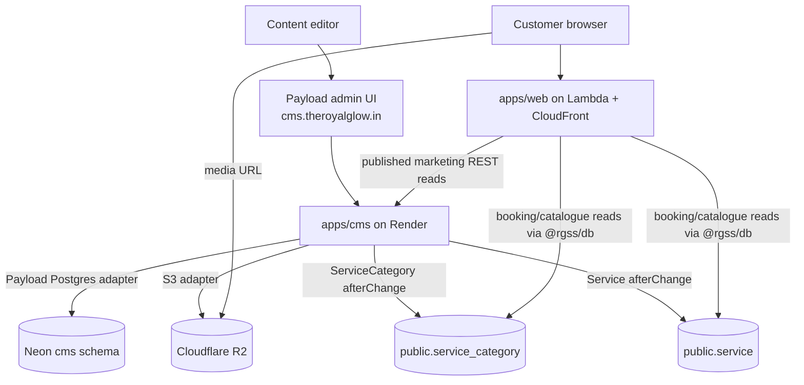
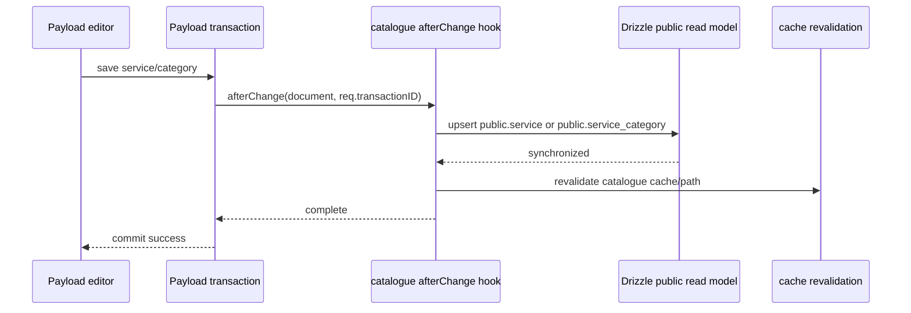

# Design Document — Phase 8: CMS and Blog

## Overview

Phase 8 provides two related surfaces:

1. `apps/cms`: Payload CMS v3 on Render for marketing content and service-catalogue authoring.
2. `apps/web`: guarded customer content pages that consume published marketing documents over Payload REST.

Payload is the authoritative write surface for `service_category` and `service`. Atomic `afterChange` hooks mirror each successful save into Drizzle-owned `public.service_category` and `public.service` read models. Booking, availability, offer linkage, and admin selectors continue reading those public tables through `@rgss/db`.

Payload does not own bookings, billing, memberships, staff assignments, offer-service links, or Better Auth admin operations. Apart from the two explicit catalogue sync targets, Payload-owned tables stay isolated in the `cms` schema.

## Goals

- Keep Payload at `cms.theroyalglow.in` with Neon and Cloudflare R2 storage.
- Keep the live collection set registered and access-controlled.
- Make Payload the only supported human write surface for services and categories.
- Preserve Drizzle catalogue read models for operational code.
- Keep `/blog`, `/blog/[slug]`, `/gallery`, homepage content, and FAQs resilient to CMS failure.
- Keep SEO metadata, structured data, sitemap entries, image semantics, and ISR behavior.
- Keep web/admin AWS Lambda bundles free of Payload's Node dependencies.

## Non-Goals

- Moving the Better Auth admin portal into Payload.
- Moving booking, billing, CRM, membership, scheduling, or loyalty tables into Payload.
- Provisioning R2, Render, Neon, or DNS resources from application code.
- Adding Cloudflare Workers, Pages, Wrangler, or KV compute.
- Replacing time-based ISR with webhook revalidation in this phase.

## System Architecture



### Ownership Boundary

| Data | Authoring owner | Read owner | Storage |
| --- | --- | --- | --- |
| Blog, gallery, team, banner, FAQ, testimonial, marketing offer/card | Payload | Web through Payload REST | Payload `cms.*` tables |
| Service category, service | Payload collections | Web/admin/business through `@rgss/db` | Payload documents plus synchronized `public.*` read models |
| Booking, invoice, membership, CRM, staff, loyalty | Custom applications | `@rgss/db` | Drizzle `public.*` tables |
| Media bytes | Payload upload flow | Browser/public pages | Cloudflare R2 |

`ServiceCard` is homepage/display content. It does not replace a bookable `Service`.

## Payload Application

### Registered Collections

`payload.config.ts` registers 12 collections in dependency-safe order:

1. `Users`
2. `Media`
3. `Blog`
4. `Gallery`
5. `Team`
6. `Banner`
7. `Faq`
8. `Testimonial`
9. `Offer`
10. `ServiceCard`
11. `ServiceCategory`
12. `Service`

The last two are catalogue authoring collections. Deletes remain disabled; editors retire entries through `isActive` so operational references stay valid.

### R2 Storage Contract

CMS media storage uses the exact server-side variables consumed by `payload.config.ts`:

- `R2_BUCKET_NAME`
- `R2_ENDPOINT`
- `R2_ACCESS_KEY_ID`
- `R2_SECRET_ACCESS_KEY`

`R2_ENDPOINT` is consumed directly. The CMS does not reconstruct it from `R2_ACCOUNT_ID`, and `NEXT_PUBLIC_R2_PUBLIC_URL` is not an input to the Payload storage plugin.

```ts
const isR2Configured =
  Boolean(process.env.R2_BUCKET_NAME) &&
  Boolean(process.env.R2_ENDPOINT) &&
  Boolean(process.env.R2_ACCESS_KEY_ID) &&
  Boolean(process.env.R2_SECRET_ACCESS_KEY)

s3Storage({
  enabled: isR2Configured,
  collections: { media: { prefix: 'cms' } },
  bucket: process.env.R2_BUCKET_NAME ?? '',
  config: {
    endpoint: process.env.R2_ENDPOINT,
    region: 'auto',
    credentials: {
      accessKeyId: process.env.R2_ACCESS_KEY_ID ?? '',
      secretAccessKey: process.env.R2_SECRET_ACCESS_KEY ?? '',
    },
    forcePathStyle: true,
  },
})
```

The snippet documents shape only; `apps/cms/src/payload.config.ts` is authoritative.

### Catalogue Synchronization



Rules:

- `syncServiceCategoryToPublic` and `syncServiceToPublic` run before cache revalidation.
- Synchronization uses the active Payload request transaction so document and read model do not diverge.
- `SERVICE_SYNC_ENABLED=false` disables synchronization for controlled seed/rollback operations.
- Customer and admin booking paths never query Payload catalogue documents directly.
- Retired custom service-write APIs remain disabled or redirected to Payload.

## Web CMS Client

`apps/web/src/lib/cms` is the only marketing-content seam. It reads optional `NEXT_PUBLIC_CMS_URL` through a guarded bootstrap path. No `CMS_READ_TOKEN` contract exists for public published reads.

```ts
export function cmsBaseUrl(): string | null
export function cmsFetch<T>(path: string): Promise<T | null>
export function getPublishedPosts(): Promise<BlogListItem[]>
export function getPostBySlug(slug: string): Promise<BlogPost | null>
export function getGalleryImages(): Promise<GalleryImage[]>
export function getTeamMembers(): Promise<TeamMember[]>
export function getActiveBanners(now?: Date): Promise<Banner[]>
export function getCmsFaqs(): Promise<CmsFaq[]>
```

Client functions are total: missing configuration, timeout, network failure, non-2xx response, or invalid data yields `[]`/`null` plus structured logging. They do not throw into page rendering.

The root `.env.example` documents the optional public CMS origin. There is no `apps/web/.env.example`.

## Public Pages and SEO

- `/blog`: published listing with ISR and empty state.
- `/blog/[slug]`: published detail with guarded `notFound()`, semantic `<time>`, metadata, breadcrumbs, and `BlogPosting` JSON-LD.
- `/gallery`: image grid with explicit dimensions, non-empty alt text, metadata, breadcrumbs, and `ImageObject` JSON-LD.
- Sitemap: static content routes plus published blog slugs when Payload is available; base sitemap survives outages.
- FAQs: Payload results when non-empty, static `FAQS` fallback otherwise.
- About/homepage content: optional Payload marketing data with existing static fallback where implemented.

Rich text passes through the allowlisted Lexical serializer. JSON-LD passes through the shared escaped serializer. No unsanitized CMS HTML is rendered.

## Deployment Boundaries

| Component | Hosting | Configuration owner |
| --- | --- | --- |
| `apps/web` | AWS Lambda + CloudFront through SST/OpenNext | SST Secrets + GitHub Actions build variables |
| `apps/admin` | AWS Lambda + CloudFront through SST/OpenNext | SST Secrets + GitHub Actions build variables |
| `apps/cms` | Render | Render environment settings |
| CMS media | Cloudflare R2 | CMS R2 server variables |
| Authoritative DNS | Cloudflare | SST Cloudflare DNS provider at AWS deployment time |

Payload remains independent and is never imported into web/admin bundles.

## Failure Behavior

| Failure | Behavior |
| --- | --- |
| `NEXT_PUBLIC_CMS_URL` absent | Marketing client returns empty data; customer pages use empty/static fallback |
| Payload timeout/non-2xx/invalid JSON | Log and return safe value; page and sitemap continue |
| R2 config incomplete in CMS | Storage plugin stays disabled; CMS must not pretend uploads are available |
| Catalogue sync hook fails | Payload transaction fails; no successful authoring response with stale read model |
| `SERVICE_SYNC_ENABLED=false` | Controlled synchronization pause; operational read model remains at previous state |

## Security

- Public REST access follows collection access rules and publication state.
- Payload writes require authenticated CMS users.
- R2 access keys remain server-only.
- `NEXT_PUBLIC_CMS_URL` and public media URLs are public configuration, not secrets.
- Upload MIME type and size validation remain enforced by the media collection.
- Rich text and JSON-LD remain sanitized/escaped.
- No Cloudflare compute credential enters application runtimes.

## Validation

- Typecheck `apps/cms` and `apps/web`.
- Run Biome on affected files.
- Build web with no CMS URL and confirm guarded routes/sitemap remain safe.
- Confirm live collection registration matches `payload.config.ts`.
- Confirm R2 names match `apps/cms/.env.example` and `payload.config.ts`.
- Confirm catalogue write hooks target only `public.service_category` and `public.service`.
- Confirm operational catalogue reads remain in `@rgss/db`.
