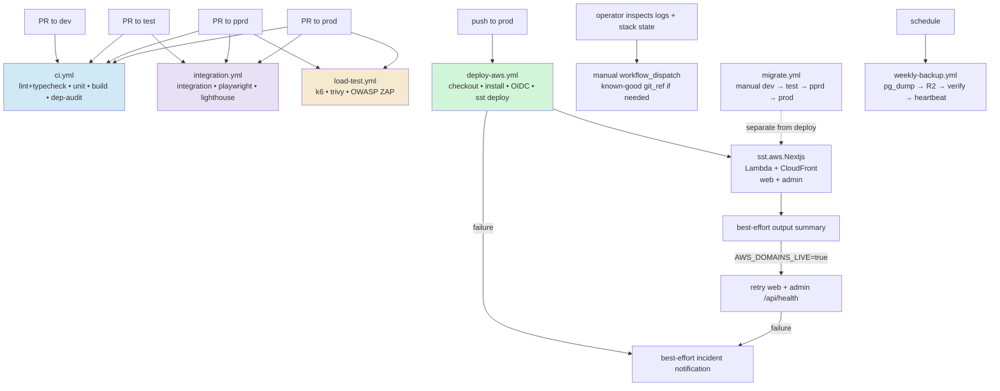
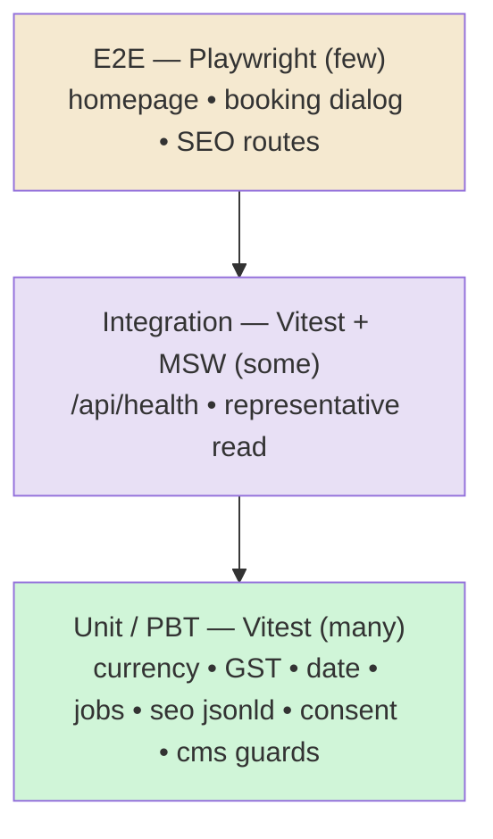
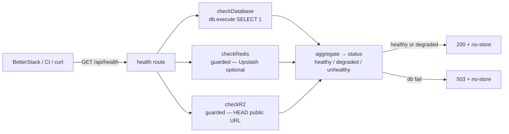

# Design Document — Phase 9: Testing & CI/CD

## Overview

Phase 9 establishes Royal Glow's automated quality and delivery backbone: a **test harness** (Vitest unit/integration, Playwright E2E, MSW mocking, v8 coverage, faker fixtures), a **`/api/health` endpoint**, the **GitHub Actions pipeline** (CI, integration/E2E, load/security, production deploy), and supporting Lighthouse, k6, security, and backup configuration. Committed workflows are executable truth; this design must not claim controls absent from their YAML.

This phase is the **explicit exception** to the project's "no test files unless requested" rule: the tests *are* the deliverable. The goal is a working harness plus meaningful, representative coverage of the riskiest pure logic (money/GST/date math, SEO builders, consent and CMS-client guards) and a couple of integration + E2E smoke paths — not 100% coverage, which is a continuous effort that grows with the codebase.

Consistent with every prior phase, everything must run **with no external keys**. The health endpoint degrades gracefully (DB is the only hard dependency locally; Redis/R2 checks are guarded and report `skipped`/`degraded` rather than crashing), the unit tests are pure and need no network, and the whole monorepo continues to `typecheck`, `lint`, and `build` cleanly. The CI workflows reference GitHub Secrets by their canonical names, but provisioning AWS/SST deployment permissions, Neon API keys, DNS-only Cloudflare credentials, and BetterStack monitors is a deploy-time ops step, not a code deliverable.

### Goals

- Stand up Vitest for the monorepo: a workspace-aware config that runs pure-logic unit tests in `packages/*` (notably `packages/business`) and component/integration tests in `apps/web`, with v8 coverage and MSW for API mocking.
- Add Playwright (chromium) with a config that builds + starts the app and runs E2E smoke specs.
- Add the `test:unit`, `test:integration`, `test:e2e`, and aggregate `test` scripts to `package.json`, and wire the `test` task into `turbo.json`.
- Write representative tests: PBT-style unit tests for the deterministic pure logic; integration tests for `/api/health` and one representative read route; Playwright smoke specs for the homepage, the booking dialog, and the SEO routes (`sitemap.xml`, `robots.txt`, `llms.txt`).
- Implement `apps/web/src/app/api/health/route.ts` exactly per `deployment.md`: DB / Redis / R2 component checks, the documented `HealthStatus` JSON, `200` for healthy/degraded and `503` for unhealthy, `Cache-Control: no-store` — guarded so it returns `200` with no Redis/R2 keys configured.
- Author the GitHub Actions quality, integration, load/security, deployment, migration, and backup workflows plus their supporting config. Each documented behavior must match its committed workflow; migrations remain separate from app deployment.

### Non-Goals (deferred)

- **Provisioning real infrastructure** — GitHub repo secrets, AWS/SST deployment roles, Cloudflare DNS credentials, Neon API keys, and BetterStack monitors are deploy-time ops. The workflows reference the secret names; wiring is later.
- **100% coverage** — this phase delivers the harness plus representative, meaningful tests. Coverage grows continuously as features change.
- **Running k6 against a live pprd URL** — the load script and thresholds are delivered; executing it requires the deployed environment and is a CI-time/ops action.
- **Sentry runtime initialisation and explicit source-map upload** — runtime wiring belongs to Phase 10. Current `deploy-aws.yml` does not supply Sentry upload credentials or run an explicit source-map step.
- **Visual regression (Meticulous), TestSprite, and mutation testing** — `testing.md` lists these as future/quarterly; out of scope here.
- **The monthly backup-restore test and prod→pprd replication crons** — included as delivered workflow files where low-risk, but they are ops-activated; the design notes them explicitly.

## Architecture

### Pipeline topology



### Per-branch CI gate matrix (from `git-workflow.md`)

| Gate | PR→dev | PR→test | PR→pprd | PR→prod |
|------|:------:|:-------:|:-------:|:-------:|
| Lint + format (Biome) | ✅ | ✅ | ✅ | ✅ |
| Type check (`tsc --noEmit`) | ✅ | ✅ | ✅ | ✅ |
| Unit tests (Vitest) | ✅ | ✅ | ✅ | ✅ |
| Build | ✅ | ✅ | ✅ | ✅ |
| Dependency audit (Trivy + Socket) | ✅ | ✅ | ✅ | ✅ |
| Integration tests | — | ✅ | ✅ | ✅ |
| Playwright E2E | — | ✅ | ✅ | ✅ |
| Lighthouse CI | — | ✅ | ✅ | ✅ |
| k6 load test | — | — | ✅ | ✅ |
| Security (Trivy + OWASP ZAP) | — | — | ✅ | ✅ |
| Deploy workflow (external approval if configured) | — | — | — | ✅ |

GitHub Actions `on.pull_request.branches` arrays implement this: `ci.yml` triggers on all four; `integration.yml` on `[test, pprd, prod]`; `load-test.yml` on `[pprd, prod]`; `deploy-aws.yml` on `push` to `prod`.

### Test pyramid



### Health-check component



### New & changed files

```
.github/workflows/
  ci.yml                         ← lint+typecheck, unit, build, dependency-audit
  integration.yml                ← integration, playwright-e2e, lighthouse-ci
  load-test.yml                  ← k6-load-test, security-scan (Trivy + ZAP)
  deploy-aws.yml                 ← one SST deploy job + optional two-endpoint health gate
  weekly-backup.yml              ← pg_dump → R2 → verify → heartbeat
  monthly-backup-test.yml        ← (delivered) restore-test into Neon test branch
  replicate-prod-to-pprd.yml     ← (delivered) Neon branch reset + PII anonymise

apps/web/src/app/api/health/route.ts   ← health endpoint (guarded checks)

vitest.config.ts                 ← root workspace vitest config (projects: business, web)
vitest.setup.ts                  ← MSW server lifecycle + test globals
playwright.config.ts             ← chromium project, webServer build+start
lighthouserc.json                ← Lighthouse CI assertions (budgets)
zap-rules.tsv                     ← OWASP ZAP baseline rule tuning
tests/load/booking-flow.js        ← k6 script with p95/error thresholds

packages/business/src/**/*.test.ts     ← unit/PBT for currency, date, GST, jobs helpers
apps/web/src/lib/seo/*.test.ts          ← jsonld builders, metadata, business constants
apps/web/src/lib/consent/*.test.ts      ← consent round-trip
apps/web/src/lib/cms/*.test.ts          ← client guards / mappers (MSW)
apps/web/src/app/api/health/route.test.ts  ← integration (MSW / mocked db)
apps/web/e2e/home.spec.ts               ← homepage + booking dialog smoke
apps/web/e2e/seo.spec.ts                ← sitemap/robots/llms reachable

package.json (root)              ← test:unit / test:integration / test:e2e / test scripts
turbo.json                       ← `test` task wiring
apps/web/package.json            ← (dev deps) vitest, @vitejs/plugin-react, playwright, msw, faker
```

### Layer & dependency rules

- Test tooling (`vitest`, `@vitest/coverage-v8`, `@vitejs/plugin-react`, `playwright`/`@playwright/test`, `msw`, `@faker-js/faker`, `wait-on`) is added as **devDependencies** only — never shipped to runtime.
- Unit tests for `packages/business` import only that package (it is pure, no I/O) — the strongest, fastest tests.
- The health route lives in `apps/web` and reads `process.env` directly for the optional Redis/R2 checks (guarded-extension-point), exactly like the Phase 5–8 seams, so it never triggers `env.ts` build-time validation and never crashes when keys are absent. DB is read via `@rgss/db`.
- Playwright E2E runs against a built app (`bun run build && bun run start`) — it is an out-of-process black-box test, no app-internal imports.

## Components and Interfaces

### Component 1: `/api/health` endpoint

`apps/web/src/app/api/health/route.ts` — `GET` handler implementing the `deployment.md` contract. It does NOT use `withErrorHandler`/`apiSuccess` (those wrap the normal API envelope); health returns its own documented shape and its own status codes, like the job routes.

```typescript
type ComponentHealth = {
  status: 'pass' | 'fail' | 'skip'
  latencyMs: number
  message?: string
}

type HealthStatus = {
  status: 'healthy' | 'degraded' | 'unhealthy'
  timestamp: string
  version: string
  uptime: number
  checks: { database: ComponentHealth; redis: ComponentHealth; r2: ComponentHealth }
}

export async function GET(): Promise<Response>
```

Behaviour:
- `checkDatabase()` — `await db.execute(sql\`SELECT 1\`)`; `pass` with latency, or `fail` on throw. **DB is the only hard dependency.**
- `checkRedis()` — if `UPSTASH_REDIS_REST_URL` + `UPSTASH_REDIS_REST_TOKEN` are absent → `skip` (not a failure). If present → guarded REST `PING`; `pass`/`fail`.
- `checkR2()` — if `NEXT_PUBLIC_R2_PUBLIC_URL` is absent → `skip`. If present → `HEAD ${url}/.health`; `pass`/`fail`.
- Aggregation: `unhealthy` iff `database.status === 'fail'`; `degraded` if DB passes but a configured (non-skipped) Redis/R2 check fails; otherwise `healthy`. `skip` never degrades the status (so a no-keys local/dev run is `healthy`).
- Status code: `503` for `unhealthy`, else `200`. Headers: `Cache-Control: no-store`, `X-Health-Status: <status>`.
- `version` from `process.env.COMMIT_SHA ?? 'unknown'`; `uptime` from `process.uptime?.() ?? 0`.
- Every check is wrapped (`Promise.allSettled`) so the handler itself never throws.

### Component 2: Vitest harness

`vitest.config.ts` (root) defines a `test.projects` array (Vitest workspace) so one command runs both:
- **`business`** project: `environment: 'node'`, `include: ['packages/business/**/*.test.ts']`, no setup file needed (pure).
- **`web`** project: `environment: 'jsdom'`, `plugins: [react()]`, `include: ['apps/web/**/*.test.{ts,tsx}']`, `setupFiles: ['./vitest.setup.ts']`, path alias `@` → `apps/web/src`.

Coverage: `provider: 'v8'`, `reporter: ['text','html']`, `reportsDirectory: ./coverage`, reasonable include/exclude (exclude `*.config.*`, `e2e/**`, generated `payload-types.ts`, `.next`). `vitest.setup.ts` wires the MSW `server.listen()/resetHandlers()/close()` lifecycle and any jsdom globals.

Scripts split by intent: `test:unit` runs the fast pure projects, `test:integration` runs the API-route tests (still Vitest, MSW-backed, mocked `@rgss/db`), `test:e2e` runs Playwright, and `test` runs unit+integration. (Integration vs unit is selected via filename suffix `*.integration.test.ts` or a separate include — the design uses a `test:integration` that targets `**/*.integration.test.ts` and `test:unit` that excludes them.)

### Component 3: Playwright harness

`playwright.config.ts` — `testDir: './apps/web/e2e'`, `projects: [{ name: 'chromium', use: devices['Desktop Chrome'] }]`, `webServer: { command: 'bun run build && bun run start', url: 'http://localhost:3000', timeout: 120_000, reuseExistingServer: !process.env.CI }`, `use.baseURL: 'http://localhost:3000'`, HTML reporter. Specs are black-box: navigate, assert visible content, assert SEO routes return 200 + correct content-type.

### Component 4: GitHub Actions workflows

Workflow files follow their committed YAML as the executable source of truth (Bun via `oven-sh/setup-bun@v2`, `bun install --frozen-lockfile`, and per-workflow concurrency/settings):
- **`ci.yml`** — jobs `lint-typecheck`, `unit-tests` (`bun run test:unit --coverage` + upload), `build` (needs lint-typecheck, uploads `.next`), `dependency-audit` (Trivy fs HIGH/CRITICAL exit-1 + Socket). Triggers: PR to `[dev,test,pprd,prod]` + push to `dev`.
- **`integration.yml`** — `integration-tests` (seed test DB, `bun run test:integration`, `DATABASE_URL: secrets.DATABASE_URL_TEST`, `APP_ENV: test`), `playwright-e2e` (install chromium, build+start, `wait-on`, `bun run test:e2e`, upload report), `lighthouse-ci` (`bunx @lhci/cli autorun`). Triggers: PR to `[test,pprd,prod]`.
- **`load-test.yml`** — `k6-load-test` (`grafana/setup-k6-action`, run `tests/load/booking-flow.js`, `K6_TARGET_URL: secrets.PPRD_URL`), `security-scan` (Trivy fs CRITICAL/HIGH exit-1 + `zaproxy/action-baseline` against `secrets.PPRD_URL` with `zap-rules.tsv`). Triggers: PR to `[pprd,prod]`.
- **`deploy-aws.yml`** — one `deploy` job gated by `vars.AWS_DEPLOY_ENABLED == 'true'`. It checks out the requested ref, installs with Bun, assumes the AWS deploy role through GitHub OIDC, and runs `bunx sst deploy --stage production`. It records `.sst/outputs.json` best-effort. When `vars.AWS_DOMAINS_LIVE == 'true'`, the same job retries only the web and admin `/api/health` endpoints. Any failed step fails the job and triggers a best-effort incident notification. It does not run DDL, upload Sentry source maps explicitly, verify check-runs, smoke-test customer paths, verify backups, or redeploy automatically. After a failed SST/Pulumi update, inspect logs and stack state, verify both applications, and manually dispatch a known-good `git_ref` if needed. Migrations remain in separate manual `migrate.yml`, using the unpooled connection in `dev → test → pprd → prod` order.
- **`weekly-backup.yml`** — cron `0 2 * * 0`: `pg_dump` (`DATABASE_URL_UNPOOLED_PROD`) → gzip → `aws s3 cp` to R2 (`R2_ACCESS_KEY_ID`/`R2_SECRET_ACCESS_KEY`/`R2_ACCOUNT_ID` endpoint) → verify (`gunzip -t`) → keep-last-8 cleanup → `BETTER_STACK_HEARTBEAT_BACKUP` ping → incident webhook on failure.

`monthly-backup-test.yml` and `replicate-prod-to-pprd.yml` are delivered per `deployment.md`/`git-workflow.md` and clearly marked as ops-activated (they need Neon + R2 secrets to run).

### Component 5: Auxiliary config

- **`lighthouserc.json`** — `ci.collect` (url `http://localhost:3000/`, plus `/services`, `/about`), `ci.assert.assertions` enforcing `categories:performance >= 0.95`, `categories:accessibility = 1`, `categories:seo = 1`, `categories:best-practices = 1` (per `testing.md` / `git-workflow.md`), `upload.target: temporary-public-storage`.
- **`tests/load/booking-flow.js`** — k6 with `options.thresholds`: `http_req_duration: ['p(95)<500']`, `http_req_failed: ['rate<0.01']`; a small ramping VU stage hitting `GET /`, `GET /api/services`, `GET /api/availability`. `K6_TARGET_URL` from env.
- **`zap-rules.tsv`** — baseline rule tuning (e.g. ignore informational alerts that don't apply to a server-rendered marketing site) so the ZAP baseline is signal, not noise.

## Data Models

No database schema changes. The only new data shape is the `HealthStatus` / `ComponentHealth` response contract (above), which is read-only and not persisted. Tests use ephemeral fixtures via `@faker-js/faker`; the integration tests mock `@rgss/db` (no real DB) and MSW intercepts outbound HTTP.

## Money, Date & Currency Conventions

- The highest-value unit tests target exactly the money/date rules: `formatINR` (Indian grouping, 2 decimals, paise→₹), `splitGST` (18% inclusive back-calc, integer paise, no float drift), and the IST date/window helpers in `packages/business/src/jobs/time.ts`. These are deterministic and are the primary **property-based testing** targets (e.g. *for any non-negative paise, `splitGST` base+gst === total and all three are integers*).
- No new money/date handling is introduced; the tests assert the existing rules hold.

## Error Handling

| Scenario | Handling | Result |
|----------|----------|--------|
| Health: DB unreachable | `checkDatabase` catch → `fail` | overall `unhealthy` → `503` |
| Health: Redis/R2 keys absent | guarded → `skip` | does not degrade → `200 healthy` |
| Health: Redis/R2 configured but failing | catch → `fail` | `degraded` → `200` (DB still up) |
| Health: handler-level error | `Promise.allSettled` + per-check try/catch | never throws; always a JSON response |
| Unit test needs network | MSW intercepts; no real outbound calls | deterministic, offline-safe |
| Integration test DB | `@rgss/db` mocked (vi.mock) | no real DB needed for `test:unit`/local |
| CI secret missing in a workflow | job fails fast with a clear step error | gated branch cannot promote |
| Lighthouse/k6 threshold breach | non-zero exit | PR blocked at the relevant gate |

The guiding rule: local `bun run test:unit` and `bun run typecheck`/`lint`/`build` must pass **with no env keys**, and `/api/health` must return `200` locally (DB up, Redis/R2 skipped).

## Security Considerations

- **No secrets in code or tests** — workflows read GitHub Secrets by canonical name; tests use faker, never real credentials. The health endpoint returns no secret values (only pass/fail/skip + latency).
- **Dependency + supply-chain scanning** on every PR (Trivy fs scan blocking HIGH/CRITICAL; Socket.dev for typosquatting/install-script/obfuscation detection).
- **DAST** via OWASP ZAP baseline against pprd before prod; **SAST/CVE** via Trivy.
- **Health endpoint is unauthenticated by design** (it must be probeable by BetterStack/CI) but leaks nothing sensitive — no env values, no row data, only liveness + latency. It is `no-store` and excluded from the sitemap/robots already (under `/api`).
- **Least-privilege CI** — AWS deploy credentials are scoped to SST deployment; `CLOUDFLARE_API_TOKEN` and `CLOUDFLARE_DEFAULT_ACCOUNT_ID` are available only to DNS deployment; migrations use the unpooled URL only in separate `migrate.yml`; backups use R2 keys only in backup workflows.
- **Branch/environment settings are external** — required checks and production approval may be configured in GitHub, but this spec does not claim untracked settings are implemented by `deploy-aws.yml`.

## Testing Strategy

This phase *is* the testing strategy implementation. Verification of the phase itself:
- **`bun run test:unit`** — the new unit/PBT suite passes (pure logic; the strongest, most numerous tests).
- **`bun run typecheck`** — all new test files, config, and the health route typecheck (`tsc --noEmit`) across the workspace.
- **`bun run lint`** — Biome clean on new files (ignoring the documented pre-existing CRLF/import-order baseline).
- **`/api/health`** — typechecks and, run locally, returns `200` with `database: pass` and `redis`/`r2`: `skip`.
- Integration (`test:integration`) and Playwright (`test:e2e`) are wired and runnable; in CI they run on the appropriate branches. Locally they are available but not part of the no-keys gate (Playwright needs a browser download; integration mocks the DB).

PBT targets (deterministic, highest value): currency rounding/format, GST split invariants, consent `set→get` round-trip (`necessary` always true, `decided` true after set), sitemap never emitting private routes, `buildMetadata` canonical URL has no double slash, `getActiveBanners` window logic.

## Design Decisions & Rationale

1. **Committed workflows are executable truth.** Runbooks may describe future controls, but this design states only behavior present in YAML. Database DDL stays in `migrate.yml`; deployment and recovery claims must not exceed `deploy-aws.yml`.
2. **Vitest workspace (projects) over two separate configs.** One `vitest.config.ts` with a `node` project for pure `packages/business` logic and a `jsdom`+react project for `apps/web` keeps a single `vitest` invocation, shared coverage, and clean separation — matching the monorepo layout without duplicating config.
3. **Harness + representative tests, not 100% coverage.** A green pipeline with meaningful tests on the riskiest logic delivers immediate value and a foundation; chasing a coverage number now would be busywork that ages poorly. The design states this explicitly so scope is honest.
4. **Health checks are guarded and `skip`-aware.** Making absent Redis/R2 a `skip` (not a `fail`) means the same endpoint is `200` locally with no keys and a true liveness signal in prod — consistent with the project-wide guarded-extension-point convention and avoiding false alarms in dev.
5. **Health route bypasses the API envelope.** Like the job routes, `/api/health` returns its own documented shape and status codes (200/503) because external probes (BetterStack, load balancers, CI) expect a plain health contract, not the app's `{ success, data }` wrapper.
6. **Test tooling is devDependency-only and added to `apps/web`.** Keeps runtime bundles untouched; Playwright/Vitest/MSW never reach production. Turbo's `test` task gets `dependsOn: ['^build']` consistent with the existing pipeline.
7. **Integration tests mock the DB; E2E is black-box.** This keeps the no-keys local gate fast and deterministic (unit+integration need no services), while the real DB/seed path runs in CI against the Neon `test` branch exactly as `git-workflow.md` specifies.
8. **Backup/replication crons are delivered but ops-activated.** Writing the workflow files now (matching the spec) means zero drift later; clearly marking them as needing Neon/R2 secrets keeps the no-keys build honest.

## Correctness Properties

> Design-first spec — requirement IDs are forward references the requirements phase will define.

### Property 1: Health endpoint is total and correctly coded
`GET /api/health` always returns a JSON `HealthStatus` with `Cache-Control: no-store`; it returns `503` iff the database check fails and `200` otherwise; it never throws regardless of any component check throwing.
**Validates: Requirements 3.1, 3.2, 3.4**

### Property 2: Health degrades gracefully with no optional keys
With `UPSTASH_REDIS_REST_URL`/`_TOKEN` and `NEXT_PUBLIC_R2_PUBLIC_URL` unset, the Redis and R2 checks report `skip`, the overall status is `healthy`, and the response code is `200`.
**Validates: Requirements 3.3**

### Property 3: Unit suite runs offline and deterministically
`bun run test:unit` passes with no environment variables and no network access; every test that would make an outbound HTTP call is intercepted by MSW and every DB-touching unit is mocked.
**Validates: Requirements 1.1, 1.4**

### Property 4: GST split is integral and conserving
For any non-negative integer paise `p`, `splitGST(p)` returns integer `basePaise`, `gstPaise`, `totalPaise` with `basePaise + gstPaise === totalPaise === p` and no floating-point artefacts.
**Validates: Requirements 1.2**

### Property 5: Currency formatting is Indian and stable
`formatINR(paise)` renders the rupee value with Indian digit grouping and exactly two decimals for any non-negative integer input.
**Validates: Requirements 1.2**

### Property 6: CI gate matrix matches the branch policy
The workflow trigger sets satisfy the matrix: `ci.yml` runs for PRs to all of `dev/test/pprd/prod`; integration/E2E/Lighthouse run for `test/pprd/prod`; k6 + security run for `pprd/prod`; production deploy runs only on push to `prod`.
**Validates: Requirements 4.1, 4.2, 4.3, 4.4**

### Property 7: Production deploy behavior matches executable workflow
`deploy-aws.yml` runs SST deployment for both `sst.aws.Nextjs` resources, records outputs best-effort, conditionally retries the two public health endpoints, and attempts incident notification on failure. It never runs database migrations or automatic rollback. Failed SST/Pulumi updates require operator inspection before manual known-good-ref redeployment.
**Validates: Requirements 3.4, 4.1, 4.2, 4.3, 4.4, 4.5**

### Property 8: Lighthouse and k6 thresholds enforce the budgets
`lighthouserc.json` asserts performance ≥ 0.95 and accessibility/SEO/best-practices = 1.0; `tests/load/booking-flow.js` fails when p95 latency ≥ 500ms or the error rate ≥ 1%.
**Validates: Requirements 4.2, 4.3**

### Property 9: Weekly backup is verifiable and bounded
`weekly-backup.yml` produces a gzipped `pg_dump`, uploads it to the R2 backups bucket, verifies it decompresses, retains only the last 8 weeks, and pings the BetterStack heartbeat on success.
**Validates: Requirements 6.1, 6.2**

### Property 10: SEO routes are reachable (E2E)
The Playwright smoke suite confirms the homepage renders its hero/booking CTA and that `GET /sitemap.xml`, `GET /robots.txt`, and `GET /llms.txt` each return `200` with the expected content type.
**Validates: Requirements 1.3**

### Property 11: Test tooling stays out of runtime
All added test dependencies (`vitest`, `@playwright/test`, `msw`, `@faker-js/faker`, coverage, `wait-on`) are devDependencies; the production build does not import them and the bundle is unaffected.
**Validates: Requirements 1.1, 4.1**
