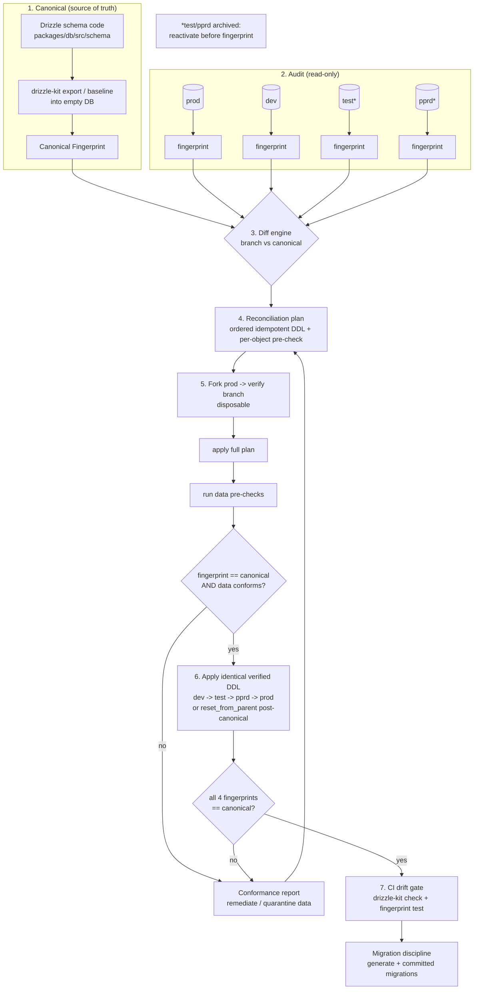

# Design Document: Schema Drift Remediation

## Overview

The RGSS database lives across four Neon branches of project `theroyalglow-db`
(`divine-heart-60915941`): `prod` (`br-bold-cake-aotql242`, default/live), `dev`
(`br-rapid-block-aoh6m3q0`, active), `test` (`br-floral-waterfall-aoag027c`,
archived), and `pprd` (`br-super-king-aoqdtfor`, archived). All four were forked
from `prod` but have since diverged. An audit of the `public` schema shows the same
38 tables on `prod` and `dev`, but materially different constraint counts:

| Branch | Tables | PKs | Uniques | FKs | Indexes |
|--------|-------:|----:|--------:|----:|--------:|
| prod   | 38     | 100 | 72      | 57  | 99      |
| dev    | 38     | 120 | 69      | 83  | 96      |

`prod` is **under-constrained** relative to `dev` (−26 FKs, −20 PK-level
constraints) and almost certainly relative to the Drizzle code. `test` and `pprd`
are archived with unknown (presumed-divergent) state. The current change mechanism
is `drizzle-kit push` (`drizzle.config.ts`, schema at `src/schema/index.ts`,
`out=./migrations`); the `migrations/` directory holds only the special
`0001_pg_cron_jobs.sql`. `drizzle-kit push` currently **fails mid-way** with
`42P16: column "id" is in a primary key` while trying to drop/redefine constraints
to reconcile the drift — proving push is unsafe here and partial-applies.

This feature reconciles the **Drizzle schema code as the single source of truth**
with all four branches, producing one canonical, production-grade schema with zero
discrepancies, makes all four branches schema-identical, and installs migration
discipline plus CI drift detection so drift cannot recur. The approach is
deterministic, idempotent, and data-safe: every corrective DDL is preceded by a
data pre-check, verified on a disposable Neon fork before touching `prod`, and the
end state is enforced by a committed migration history and a CI drift gate.

Constraints carried from steering: `neon-http` has **no interactive transactions**
(`db.transaction` throws) so reconciliation uses ordered single statements /
`db.batch()`; money is `integer` paise, PKs are `text` nanoid, timestamps are
`timestamptz`; tables are `snake_case` singular; FKs use explicit `ON DELETE`.

## Architecture

The remediation runs as a deterministic pipeline. Read-only fingerprinting feeds a
diff engine; the diff drives data pre-checks and ordered corrective DDL; the DDL is
proven on a throwaway Neon fork; only the verified DDL is then applied to the four
real branches; finally a CI gate enforces convergence forever.



### Pipeline phases

1. **Canonical derivation** — Establish the byte-level target fingerprint from the
   Drizzle code (not from any live branch), so reconciliation pulls every branch
   *toward the code*, never the reverse.
2. **Audit** — Compute a read-only fingerprint per branch via `information_schema`
   / `pg_catalog`. No writes.
3. **Diff** — Compare each branch fingerprint to canonical (and branches to each
   other) producing a structured, ordered set of differences.
4. **Plan** — Translate each diff into idempotent corrective DDL plus a data
   pre-check predicate that must pass before the DDL runs.
5. **Fork-verify** — Fork `prod` into a disposable branch, apply the entire plan,
   run pre-checks and fingerprint, confirm convergence to canonical.
6. **Rollout** — Apply the identical, verified DDL to `dev`, `test`, `pprd`,
   `prod`. Archived branches are reactivated first.
7. **Drift gate** — Commit a migration baseline and add a CI step that fails the
   build when code and the reference schema diverge.

## Components and Interfaces

All tooling lives under a new `packages/db/scripts/drift/` area (pure logic
modules) plus thin runnable entrypoints, consistent with the existing
`packages/db/scripts/*.ts` `bun run` convention. Pure functions (fingerprint
normalization, diff, pre-check predicates) carry **no I/O** so they are unit- and
property-testable in isolation; the Neon Management API and SQL execution are
isolated behind adapter interfaces.

```
packages/db/scripts/drift/
├── fingerprint.ts      ← pure: catalog rows -> normalized SchemaFingerprint
├── catalog-queries.ts  ← the exact read-only information_schema/pg_catalog SQL
├── diff.ts             ← pure: (canonical, branch) -> SchemaDiff
├── precheck.ts         ← pure: SchemaDiff -> DataPreCheck[] predicate SQL + eval
├── reconcile.ts        ← pure: SchemaDiff -> ordered idempotent DDL plan
├── canonical.ts        ← derive canonical fingerprint from Drizzle code
├── neon-admin.ts       ← adapter: Neon Management API (fork/reset/reactivate)
├── runner.ts           ← orchestrates audit -> fork-verify -> rollout (I/O)
└── report.ts           ← render conformance + diff reports (markdown/json)
```

### Component 1: `fingerprint`

**Purpose**: Compute a deterministic, order-independent structural fingerprint of a
schema from raw catalog rows.

```typescript
interface Fingerprinter {
  // Pure: same rows in any order -> identical fingerprint
  build(rows: CatalogRows): SchemaFingerprint
  // Stable canonical-JSON serialization for hashing/equality
  serialize(fp: SchemaFingerprint): string
  hash(fp: SchemaFingerprint): string // sha256 of serialize()
}
```

**Responsibilities**:
- Normalize ordering (sort tables, columns, constraints, index members by name).
- Normalize type spelling (`int4`→`integer`, `timestamptz` canonical form),
  default expressions, and `NOT NULL` flags.
- Exclude environment-specific noise (OIDs, comment timestamps, `pg_cron` job rows).

### Component 2: `catalog-queries`

**Purpose**: Hold the exact read-only SQL that extracts schema structure. Read-only;
safe on `prod`.

```typescript
interface CatalogReader {
  readTables(): Promise<TableRow[]>
  readColumns(): Promise<ColumnRow[]>      // type, nullability, default
  readPrimaryKeys(): Promise<PkRow[]>
  readUniques(): Promise<UniqueRow[]>
  readForeignKeys(): Promise<FkRow[]>      // incl. on_delete / on_update
  readIndexes(): Promise<IndexRow[]>       // incl. partial predicate, uniqueness
  readEnums(): Promise<EnumRow[]>          // type name + ordered labels
}
```

**Responsibilities**:
- One query per object class against `information_schema` / `pg_catalog`
  (see Data Models for query shapes), scoped to `schema = 'public'`.
- Return plain rows only — no normalization (that is `fingerprint`'s job).

### Component 3: `diff`

**Purpose**: Pure structural diff of two fingerprints.

```typescript
interface SchemaDiffer {
  diff(canonical: SchemaFingerprint, branch: SchemaFingerprint): SchemaDiff
  equal(a: SchemaFingerprint, b: SchemaFingerprint): boolean
}
```

**Responsibilities**:
- Classify each object as `missing_on_branch`, `extra_on_branch`, or `divergent`.
- Be symmetric and total: every object in either side is accounted for.

### Component 4: `precheck`

**Purpose**: For each additive constraint, generate the data-conformance predicate
that must hold before the constraint can be added, and evaluate it.

```typescript
interface PreChecker {
  // Pure: which checks are needed for this diff
  plan(diff: SchemaDiff): DataPreCheck[]
  // I/O: run a single check's read-only probe SQL
  evaluate(check: DataPreCheck, reader: ProbeReader): Promise<PreCheckResult>
}
```

**Responsibilities**:
- UNIQUE/PK → detect duplicate key groups.
- FK → detect orphaned child rows (no matching parent).
- `NOT NULL` add → detect existing NULLs.
- Surface violations as data, never auto-mutate (resolution is explicit).

### Component 5: `reconcile`

**Purpose**: Turn a diff into an ordered, idempotent DDL plan.

```typescript
interface Reconciler {
  plan(diff: SchemaDiff): ReconcileStep[] // ordered, idempotent
}
```

**Responsibilities**:
- Emit `ADD CONSTRAINT` / `CREATE [UNIQUE] INDEX IF NOT EXISTS` / `ALTER ... ` /
  `CREATE TYPE` as needed; **never** `drizzle-kit push` (which partial-applied).
- Order steps so dependencies hold: enums → columns → PK/unique → indexes → FKs.
- Each step idempotent (guarded by `IF NOT EXISTS` or catalog existence probe) so
  applying the plan twice equals applying it once.
- Bind each step to its `DataPreCheck` so DDL is skipped+reported on violation.

### Component 6: `neon-admin`

**Purpose**: Adapter over the Neon Management API for branch lifecycle.

```typescript
interface NeonAdmin {
  forkBranch(parent: BranchId, name: string): Promise<BranchId>
  deleteBranch(id: BranchId): Promise<void>
  reactivate(id: BranchId): Promise<void>          // un-archive
  resetFromParent(id: BranchId): Promise<void>      // restore == parent
  connectionString(id: BranchId): Promise<string>   // unpooled for DDL
}
```

**Responsibilities**:
- Provide disposable verification branches and reactivate archived `test`/`pprd`.
- Expose `resetFromParent` as the post-canonical convergence option (see Rollout).

### Component 7: `runner` + `report`

**Purpose**: Orchestrate the phases (the only stateful/effectful component) and
render human-readable diff + conformance reports.

```typescript
interface DriftRunner {
  audit(branches: BranchId[]): Promise<AuditReport>
  verifyOnFork(plan: ReconcileStep[]): Promise<VerifyReport>
  rollout(plan: ReconcileStep[], branches: BranchId[]): Promise<RolloutReport>
}
```

## Data Models

### SchemaFingerprint

The fingerprint is a fully normalized, order-independent description of a schema.
Equality of two fingerprints ⇔ schemas are structurally identical.

```typescript
type SchemaFingerprint = {
  enums: EnumFp[]          // sorted by name
  tables: TableFp[]        // sorted by name
  version: 1               // fingerprint format version
}

type EnumFp = {
  name: string
  labels: string[]         // ordinal order preserved (label order is significant)
}

type TableFp = {
  name: string
  columns: ColumnFp[]      // sorted by name
  primaryKey: string[] | null   // ordered column list (key order significant)
  uniques: ConstraintFp[]  // sorted by normalized member list
  foreignKeys: FkFp[]      // sorted by (columns, refTable, refColumns)
  indexes: IndexFp[]       // sorted by normalized definition
}

type ColumnFp = {
  name: string
  type: string             // normalized: 'integer','text','timestamptz', ...
  nullable: boolean
  default: string | null   // normalized default expression, null if none
}

type ConstraintFp = { name: string | null; columns: string[] }

type FkFp = {
  columns: string[]
  refTable: string
  refColumns: string[]
  onDelete: 'cascade' | 'restrict' | 'set null' | 'set default' | 'no action'
  onUpdate: 'cascade' | 'restrict' | 'set null' | 'set default' | 'no action'
}

type IndexFp = {
  columns: string[]
  unique: boolean
  predicate: string | null // normalized partial-index WHERE, null if full
  method: string           // 'btree','gin', ...
}
```

**Validation / normalization rules**:
- Constraint *names* are excluded from structural equality by default (drift in
  auto-generated names must not count as a discrepancy); names are retained only
  for report readability. Structural identity is determined by columns + semantics.
- Types are normalized to a single canonical spelling before comparison.
- Default expressions are normalized (whitespace, cast spelling) before comparison.
- Index/constraint member lists are sorted unless ordinal position is semantically
  significant (PK column order, FK column↔refColumn pairing, enum labels).

### Catalog query shapes (read-only)

Exact extraction queries, all scoped to `table_schema = 'public'` /
`n.nspname = 'public'`:

```sql
-- Columns: name, type, nullability, default
SELECT table_name, column_name, data_type, udt_name,
       is_nullable, column_default
FROM information_schema.columns
WHERE table_schema = 'public'
ORDER BY table_name, ordinal_position;

-- Primary keys & uniques (constraint + ordered members)
SELECT tc.table_name, tc.constraint_type, tc.constraint_name,
       kcu.column_name, kcu.ordinal_position
FROM information_schema.table_constraints tc
JOIN information_schema.key_column_usage kcu
  ON tc.constraint_name = kcu.constraint_name
 AND tc.table_schema = kcu.table_schema
WHERE tc.table_schema = 'public'
  AND tc.constraint_type IN ('PRIMARY KEY','UNIQUE')
ORDER BY tc.table_name, tc.constraint_name, kcu.ordinal_position;

-- Foreign keys incl. ON DELETE / ON UPDATE
SELECT con.conname, c.relname AS table_name, rc.relname AS ref_table,
       con.confdeltype, con.confupdtype,
       con.conkey, con.confkey
FROM pg_constraint con
JOIN pg_class c   ON c.oid  = con.conrelid
JOIN pg_class rc  ON rc.oid = con.confrelid
JOIN pg_namespace n ON n.oid = c.relnamespace
WHERE con.contype = 'f' AND n.nspname = 'public';

-- Indexes incl. partial predicate + uniqueness + method
SELECT t.relname AS table_name, i.relname AS index_name,
       ix.indisunique, am.amname AS method,
       pg_get_indexdef(ix.indexrelid) AS def,
       pg_get_expr(ix.indpred, ix.indrelid) AS predicate
FROM pg_index ix
JOIN pg_class i  ON i.oid = ix.indexrelid
JOIN pg_class t  ON t.oid = ix.indrelid
JOIN pg_am am    ON am.oid = i.relam
JOIN pg_namespace n ON n.oid = t.relnamespace
WHERE n.nspname = 'public' AND NOT ix.indisprimary;

-- Enums: type + ordered labels
SELECT t.typname, e.enumlabel, e.enumsortorder
FROM pg_type t
JOIN pg_enum e ON e.enumtypid = t.oid
JOIN pg_namespace n ON n.oid = t.typnamespace
WHERE n.nspname = 'public'
ORDER BY t.typname, e.enumsortorder;
```

### SchemaDiff

```typescript
type SchemaDiff = {
  fromCanonicalHash: string
  toBranchHash: string
  objects: DiffEntry[]
  isIdentical: boolean   // objects.length === 0
}

type DiffEntry = {
  kind: 'enum' | 'column' | 'primaryKey' | 'unique' | 'foreignKey' | 'index'
  table: string | null
  object: string         // identifying member list / name
  status: 'missing_on_branch' | 'extra_on_branch' | 'divergent'
  canonical: unknown | null
  branch: unknown | null
}
```

### ReconcileStep & DataPreCheck

```typescript
type ReconcileStep = {
  id: string
  diff: DiffEntry
  ddl: string                 // idempotent (IF NOT EXISTS / guarded)
  preCheck: DataPreCheck | null
  order: number               // enums < columns < pk/unique < index < fk
}

type DataPreCheck = {
  kind: 'duplicate_key' | 'orphan_fk' | 'existing_null'
  probeSql: string            // read-only; returns violating rows/groups
  description: string
}

type PreCheckResult = {
  check: DataPreCheck
  passed: boolean             // true == safe to apply DDL
  violationCount: number
  sample: unknown[]           // first N violating rows for the report
}
```

### Rollout decision model

For converging `dev`, `test`, `pprd`, `prod` to canonical:

| Branch | State | Strategy | Rationale |
|--------|-------|----------|-----------|
| prod | live data | **forward-migrate** (apply verified DDL) | Must preserve live data; never reset. |
| dev | active dev data | forward-migrate | Preserve in-progress dev data. |
| test | archived | **reset_from_parent** (from prod, post-canonical) | Disposable QA data; reset guarantees byte-identical schema with zero migration risk. |
| pprd | archived | **reset_from_parent** (from prod, post-canonical) | Pre-prod mirror; cleanest identity is a fresh fork of canonical prod. |

`reset_from_parent` on `test`/`pprd` **discards their existing data** — acceptable
because both are non-authoritative environments seeded from prod, and resetting
*after* prod is canonical is the only way to guarantee schema identity with no
residual drift. This trade-off is called out explicitly so it can be ratified in
the requirements phase.

## Correctness Properties

These are the invariants the implementation must satisfy. They map directly to
property-based tests (fast-check + Vitest) for the pure functions and to
integration assertions on a Neon fork. Stated with universal quantification.

### Property 1: Fingerprint determinism / order-independence
∀ catalog row-sets `R`, and ∀ permutations `π` of `R`:
`serialize(build(R)) === serialize(build(π(R)))`.
The fingerprint depends only on schema content, never on row order.

### Property 2: Fingerprint equality soundness
∀ schemas `A`, `B`: `hash(build(A)) === hash(build(B))` ⟺ `A` and `B` are
structurally identical (same tables/columns/types/nullability/defaults/PKs/
uniques/FKs+on-delete/indexes+predicates/enums).

### Property 3: Diff totality & symmetry
∀ fingerprints `c`, `b`: every object present in `c` or `b` appears in exactly
one `DiffEntry`; and `diff(c,b).isIdentical ⟺ equal(c,b) ⟺ diff(b,c).isIdentical`.

### Property 4: Pre-check soundness
∀ branch data `D` and constraint `k`: `precheck(k).passed === true` ⟺ adding
`k` to `D` would succeed (i.e. a violation is reported iff one actually exists).
No false negatives (never green-lights a constraint that would fail).

### Property 5: Reconciliation idempotence
∀ plans `P` and branch `B`: `apply(apply(B, P), P)` has the same fingerprint as
`apply(B, P)`. Running the plan twice equals running it once.

### Property 6: Convergence to canonical
After successful rollout, ∀ branch `x ∈ {prod, dev, test, pprd}`:
`hash(fingerprint(x)) === hash(canonicalFingerprint)`. All four branches are
byte-identical at the schema level and equal to the Drizzle code.

### Property 7: Ordering safety
∀ plans `P`: applying `P` in `step.order` never references an object before it
exists (enums → columns → pk/unique → indexes → fks).

### Property 8: Read-only audit
∀ fingerprint/pre-check executions: only `SELECT` statements are issued; the
audited branch's data and schema are unchanged.

## Error Handling

### Scenario 1: Pre-check finds violating data on a real branch (esp. prod)
**Condition**: e.g. duplicate keys before a UNIQUE/PK, or orphan rows before an FK.
**Response**: **Halt that single object only** (skip its DDL), mark the step
`blocked`, and emit a conformance report listing violating rows/groups. Other
independent steps continue.
**Recovery**: Operator remediates the data (de-duplicate, backfill/quarantine
orphans) or quarantines offending rows, then re-runs the plan (idempotent) — the
now-conforming object applies cleanly.

### Scenario 2: `drizzle-kit push` style partial-apply / `42P16`
**Condition**: Attempting to drop/redefine an in-use PK column.
**Response**: Not applicable — this design **abandons `push`** for reconciliation
and uses explicit ordered, additive, idempotent DDL. Constraint *redefinition*
(rare) is modeled as drop-then-add only with an explicit pre-check and is never
auto-applied to columns participating in a PK without an operator-confirmed step.

### Scenario 3: Fork verification fails to converge
**Condition**: After applying the full plan on the prod fork, fingerprint ≠
canonical, or a pre-check fails.
**Response**: Abort rollout. The disposable fork is deleted; **no real branch is
touched**. The diff/report is regenerated to refine the plan.
**Recovery**: Adjust `reconcile`/`canonical`, re-verify on a fresh fork.

### Scenario 4: Mid-rollout failure on a real branch
**Condition**: DDL fails on `prod`/`dev` partway.
**Response**: Because steps are idempotent and ordered, re-running resumes safely.
For catastrophic cases, **Neon point-in-time restore / branch-preserve** is the
rollback: a pre-rollout restore point (or a retained pre-change branch) lets the
branch be restored to its exact pre-remediation state.
**Recovery**: Restore from the retained point, fix the plan, re-run.

### Scenario 5: Archived branch cannot be read
**Condition**: `test`/`pprd` archived, no compute.
**Response**: `neon-admin.reactivate` before fingerprinting; if reactivation
fails, report and proceed with the others (these two converge via
`reset_from_parent` anyway).

### Rollback mechanism (summary)
Primary rollback is **Neon branching / PITR**: take a restore point (or retain a
forked copy) of each real branch immediately before applying DDL. Any failure is
recovered by restoring that point — no destructive in-place undo DDL is authored.

## Testing Strategy

### Unit testing
- `catalog-queries`: snapshot-test query strings; run against a fixture schema on a
  Neon fork and assert row shapes.
- `report`: deterministic markdown/json rendering from fixed inputs.

### Property-based testing (fast-check + Vitest)
`fast-check` is already a `devDependency` of `@rgss/db`. Pure functions get PBT:

- **Fingerprint** (Properties 1, 2): generate random schema models, emit catalog
  rows in random order, assert order-independence and equality soundness.
- **Diff** (Property 3): generate fingerprint pairs, assert totality, symmetry, and
  `isIdentical ⟺ equal`.
- **Pre-check predicates** (Property 4): generate small datasets with/without
  violations, assert the predicate reports a violation iff one exists.
- **Reconcile idempotence & ordering** (Properties 5, 7): generate diffs, assert
  the plan is idempotent under a modeled `apply`, and that `order` never forward-
  references a not-yet-created object.

Suggested layout: `packages/db/scripts/drift/__tests__/*.property.test.ts`.

### Integration testing (on a Neon fork)
- Fork `prod` → apply full plan → assert fingerprint == canonical (Property 6) and
  all pre-checks pass.
- Seed deliberate violations on the fork → assert the matching object is blocked
  and reported, others still apply.
- Idempotence: apply plan twice on the fork, assert identical fingerprint.

### CI drift gate (regression prevention)
- A CI job runs `drizzle-kit check` (and/or a fingerprint test comparing the code's
  derived canonical fingerprint to a committed reference fingerprint) and **fails
  the build** when the code schema and the committed migration history diverge.
- Wire into `.github/workflows/ci.yml` so PRs that change `packages/db/src/schema`
  without a matching committed migration are rejected.

## Drift Prevention (going forward)

1. **Adopt `drizzle-kit generate` + committed migrations.** Replace ad-hoc
   `drizzle-kit push` with generated, version-controlled SQL migrations under
   `packages/db/migrations/` (preserving the existing special
   `0001_pg_cron_jobs.sql`). Establish a committed **baseline migration**
   representing the canonical schema, then forward-only migrations thereafter.
2. **CI drift gate** (above) — `drizzle-kit check` + fingerprint reference test
   fail the build on divergence.
3. **Steering update** — document the migration workflow (generate → review →
   commit → migrate per branch in `dev → test → pprd → prod` order) in a steering
   file so the discipline is part of the standard process. `push` is reserved only
   for throwaway local experimentation, never for shared branches.

## Dependencies

- `drizzle-kit` ^0.30.0 (`generate`, `check`, `export`/introspect) — present.
- `drizzle-orm` ^0.38.0, `@neondatabase/serverless` ^0.10.0 — present.
- `fast-check` ^3.23.1 (PBT) — present as devDependency.
- Vitest — repo standard test runner.
- Neon Management API (branch fork/reset/reactivate, PITR restore points) — via
  `neon-admin` adapter; requires a Neon API key in CI/ops env (not committed).
- Unpooled (direct) connection string for DDL (`DATABASE_URL_UNPOOLED`), per
  `drizzle.config.ts`.
