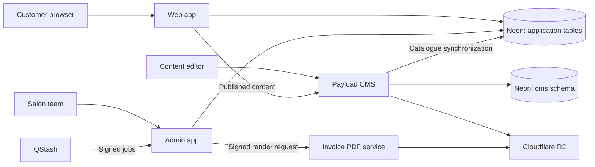

# Royal Glow Salon & Spa

<p align="center">
  <a href="https://theroyalglow.in"></a>
</p>

<p align="center">
  <a href="https://github.com/royalglowsalonspa/theroyalglow-webapp/actions/workflows/ci.yml"></a>
  <a href="./LICENSE"></a>
  <a href="./.github/CODE_OF_CONDUCT.md"></a>
  <a href="./.github/SECURITY.md"></a>
  <a href="./.github/CONTRIBUTING.md"></a>
  <a href="https://bun.sh"></a>
  <a href="https://nextjs.org"></a>
  <a href="https://www.typescriptlang.org"></a>
  <a href="https://status.theroyalglow.in/"></a>
</p>

A TypeScript monorepo for **Royal Glow Salon & Spa by Roshini**: the customer website, booking experience, staff operations, content authoring, and invoice PDF service. Shared packages hold validation contracts, business rules, database access, and common UI utilities.

[Website](https://theroyalglow.in) · [Book an appointment](https://theroyalglow.in/?book=1) · [Visit the store](https://share.google/xAhEVaQlvnNqoGibZ) · [Knowledge base](knowledge-base/INDEX.md) · [Issues and labels](knowledge-base/ISSUES.md)

## Applications

Start with the README for the application you are changing.

| App | Responsibilities | Local port | Deployment definition |
| --- | --- | --- | --- |
| [Web](apps/web/README.md) | Public pages, booking dialog, customer accounts, lead capture, customer APIs | 3000 | AWS Lambda + CloudFront through [SST](sst.config.ts) |
| [Admin](apps/admin/README.md) | Booking operations, billing, customers, memberships, staff, reports, background jobs | 3001 | AWS Lambda + CloudFront through [SST](sst.config.ts) |
| [CMS](apps/cms/README.md) | Payload admin, marketing content, media, service catalogue authoring | 3002 | Render blueprint in [.github/render.yaml](.github/render.yaml) |
| [Invoicing](apps/invoicing/README.md) | HMAC-authenticated PDF rendering and R2 storage | 8080 | Node container targeting Google Cloud Run; see app packaging caveats |

The public site is `theroyalglow.in`; operations run at `admin.theroyalglow.in`, and Payload runs at `cms.theroyalglow.in`. Admin URLs use root paths such as `/bookings`, not `/admin/bookings`. Payload has its own `/admin` interface and authentication.

## How the system fits together



- **Customer journey:** public service discovery, Google sign-in, homepage booking dialog, account and booking views. `/book` is a lead-capture landing page; submitting a lead does not reserve a slot.
- **Operations:** role-guarded workflows for bookings, billing, customer records, loyalty, memberships, leave, staff, and reporting. Detailed permissions live in the admin implementation and its README.
- **Content:** Payload owns content authoring and media. Service/category hooks mirror catalogue data into the application schema used by the booking APIs.
- **Billing:** the application computes final invoice amounts; the invoicing service renders those values. The admin invoice job coordinates PDF requests and email delivery. Counter payment recording is separate from an online payment gateway.
- **Background work:** QStash calls signed admin job endpoints; GitHub Actions owns repository maintenance and scheduled infrastructure tasks. See the [job catalogue](knowledge-base/background-jobs.md).

Some pages intentionally render fallback content, and some integrations are optional or planned. A successful page render or configured environment-variable name does not prove a provider is connected. The app READMEs describe those boundaries; use live verification for deployment claims.

## Stack and sources of truth

| Concern | Implementation |
| --- | --- |
| Workspace tooling | Bun workspaces, Turborepo, ESM; expected Bun version in [package.json](package.json) |
| Web frameworks | Next.js App Router and React for web/admin/CMS; Hono and Node.js for invoicing |
| UI | Tailwind CSS, app-local Radix/shadcn-style primitives, shared brand tokens with app-specific semantic mappings |
| Contracts and logic | Zod and TypeScript in `packages/types`; domain functions in `packages/business` |
| Database | Neon PostgreSQL and Drizzle; Payload manages its own `cms` schema |
| Authentication | Better Auth with Google for web/admin; separate Payload CMS users |
| Storage and messaging | Cloudflare R2, Ably, Upstash Redis, QStash |
| Notifications and analytics | Provider adapters/configuration for Resend, Brevo, PostHog, Clarity, Meta, Sentry, Better Stack, and Slack; enablement varies by app |
| Quality | Biome, TypeScript, Vitest, Playwright, Lighthouse, CodeQL, dependency audit, and workflow-specific security/load checks |

Exact versions belong in each workspace manifest and `bun.lock`. Hosting definitions and workflows establish deployment behavior; provider dashboards establish live state. Older design plans are useful context, not proof that a feature or deployment is complete.

## Local setup

### 1. Install the workspace

Use Git, the Bun version declared by `packageManager`, and Node.js for the Node-based tools. The invoicing bundle targets Node 22. Docker and cloud CLIs are needed only for their respective workflows.

```bash
git clone https://github.com/royalglowsalonspa/theroyalglow-webapp.git
cd theroyalglow-webapp
bun install --frozen-lockfile
```

Run dependency installation from the repository root. Keep the existing Bun lockfile; do not generate a second package-manager lockfile.

### 2. Configure only the apps you need

Use [.env.example](.env.example) as a shared reference, [apps/admin/.env.example](apps/admin/.env.example) for admin, and [apps/cms/.env.example](apps/cms/.env.example) for CMS. Follow each app README and its environment validator before copying values. Templates contain placeholders, not working credentials.

- Web/admin need the correct database, shared Better Auth secret, app-specific origins, and Google OAuth settings for sign-in. Use separate app-local env files; do not assume root env values automatically configure every subprocess.
- CMS has separate Payload credentials and migration behavior. Its database connection must match the intended environment and schema.
- Invoicing requires its HMAC and R2 settings at startup; it does not need a database URL.
- Leave unconfigured optional values absent where the validator expects that. An empty string is not universally equivalent to an unset variable.
- `NEXT_PUBLIC_*` values are browser-visible build configuration. Keep server credentials out of them.

Full references: [environment variables](knowledge-base/environment-variables.md) and [environment setup](knowledge-base/ENVIRONMENT_SETUP_GUIDE.md). Developer MCP credentials are separate from application runtime configuration and are not prerequisites for ordinary coding.

### 3. Start an app

Run one command per terminal, from the repository root:

```bash
bun run --filter=@rgss/web dev
bun run --filter=@rgss/admin dev
bun run --filter=@rgss/cms dev
bun run --filter=@rgss/invoicing dev
```

Only start the services needed for your task. `bun run dev` launches the workspace task graph and therefore needs configuration for every participating app. CMS deliberately uses Webpack for local development; its README explains the Windows tooling constraint.

## Development and verification

All commands below run from the repository root.

| Check | Command | Notes |
| --- | --- | --- |
| Lint | `bun run lint` | Runs existing workspace lint scripts; follow app instructions for gaps |
| Types | `bun run typecheck` | Strict workspace TypeScript checks |
| Unit tests | `bun run test:unit` | Vitest projects; live suites excluded by default |
| Focused tests | `bunx vitest run --project web <test-path>` | Replace project/path with a configured project |
| Coverage | `bun run test:coverage` | Writes `coverage/`; does not include live integration suites |
| Dependency security | `bun audit` | Strict: no advisory allowlist or severity filter |
| App build | `bun run --filter=@rgss/web build` | Substitute app; runtime-dependent configuration may still be required |
| Web browser tests | `bun run test:e2e` | Root Playwright config; admin/CMS have separate configs |
| Integration tests | `bun run test:integration` | Explicit opt-in; can access databases and external services |
| Release consistency | `bun run release:check` | Validates workspace release versions |

Use relevant checks for the change. Live tests, seeds, database resets, notifications, and deployment commands are operational actions, not generic setup steps. Use designated test resources and read the script before running it. In particular, some drift tests create Neon branches and CMS integration tests modify database records.

CI is defined in [.github/workflows/ci.yml](.github/workflows/ci.yml). It includes app checks, repository lint/typechecks, unit coverage, dependency auditing, design boundaries, and schema drift checks. Some integration/load/security jobs depend on configured environment inputs; a skipped job is not a passing live test. See [testing.md](knowledge-base/testing.md) for the broader strategy and verify current runner configs before assuming a test is collected.

## Repository map

```text
apps/                       Four deployable applications
packages/types/src/         Shared validation schemas and types
packages/business/src/      Business rules, calculations, formatting, signing
packages/db/src/            Drizzle schema, queries, and database client
packages/db/migrations/     Application SQL migrations and snapshots
packages/errors/            Shared error definitions
packages/logger/            Structured logging
packages/ui/                Shared UI tokens/utilities
scripts/                    CI, design, release, MCP, and operational tooling
tests/                      Synthetic, load, and other cross-application checks
.github/                    Workflows, templates, community assets, funding
knowledge-base/             Architecture, setup, decisions, and operational guides
docs/                       Mintlify documentation content and configuration
design/                     Design references and assets
theroyalglow-design-system/ Design reference material
infra/aws/_ec2-path/         Archived infrastructure alternative
ltm/                        Repository memory tooling and reference material
```

Build/cache folders such as `.next`, `.turbo`, `.sst`, `dist`, and `coverage` are not application source. Inspect their owning tools before cleaning or regenerating them.

## Database changes

Application tables and Payload tables have separate owners and migration histories. Follow **generate → review → commit → migrate**. Apply reviewed migrations through `dev → test → pprd → prod`; use direct/unpooled connections for DDL. Do not use schema push to repair shared environments or edit an applied migration.

For application schema changes, start in `packages/db/src/schema`, run `bun run generate`, and keep emitted SQL, metadata, and the fingerprint reference consistent. Payload schema changes use the CMS scripts and migrations. See [migration discipline](.kiro/steering/migration-discipline.md), [database guide](knowledge-base/database.md), and [CMS README](apps/cms/README.md). Consult current scripts for snapshot selection; historical guides may refer to older snapshot numbers.

## Branches, releases, and deployment

The permanent Git branches are **`dev`, `test`, `pprd`, and `prod`**. `prod` is the release/default branch; there is no `main` branch.

1. Develop on a task branch based on `dev` and open a review PR into `dev`.
2. Complete the applicable checks and review before merging.
3. Promote the validated commit using [Promote validated commit](.github/workflows/promote.yml). It advances `test → pprd → prod` by fast-forwarding the same commit, preserving commit IDs and messages. No promotion PRs are needed.
4. Verify migrations, release publication, and each affected deployment separately. Release Please owns version/changelog release PRs; those serve a different purpose from environment promotion.

[Promotion operations](knowledge-base/branch-promotions.md) describes the production confirmation input, source validation, and dispatch behavior. Web/admin deploy through [Deploy AWS](.github/workflows/deploy-aws.yml); CMS uses the Render blueprint. This checkout has no invoicing deployment workflow, and its container needs packaging review before release. Do not infer deployed state from a branch name or a green workflow for a different app.

## Contributor and agent documentation

- [CONTRIBUTING.md](.github/CONTRIBUTING.md): contribution process and commit conventions.
- [knowledge-base/ISSUES.md](knowledge-base/ISSUES.md): issue terms, label slugs, priority, severity, and triage. It is a reading guide, not an inventory of open issues.
- [AGENTS.md](AGENTS.md): shared instructions for coding agents; each app has scoped instructions.
- [CLAUDE.md](CLAUDE.md): imports the shared instructions for Claude Code; each app has its own entrypoint.
- [Knowledge-base index](knowledge-base/INDEX.md): choose the relevant architecture or operational guide rather than reading every document.
- [SECURITY.md](.github/SECURITY.md): vulnerability reporting. Follow [CODE_OF_CONDUCT.md](.github/CODE_OF_CONDUCT.md) in project discussions.

The instruction layout follows [AGENTS.md guidance](https://agents.md/), [Codex instruction discovery](https://learn.chatgpt.com/docs/agent-configuration/agents-md), and [Claude Code memory guidance](https://code.claude.com/docs/en/memory). Shared rules live in `AGENTS.md`; `CLAUDE.md` imports them to avoid maintaining duplicate instructions. App-specific guidance stays close to its code, while READMEs explain the system to contributors.

## Maintainer and sponsorship

Developed and maintained by **Katabathuni Bose ([katbose](https://github.com/katbose))**, the project's sole developer. Contributions, clear bug reports, documentation improvements, and sponsorship help support ongoing maintenance.

<p>
  <a href="https://github.com/katbose"></a>
  <a href="https://github.com/sponsors/katbose"></a>
  <a href="https://www.linkedin.com/in/katbose"></a>
  <a href="https://katbose.dev"></a>
  <a href="mailto:im@katbose.dev"></a>
</p>

Licensed under the [MIT License](LICENSE).
